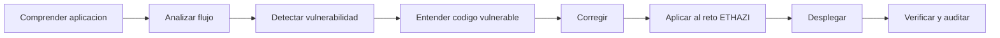

# 0. Presentacion del modulo

## 1. Introduccion

Este modulo no trata de pentesting. Trata de desarrollar aplicaciones web mas seguras dentro del trabajo normal de DAW: disenar, programar, desplegar y verificar.

El objetivo de estos apuntes es darte un metodo practico para detectar errores frecuentes, corregirlos en codigo real y aplicar mejoras en tus retos ETHAZI.

## 2. Objetivos

- Entender como se organiza el modulo y como se va a evaluar.
- Diferenciar seguridad ofensiva de desarrollo web seguro.
- Conocer el flujo de trabajo que seguiremos en cada bloque.
- Preparar el entorno de trabajo minimo para practicas y verificacion.
- Acordar criterios de calidad que se mantendran durante todo el curso.

## 3. Conceptos previos

Para aprovechar este modulo necesitas una base minima en:

- HTTP, formularios y sesiones.
- PHP y JavaScript.
- SQL basico.
- Git y GitHub.
- Despliegue basico con Apache o Docker.

No hace falta ser experto en ciberseguridad para empezar.

## 4. Situacion real

Contexto tipico de DAW:

- Una app funciona en local, pero en produccion expone trazas de error.
- Se sube un repo con secretos en `.env`.
- Se valida en frontend, pero no en backend.
- Se corrige un bug, pero no se verifica si la vulnerabilidad desaparecio.

Resultado: la app "funciona", pero no es segura.

## 5. Explicacion

La metodologia del modulo sigue este ciclo:



Herramientas principales por tipo de trabajo:

| Tipo | Herramientas |
|---|---|
| Analisis | Burp Suite, DevTools |
| Correccion | Editor, Git, revisiones de codigo |
| Verificacion | OWASP ZAP, Security Headers, SSL Labs |
| Dependencias | `composer audit`, `npm audit` |
| Despliegue | Docker, Apache, AWS |

## 6. Codigo vulnerable

Ejemplo simple de mala practica inicial (no hacer):

```dotenv
APP_ENV=production
APP_DEBUG=true
DB_PASSWORD=admin123
AWS_SECRET_ACCESS_KEY=AKIAxxxxxxxx
```

Y en PHP:

```php
<?php
echo $_GET['q'];
```

Problemas inmediatos:

- Secretos expuestos.
- Debug activo en produccion.
- Salida sin codificar (riesgo XSS).

## 7. Laboratorio guiado

Primera practica del curso (20-30 min):

1. Clonar proyecto de practica.
2. Levantar entorno local.
3. Interceptar una peticion con Burp Suite.
4. Identificar un dato de entrada no validado.
5. Revisar el fragmento de codigo responsable.
6. Aplicar una correccion minima.
7. Verificar que el comportamiento inseguro desaparece.
8. Registrar evidencia en checklist.

## 8. Analisis del codigo

Preguntas que siempre debemos contestar:

- Que entra desde cliente y donde se valida.
- Que sale al navegador y como se codifica.
- Que datos son sensibles y donde se almacenan.
- Que rutas o acciones requieren autorizacion.
- Que pruebas confirman que la correccion funciona.

## 9. Correccion

Criterios minimos de correccion en este modulo:

- Validar en backend, no solo en frontend.
- Codificar salida HTML, atributos y URL cuando corresponda.
- No subir secretos al repositorio.
- Desactivar debug en produccion.
- Verificar con herramienta + prueba manual.

Checklist base:

- [ ] Existe validacion de entrada en servidor.
- [ ] No hay secretos en codigo ni en commits.
- [ ] La salida dinamica se codifica correctamente.
- [ ] Se documenta la evidencia de verificacion.

## 10. Aplicacion al reto ETHAZI

Como se conecta con los retos:

- Reto 1 (PHP + JS + CSS): usar DVWA para aprender y transferir la correccion al proyecto del reto.
- Reto 2 (Laravel + Vue): trabajar con casos vulnerables en controladores, middleware y componentes.

En ambos casos, la mejora debe quedar integrada en el flujo real del equipo.

## 11. Resumen

- Este modulo ensena a construir software web mas seguro.
- El foco es codigo, despliegue y verificacion.
- Cada bloque seguira la misma estructura de trabajo.
- La seguridad se evalua por evidencias, no por teoria aislada.

## 12. Ejercicios

1. Enumera tres riesgos de dejar `APP_DEBUG=true` en produccion.
2. Explica por que validar solo en frontend es insuficiente.
3. Define dos evidencias objetivas para afirmar que una vulnerabilidad se ha corregido.
4. Redacta una mini checklist de 5 puntos para revisar un formulario antes de desplegar.

## 13. Para saber mas

- OWASP ASVS: guia de requisitos de seguridad para aplicaciones.
- OWASP Cheat Sheet Series: recomendaciones practicas por tema.
- Documentacion oficial de Laravel (validacion, CSRF, autorizacion).
- Documentacion de MDN sobre seguridad web y cabeceras HTTP.
