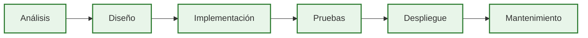

# Introducción al desarrollo web seguro

Cada día utilizamos aplicaciones web para realizar operaciones bancarias, comprar por Internet, gestionar historiales médicos, presentar declaraciones tributarias o comunicarnos con otras personas. En todas ellas, la seguridad forma parte de la calidad del software. Un fallo puede comprometer información, interrumpir un servicio o permitir acciones no autorizadas.

El desarrollo web moderno incorpora la seguridad desde las primeras fases del proyecto y no como una revisión final. Construir aplicaciones seguras es una responsabilidad del equipo de desarrollo y una competencia esencial para cualquier desarrollador profesional.

!!! abstract "Objetivos de esta página"

    Al finalizar esta página serás capaz de:

    - Comprender qué significa desarrollar aplicaciones web seguras.
    - Diferenciar desarrollo seguro y pentesting.
    - Entender por qué la seguridad forma parte del ciclo de vida del software.
    - Comprender el papel de este módulo dentro del ciclo DAW.
    - Conocer cómo se trabajará durante el curso.

---

## ¿Qué significa desarrollar aplicaciones web seguras?

Desarrollar aplicaciones web seguras no consiste en añadir una capa final de protección ni en reaccionar cuando ya existe un problema. Consiste en tomar buenas decisiones durante el análisis, el diseño, la implementación, las pruebas, el despliegue y el mantenimiento de una aplicación para reducir riesgos y aumentar su fiabilidad.

Desde la perspectiva del desarrollador, la seguridad significa construir aplicaciones capaces de cumplir su función prevista incluso cuando reciben entradas inesperadas, interactúan con otros sistemas o evolucionan con el paso del tiempo.

Una aplicación no es segura por una única decisión correcta, sino por la suma de muchas decisiones coherentes. Validar correctamente la información, controlar el acceso a los recursos, separar responsabilidades o proteger la comunicación entre componentes forman parte del mismo objetivo: desarrollar software de calidad.

En este módulo la seguridad no se estudiará como una disciplina independiente del desarrollo, sino como una forma de desarrollar mejor.

---

## ¿Por qué es importante para un desarrollador?

Cada decisión tomada durante el desarrollo influye directamente en la calidad final del software. La seguridad es una característica más del producto, igual que el rendimiento, la mantenibilidad o la facilidad de uso.

Cuando una aplicación se desarrolla sin criterios de seguridad, los problemas suelen detectarse tarde, cuando corregirlos resulta mucho más costoso. Incorporar la seguridad desde el inicio reduce errores, facilita el mantenimiento y aumenta la confianza en el producto final.

Para un desarrollador profesional, trabajar con criterios de seguridad significa asumir una responsabilidad más completa sobre el software que construye.

!!! note "Seguridad y calidad del software"

    En este módulo la seguridad se tratará como una dimensión de la calidad del software. No constituye una tarea independiente ni una actividad reservada para el final del proyecto.

---

## Desarrollo seguro frente a pentesting

Aunque ambos conceptos están relacionados, persiguen objetivos diferentes.

El desarrollo web seguro tiene como finalidad prevenir problemas durante la construcción de la aplicación. El pentesting, por el contrario, busca descubrir vulnerabilidades mediante pruebas realizadas sobre una aplicación ya desarrollada.

En este módulo el objetivo será aprender a construir aplicaciones más robustas, no aprender técnicas avanzadas de ataque.

| Desarrollo web seguro | Pentesting |
|------------------------|------------|
| Previene problemas durante el desarrollo | Detecta problemas mediante pruebas |
| Se integra en todas las fases del proyecto | Se realiza sobre aplicaciones ya desarrolladas |
| Forma parte del trabajo habitual del desarrollador | Habitualmente lo realiza un auditor o especialista |
| Reduce la probabilidad de vulnerabilidades | Evalúa la existencia de vulnerabilidades |

Esta diferencia marcará el enfoque de todo el curso.

---

## La seguridad durante el ciclo de vida del software

La seguridad no aparece en una única fase del desarrollo. Debe estar presente durante todo el ciclo de vida de la aplicación.

En el análisis permite definir requisitos más completos. Durante el diseño ayuda a establecer responsabilidades y límites entre componentes. En la implementación orienta decisiones concretas de programación. Las pruebas verifican que dichas decisiones funcionan correctamente. El despliegue traslada esos criterios al entorno de producción y el mantenimiento garantiza que la aplicación siga siendo segura conforme evoluciona.

El diagrama refleja una idea fundamental: la seguridad acompaña continuamente al desarrollo y debe revisarse cada vez que la aplicación cambia.

!!! note "Idea fundamental"

    La mayoría de las vulnerabilidades no aparecen porque un lenguaje de programación sea inseguro, sino porque durante el desarrollo se toman decisiones incorrectas o incompletas.

---

## El papel de este módulo dentro del ciclo DAW

Este módulo actúa como una competencia transversal dentro del segundo curso del ciclo de Desarrollo de Aplicaciones Web.

No pretende sustituir a los módulos de programación, bases de datos, despliegue o diseño de interfaces. Su finalidad es incorporar criterios de seguridad al trabajo realizado en todos ellos.

Durante el curso se analizarán decisiones habituales del desarrollo y se estudiará cómo reducir los riesgos asociados a cada una de ellas. De este modo, la seguridad dejará de verse como un conocimiento aislado para convertirse en una parte natural del proceso de desarrollo.

---

## Cómo trabajaremos durante el curso

El módulo se desarrollará siguiendo la metodología **ETHAZI**, basada en aprendizaje por retos.

Los conceptos fundamentales se introducirán al inicio de cada bloque y, posteriormente, se aplicarán directamente sobre los proyectos desarrollados durante el curso.

La mayor parte del aprendizaje tendrá lugar mientras el alumnado desarrolla los dos retos del segundo curso. La documentación servirá como referencia técnica para comprender los conceptos, justificar decisiones y aplicar buenas prácticas durante el desarrollo de las aplicaciones.

El objetivo no será memorizar vulnerabilidades, sino aprender a tomar mejores decisiones de desarrollo.

---

## Qué no aprenderás en este módulo

Este módulo no pretende formar especialistas en pentesting ni en hacking ofensivo.

Tampoco pretende estudiar de forma exhaustiva todas las vulnerabilidades existentes ni todas las herramientas de auditoría disponibles.

Su finalidad es proporcionar criterios técnicos que permitan desarrollar aplicaciones web más seguras, robustas y mantenibles.

---

## Resumen

El desarrollo web seguro consiste en incorporar la seguridad como una parte natural del proceso de desarrollo. No se trata de añadir mecanismos de protección al final del proyecto, sino de tomar decisiones adecuadas desde el análisis hasta el mantenimiento de la aplicación.

Este módulo adopta esa filosofía y la integra en los retos del ciclo DAW para que la seguridad forme parte del trabajo cotidiano del desarrollador.

En la siguiente página analizaremos cómo está estructurada una aplicación web y cómo interactúan sus diferentes componentes. Comprender esa arquitectura será el primer paso para identificar dónde pueden aparecer riesgos de seguridad y cómo prevenirlos.

---

## Ideas clave

- La seguridad es una característica de calidad del software.
- Desarrollar de forma segura implica tomar buenas decisiones durante todo el ciclo de vida.
- Desarrollo seguro y pentesting son disciplinas complementarias, pero con objetivos diferentes.
- La seguridad acompaña todas las fases del desarrollo de una aplicación.
- Este módulo integra la seguridad dentro del trabajo habitual del desarrollador y de los retos ETHAZI.

---

## Navegación

**← Anterior:** [Fundamentos del desarrollo web seguro](index.md)

**Siguiente →:** [Arquitectura de una aplicación web](2.arquitectura-aplicacion-web.md)