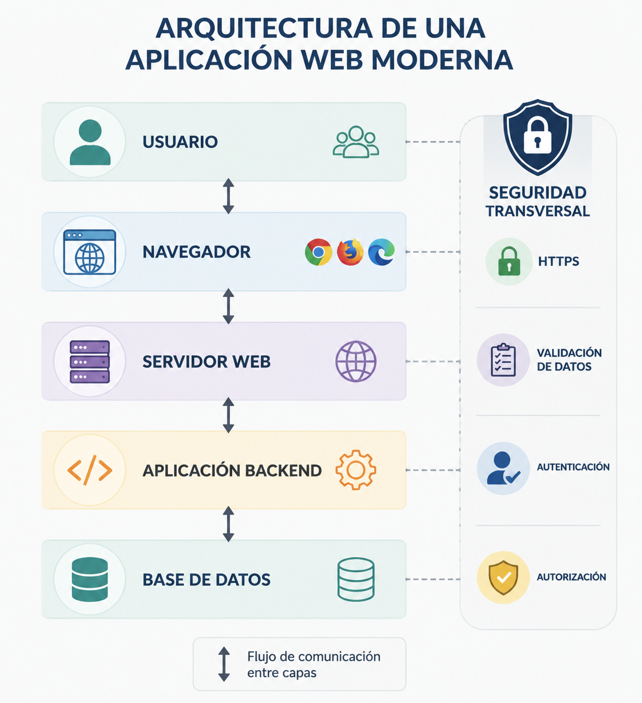
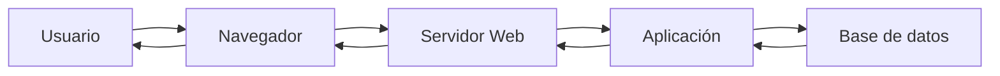
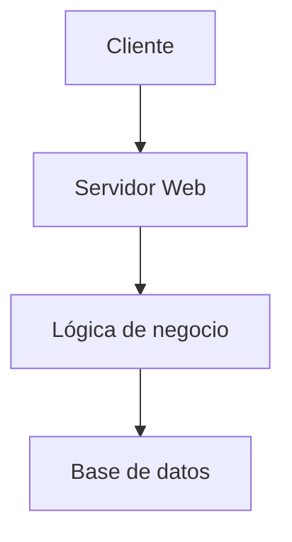

# Arquitectura de una aplicación web

Antes de desarrollar una aplicación web segura es necesario comprender cómo está organizada. Una aplicación web no es un único programa, sino un conjunto de componentes que colaboran para ofrecer un servicio a los usuarios.

Cada componente tiene una responsabilidad diferente y se comunica con los demás siguiendo un flujo determinado. Comprender esa organización permite identificar dónde pueden aparecer riesgos de seguridad y qué medidas deben adoptarse para reducirlos.

## ¿Qué es una aplicación web?

Una aplicación web es un sistema software al que los usuarios acceden a través de un navegador. A diferencia de una aplicación de escritorio, la mayor parte del procesamiento se realiza en un servidor remoto, mientras que el navegador se encarga de presentar la información y permitir la interacción con el usuario.

Desde el punto de vista del desarrollador, una aplicación web puede entenderse como un conjunto de componentes especializados que colaboran para procesar peticiones, aplicar la lógica de negocio, acceder a los datos y devolver una respuesta al cliente.

Esta separación de responsabilidades facilita el mantenimiento de la aplicación, mejora su escalabilidad y permite incorporar medidas de seguridad específicas en cada parte del sistema.

## Componentes principales

Aunque existen múltiples arquitecturas, la mayoría de las aplicaciones web modernas comparten los siguientes elementos principales.

| Componente | Función principal |
|------------|-------------------|
| Cliente | Interactúa con el usuario y envía peticiones al servidor. |
| Servidor web | Recibe las peticiones HTTP y las dirige a la aplicación. |
| Aplicación | Implementa la lógica de negocio y procesa las solicitudes. |
| Base de datos | Almacena y recupera la información necesaria. |

{ width="700" }

Cada componente tiene responsabilidades diferentes y, por tanto, también riesgos de seguridad diferentes.

## El recorrido de una petición web

Cuando un usuario interactúa con una aplicación web se inicia una secuencia de comunicaciones entre los distintos componentes del sistema.

El proceso puede resumirse en los siguientes pasos:

1. El usuario realiza una acción desde el navegador.
2. El navegador envía una petición HTTP al servidor.
3. El servidor entrega la petición a la aplicación.
4. La aplicación ejecuta la lógica necesaria y, si es preciso, consulta la base de datos.
5. La aplicación genera una respuesta.
6. El servidor devuelve esa respuesta al navegador.
7. El navegador presenta el resultado al usuario.

Durante este recorrido la información atraviesa distintos componentes, cada uno con funciones y responsabilidades específicas.

## Cliente y servidor: responsabilidades

En una aplicación web el cliente y el servidor colaboran, pero no realizan el mismo trabajo.

El cliente se ocupa principalmente de la interfaz de usuario: mostrar información, recoger datos introducidos por el usuario y mejorar la experiencia de uso mediante tecnologías como HTML, CSS y JavaScript.

El servidor, por su parte, es responsable de ejecutar la lógica de negocio, validar la información recibida, gestionar la autenticación, controlar los permisos y acceder a los datos almacenados.

Esta separación es importante porque cualquier información procedente del cliente debe considerarse potencialmente manipulable. Por ello, las decisiones de seguridad críticas siempre deben verificarse en el servidor.

!!! warning "Nunca confíes en el cliente"

    El navegador pertenece al usuario, no al desarrollador. Cualquier dato enviado desde el cliente puede modificarse antes de llegar al servidor y debe validarse siempre.

## Arquitectura en capas

Para facilitar el mantenimiento y la evolución del software, las aplicaciones suelen organizarse en capas con responsabilidades bien definidas.

Esta organización ofrece varias ventajas:

- Favorece la separación de responsabilidades.
- Reduce el acoplamiento entre componentes.
- Facilita el mantenimiento y las pruebas.
- Permite aplicar controles de seguridad en diferentes niveles.
- Hace posible sustituir o evolucionar una capa sin modificar completamente las demás.

Muchos frameworks modernos, como Laravel, siguen este principio de organización, aunque utilicen estructuras internas más complejas.

## ¿Dónde aparecen los riesgos de seguridad?

Los riesgos de seguridad no se concentran en un único componente. Pueden aparecer en cualquier punto donde la aplicación recibe, procesa, almacena o transmite información.

Algunos ejemplos son:

- Datos introducidos por el usuario que no se validan correctamente.
- Consultas a la base de datos construidas de forma insegura.
- Gestión inadecuada de sesiones o credenciales.
- Comunicación sin cifrado entre cliente y servidor.
- Configuraciones incorrectas durante el despliegue.

Comprender la arquitectura permite localizar estos puntos y aplicar medidas de protección desde las primeras fases del desarrollo.

## Resumen

Una aplicación web está formada por varios componentes que colaboran para procesar las peticiones del usuario.

Comprender cómo se relacionan esos componentes permite identificar dónde pueden aparecer riesgos de seguridad y aplicar medidas de protección desde las primeras fases del desarrollo.

En el siguiente capítulo estudiaremos cómo se comunican el navegador y el servidor mediante el protocolo HTTP y por qué ese intercambio de información es fundamental para comprender la seguridad de una aplicación web.

## Ideas clave

- Una aplicación web está formada por varios componentes con responsabilidades diferentes.
- Cliente y servidor colaboran, pero no realizan las mismas funciones.
- La información atraviesa distintas capas antes de generar una respuesta.
- La separación de responsabilidades mejora la mantenibilidad y la seguridad.
- Comprender la arquitectura facilita identificar los puntos donde pueden aparecer vulnerabilidades.