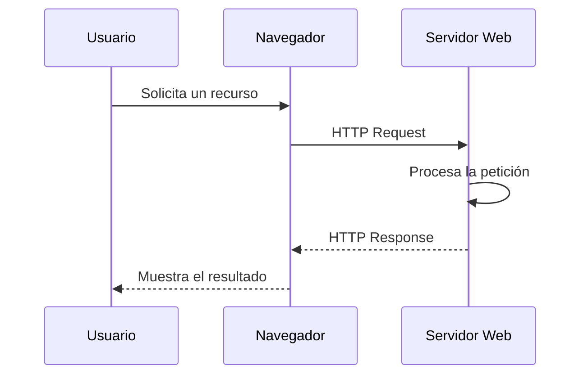
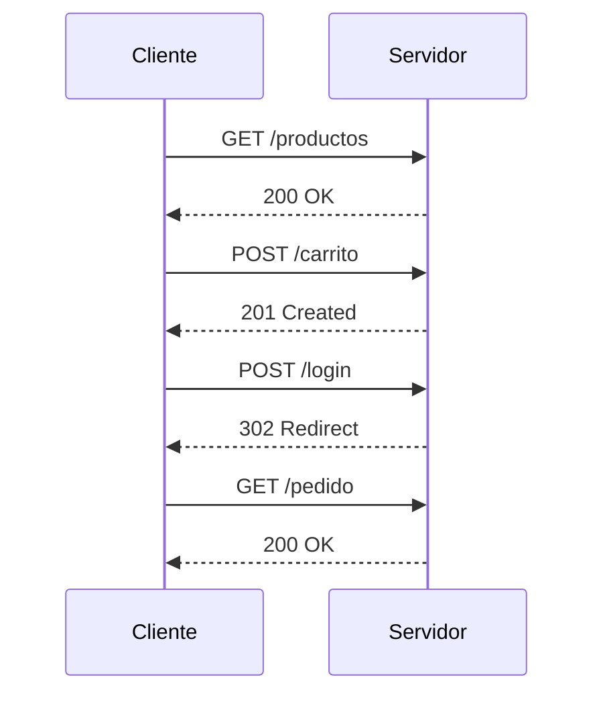

# Protocolo HTTP

La arquitectura de una aplicación web explica cómo se organizan sus componentes y cuál es la función de cada uno de ellos. Sin embargo, todavía queda una pregunta por responder: ¿cómo se comunican esos componentes?

Cuando un usuario pulsa un botón, envía un formulario o accede a una página web, el navegador necesita intercambiar información con un servidor. Esa comunicación debe seguir unas reglas comunes para que ambos puedan entenderse correctamente. El protocolo HTTP define precisamente esas reglas.

Comprender el funcionamiento de HTTP es fundamental para cualquier desarrollador web. Gran parte de las decisiones relacionadas con la autenticación, las sesiones, las APIs, la gestión de errores o la seguridad dependen directamente de cómo funciona este protocolo.

En este capítulo se estudiará cómo se desarrolla una comunicación HTTP, qué información intercambian cliente y servidor y qué implicaciones tiene este protocolo desde la perspectiva del desarrollo seguro.

---

## ¿Por qué existe HTTP?

Cuando un usuario escribe la dirección de una página web en el navegador o hace clic sobre un enlace, espera obtener una respuesta casi inmediata. Sin embargo, el navegador y el servidor son programas diferentes que se ejecutan en equipos distintos y, en muchas ocasiones, separados por miles de kilómetros. Para poder intercambiar información necesitan hablar un lenguaje común.

Ese lenguaje es el **HyperText Transfer Protocol (HTTP)**.

HTTP es un protocolo de comunicación que establece las reglas que deben seguir el cliente y el servidor para intercambiar peticiones y respuestas. Gracias a esas reglas, cualquier navegador moderno puede comunicarse con cualquier servidor web independientemente del sistema operativo, del lenguaje de programación utilizado o de la tecnología con la que se haya desarrollado la aplicación.

En una comunicación HTTP siempre participan, al menos, dos elementos:

- **Un cliente**, normalmente un navegador web, que solicita un recurso.
- **Un servidor**, que recibe la petición, la procesa y devuelve una respuesta.

El recurso solicitado puede ser una página HTML, una imagen, un documento PDF, un archivo JSON, un vídeo o cualquier otro contenido que el servidor sea capaz de proporcionar.

El protocolo HTTP no define cómo debe implementarse una aplicación ni qué lenguaje debe utilizar el servidor. Un mismo navegador puede acceder sin diferencias aparentes a aplicaciones desarrolladas con PHP, Laravel, Java, .NET, Node.js o Python, porque todas ellas utilizan el mismo protocolo de comunicación.

Esta independencia tecnológica ha sido uno de los factores que han permitido el enorme crecimiento de la Web. Los desarrolladores pueden elegir las herramientas que consideren más adecuadas para cada proyecto, mientras que el navegador continúa comunicándose siempre mediante HTTP.

!!! note "HTTP es un estándar"

    HTTP es un estándar abierto definido por el **IETF (Internet Engineering Task Force)**. Gracias a ello, cualquier fabricante de navegadores o servidores puede implementar el protocolo siguiendo las mismas especificaciones, garantizando la interoperabilidad entre sistemas.

Desde la perspectiva del desarrollo seguro, comprender HTTP es mucho más que conocer un protocolo de comunicación. Significa entender cómo viajan los datos entre cliente y servidor, qué información se transmite en cada petición y en qué puntos pueden aparecer riesgos de seguridad. Todo el resto del módulo se apoyará sobre esta base.

!!! example "Desde la perspectiva del desarrollador"

    Cada vez que un usuario pulsa un botón, inicia sesión, envía un formulario o consulta información, el navegador genera una o varias peticiones HTTP.

    Comprender qué contienen esas peticiones y cómo responde el servidor permitirá interpretar posteriormente el funcionamiento de herramientas como las DevTools del navegador, Burp Suite o OWASP ZAP, además de entender por qué determinadas medidas de seguridad deben implementarse en el servidor y no únicamente en el cliente.

    ---

## Cómo se desarrolla una comunicación HTTP

Toda comunicación HTTP sigue un patrón muy sencillo: un cliente realiza una petición y un servidor devuelve una respuesta.

El cliente suele ser un navegador web, aunque también puede ser una aplicación móvil, un programa de escritorio o incluso otra aplicación que consume una API. El servidor recibe la petición, la procesa y genera una respuesta adecuada.

Esta comunicación recibe el nombre de **modelo petición-respuesta (request-response)** y constituye el funcionamiento básico de prácticamente todas las aplicaciones web.

El siguiente diagrama resume este proceso.



Aunque el diagrama parece muy simple, en una aplicación real pueden producirse decenas o incluso cientos de peticiones HTTP para construir una única página. El navegador solicita el documento HTML principal, pero también descarga hojas de estilo, archivos JavaScript, imágenes, tipografías y otros recursos necesarios para representar correctamente la interfaz.

Por este motivo, al abrir las herramientas de desarrollo del navegador o Burp Suite es habitual observar numerosas peticiones asociadas a una sola acción del usuario.

### Un ejemplo sencillo

Supongamos que un usuario escribe la siguiente dirección en el navegador:

```
https://www.ejemplo.com/productos
```

A partir de ese momento se produce una secuencia de acciones similar a la siguiente:

1. El navegador prepara una petición HTTP para solicitar el recurso `/productos`.
2. La petición se envía al servidor.
3. El servidor interpreta la solicitud y ejecuta la lógica correspondiente.
4. Si es necesario, consulta la base de datos.
5. Genera una respuesta HTTP.
6. El navegador recibe la respuesta.
7. Finalmente, representa el contenido al usuario.

Todo este proceso suele completarse en unas pocas décimas de segundo.

!!! note "Una conversación breve"

    HTTP no mantiene una conversación permanente entre cliente y servidor. Cada petición es independiente de las anteriores y termina cuando el servidor devuelve la respuesta.

Esta característica tendrá una consecuencia muy importante que estudiaremos más adelante: **HTTP es un protocolo sin estado (stateless)**. Precisamente por ello será necesario utilizar mecanismos como las cookies y las sesiones para recordar la información entre distintas peticiones.

!!! example "Desde la perspectiva del desarrollador"

    Cuando una aplicación "parece" realizar una única operación, normalmente está intercambiando múltiples peticiones HTTP.
    Aprender a observar esas peticiones permitirá comprender cómo funcionan las aplicaciones modernas, localizar errores y analizar problemas de seguridad durante el desarrollo.
    ---

## Anatomía de una petición HTTP

Cada vez que un cliente solicita un recurso a un servidor, envía una **petición HTTP** (*HTTP Request*). Esta petición es un mensaje estructurado que contiene toda la información necesaria para que el servidor pueda interpretar qué recurso se solicita y cómo debe procesar la solicitud.

Aunque la mayoría de los usuarios nunca llegan a verla, todas las aplicaciones web intercambian miles de peticiones HTTP cada día.

La siguiente petición corresponde a una solicitud sencilla para acceder a una lista de productos.

```http
GET /productos HTTP/1.1
Host: www.ejemplo.com
User-Agent: Mozilla/5.0
Accept: text/html
Accept-Language: es-ES
Connection: keep-alive
```

A primera vista puede parecer un conjunto de líneas sin relación, pero cada una tiene un significado concreto.

### La línea de petición

La primera línea indica tres datos fundamentales:

```http
GET /productos HTTP/1.1
```

- **GET** → método HTTP utilizado.
- **/productos** → recurso solicitado.
- **HTTP/1.1** → versión del protocolo utilizada.

Esta información permite al servidor identificar qué operación desea realizar el cliente.

### Las cabeceras HTTP

Después de la línea de petición aparecen una serie de **cabeceras** (*HTTP Headers*).

Las cabeceras aportan información adicional sobre la petición. Algunas identifican el servidor al que se dirige la solicitud, otras describen el navegador utilizado o indican qué tipo de respuesta espera recibir el cliente.

En el ejemplo anterior aparecen algunas de las más habituales.

| Cabecera | Función |
|----------|---------|
| Host | Indica el servidor de destino. |
| User-Agent | Identifica el navegador o aplicación cliente. |
| Accept | Especifica el tipo de contenido que el cliente puede recibir. |
| Accept-Language | Indica el idioma preferido. |
| Connection | Define cómo gestionar la conexión con el servidor. |

A lo largo del módulo aparecerán otras cabeceras relacionadas con autenticación, cookies, caché o seguridad.

!!! note "Las cabeceras son metadatos"

    Las cabeceras no forman parte del contenido de la petición. Proporcionan información adicional que ayuda al servidor a interpretar correctamente la solicitud.

### El cuerpo de la petición

No todas las peticiones incluyen un cuerpo (*Body*).

Los métodos como **GET** suelen enviar toda la información en la propia URL, por lo que normalmente no incorporan datos adicionales.

Sin embargo, otros métodos, como **POST**, **PUT** o **PATCH**, utilizan el cuerpo de la petición para enviar información al servidor.

Por ejemplo, cuando un usuario completa un formulario de inicio de sesión, los datos enviados viajan habitualmente en el cuerpo de la petición.

```http
POST /login HTTP/1.1
Host: www.ejemplo.com
Content-Type: application/x-www-form-urlencoded

usuario=juan&password=123456
```

En este ejemplo, las dos primeras líneas corresponden a la petición HTTP, mientras que los datos del formulario aparecen en el cuerpo del mensaje.

Durante el resto del curso analizaremos numerosas peticiones reales utilizando las herramientas de desarrollo del navegador y Burp Suite para comprender cómo viaja esta información entre cliente y servidor.

!!! example "Desde la perspectiva del desarrollador"

    Una petición HTTP contiene mucha más información que la URL visible en el navegador.
    Aprender a interpretar sus cabeceras y su cuerpo permitirá comprender cómo funcionan los formularios, las APIs, la autenticación, las cookies y muchas de las vulnerabilidades que se estudiarán más adelante.
    ---

## Anatomía de una respuesta HTTP

Una vez que el servidor ha recibido y procesado la petición, genera una **respuesta HTTP** (*HTTP Response*). Este mensaje contiene el resultado de la solicitud y toda la información necesaria para que el cliente sepa cómo debe interpretarlo.

La estructura de una respuesta HTTP es muy similar a la de una petición. También está formada por una línea inicial, un conjunto de cabeceras y, normalmente, un cuerpo con el contenido solicitado.

El siguiente ejemplo muestra una respuesta sencilla.

```http
HTTP/1.1 200 OK
Content-Type: text/html; charset=UTF-8
Content-Length: 1256
Date: Tue, 29 Jul 2025 10:15:00 GMT

<html>
...
</html>
```

Cada una de estas partes cumple una función específica.

### La línea de estado

La primera línea informa del resultado de la petición.

```http
HTTP/1.1 200 OK
```

Está formada por tres elementos:

- **HTTP/1.1** → versión del protocolo utilizada.
- **200** → código de estado.
- **OK** → descripción textual del resultado.

El código de estado es uno de los elementos más importantes de la respuesta, ya que permite al cliente conocer si la operación se ha realizado correctamente o si se ha producido algún problema.

En la siguiente sección estudiaremos con detalle los códigos de estado más habituales.

### Las cabeceras HTTP

Después de la línea de estado aparecen las cabeceras de la respuesta.

Estas cabeceras proporcionan información adicional sobre el contenido devuelto por el servidor y sobre la forma en que el navegador debe tratarlo.

Algunas de las más habituales son:

| Cabecera | Función |
|----------|---------|
| Content-Type | Indica el tipo de contenido devuelto. |
| Content-Length | Especifica el tamaño del contenido. |
| Date | Fecha y hora de generación de la respuesta. |
| Cache-Control | Define cómo puede almacenarse la respuesta en caché. |
| Set-Cookie | Envía cookies al navegador. |

A lo largo del módulo aparecerán otras cabeceras especialmente relacionadas con la seguridad, como **Content-Security-Policy**, **Strict-Transport-Security** o **X-Frame-Options**.

!!! note "Las cabeceras también protegen"

    Muchas medidas de seguridad modernas no requieren modificar el código de la aplicación, sino configurar correctamente determinadas cabeceras HTTP enviadas por el servidor.

### El cuerpo de la respuesta

El cuerpo (*Body*) contiene el recurso solicitado por el cliente.

Dependiendo de la aplicación, el contenido puede ser muy diferente.

Por ejemplo:

- Una página HTML.
- Una imagen.
- Un documento PDF.
- Un archivo CSS.
- Un archivo JavaScript.
- Un objeto JSON devuelto por una API.
- Un vídeo o cualquier otro recurso.

En una aplicación web moderna es muy habitual que el servidor responda con datos en formato **JSON**, especialmente cuando el frontend y el backend están separados.

Más adelante, cuando trabajemos con JavaScript, Vue y Laravel, veremos que muchas de las respuestas intercambiadas entre cliente y servidor ya no contienen páginas HTML completas, sino únicamente datos que el navegador utiliza para actualizar la interfaz.

!!! example "Desde la perspectiva del desarrollador"

    Comprender una respuesta HTTP permite interpretar mucho más que el contenido visible en el navegador.
    Los códigos de estado, las cabeceras y el tipo de contenido ofrecen información muy valiosa para depurar errores, optimizar aplicaciones y detectar problemas de seguridad.
    ---

## Métodos HTTP más habituales

Cada petición HTTP indica al servidor qué operación desea realizar sobre un recurso. Para ello utiliza un **método HTTP**, también denominado **HTTP Method** o **HTTP Verb**.

El método forma parte de la primera línea de la petición y expresa la intención del cliente. No es lo mismo solicitar información que crear un nuevo recurso, modificarlo o eliminarlo.

Los métodos más utilizados en el desarrollo de aplicaciones web son los siguientes.

| Método | Finalidad | Ejemplo |
|---------|-----------|---------|
| GET | Obtener información | Consultar un producto |
| POST | Crear un nuevo recurso | Registrar un usuario |
| PUT | Sustituir completamente un recurso | Actualizar un perfil |
| PATCH | Modificar parcialmente un recurso | Cambiar una contraseña |
| DELETE | Eliminar un recurso | Borrar un comentario |

Aunque el protocolo HTTP define otros métodos, estos cinco cubren la mayoría de las necesidades de una aplicación web moderna.

### GET

El método **GET** solicita información al servidor sin modificar el estado de la aplicación.

Por ejemplo, cuando un usuario visita la página de un producto, consulta una noticia o accede a su perfil, el navegador suele enviar una petición GET.

```http
GET /productos/15 HTTP/1.1
```

Las peticiones GET deben utilizarse únicamente para consultar información y no para realizar operaciones que modifiquen datos.

### POST

El método **POST** envía información al servidor para crear un nuevo recurso o ejecutar una acción.

Es habitual utilizarlo en formularios de registro, inicio de sesión, envío de comentarios o creación de pedidos.

```http
POST /usuarios HTTP/1.1
```

Normalmente, los datos enviados viajan en el cuerpo de la petición.

### PUT

El método **PUT** sustituye completamente un recurso existente.

Si el recurso ya existe, su contenido se reemplaza por la nueva información enviada por el cliente.

```http
PUT /usuarios/15 HTTP/1.1
```

En aplicaciones REST suele emplearse para actualizaciones completas.

### PATCH

El método **PATCH** modifica únicamente una parte del recurso.

Por ejemplo, cambiar únicamente la dirección de correo electrónico de un usuario o actualizar su fotografía de perfil.

```http
PATCH /usuarios/15 HTTP/1.1
```

Actualmente es uno de los métodos más utilizados en aplicaciones web modernas.

### DELETE

El método **DELETE** solicita la eliminación de un recurso.

```http
DELETE /usuarios/15 HTTP/1.1
```

El servidor decidirá finalmente si esa operación está permitida en función de los permisos del usuario y de las reglas de negocio de la aplicación.

!!! warning "El método no garantiza la seguridad"

    Utilizar correctamente los métodos HTTP mejora la organización de una aplicación, pero no impide que un usuario intente realizar operaciones no autorizadas. Todas las comprobaciones de seguridad deben realizarse siempre en el servidor.

### Métodos HTTP y aplicaciones modernas

En aplicaciones desarrolladas con frameworks como Laravel, Spring Boot o ASP.NET, los métodos HTTP forman parte del propio diseño de la aplicación.

De la misma forma, bibliotecas y frameworks de frontend como Vue, React o Angular utilizan estos métodos para comunicarse con APIs REST mediante peticiones asíncronas.

Comprender cuándo utilizar cada método facilita el desarrollo de aplicaciones más coherentes, mantenibles y alineadas con los estándares actuales.

!!! example "Desde la perspectiva del desarrollador"

    Elegir correctamente el método HTTP no es solo una cuestión de estilo. Permite que otros desarrolladores comprendan mejor la intención de la aplicación y facilita la integración con APIs, herramientas de prueba y frameworks modernos.
    
    ---

## Códigos de estado HTTP

Cada respuesta HTTP incluye un **código de estado** (*HTTP Status Code*) que informa al cliente del resultado de la petición realizada.

Gracias a este código, el navegador, una aplicación móvil o cualquier otro cliente puede saber si la operación se ha realizado correctamente o si se ha producido algún problema.

Los códigos de estado están formados por tres cifras y se agrupan en cinco grandes categorías.

| Categoría | Significado |
|-----------|-------------|
| 1xx | Información |
| 2xx | La petición se ha procesado correctamente |
| 3xx | Redirección |
| 4xx | Error provocado por el cliente |
| 5xx | Error producido en el servidor |

En el desarrollo diario no es necesario memorizar todos los códigos definidos por el protocolo. Sin embargo, sí conviene conocer los más habituales.

### Respuestas satisfactorias (2xx)

Indican que el servidor ha procesado correctamente la petición.

| Código | Significado | Uso habitual |
|---------|-------------|--------------|
| 200 OK | Operación realizada correctamente | Consulta de información |
| 201 Created | Recurso creado correctamente | Alta de usuarios, pedidos o productos |
| 204 No Content | Operación correcta sin contenido de respuesta | Eliminaciones o actualizaciones |

### Redirecciones (3xx)

Indican que el cliente debe realizar una nueva petición a otra dirección.

| Código | Significado |
|---------|-------------|
| 301 Moved Permanently | Redirección permanente |
| 302 Found | Redirección temporal |
| 304 Not Modified | El recurso no ha cambiado desde la última consulta |

Las redirecciones son habituales después de un inicio de sesión o cuando una página cambia de ubicación.

### Errores del cliente (4xx)

Estos códigos indican que el servidor ha recibido la petición, pero no puede procesarla debido a algún problema relacionado con el cliente.

| Código | Significado |
|---------|-------------|
| 400 Bad Request | La petición contiene errores de formato |
| 401 Unauthorized | Es necesario autenticarse |
| 403 Forbidden | El usuario está autenticado, pero no tiene permisos |
| 404 Not Found | El recurso solicitado no existe |

Es importante distinguir entre **401** y **403**, ya que representan situaciones diferentes.

- **401** significa que el usuario todavía no ha demostrado su identidad.
- **403** indica que el servidor conoce la identidad del usuario, pero no le permite realizar esa operación.

### Errores del servidor (5xx)

Estos códigos indican que el problema se ha producido durante el procesamiento de la petición.

| Código | Significado |
|---------|-------------|
| 500 Internal Server Error | Error interno de la aplicación |
| 502 Bad Gateway | Error de comunicación entre servidores |
| 503 Service Unavailable | Servicio temporalmente no disponible |

En una aplicación correctamente desarrollada, estos errores deberían ser poco frecuentes y registrarse para facilitar su análisis y corrección.

!!! note "Los códigos de estado también forman parte del diseño"

    Una API o una aplicación web bien diseñada utiliza los códigos de estado adecuados para comunicar claramente el resultado de cada operación. Elegir correctamente el código facilita la integración con otras aplicaciones y simplifica la depuración de errores.

!!! example "Desde la perspectiva del desarrollador"

    Cuando una aplicación no funciona como esperabas, uno de los primeros datos que conviene comprobar es el código de estado HTTP.
    Herramientas como las DevTools del navegador, Burp Suite o OWASP ZAP muestran este código en todas las respuestas, convirtiéndolo en una de las primeras pistas para localizar problemas durante el desarrollo.
    ---

## Limitaciones de HTTP y origen de las sesiones

Hasta este momento hemos visto que HTTP permite intercambiar peticiones y respuestas entre un cliente y un servidor. Sin embargo, este protocolo tiene una característica muy importante: **no recuerda las comunicaciones anteriores**.

Cada petición HTTP es completamente independiente de las demás. Cuando un servidor recibe una solicitud, la procesa, genera una respuesta y da por finalizada esa comunicación. Si unos segundos después el mismo usuario realiza otra petición, el servidor la tratará como si fuera la primera vez que se comunica con él.

Por este motivo se dice que **HTTP es un protocolo sin estado** (*stateless*).

### ¿Qué significa que HTTP sea un protocolo sin estado?

Imaginemos que un usuario accede a una tienda en línea.

1. Consulta el catálogo de productos.
2. Añade un artículo al carrito.
3. Visualiza el carrito.
4. Inicia sesión.
5. Finaliza la compra.

Desde el punto de vista del usuario, todas estas acciones forman parte de una misma sesión de navegación.

Sin embargo, desde el punto de vista del protocolo HTTP, cada una de ellas corresponde a una petición completamente independiente.



Si HTTP no incorporara ningún mecanismo adicional, el servidor no tendría forma de saber que todas esas peticiones pertenecen al mismo usuario.

Cada solicitud llegaría como una petición completamente nueva.

### Un problema para las aplicaciones modernas

La mayoría de las aplicaciones web necesitan recordar información entre distintas peticiones.

Por ejemplo:

- Saber qué usuario ha iniciado sesión.
- Mantener el contenido del carrito de compra.
- Recordar el idioma seleccionado.
- Conservar determinadas preferencias de navegación.
- Identificar permisos o roles de acceso.

Sin algún mecanismo que permita conservar ese contexto, cada petición obligaría al usuario a empezar desde cero.

Resultaría imposible desarrollar aplicaciones como plataformas de comercio electrónico, redes sociales, banca electrónica o gestores de contenidos.

### ¿Cómo se resuelve este problema?

Aunque HTTP es un protocolo sin estado, las aplicaciones web utilizan distintos mecanismos para mantener información entre peticiones.

Los dos más importantes son:

- **Las cookies**, que permiten almacenar pequeños datos en el navegador.
- **Las sesiones**, que permiten asociar varias peticiones con un mismo usuario manteniendo la información en el servidor.

Estos mecanismos no modifican el funcionamiento de HTTP. Lo que hacen es añadir la información necesaria para que la aplicación pueda reconocer distintas peticiones como parte de una misma interacción.

En el siguiente capítulo estudiaremos con detalle cómo funcionan las cookies y las sesiones, cómo colaboran entre sí y por qué son elementos esenciales en prácticamente cualquier aplicación web.

!!! note "HTTP sigue siendo un protocolo sin estado"

    Aunque una aplicación recuerde al usuario entre distintas peticiones, HTTP no deja de ser un protocolo sin estado. Son las cookies, las sesiones y otros mecanismos similares los que permiten mantener el contexto de la comunicación.

!!! example "Desde la perspectiva del desarrollador"

    Muchas vulnerabilidades relacionadas con la autenticación y el control de acceso no se deben al protocolo HTTP, sino a una gestión incorrecta de las cookies, las sesiones o la identidad del usuario.

    Comprender esta diferencia será fundamental para entender los mecanismos de autenticación que estudiaremos en los próximos capítulos.

    ---

## ¿Qué implicaciones tiene HTTP para la seguridad?

Hasta ahora hemos estudiado HTTP como un protocolo de comunicación entre clientes y servidores. Sin embargo, desde la perspectiva del desarrollo seguro, HTTP es mucho más que un mecanismo para intercambiar información.

Toda la comunicación entre una aplicación web y sus usuarios viaja mediante peticiones y respuestas HTTP. Por este motivo, cualquier decisión relacionada con la autenticación, la autorización, el intercambio de datos, las cookies, las sesiones o las APIs termina reflejándose en ese intercambio de mensajes.

Comprender cómo funciona HTTP permite responder a preguntas como las siguientes:

- ¿Qué información envía realmente el navegador al servidor?
- ¿Dónde viajan las credenciales de autenticación?
- ¿Cómo mantiene una aplicación la identidad del usuario?
- ¿Qué datos puede modificar un atacante antes de que lleguen al servidor?
- ¿Qué información devuelve la aplicación en cada respuesta?

Responder correctamente a estas preguntas resulta fundamental para desarrollar aplicaciones más robustas y reducir los riesgos de seguridad.

### HTTP no distingue entre usuarios legítimos y atacantes

Desde el punto de vista del protocolo, todas las peticiones HTTP tienen el mismo formato.

HTTP no sabe si una petición procede de un usuario autorizado, de un atacante o de una herramienta automatizada. Su única función consiste en transportar información entre el cliente y el servidor.

Por este motivo, la responsabilidad de comprobar la validez de cada petición corresponde siempre a la aplicación.

El servidor debe verificar, entre otros aspectos:

- Que los datos recibidos son válidos.
- Que el usuario está autenticado cuando sea necesario.
- Que dispone de permisos suficientes para realizar la operación.
- Que los recursos solicitados pueden compartirse.
- Que la información devuelta no expone datos innecesarios.

Estas comprobaciones forman parte del desarrollo de la aplicación, no del protocolo HTTP.

### Comprender HTTP facilita el análisis de problemas

Durante el desarrollo es habitual utilizar herramientas que permiten observar las peticiones y respuestas HTTP.

Gracias a ellas es posible:

- Analizar el funcionamiento de una aplicación.
- Localizar errores de comunicación.
- Comprobar los datos enviados al servidor.
- Revisar las cabeceras HTTP.
- Verificar los códigos de estado.
- Detectar configuraciones inseguras.

En los siguientes bloques del módulo utilizaremos de forma habitual las herramientas de desarrollo del navegador, Burp Suite y OWASP ZAP para analizar este tráfico y comprender mejor el comportamiento de las aplicaciones.

!!! note "La seguridad comienza entendiendo la comunicación"

    Antes de aplicar mecanismos de protección es necesario comprender cómo se intercambia la información entre el cliente y el servidor. Solo así es posible identificar dónde aparecen los riesgos y cómo reducirlos mediante decisiones de desarrollo.

!!! example "Desde la perspectiva del desarrollador"

    Un desarrollador que comprende HTTP puede interpretar con mayor facilidad los problemas que aparecen durante la implementación de una aplicación.

    Muchas incidencias que inicialmente parecen errores de programación terminan estando relacionadas con una petición mal construida, una respuesta inesperada o una configuración incorrecta del protocolo de comunicación.
    
    ---

## Para recordar

En este capítulo se ha estudiado el funcionamiento básico del protocolo HTTP como mecanismo de comunicación entre clientes y servidores.

Se ha analizado cómo se estructura una petición y una respuesta HTTP, qué función desempeñan los principales métodos y códigos de estado, y por qué HTTP se considera un protocolo sin estado.

Estos conceptos constituyen la base necesaria para comprender el resto del módulo, ya que la autenticación, las sesiones, las APIs, el despliegue y la auditoría de aplicaciones web se apoyan directamente en este protocolo.

---

## Ideas clave

- HTTP define las reglas de comunicación entre clientes y servidores.
- Toda comunicación HTTP sigue un modelo de petición y respuesta.
- Las peticiones y las respuestas están formadas por una línea inicial, cabeceras y, en muchos casos, un cuerpo.
- Los métodos HTTP indican la intención de la operación solicitada.
- Los códigos de estado informan del resultado de cada petición.
- HTTP es un protocolo sin estado, por lo que necesita mecanismos adicionales para mantener el contexto entre distintas peticiones.
- Comprender HTTP es imprescindible para desarrollar, desplegar y auditar aplicaciones web seguras.

---

## Navegación

**Página anterior:** [Arquitectura de una aplicación web](2.arquitectura-aplicacion-web.md)

**Página siguiente:** [Cookies, sesiones y gestión del estado](4.cookies-sesiones.md)

**Volver al índice del bloque:** [Fundamentos del desarrollo web seguro](index.md)