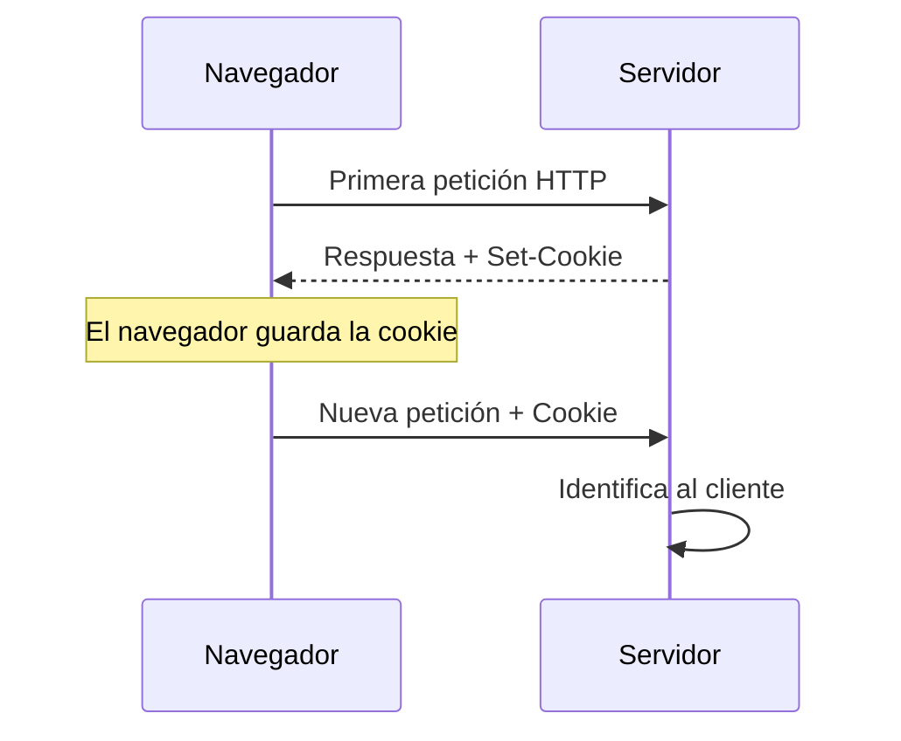
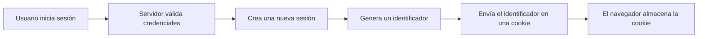
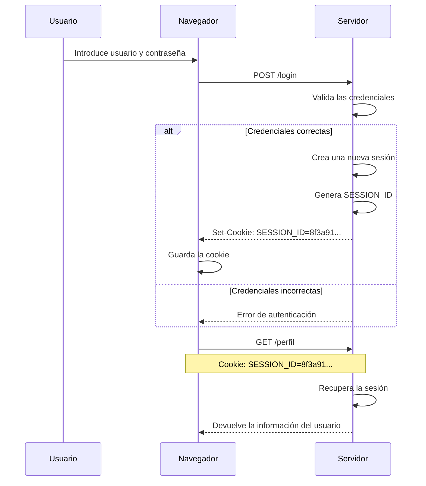

# Cookies, sesiones y gestión del estado

En el capítulo anterior hemos visto que HTTP es un protocolo sin estado. Cada petición se procesa de forma independiente y, una vez enviada la respuesta, el servidor no conserva información sobre esa comunicación.

Sin embargo, la mayoría de las aplicaciones web necesitan recordar información entre distintas peticiones. Un usuario inicia sesión una única vez, mantiene un carrito de compra mientras navega por una tienda en línea o continúa trabajando sobre un documento sin tener que identificarse en cada página.

¿Cómo es posible si HTTP no recuerda nada?

La respuesta se encuentra en los mecanismos de gestión del estado que utilizan las aplicaciones web. Entre ellos, las **cookies** y las **sesiones** desempeñan un papel fundamental.

En este capítulo estudiaremos por qué son necesarias, cómo funcionan y cómo colaboran para que una aplicación pueda identificar a un usuario y mantener el contexto de su interacción. También analizaremos los riesgos de una gestión incorrecta y las principales medidas para proteger estos mecanismos.

---
## El problema del protocolo HTTP

Como ya se ha explicado, HTTP no conserva información entre peticiones. Cada solicitud que llega al servidor se procesa como un mensaje independiente, sin recordar las comunicaciones anteriores.

Esta característica simplifica el funcionamiento del protocolo y facilita su escalabilidad, pero plantea un problema importante para las aplicaciones web modernas.

Pensemos en una plataforma de comercio electrónico. Un usuario puede realizar acciones como las siguientes:

- Consultar el catálogo de productos.
- Añadir varios artículos al carrito.
- Iniciar sesión.
- Modificar su dirección de envío.
- Finalizar una compra.

Desde la perspectiva del usuario, todas estas acciones forman parte de una única interacción con la aplicación.

Sin embargo, desde la perspectiva de HTTP, cada una de ellas corresponde a una petición completamente independiente.

Si el servidor no dispusiera de ningún mecanismo adicional, no podría responder a preguntas tan sencillas como:

- ¿Quién ha realizado esta petición?
- ¿Es el mismo usuario que inició sesión hace unos minutos?
- ¿Qué productos tiene actualmente en su carrito?
- ¿Qué permisos tiene asignados?
- ¿Qué preferencias de configuración había seleccionado?

Sin esa información, muchas de las aplicaciones que utilizamos diariamente serían imposibles de desarrollar.

!!! note "El problema no es HTTP"

    HTTP funciona exactamente como fue diseñado. La necesidad de mantener información entre distintas peticiones aparece porque las aplicaciones modernas requieren conservar el contexto de la interacción con cada usuario.

La solución consiste en añadir mecanismos que permitan relacionar varias peticiones independientes como si formasen parte de una misma conversación entre el cliente y el servidor.

En los siguientes apartados veremos cómo las cookies y las sesiones resuelven este problema de forma coordinada.
## Qué es una cookie

Una **cookie** es un pequeño fragmento de información que un servidor envía al navegador para que este lo almacene y lo vuelva a enviar en futuras peticiones cuando corresponda.

Su finalidad principal es permitir que distintas peticiones HTTP puedan relacionarse entre sí. Gracias a este mecanismo, el servidor puede reconocer que varias solicitudes proceden del mismo navegador y mantener el contexto de la interacción.

Es importante comprender que una cookie **no es un programa**, **no ejecuta código** y **no contiene la aplicación**. Simplemente almacena una pequeña cantidad de información en forma de pares **nombre–valor**.

Por ejemplo, una cookie puede contener un identificador de sesión:

```http
Set-Cookie: SESSION_ID=8f3a91b2c4d7...
```

Cuando el navegador recibe esta respuesta, guarda automáticamente la cookie.

En las siguientes peticiones dirigidas al mismo sitio web, la enviará de nuevo mediante la cabecera **Cookie**.

```http
Cookie: SESSION_ID=8f3a91b2c4d7...
```

De esta forma, el servidor puede reconocer que ambas peticiones pertenecen al mismo navegador.

### El intercambio de una cookie

El proceso completo puede resumirse en los siguientes pasos.



La cookie actúa como un identificador que acompaña a las peticiones posteriores.

Es importante destacar que el navegador gestiona este proceso de forma automática. El usuario no tiene que intervenir para que la cookie se almacene ni para que vuelva a enviarse.

### Qué información puede contener una cookie

Aunque técnicamente una cookie puede almacenar distintos tipos de información, en aplicaciones modernas suele utilizarse para guardar únicamente un identificador.

Ese identificador permite localizar la información asociada al usuario en el servidor, evitando almacenar datos sensibles directamente en el navegador.

En otras situaciones, las cookies también pueden utilizarse para recordar preferencias como:

- El idioma de la aplicación.
- El tema claro u oscuro.
- La aceptación del aviso de cookies.
- Determinadas opciones de personalización.

En cualquier caso, las cookies deben almacenar únicamente la información imprescindible.

!!! note "La cookie identifica; no almacena toda la información"

    Una idea equivocada muy frecuente consiste en pensar que la cookie contiene todos los datos del usuario.

    En realidad, lo habitual es que únicamente almacene un identificador. La información importante permanece en el servidor y se recupera utilizando ese identificador.

!!! example "Desde la perspectiva del desarrollador"

    Cuando un usuario inicia sesión, normalmente la aplicación no guarda su nombre, su contraseña o sus permisos dentro de la cookie.

    Lo habitual es almacenar únicamente un identificador de sesión y utilizarlo para recuperar toda la información desde el servidor en cada petición.

## Qué es una sesión

Una **sesión** es un mecanismo que permite al servidor conservar información sobre un usuario entre distintas peticiones HTTP.

A diferencia de las cookies, que se almacenan en el navegador, la información de una sesión permanece en el servidor. Esto permite mantener datos importantes sin enviarlos continuamente a través de la red.

Cuando una aplicación crea una sesión, genera un identificador único que la representa. Ese identificador se envía al navegador mediante una cookie y será utilizado posteriormente para localizar la información correspondiente en el servidor.

De esta forma, el navegador únicamente necesita enviar el identificador de la sesión. Todos los datos asociados permanecen protegidos en el servidor.

### ¿Qué información suele contener una sesión?

El contenido de una sesión depende de las necesidades de cada aplicación, pero es habitual almacenar información como:

- El identificador del usuario autenticado.
- Su nombre o información básica del perfil.
- Los permisos o roles asignados.
- El idioma seleccionado.
- El contenido del carrito de compra.
- Datos temporales necesarios durante la navegación.

Toda esta información permanece en el servidor y solo es accesible por la propia aplicación.

### ¿Dónde se almacena una sesión?

La información de una sesión puede almacenarse de distintas formas.

Por ejemplo:

- En memoria.
- En archivos del servidor.
- En una base de datos.
- En sistemas distribuidos como Redis o Memcached.

La elección depende del tamaño de la aplicación, del número de usuarios y de los requisitos de rendimiento.

Desde el punto de vista del desarrollador, lo importante es comprender que **la sesión pertenece al servidor**, mientras que el navegador únicamente conserva el identificador necesario para localizarla.

### Ciclo de vida de una sesión

Cuando un usuario inicia sesión correctamente, el servidor suele realizar las siguientes operaciones:

1. Valida las credenciales recibidas.
2. Crea una nueva sesión.
3. Genera un identificador único.
4. Asocia ese identificador a la información del usuario.
5. Envía el identificador al navegador mediante una cookie.

En las peticiones posteriores, el navegador enviará automáticamente esa cookie y el servidor recuperará la sesión correspondiente.



### La sesión no sustituye a HTTP

Es importante comprender que una sesión no modifica el funcionamiento del protocolo HTTP.

Cada petición sigue siendo independiente y el protocolo continúa siendo un sistema sin estado.

Lo que hace la aplicación es utilizar el identificador enviado mediante la cookie para recuperar la información almacenada en el servidor y reconstruir el contexto de cada petición.

!!! note "La información importante permanece en el servidor"

    La sesión permite mantener datos relevantes sin necesidad de enviarlos continuamente al navegador.

    Esto reduce la exposición de información sensible y facilita el control de acceso por parte de la aplicación.

!!! example "Desde la perspectiva del desarrollador"

    Cuando un usuario inicia sesión en Laravel, PHP o cualquier otro framework moderno, normalmente no se envían sus datos personales en cada petición.

    El navegador únicamente transmite el identificador de la sesión. Es el servidor quien utiliza ese identificador para recuperar toda la información necesaria.

    ---

## Cómo colaboran cookies y sesiones

Las cookies y las sesiones no son mecanismos alternativos, sino complementarios.

Cada una desempeña una función diferente dentro de la aplicación.

- La **cookie** permite identificar al navegador en cada petición.
- La **sesión** almacena la información asociada a ese usuario dentro del servidor.

Trabajando conjuntamente, permiten que una aplicación recuerde quién es el usuario sin necesidad de enviar toda su información en cada petición.

### Un ejemplo completo

Supongamos que un usuario accede a una aplicación e introduce sus credenciales.

1. El navegador envía el formulario de inicio de sesión.
2. El servidor valida el usuario y la contraseña.
3. Si las credenciales son correctas, crea una nueva sesión.
4. La sesión recibe un identificador único.
5. El servidor envía ese identificador al navegador mediante una cookie.
6. El navegador almacena automáticamente la cookie.
7. En las siguientes peticiones, el navegador enviará la cookie junto con la solicitud.
8. El servidor utilizará ese identificador para recuperar la sesión correspondiente.

El proceso puede representarse de la siguiente forma.



El aspecto más importante del proceso es que **la información del usuario nunca viaja completa en cada petición**.

El navegador únicamente envía el identificador de la sesión.

Toda la información permanece almacenada en el servidor.

### ¿Qué ocurre en las siguientes peticiones?

Una vez iniciada la sesión, el navegador incorporará automáticamente la cookie en todas las peticiones dirigidas al mismo sitio web.

Por ejemplo:

```http
GET /perfil HTTP/1.1
Host: ejemplo.com
Cookie: SESSION_ID=8f3a91b2c4d7...
```

Cuando el servidor recibe esa petición:

1. Lee la cookie.
2. Obtiene el identificador de sesión.
3. Busca esa sesión en su almacenamiento.
4. Recupera la información del usuario.
5. Procesa la petición con normalidad.

Todo este proceso resulta completamente transparente para el usuario.

### ¿Por qué no guardar toda la información en la cookie?

Podría parecer más sencillo almacenar directamente el nombre del usuario, sus permisos o el contenido del carrito dentro de la cookie.

Sin embargo, esa solución presenta importantes inconvenientes.

- La información viajaría en todas las peticiones.
- Aumentaría el tamaño del tráfico HTTP.
- Sería más difícil mantener los datos sincronizados.
- Expondría información innecesaria al navegador.

Por ese motivo, la mayoría de las aplicaciones modernas utilizan la cookie únicamente como un identificador y mantienen el resto de la información dentro de la sesión.

!!! note "Cookie y sesión forman un único mecanismo"

    Aunque suelen estudiarse por separado, en la práctica ambas trabajan conjuntamente.

    La cookie permite identificar la sesión y la sesión proporciona el contexto necesario para procesar correctamente cada petición.

!!! example "Desde la perspectiva del desarrollador"

    Cuando un desarrollador utiliza `$_SESSION` en PHP o el sistema de sesiones de Laravel, normalmente no necesita preocuparse de enviar información al navegador.

    El framework crea la sesión, genera el identificador, envía la cookie y recupera automáticamente la información asociada en cada petición.

---

## Buenas prácticas de seguridad

Las cookies y las sesiones permiten mantener la identidad del usuario entre distintas peticiones. Sin embargo, una configuración incorrecta puede facilitar el robo de sesiones, el acceso no autorizado o la suplantación de identidad.

Por este motivo, las aplicaciones modernas incorporan diferentes mecanismos para proteger tanto la cookie que identifica la sesión como la propia información almacenada en el servidor.

### Proteger la cookie de sesión

La cookie que contiene el identificador de la sesión es especialmente sensible. Si un atacante consigue obtener ese identificador, podría intentar utilizarlo para hacerse pasar por el usuario legítimo.

Para reducir este riesgo, es recomendable aplicar varias medidas de protección.

#### Utilizar HTTPS

Las cookies de sesión deben transmitirse únicamente mediante conexiones cifradas.

Cuando una aplicación utiliza HTTPS, la información viaja protegida frente a escuchas o modificaciones durante la comunicación.

En el próximo capítulo estudiaremos con detalle cómo HTTPS proporciona esta protección.

#### Utilizar el atributo Secure

El atributo **Secure** indica al navegador que la cookie solo debe enviarse cuando la comunicación se realiza mediante HTTPS.

De este modo se evita que pueda transmitirse accidentalmente a través de conexiones no cifradas.

#### Utilizar el atributo HttpOnly

El atributo **HttpOnly** impide que el código JavaScript de la página pueda acceder directamente al contenido de la cookie.

Esta medida reduce el riesgo de que determinadas vulnerabilidades, como algunos ataques de Cross-Site Scripting (XSS), permitan obtener el identificador de la sesión.

#### Utilizar el atributo SameSite

El atributo **SameSite** ayuda a limitar cuándo puede enviarse una cookie en peticiones procedentes de otros sitios web.

Su utilización contribuye a reducir determinados ataques relacionados con el envío automático de cookies entre aplicaciones distintas, como veremos más adelante al estudiar la protección frente a CSRF.

### Proteger la sesión

Además de proteger la cookie, también es necesario gestionar correctamente la propia sesión.

Algunas recomendaciones habituales son:

- Generar identificadores de sesión suficientemente aleatorios.
- Regenerar el identificador después del inicio de sesión.
- Eliminar la sesión al cerrar la sesión del usuario.
- Establecer tiempos de expiración adecuados.
- Evitar almacenar información innecesaria dentro de la sesión.

Estas medidas reducen la posibilidad de reutilizar sesiones antiguas o aprovechar identificadores previamente conocidos.

### Los frameworks modernos ayudan

Frameworks como Laravel implementan muchas de estas medidas de forma automática.

Por ejemplo, regeneran el identificador de sesión después del inicio de sesión, configuran mecanismos de protección frente a CSRF y permiten establecer fácilmente atributos como **HttpOnly**, **Secure** o **SameSite**.

No obstante, es importante comprender qué problema resuelve cada mecanismo. Utilizar un framework no elimina la responsabilidad del desarrollador de configurar correctamente la aplicación.

!!! warning "Una cookie de sesión merece especial protección"

    En la mayoría de las aplicaciones, el identificador de sesión es suficiente para reconocer al usuario.

    Si un atacante consigue utilizar ese identificador antes de que expire, podría acceder a la aplicación con los mismos permisos que el usuario legítimo.

!!! example "Desde la perspectiva del desarrollador"

    Configurar correctamente las cookies y gestionar adecuadamente las sesiones forma parte del desarrollo seguro de cualquier aplicación web.

    Los frameworks modernos simplifican este trabajo, pero conocer los mecanismos subyacentes permite comprender mejor su funcionamiento y detectar configuraciones incorrectas.

---

## Para recordar

HTTP es un protocolo sin estado y, por sí solo, no puede recordar la identidad de un usuario entre distintas peticiones.

Las aplicaciones web resuelven este problema utilizando cookies y sesiones de forma conjunta.

La cookie permite identificar al navegador mediante un identificador de sesión, mientras que la sesión almacena en el servidor la información necesaria para mantener el contexto de la interacción.

Comprender esta colaboración resulta fundamental para entender cómo funcionan la autenticación, el control de acceso y muchos de los mecanismos de seguridad que estudiaremos en los siguientes capítulos.

---

## Ideas clave

- HTTP no recuerda las peticiones anteriores.
- Las cookies permiten identificar al navegador entre distintas peticiones.
- Las sesiones almacenan la información del usuario en el servidor.
- Cookie y sesión trabajan conjuntamente para mantener el estado de la aplicación.
- La información sensible debe permanecer en el servidor siempre que sea posible.
- Las cookies de sesión deben protegerse mediante una configuración adecuada.
- Los frameworks modernos implementan gran parte de estos mecanismos, pero el desarrollador debe comprender su funcionamiento.

---

## Navegación

**Página anterior:** [Protocolo HTTP](3.protocolo-http.md)

**Página siguiente:** [HTTPS y certificados digitales](5.https-certificados.md)

**Volver al índice del bloque:** [Fundamentos del desarrollo web seguro](index.md)