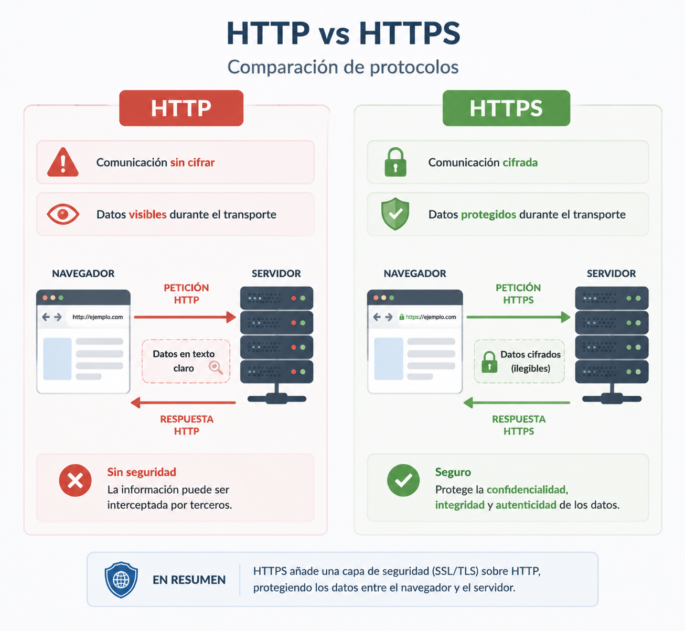
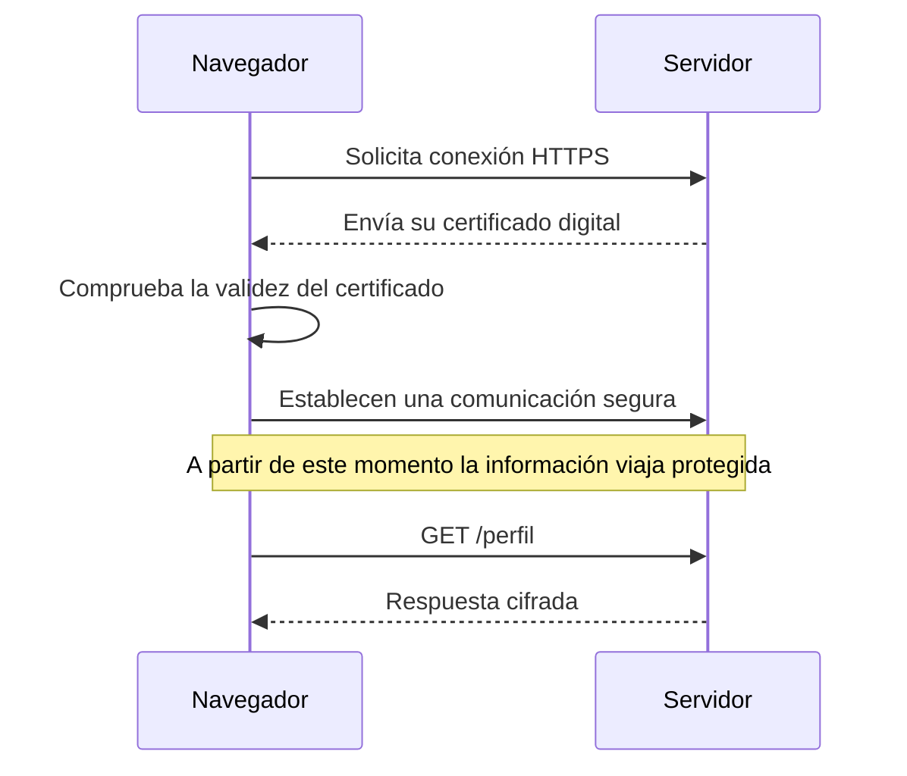
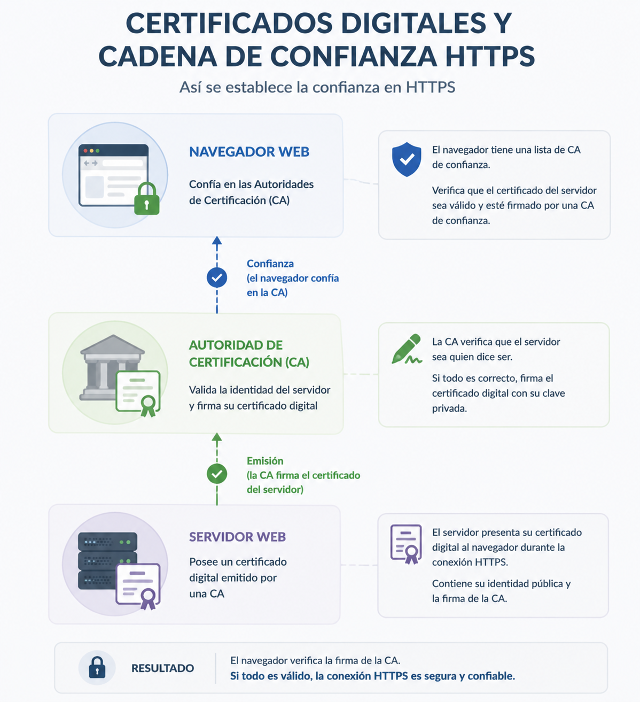
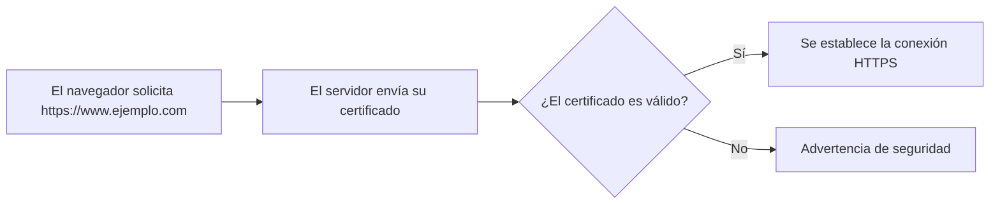
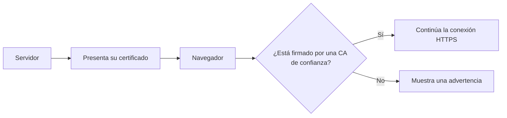

# HTTPS y certificados digitales

En los capítulos anteriores hemos aprendido cómo se comunican el navegador y el servidor mediante el protocolo HTTP y cómo las cookies y las sesiones permiten mantener el estado de una aplicación web.

Sin embargo, hasta ahora hemos dado por supuesto que esa comunicación se realiza de forma segura. ¿Qué ocurre si un tercero puede observar o modificar la información que viaja por la red?

Cuando una aplicación intercambia datos sensibles —como credenciales, información personal o datos bancarios— resulta imprescindible proteger la comunicación entre el cliente y el servidor.

Para resolver este problema se utiliza **HTTPS**, un protocolo que añade una capa de seguridad sobre HTTP mediante técnicas de cifrado y autenticación.

En este capítulo estudiaremos qué problemas resuelve HTTPS, cómo funciona de forma general, qué papel desempeñan los certificados digitales y por qué todo desarrollador debe utilizarlo en sus aplicaciones.

---

## El problema de HTTP

HTTP fue diseñado para facilitar la comunicación entre clientes y servidores en una red. Sin embargo, en su versión original no incorpora ningún mecanismo para proteger la información que se transmite.

Esto significa que las peticiones y respuestas viajan en texto claro. Cualquier dispositivo situado entre el navegador y el servidor podría, en determinadas circunstancias, leer o incluso modificar esa información.

Supongamos que un usuario inicia sesión en una aplicación web utilizando una conexión HTTP.

```http
POST /login HTTP/1.1
Host: ejemplo.com

usuario=jgarcia
password=MiClave123
```

Si esa comunicación no está protegida, un tercero con acceso al tráfico de red podría capturar fácilmente tanto el nombre de usuario como la contraseña.

Pero las credenciales no son el único dato sensible que puede verse comprometido.

Una aplicación web puede transmitir información como:

- Datos personales.
- Direcciones de correo electrónico.
- Información médica.
- Números de tarjeta bancaria.
- Cookies de sesión.
- Documentos privados.

Toda esa información debería llegar únicamente al destinatario previsto.

### Tres riesgos principales

Cuando una aplicación utiliza HTTP sin protección aparecen tres problemas fundamentales.

#### Confidencialidad

La información puede ser leída por personas no autorizadas durante la transmisión.

#### Integridad

Los datos pueden modificarse antes de llegar a su destino sin que el usuario o la aplicación lo detecten.

Por ejemplo, un atacante podría alterar el contenido de una respuesta o modificar un enlace antes de que llegue al navegador.

#### Autenticidad

El navegador necesita tener la certeza de que realmente está comunicándose con el servidor esperado y no con un servidor falso que intenta hacerse pasar por él.

Sin un mecanismo de autenticación sería posible engañar al usuario para que enviara información sensible a un servidor controlado por un atacante.

!!! warning "HTTP no es inseguro por sí mismo"

    HTTP cumple correctamente su función como protocolo de comunicación.

    El problema aparece cuando se utiliza para transmitir información que requiere confidencialidad, integridad o autenticación.

Por este motivo, las aplicaciones modernas utilizan HTTPS como mecanismo para proteger las comunicaciones entre el navegador y el servidor.

## Qué aporta HTTPS

HTTPS (**HyperText Transfer Protocol Secure**) es la versión segura de HTTP.

No sustituye a HTTP, sino que añade una capa de protección que permite intercambiar información de forma confidencial y verificar la identidad del servidor con el que se establece la comunicación.

Desde la perspectiva del desarrollador, HTTPS resuelve los tres problemas planteados en el apartado anterior.

### Confidencialidad

La información que intercambian el navegador y el servidor viaja cifrada.

Esto significa que, aunque un tercero consiga interceptar el tráfico de red, no podrá interpretar fácilmente su contenido.

Por ejemplo, una petición como la siguiente:

```http
POST /login HTTP/1.1

usuario=jgarcia
password=MiClave123
```

deja de viajar como texto legible y pasa a transmitirse mediante datos cifrados que solo pueden interpretar el navegador y el servidor.

### Integridad

HTTPS garantiza que la información no ha sido modificada durante la transmisión.

Si un tercero intentara alterar una petición o una respuesta, el navegador detectaría que la comunicación ha perdido su integridad y descartaría los datos recibidos.

Esto evita que un atacante pueda modificar el contenido de una página, alterar enlaces o cambiar información enviada entre el cliente y el servidor.

### Autenticidad

Además de proteger la comunicación, HTTPS permite comprobar que el navegador está conectado al servidor correcto.

Antes de comenzar la comunicación segura, el servidor presenta un certificado digital que acredita su identidad.

El navegador verifica ese certificado antes de intercambiar información sensible.

Gracias a este proceso, el usuario puede tener una confianza razonable de que realmente está comunicándose con el servidor esperado y no con otro que intenta suplantarlo.

{ width="700" }

### Una conexión protegida

El proceso general puede resumirse de la siguiente forma.



Aunque internamente este proceso utiliza diferentes mecanismos criptográficos, para un desarrollador es suficiente comprender la idea general: antes de intercambiar información sensible, el navegador verifica la identidad del servidor y establece un canal seguro para la comunicación.

!!! note "HTTPS protege la comunicación"

    HTTPS no hace que una aplicación sea automáticamente segura.

    Su función consiste en proteger la información mientras viaja entre el navegador y el servidor. La seguridad del propio código de la aplicación seguirá dependiendo de cómo haya sido diseñada e implementada.

!!! example "Desde la perspectiva del desarrollador"

    Hoy en día, cualquier aplicación que gestione autenticación, datos personales o información sensible debe utilizar HTTPS desde el primer momento, tanto durante las pruebas como en producción.

## Qué es un certificado digital

Un **certificado digital** es un documento electrónico que permite acreditar la identidad de un servidor durante una conexión HTTPS.

Un certificado digital permite asociar una identidad con una clave pública y está firmado por una Autoridad de Certificación de confianza.

{ width="650" }

Cuando un navegador establece una conexión segura con un sitio web, una de las primeras acciones del servidor consiste en enviar su certificado digital.

Ese certificado contiene información que permite al navegador comprobar que está comunicándose con el servidor correcto y no con otro que intenta suplantarlo.

Entre otros datos, un certificado suele incluir:

- El nombre del dominio para el que ha sido emitido.
- La identidad del propietario del certificado.
- La clave pública del servidor.
- El periodo de validez.
- La entidad que ha emitido el certificado.
- La firma digital que garantiza su autenticidad.

Aunque internamente contiene información criptográfica, para un desarrollador lo importante es comprender su función: **permitir que el navegador verifique la identidad del servidor antes de comenzar una comunicación segura.**

### ¿Qué ocurre cuando accedemos a un sitio HTTPS?

Cuando un usuario escribe una dirección como:

```text
https://www.ejemplo.com
```

el navegador inicia una conexión HTTPS y solicita al servidor su certificado digital.

A continuación realiza varias comprobaciones automáticas.

1. Comprueba que el certificado no ha caducado.
2. Verifica que el dominio coincide con el sitio solicitado.
3. Comprueba que el certificado ha sido emitido por una entidad de confianza.
4. Verifica que la firma digital del certificado es válida.

Si todas estas comprobaciones son correctas, el navegador continúa estableciendo la conexión segura.

En caso contrario, muestra un aviso indicando que no puede garantizar la identidad del servidor.



### El candado del navegador

Cuando todas las verificaciones son satisfactorias, el navegador muestra el conocido icono del candado en la barra de direcciones.

Ese símbolo **no significa que la aplicación sea completamente segura**.

Indica únicamente que:

- La comunicación está protegida mediante HTTPS.
- La identidad del servidor ha sido verificada mediante un certificado válido.

Una aplicación puede utilizar HTTPS y, aun así, contener errores de programación o vulnerabilidades de seguridad.

!!! note "El certificado identifica al servidor"

    El certificado digital no protege por sí mismo la aplicación.

    Su función consiste en demostrar la identidad del servidor y permitir el establecimiento de una comunicación segura.

!!! example "Desde la perspectiva del desarrollador"

    Cuando desplegamos una aplicación en Internet, instalar un certificado digital válido es una parte esencial del proceso de publicación.

    Sin él, los navegadores modernos advertirán al usuario de que la identidad del servidor no puede verificarse correctamente.
## Autoridades de certificación

Un certificado digital solo resulta útil si existe un mecanismo que permita confiar en él.

Pensemos en una situación cotidiana. Cualquier persona puede imprimir un documento que afirme "Soy quien digo ser", pero ese documento no tendrá ningún valor si no existe una entidad de confianza que lo respalde.

Con los certificados digitales ocurre algo parecido.

Las **Autoridades de Certificación** (*Certification Authorities* o **CA**) son organizaciones encargadas de emitir certificados digitales y de verificar la identidad de quien los solicita.

Cuando una CA emite un certificado, lo firma digitalmente. Esa firma permite al navegador comprobar que el certificado ha sido emitido por una entidad en la que previamente confía.

### ¿Por qué confía el navegador?

Los principales navegadores incorporan una lista de Autoridades de Certificación consideradas fiables.

Cuando reciben un certificado durante una conexión HTTPS, comprueban si ha sido firmado por alguna de esas entidades.

Si la respuesta es afirmativa y el resto de las comprobaciones también son correctas, la conexión continúa normalmente.

En caso contrario, el navegador muestra una advertencia indicando que no puede garantizar la identidad del servidor.



### Certificados autofirmados

Durante el desarrollo de una aplicación es frecuente utilizar **certificados autofirmados**.

En este caso, el propio desarrollador genera y firma el certificado sin recurrir a una Autoridad de Certificación.

Aunque técnicamente permiten establecer una conexión cifrada, los navegadores no pueden verificar su autenticidad y, por ello, muestran una advertencia de seguridad.

Este tipo de certificados son útiles en entornos de desarrollo o laboratorio, pero no deberían utilizarse en aplicaciones públicas.

### Certificados en producción

Cuando una aplicación va a publicarse en Internet, es necesario instalar un certificado emitido por una Autoridad de Certificación reconocida.

Actualmente existen entidades que proporcionan certificados gratuitos, como **Let's Encrypt**, lo que ha facilitado que prácticamente cualquier sitio web pueda utilizar HTTPS sin coste económico.

Desde la perspectiva del desarrollador, lo importante es recordar que una aplicación publicada debería ofrecer siempre una conexión HTTPS con un certificado válido.

!!! note "Confiamos en la entidad emisora"

    El navegador no conoce previamente al servidor con el que se comunica.

    Lo que conoce y en lo que confía es en la Autoridad de Certificación que ha emitido y firmado el certificado.

!!! example "Desde la perspectiva del desarrollador"

    Durante el desarrollo es normal trabajar con certificados autofirmados y aceptar la advertencia del navegador.

    Sin embargo, antes de desplegar una aplicación en producción debe instalarse un certificado emitido por una Autoridad de Certificación reconocida.

## Qué cambia para el desarrollador

Comprender cómo funciona HTTPS es importante, pero el objetivo de este módulo no es diseñar protocolos de comunicación, sino desarrollar aplicaciones web seguras.

Desde esa perspectiva, utilizar HTTPS deja de ser una decisión opcional y pasa a convertirse en un requisito básico de cualquier aplicación moderna.

### Utilizar HTTPS desde el inicio

Durante el desarrollo de una aplicación es recomendable trabajar siempre que sea posible utilizando HTTPS.

De este modo, el entorno de desarrollo se aproxima al entorno de producción y es posible detectar antes determinados problemas relacionados con la configuración de cookies, sesiones o autenticación.

Muchos frameworks modernos permiten configurar fácilmente entornos locales con HTTPS mediante certificados de desarrollo.

### Proteger la autenticación

Las credenciales de acceso nunca deberían transmitirse mediante HTTP.

Cuando un usuario introduce su nombre de usuario y su contraseña, esa información debe viajar siempre a través de una conexión HTTPS.

Lo mismo ocurre con los formularios de registro, recuperación de contraseña o modificación de datos personales.

### Proteger las cookies de sesión

Como vimos en el capítulo anterior, las cookies de sesión identifican al usuario durante su interacción con la aplicación.

Si esas cookies viajaran mediante HTTP, podrían ser interceptadas por un tercero.

Por este motivo, las aplicaciones modernas utilizan HTTPS junto con el atributo **Secure**, de forma que las cookies de sesión solo se transmitan mediante conexiones cifradas.

### Proteger las API

Las aplicaciones actuales suelen comunicarse con APIs REST para intercambiar información entre distintos servicios.

Cuando esas APIs manejan datos personales, credenciales o información sensible, también deben utilizar HTTPS.

Este requisito es independiente del lenguaje de programación o del framework utilizado.

### HTTPS no sustituye al desarrollo seguro

Es importante recordar que HTTPS únicamente protege la comunicación entre el navegador y el servidor.

No evita errores de programación, vulnerabilidades en el código o configuraciones incorrectas de la aplicación.

Por ejemplo, una aplicación puede utilizar HTTPS y seguir siendo vulnerable a ataques como:

- Cross-Site Scripting (XSS).
- Inyección SQL.
- Cross-Site Request Forgery (CSRF).
- Control de acceso insuficiente.
- Validación incorrecta de datos.

HTTPS constituye una parte esencial del desarrollo seguro, pero no sustituye a las demás medidas de protección que estudiaremos a lo largo del curso.

!!! note "HTTPS es un requisito básico"

    Actualmente se considera una buena práctica utilizar HTTPS en cualquier aplicación web, incluso cuando no gestione información especialmente sensible.

    Además de mejorar la seguridad, muchos navegadores limitan determinadas funcionalidades cuando una aplicación no utiliza una conexión segura.

!!! example "Desde la perspectiva del desarrollador"

    En los proyectos desarrollados durante este módulo trabajaremos siempre utilizando HTTPS cuando el entorno lo permita.

    Esta práctica facilitará la comprensión de otros mecanismos de seguridad que aparecerán en los siguientes bloques.

    ---

## Para recordar

HTTP permite la comunicación entre el navegador y el servidor, pero no protege la información que se transmite.

HTTPS añade una capa de seguridad que garantiza la confidencialidad, la integridad y la autenticidad de la comunicación mediante el uso de técnicas criptográficas y certificados digitales.

Los certificados permiten verificar la identidad del servidor, mientras que las Autoridades de Certificación proporcionan el nivel de confianza necesario para que el navegador pueda validar esos certificados.

Para un desarrollador, utilizar HTTPS constituye uno de los primeros requisitos para construir aplicaciones web seguras, aunque siempre debe complementarse con una correcta implementación del resto de mecanismos de seguridad.

---

## Ideas clave

- HTTP transmite la información sin protección.
- HTTPS protege la comunicación entre el navegador y el servidor.
- HTTPS proporciona confidencialidad, integridad y autenticidad.
- Los certificados digitales permiten verificar la identidad del servidor.
- Las Autoridades de Certificación validan y firman los certificados.
- Los certificados autofirmados son útiles para desarrollo, pero no para producción.
- HTTPS protege la comunicación, pero no elimina las vulnerabilidades de la aplicación.
- Toda aplicación web moderna debería utilizar HTTPS.

---
