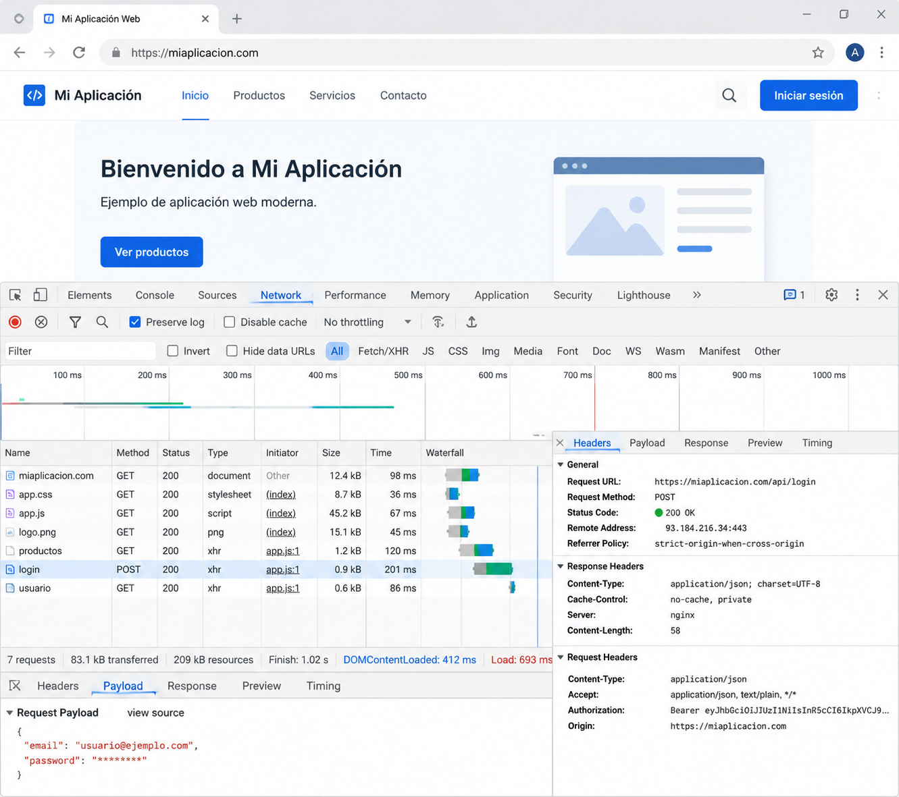
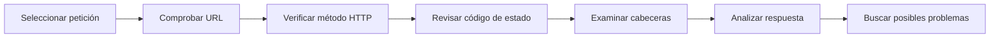
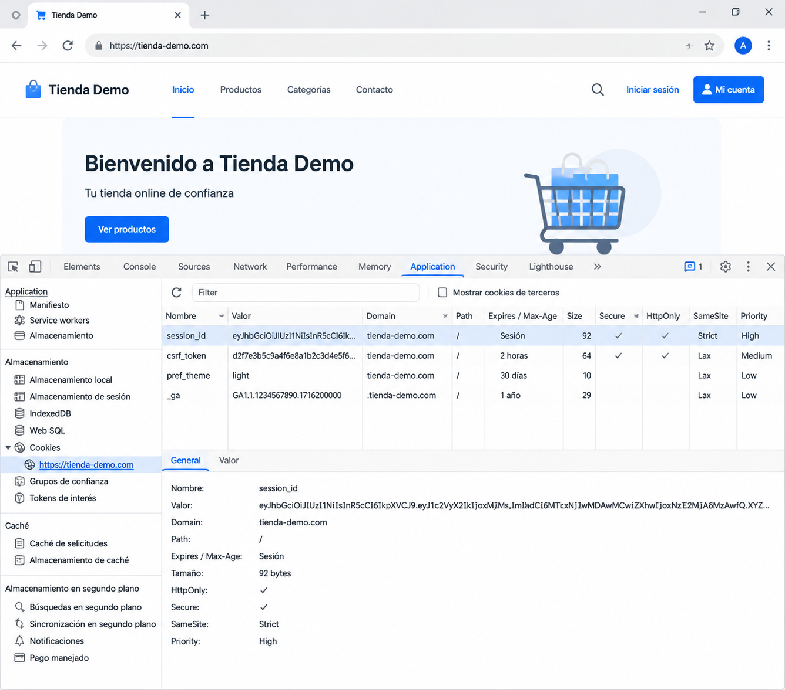
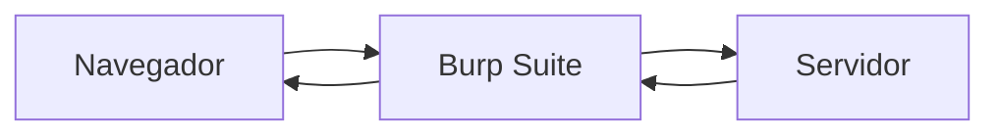

# Herramientas de análisis web

En los capítulos anteriores hemos estudiado cómo se comunican el navegador y el servidor, cómo se mantiene el estado mediante cookies y sesiones y cómo HTTPS protege la información durante la comunicación.

Sin embargo, un desarrollador no puede limitarse a conocer estos mecanismos desde un punto de vista teórico. También necesita comprobar que su aplicación se comporta como espera y ser capaz de interpretar lo que realmente ocurre durante una petición.

Para ello existen diferentes herramientas de análisis que permiten observar la comunicación entre el cliente y el servidor, inspeccionar cookies, analizar respuestas HTTP y detectar posibles problemas durante el desarrollo.

En este capítulo conoceremos las herramientas más utilizadas por un desarrollador web y aprenderemos a utilizarlas como parte habitual del proceso de desarrollo y depuración.

---

## ¿Por qué analizar una aplicación web?

Cuando desarrollamos una aplicación solemos pensar en el código que escribimos.

Sin embargo, una parte importante del trabajo consiste en verificar que ese código produce exactamente el comportamiento esperado.

Por ejemplo, un desarrollador puede necesitar responder a preguntas como estas:

- ¿Qué petición HTTP acaba de enviar el navegador?
- ¿Qué respuesta ha devuelto el servidor?
- ¿Se ha enviado correctamente la cookie de sesión?
- ¿Qué código de estado HTTP se ha recibido?
- ¿Cuánto tiempo ha tardado la respuesta?
- ¿Por qué una petición devuelve un error 403 o un 500?

Responder a estas preguntas únicamente leyendo el código suele ser difícil.

Las herramientas de análisis permiten observar directamente la comunicación entre el navegador y el servidor, facilitando la localización de errores y la comprensión del funcionamiento interno de una aplicación.

### Analizar forma parte del desarrollo

El análisis no debe entenderse como una actividad reservada para especialistas en seguridad o administradores de sistemas.

Forma parte del trabajo cotidiano de cualquier desarrollador.

Durante el desarrollo es habitual inspeccionar peticiones, revisar cabeceras HTTP, comprobar cookies o analizar respuestas para verificar que la aplicación funciona correctamente.

Cuanto antes se detecta un problema, más sencillo resulta corregirlo.

!!! note "Observar antes de modificar"

    Muchas incidencias pueden resolverse simplemente observando qué información intercambian realmente el navegador y el servidor.

    Antes de cambiar el código, conviene comprobar qué está ocurriendo durante la comunicación.

!!! example "Desde la perspectiva del desarrollador"

    Las herramientas de análisis permiten comprender el comportamiento real de una aplicación y tomar decisiones basadas en evidencias, no en suposiciones.

## Las herramientas de desarrollo del navegador

Los navegadores modernos incorporan un conjunto de herramientas de desarrollo que permiten inspeccionar el funcionamiento interno de una página web.

Estas herramientas, conocidas habitualmente como **DevTools** (*Developer Tools*), forman parte del trabajo diario de cualquier desarrollador web.

Aunque ofrecen numerosas funcionalidades, durante este módulo utilizaremos principalmente aquellas relacionadas con la comunicación entre el navegador y el servidor.

En la mayoría de los navegadores pueden abrirse pulsando la tecla **F12** o mediante la opción **Inspeccionar** del menú contextual.

{ width="900" }

### Las pestañas más utilizadas

Las DevTools incluyen numerosas pestañas, pero unas pocas concentran la mayor parte del trabajo de desarrollo.

| Pestaña | Utilidad principal |
|----------|--------------------|
| **Elements** | Inspeccionar y modificar la estructura HTML y los estilos CSS. |
| **Console** | Mostrar mensajes, errores y ejecutar instrucciones JavaScript. |
| **Network** | Analizar las peticiones y respuestas HTTP. |
| **Application** (Chrome) / **Storage** (Firefox) | Inspeccionar cookies, almacenamiento local y otros datos del navegador. |

A lo largo de este módulo utilizaremos principalmente las pestañas **Network** y **Application**, ya que permiten observar directamente muchos de los mecanismos estudiados en los capítulos anteriores.

### DevTools como herramienta de aprendizaje

Las herramientas de desarrollo no solo sirven para localizar errores.

También permiten comprender cómo funciona una aplicación web mientras está en ejecución.

Por ejemplo, con ellas podremos observar:

- Qué recursos solicita el navegador.
- Qué cabeceras HTTP se intercambian.
- Qué código de estado devuelve el servidor.
- Qué cookies se crean durante el inicio de sesión.
- Cuánto tarda cada petición.
- Qué información devuelve una API.

Esta capacidad de observación resulta especialmente útil durante el aprendizaje, ya que permite relacionar los conceptos teóricos con el comportamiento real de una aplicación.

!!! note "Una herramienta imprescindible"

    Las DevTools forman parte del entorno habitual de trabajo de cualquier desarrollador web.

    Aprender a utilizarlas correctamente resulta tan importante como conocer el lenguaje de programación o el framework empleado.

!!! example "Desde la perspectiva del desarrollador"

    En este módulo utilizaremos las DevTools continuamente para comprobar el funcionamiento de las aplicaciones desarrolladas durante los retos y verificar que la comunicación entre el navegador y el servidor se produce como esperamos.

## Analizando una petición HTTP

La pestaña **Network** de las herramientas de desarrollo permite observar todas las peticiones que realiza el navegador mientras interactúa con una aplicación web.

Cada vez que se carga una página, se envía un formulario o se consulta una API, aparece una nueva entrada con información detallada sobre esa comunicación.

Esta herramienta resulta especialmente útil para comprobar si una aplicación está funcionando como esperamos o para localizar el origen de un problema.

### Qué información ofrece una petición

Al seleccionar una petición en la pestaña **Network** podemos consultar información como:

- La URL solicitada.
- El método HTTP utilizado.
- El código de estado devuelto por el servidor.
- Las cabeceras de la petición y de la respuesta.
- El contenido enviado al servidor.
- El contenido recibido como respuesta.
- El tiempo empleado en completar la comunicación.

Toda esta información permite comprender con precisión qué está ocurriendo entre el navegador y el servidor.

### Un ejemplo

Supongamos que un usuario accede a la página principal de una aplicación.

La pestaña **Network** podría mostrar una petición similar a esta:

```text
Nombre        Método   Estado   Tipo
------------------------------------------
index.html    GET      200      document
styles.css    GET      200      stylesheet
app.js        GET      200      script
logo.png      GET      200      image
```

A partir de esta información podemos comprobar que:

- La página principal se ha cargado correctamente.
- Los archivos CSS y JavaScript se han descargado sin errores.
- Las imágenes también se han recibido correctamente.
- No aparecen recursos con errores de carga.

### Analizando una petición paso a paso

Cuando seleccionamos una petición concreta podemos seguir un pequeño proceso de análisis.

1. Comprobar la URL solicitada.
2. Verificar el método HTTP utilizado.
3. Revisar el código de estado de la respuesta.
4. Examinar las cabeceras HTTP.
5. Analizar el contenido enviado y recibido.
6. Comprobar el tiempo empleado por la petición.

Este procedimiento resulta útil tanto para localizar errores como para comprender el funcionamiento interno de una aplicación.



### Relacionando teoría y práctica

En los capítulos anteriores hemos estudiado conceptos como HTTP, cookies, sesiones y HTTPS.

La pestaña **Network** permite observar directamente todos esos mecanismos.

Por ejemplo, podremos comprobar:

- Qué método HTTP utiliza cada petición.
- Qué código de estado devuelve el servidor.
- Qué cabeceras HTTP se intercambian.
- Si la comunicación utiliza HTTP o HTTPS.
- Si el navegador envía cookies junto con la petición.

La teoría deja así de ser un conjunto de conceptos abstractos para convertirse en información observable durante la ejecución de una aplicación.

!!! note "No todas las peticiones corresponden a páginas web"

    Una página moderna suele realizar numerosas peticiones adicionales para cargar imágenes, hojas de estilo, archivos JavaScript o consultar APIs.

    La pestaña **Network** permite analizar todas ellas de forma independiente.

!!! example "Desde la perspectiva del desarrollador"

    Cuando una aplicación no funciona como esperábamos, una de las primeras acciones consiste en abrir la pestaña **Network** y comprobar qué peticiones se han realizado y qué respuestas ha devuelto el servidor.

## Observando cookies y sesiones

En el capítulo anterior aprendimos que las cookies y las sesiones permiten mantener el estado de una aplicación web entre distintas peticiones HTTP.

Las herramientas de desarrollo del navegador permiten comprobar directamente cómo funcionan estos mecanismos y observar la información que el navegador almacena para cada sitio web.

En Chrome y Microsoft Edge esta información puede consultarse desde la pestaña **Application**, mientras que Firefox ofrece funcionalidades equivalentes en la pestaña **Storage**.

{ width="900" }

### Inspeccionando las cookies

Al seleccionar el apartado **Cookies** dentro de las herramientas de desarrollo, el navegador muestra todas las cookies asociadas al sitio web actual.

Cada cookie aparece acompañada de diferentes atributos, como:

- Nombre.
- Valor.
- Dominio.
- Ruta (*Path*).
- Fecha de expiración.
- Indicador **Secure**.
- Indicador **HttpOnly**.
- Indicador **SameSite**.

Esta información permite comprobar cómo gestiona la aplicación la identificación del usuario y verificar que las cookies se han configurado correctamente.

> **Aquí insertaremos la Figura 4: Cookies almacenadas por el navegador.**

### Relacionando las cookies con las sesiones

Cuando un usuario inicia sesión en una aplicación, es habitual que aparezca una cookie similar a alguna de las siguientes:

```text
PHPSESSID

laravel_session

JSESSIONID

ASP.NET_SessionId
```

Aunque el nombre depende de la tecnología utilizada, todas cumplen una función muy parecida: almacenar el identificador que permitirá al servidor recuperar la sesión correspondiente.

Es importante recordar que **la sesión no se encuentra almacenada en el navegador**.

El navegador únicamente conserva el identificador de la sesión mediante una cookie. Toda la información asociada al usuario permanece almacenada en el servidor.

Esta observación permite comprobar en la práctica uno de los conceptos más importantes estudiados en el capítulo anterior.

### Verificando los atributos de seguridad

Además del identificador de la sesión, las herramientas de desarrollo permiten comprobar si las cookies utilizan correctamente distintos mecanismos de protección.

Por ejemplo, podremos verificar si una cookie:

- Solo se transmite mediante HTTPS (**Secure**).
- No puede accederse desde JavaScript (**HttpOnly**).
- Limita su envío a otros sitios web mediante **SameSite**.

Estas comprobaciones resultan especialmente útiles durante el desarrollo de aplicaciones que gestionan autenticación o información sensible.

### Una herramienta para comprender mejor la aplicación

Inspeccionar las cookies no solo sirve para localizar errores.

También ayuda a comprender cómo una aplicación mantiene la identidad del usuario entre distintas peticiones y cómo implementa los mecanismos de autenticación.

Relacionar esta información con la pestaña **Network** permite seguir el recorrido completo de una petición: desde el envío de la cookie por parte del navegador hasta la respuesta generada por el servidor.

!!! note "Las sesiones no aparecen en el navegador"

    Las herramientas de desarrollo muestran las cookies almacenadas por el navegador, pero no el contenido de las sesiones.

    La información de la sesión permanece siempre en el servidor y solo es accesible desde la propia aplicación.

!!! example "Desde la perspectiva del desarrollador"

    Comprobar las cookies mediante las herramientas de desarrollo es una forma rápida de verificar que la autenticación funciona correctamente y que los atributos de seguridad se han configurado según lo previsto.

## Analizando el tráfico de red

Las herramientas de desarrollo del navegador permiten observar la comunicación desde la perspectiva del propio navegador.

Sin embargo, existen herramientas capaces de analizar el tráfico que circula realmente por una red.

Una de las más conocidas es **Wireshark**, un analizador de protocolos utilizado tanto por desarrolladores como por administradores de sistemas, ingenieros de redes y especialistas en seguridad.

Su función consiste en capturar los paquetes que circulan por una interfaz de red y mostrar la información contenida en ellos.

### ¿Qué puede observarse con Wireshark?

Wireshark permite analizar numerosos protocolos de comunicación.

En el contexto de este módulo resulta especialmente interesante comprobar:

- Las conexiones HTTP y HTTPS.
- Las peticiones DNS.
- El establecimiento de conexiones TCP.
- El intercambio de paquetes entre cliente y servidor.

Esta información ayuda a comprender cómo viajan realmente los datos por la red.

### HTTP frente a HTTPS

Una de las demostraciones más ilustrativas consiste en comparar una conexión HTTP con otra HTTPS.

Cuando una aplicación utiliza HTTP, gran parte de la información transmitida puede observarse directamente en la captura de red.

Por ejemplo, es posible identificar:

- La URL solicitada.
- Las cabeceras HTTP.
- El contenido de muchas peticiones y respuestas.
- Información enviada mediante formularios.

En cambio, cuando la aplicación utiliza HTTPS, el contenido de la comunicación aparece cifrado.

Aunque siguen siendo visibles determinados datos técnicos —como las direcciones IP o el establecimiento de la conexión— el contenido intercambiado entre el navegador y el servidor ya no puede interpretarse directamente.

> **Aquí insertaremos la Figura 5: Captura de tráfico HTTP con Wireshark.**

> **Aquí insertaremos la Figura 6: Captura de tráfico HTTPS con Wireshark.**

Comparar ambas capturas permite comprender de forma inmediata la importancia de utilizar HTTPS en aplicaciones que manejan información sensible.

### Wireshark como herramienta de aprendizaje

En este módulo no utilizaremos Wireshark para realizar auditorías ni análisis avanzados de redes.

Su objetivo será ayudar a visualizar cómo se comunican realmente las aplicaciones web y reforzar los conceptos estudiados en los capítulos anteriores.

Observar directamente el tráfico HTTP y HTTPS facilita comprender por qué la protección de las comunicaciones constituye un requisito fundamental del desarrollo web seguro.

!!! note "Una visión diferente"

    Mientras que las herramientas de desarrollo muestran la comunicación desde el navegador, Wireshark permite observar el tráfico desde la perspectiva de la red.

    Ambas herramientas ofrecen información complementaria.

!!! example "Desde la perspectiva del desarrollador"

    Utilizar Wireshark en un entorno de laboratorio ayuda a comprender cómo viaja la información entre el cliente y el servidor y por qué HTTPS resulta imprescindible en aplicaciones modernas.

## Otras herramientas de análisis

Además de las herramientas integradas en el navegador y de analizadores de tráfico como Wireshark, existen aplicaciones especializadas para inspeccionar la comunicación entre un navegador y un servidor.

Una de las más conocidas es **Burp Suite**, una herramienta ampliamente utilizada durante el desarrollo, las pruebas de seguridad y las auditorías de aplicaciones web.

Su funcionamiento se basa en actuar como un **proxy** entre el navegador y el servidor.

En lugar de comunicarse directamente con la aplicación, el navegador envía las peticiones a Burp Suite. La herramienta las recibe, las muestra al desarrollador y, posteriormente, las reenvía al servidor.

De la misma forma, las respuestas del servidor también pasan por Burp Suite antes de llegar al navegador.



Gracias a este funcionamiento es posible observar con detalle las peticiones y respuestas HTTP, comprobar las cabeceras intercambiadas o analizar cómo se comporta una aplicación durante su ejecución.

### ¿Para qué puede utilizarla un desarrollador?

Aunque Burp Suite dispone de numerosas funcionalidades avanzadas, en este módulo nos interesan especialmente aquellas relacionadas con la comprensión del funcionamiento de una aplicación web.

Por ejemplo, permite:

- Observar las peticiones HTTP y HTTPS.
- Analizar las cabeceras enviadas por el navegador.
- Inspeccionar las respuestas del servidor.
- Comprender el intercambio de información entre cliente y servidor.
- Verificar el funcionamiento de formularios y APIs.

Estas tareas resultan útiles durante el desarrollo y ayudan a comprender mejor el comportamiento de una aplicación.

### Un primer contacto

En este módulo utilizaremos únicamente algunas funcionalidades básicas de Burp Suite Community Edition con fines didácticos.

El objetivo no será aprender técnicas ofensivas ni realizar auditorías de seguridad, sino comprender cómo circula la información entre el navegador y el servidor y cómo pueden analizarse las comunicaciones de una aplicación web.

!!! note "Una herramienta muy utilizada"

    Burp Suite es una herramienta de referencia en el ámbito del desarrollo y la seguridad de aplicaciones web.

    En este módulo la utilizaremos como instrumento de observación y aprendizaje.

!!! example "Desde la perspectiva del desarrollador"

    Antes de modificar el código de una aplicación, resulta útil observar cómo se intercambian realmente las peticiones y respuestas HTTP. Herramientas como Burp Suite facilitan este proceso de análisis.

## ¿Qué herramienta utilizar?

| Herramienta | ¿Qué permite observar? | Uso habitual |
|--------------|------------------------|--------------|
| **DevTools** | HTML, CSS, JavaScript, peticiones HTTP, cookies | Desarrollo diario |
| **Wireshark** | Tráfico de red y protocolos | Análisis de comunicaciones |
| **Burp Suite** | Peticiones y respuestas HTTP/HTTPS | Desarrollo, depuración y pruebas de aplicaciones |

## Qué cambia para el desarrollador

Las herramientas de análisis forman parte del trabajo cotidiano de cualquier desarrollador web.

No se utilizan únicamente cuando aparece un error. También permiten comprobar que una aplicación se comporta correctamente, verificar la comunicación entre el navegador y el servidor y confirmar que las decisiones de diseño se han implementado según lo previsto.

A lo largo de este módulo utilizaremos estas herramientas de forma habitual para observar el funcionamiento de las aplicaciones desarrolladas durante los retos.

Por ejemplo, podremos comprobar:

- Qué peticiones realiza una aplicación al cargar una página.
- Qué respuestas devuelve el servidor.
- Cómo se envían las cookies de sesión.
- Si la comunicación utiliza HTTPS.
- Qué información intercambian el navegador y una API.
- Cómo interpretar los principales códigos de estado HTTP.

Este enfoque permitirá desarrollar una forma de trabajo basada en la observación y la comprobación, evitando tomar decisiones únicamente a partir del código fuente.

Con el tiempo, consultar las herramientas de análisis se convertirá en una práctica tan habitual como escribir código o utilizar un depurador.

!!! note "Observar antes de corregir"

    Cuando una aplicación no funciona correctamente, resulta recomendable comprobar primero qué está ocurriendo durante la comunicación entre el navegador y el servidor.

    En muchas ocasiones, la información necesaria para localizar el problema ya se encuentra disponible en las herramientas de análisis.

!!! example "Desde la perspectiva del desarrollador"

    Un desarrollador no necesita memorizar todas las cabeceras HTTP o todos los códigos de estado.

    Lo importante es saber utilizar las herramientas adecuadas para obtener esa información cuando sea necesaria.

---

## Para recordar

Las herramientas de análisis permiten observar el comportamiento real de una aplicación web mientras está en funcionamiento.

Las DevTools del navegador facilitan el análisis de las peticiones HTTP, las respuestas del servidor, las cookies y otros elementos relacionados con el desarrollo diario.

Wireshark ofrece una visión del tráfico que circula por la red y permite comprender la diferencia entre una comunicación HTTP y otra protegida mediante HTTPS.

Burp Suite actúa como intermediario entre el navegador y el servidor, proporcionando una forma muy útil de inspeccionar la comunicación HTTP durante el desarrollo y las pruebas.

Aprender a utilizar estas herramientas permite comprender mejor el funcionamiento de una aplicación y localizar problemas con mayor rapidez.

---

## Ideas clave

- Las herramientas de análisis permiten observar el comportamiento real de una aplicación web.
- Las DevTools forman parte del entorno habitual de trabajo de cualquier desarrollador.
- La pestaña **Network** permite analizar peticiones y respuestas HTTP.
- La pestaña **Application** o **Storage** permite inspeccionar las cookies almacenadas por el navegador.
- Wireshark muestra el tráfico de red y permite comparar comunicaciones HTTP y HTTPS.
- Burp Suite facilita el análisis de la comunicación entre el navegador y el servidor.
- Observar una aplicación es una parte esencial del proceso de desarrollo.

---
