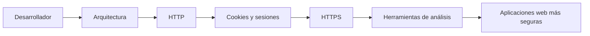

# Resumen del bloque

A lo largo de este bloque hemos construido una visión general del desarrollo web seguro desde la perspectiva de un desarrollador.

Más que estudiar mecanismos aislados, el objetivo ha sido comprender cómo se comunican las aplicaciones web, cómo mantienen el estado, cómo protegen la información y qué herramientas permiten analizar su funcionamiento.

Estos conocimientos constituyen la base sobre la que se apoyarán los siguientes bloques del módulo.

---

## Qué hemos aprendido

Durante este bloque hemos recorrido los conceptos fundamentales que intervienen en el funcionamiento de una aplicación web moderna.

En primer lugar, hemos entendido que desarrollar aplicaciones seguras no consiste únicamente en corregir vulnerabilidades, sino en incorporar criterios de seguridad durante todo el ciclo de vida del software.

A continuación, hemos estudiado la arquitectura básica de una aplicación web y el papel que desempeñan el navegador, el servidor y las bases de datos durante una petición.

Posteriormente hemos analizado el protocolo HTTP, comprendiendo cómo se intercambian las peticiones y respuestas y cómo los códigos de estado permiten interpretar el resultado de una comunicación.

Después hemos visto que HTTP es un protocolo sin estado y que las aplicaciones utilizan cookies y sesiones para mantener la identidad del usuario entre distintas peticiones.

También hemos comprobado cómo HTTPS protege la comunicación mediante el uso de certificados digitales y cómo las Autoridades de Certificación permiten verificar la identidad del servidor.

Finalmente, hemos aprendido a utilizar distintas herramientas de análisis para observar el comportamiento real de una aplicación web y relacionar la teoría con la práctica.

## La visión de conjunto

Los conceptos estudiados en este bloque no deben entenderse como temas independientes.

Cada uno de ellos responde a una parte del funcionamiento de una aplicación web y todos se complementan entre sí.

La arquitectura define cómo se organizan los distintos componentes de una aplicación.

HTTP establece las reglas de comunicación entre el navegador y el servidor.

Las cookies y las sesiones permiten mantener el estado entre distintas peticiones.

HTTPS protege esa comunicación frente a accesos no autorizados y garantiza la identidad del servidor.

Finalmente, las herramientas de análisis permiten observar todos estos mecanismos durante la ejecución de una aplicación y verificar que funcionan como se espera.

Esta visión global resulta fundamental para cualquier desarrollador web, ya que permite comprender no solo cómo construir una aplicación, sino también cómo analizar su comportamiento y tomar decisiones técnicas fundamentadas.

## Qué deberías ser capaz de hacer

Al finalizar este bloque deberías ser capaz de:

- Explicar qué significa desarrollar una aplicación web de forma segura.
- Describir la arquitectura básica de una aplicación web.
- Interpretar una petición y una respuesta HTTP.
- Diferenciar los principales códigos de estado HTTP.
- Explicar cómo las cookies y las sesiones mantienen el estado de una aplicación.
- Comprender qué aporta HTTPS frente a HTTP.
- Identificar la función de un certificado digital y de una Autoridad de Certificación.
- Utilizar las herramientas de desarrollo del navegador para analizar una aplicación web.
- Interpretar información básica obtenida mediante Wireshark y Burp Suite.

Estos conocimientos constituyen la base necesaria para abordar los siguientes bloques del módulo, en los que comenzaremos a aplicar estos conceptos sobre aplicaciones reales.

## Preparados para el siguiente bloque

Hasta ahora hemos estudiado cómo funciona una aplicación web y qué mecanismos permiten proteger y analizar la comunicación entre el navegador y el servidor.

A partir del siguiente bloque comenzaremos a trabajar sobre los riesgos que pueden aparecer durante el desarrollo de una aplicación y sobre las decisiones de diseño e implementación que permiten reducirlos.

Los conceptos aprendidos en este bloque seguirán apareciendo continuamente, ya que comprender la arquitectura, la comunicación HTTP, las cookies, las sesiones o HTTPS resulta imprescindible para entender el resto del módulo.

En otras palabras, este bloque constituye el lenguaje común sobre el que construiremos todos los contenidos posteriores.

---

## Ideas clave

- El desarrollo web seguro comienza durante el diseño de una aplicación y continúa a lo largo de todo su ciclo de vida.
- Comprender la arquitectura de una aplicación web permite interpretar cómo se comunican sus distintos componentes.
- HTTP define la comunicación entre el navegador y el servidor.
- Las cookies y las sesiones permiten mantener el estado entre peticiones.
- HTTPS protege la comunicación y verifica la identidad del servidor mediante certificados digitales.
- Las herramientas de análisis permiten observar el comportamiento real de una aplicación web.
- Todos estos conceptos forman parte del trabajo habitual de un desarrollador web.

---

## Navegación

**Página anterior:** [Herramientas de análisis web](6.herramientas-analisis-web.md)

**Volver al índice del bloque:** [Fundamentos del desarrollo web seguro](index.md)

