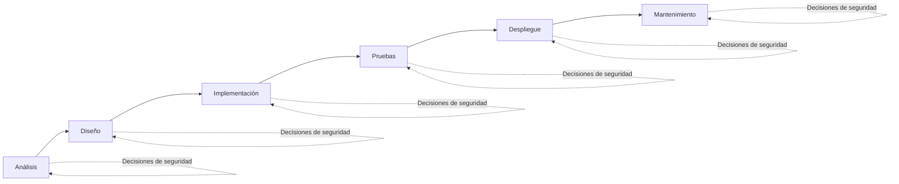
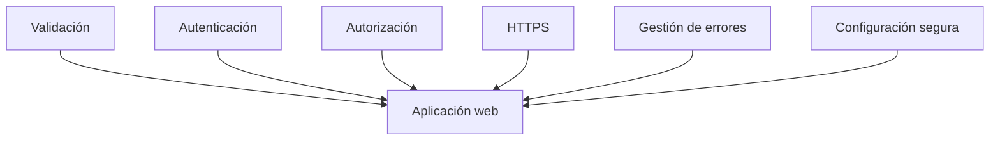
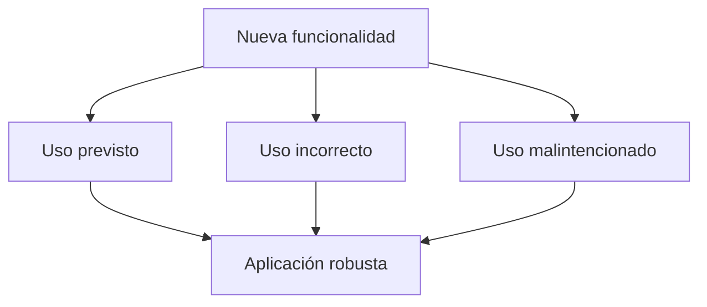

# Introducción al desarrollo seguro

En el bloque anterior hemos estudiado cómo funciona una aplicación web y cómo se comunican el navegador y el servidor mediante HTTP y HTTPS.

También hemos analizado el papel de las cookies, las sesiones y las herramientas que permiten observar el comportamiento de una aplicación durante su ejecución.

Conocer estos mecanismos es imprescindible para cualquier desarrollador web, ya que constituye la base sobre la que se construyen las aplicaciones modernas.

Sin embargo, comprender cómo funciona una aplicación no garantiza que sea segura.

La seguridad depende, en gran medida, de las decisiones que se toman durante su análisis, diseño, implementación, despliegue y mantenimiento.

En este bloque comenzaremos a estudiar esas decisiones y cómo influyen en la calidad, la robustez y la seguridad del software que desarrollamos.

---

## La seguridad comienza mucho antes del primer ataque

Cuando se habla de seguridad informática, es habitual pensar en ataques, vulnerabilidades o cibercriminales.

Sin embargo, desde la perspectiva de un desarrollador, la seguridad comienza mucho antes.

Empieza en el momento en que se diseña una aplicación y continúa durante todo su desarrollo.

Cada decisión técnica puede contribuir a reducir riesgos o, por el contrario, introducir problemas que más adelante podrán convertirse en vulnerabilidades.

Por ejemplo:

- ¿Cómo se validarán los datos introducidos por el usuario?
- ¿Quién podrá acceder a cada recurso de la aplicación?
- ¿Dónde se almacenarán las credenciales y las claves de acceso?
- ¿Qué información se mostrará cuando se produzca un error?
- ¿Cómo se protegerán las comunicaciones con el servidor?

Responder correctamente a estas preguntas forma parte del trabajo cotidiano de un desarrollador.

Por este motivo, desarrollar de forma segura no consiste únicamente en corregir errores cuando aparecen, sino en tomar buenas decisiones desde el inicio del proyecto.

!!! note "La seguridad acompaña todo el ciclo de vida"

    La seguridad no es una fase independiente del desarrollo de software.

    Debe estar presente desde las primeras decisiones de diseño hasta el mantenimiento de la aplicación una vez puesta en producción.

!!! example "Desde la perspectiva del desarrollador"

    Una aplicación puede funcionar correctamente y, sin embargo, contener decisiones de diseño que faciliten la aparición de vulnerabilidades.

    El objetivo del desarrollo seguro es reducir esos riesgos antes de que lleguen a convertirse en problemas.

## Pequeñas decisiones, grandes diferencias

En el desarrollo de una aplicación web no suele existir una única decisión que determine si una aplicación es segura o insegura.

Lo habitual es que la seguridad sea el resultado de muchas pequeñas decisiones tomadas durante el desarrollo.

Cada una de ellas puede parecer poco importante de forma aislada, pero, en conjunto, determinan el nivel de protección de la aplicación.

Por ejemplo:

- Validar correctamente la información introducida por el usuario.
- Utilizar contraseñas cifradas en lugar de almacenarlas en texto plano.
- Limitar el acceso a determinadas funcionalidades.
- Mostrar mensajes de error adecuados.
- Mantener actualizadas las dependencias del proyecto.
- Utilizar conexiones HTTPS.
- Proteger las claves y credenciales de la aplicación.

Ninguna de estas medidas garantiza por sí sola la seguridad de una aplicación.

Sin embargo, cuando todas ellas se aplican de forma conjunta, contribuyen a reducir considerablemente los riesgos.

Este enfoque se conoce habitualmente como **seguridad por capas** (*Defense in Depth*), ya que combina diferentes mecanismos de protección para dificultar la explotación de posibles vulnerabilidades.

!!! note "No existe la seguridad absoluta"

    Ninguna aplicación puede considerarse completamente segura.

    El objetivo del desarrollo seguro consiste en reducir los riesgos mediante la aplicación de buenas prácticas durante todo el ciclo de vida del software.

!!! example "Desde la perspectiva del desarrollador"

    Una aplicación no es más segura por incorporar una única medida de protección.

    Lo es porque combina múltiples mecanismos que trabajan conjuntamente para proteger la información y los recursos del sistema.

## Anticipar los riesgos

Cuando un desarrollador implementa una nueva funcionalidad suele pensar en cómo la utilizará un usuario legítimo.

Por ejemplo, al crear un formulario de inicio de sesión, es normal comprobar que el usuario puede introducir correctamente su nombre y su contraseña y acceder a la aplicación.

Sin embargo, durante el desarrollo también conviene plantearse otras preguntas.

¿Qué ocurrirá si el usuario deja un campo vacío?

¿Y si introduce un texto mucho más largo de lo esperado?

¿Y si intenta acceder a una página para la que no tiene permisos?

¿Y si modifica manualmente una petición enviada al servidor?

Este tipo de preguntas ayudan a identificar situaciones que podrían provocar errores o convertirse en problemas de seguridad.

Por este motivo, un desarrollador no debe pensar únicamente en el uso correcto de una aplicación, sino también en los usos incorrectos, accidentales o incluso malintencionados.

Anticipar estos escenarios permite diseñar aplicaciones más robustas y reducir la aparición de vulnerabilidades antes de que lleguen a producción.

!!! note "Pensar en escenarios"

    Una parte importante del desarrollo seguro consiste en imaginar situaciones que probablemente nunca ocurrirán, pero que podrían provocar un problema si llegan a producirse.

!!! example "Desde la perspectiva del desarrollador"

    Antes de dar por terminada una funcionalidad, resulta recomendable preguntarse:

    - ¿Qué podría salir mal?
    - ¿Qué ocurriría si el usuario hace algo inesperado?
    - ¿Estoy confiando demasiado en los datos recibidos?
  
## Qué estudiaremos en este bloque

A lo largo de este bloque analizaremos algunas de las decisiones de desarrollo que tienen un mayor impacto sobre la seguridad de una aplicación web.

Comenzaremos estudiando la validación de entradas, una práctica fundamental para garantizar que la información recibida cumple las condiciones esperadas antes de ser procesada.

Después veremos cómo gestionar los errores sin revelar información sensible que pueda ayudar a un posible atacante.

También analizaremos la diferencia entre autenticación y autorización, dos conceptos estrechamente relacionados, pero con objetivos claramente distintos.

Finalmente, estudiaremos cómo proteger la configuración de una aplicación y gestionar de forma segura credenciales, claves y otros secretos utilizados durante el desarrollo y el despliegue.

Todos estos aspectos constituyen buenas prácticas que cualquier desarrollador debería incorporar a su forma de trabajar, independientemente del lenguaje de programación o del framework utilizado.

## Qué cambia para el desarrollador

Desarrollar una aplicación segura implica mucho más que conocer vulnerabilidades o utilizar herramientas específicas.

Supone adoptar una forma de trabajar en la que la seguridad forma parte de cada decisión tomada durante el desarrollo.

Esto significa validar la información antes de procesarla, controlar el acceso a los recursos, proteger las credenciales, gestionar correctamente los errores y cuestionarse continuamente cómo puede comportarse una aplicación ante situaciones no previstas.

En los capítulos siguientes aprenderemos cómo aplicar estas buenas prácticas y cómo incorporarlas al desarrollo de aplicaciones web reales.

El objetivo no será memorizar una lista de recomendaciones, sino comprender el motivo por el que cada una de ellas contribuye a construir aplicaciones más seguras y robustas.

!!! note "La seguridad es una responsabilidad"

    La seguridad no depende únicamente de herramientas o tecnologías.

    Depende, sobre todo, de las decisiones que toman las personas que diseñan, desarrollan y mantienen una aplicación.

!!! example "Desde la perspectiva del desarrollador"

    Antes de incorporar una nueva funcionalidad, conviene preguntarse:

    - ¿Qué riesgos puede introducir?
    - ¿Cómo puedo reducir esos riesgos desde el propio diseño?

---

## Resumen

El desarrollo seguro comienza mucho antes de que aparezcan las primeras vulnerabilidades.

Las decisiones tomadas durante el análisis, el diseño y la implementación influyen directamente en la seguridad de una aplicación.

La protección no depende de una única medida, sino de la combinación de diferentes mecanismos que actúan conjuntamente para reducir los riesgos.

Anticipar situaciones inesperadas y cuestionar continuamente el comportamiento de una aplicación forma parte del trabajo habitual de un desarrollador.

Los capítulos siguientes desarrollarán las principales prácticas que permiten incorporar la seguridad al proceso de desarrollo.

---

## Ideas clave

- La seguridad debe estar presente durante todo el ciclo de vida del software.
- Las decisiones de desarrollo tienen un impacto directo sobre la seguridad de una aplicación.
- La seguridad por capas combina diferentes mecanismos de protección.
- Un desarrollador debe pensar tanto en el uso previsto como en los posibles usos incorrectos o malintencionados.
- Anticipar riesgos ayuda a prevenir vulnerabilidades antes de que lleguen a producción.
- Las buenas prácticas de desarrollo reducen la probabilidad de que aparezcan problemas de seguridad.

---
