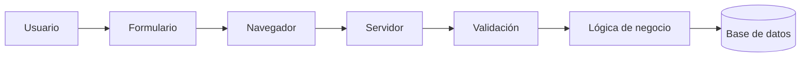
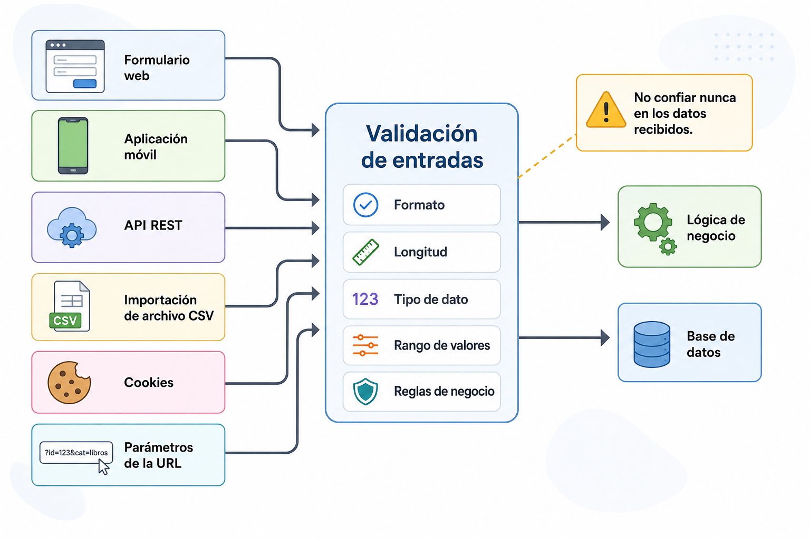
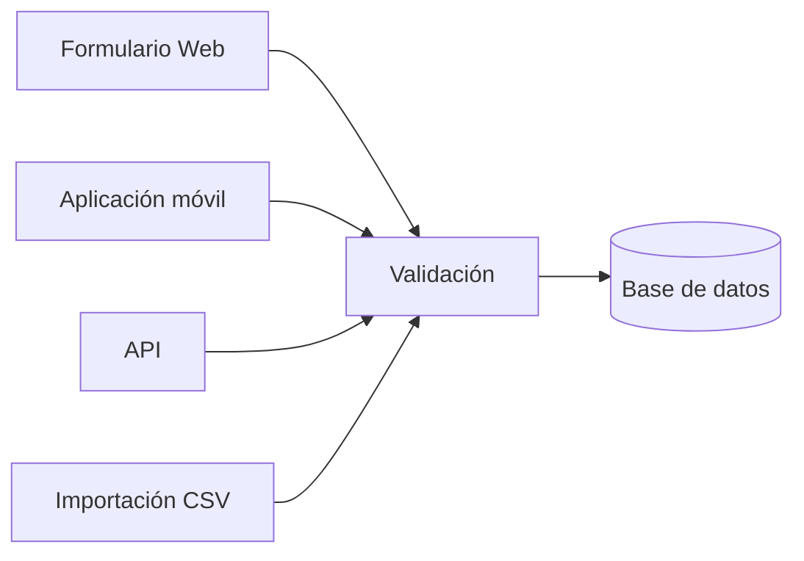
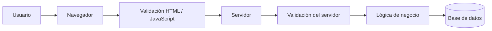
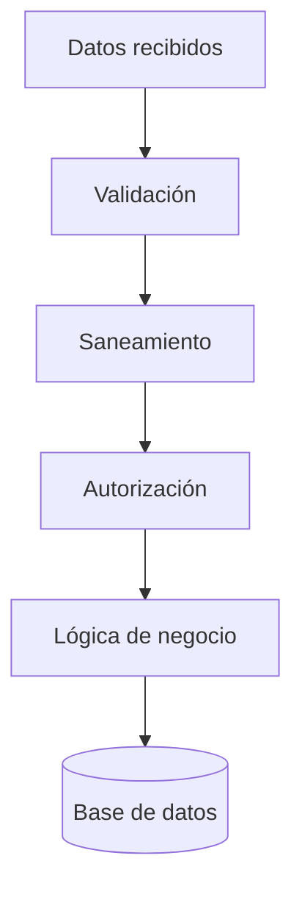
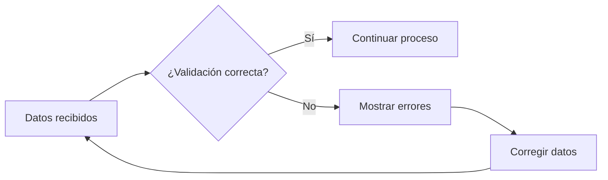

# Validación de entradas

## Introducción

Miren trabaja en la secretaría de un centro de Formación Profesional y utiliza **TxurdiGest** para matricular a un nuevo alumno.

Durante el proceso introduce su nombre, apellidos, dirección de correo electrónico, fecha de nacimiento y documento de identidad. Finalmente pulsa el botón **Guardar** y la información queda almacenada en la base de datos.

Aparentemente todo ha funcionado correctamente.

Sin embargo, antes de aceptar esos datos, la aplicación debería plantearse numerosas preguntas.

- ¿El correo electrónico tiene un formato válido?
- ¿La fecha de nacimiento existe realmente?
- ¿El DNI contiene el número y la letra correctos?
- ¿Ese correo ya pertenece a otro alumno?
- ¿Se ha intentado introducir código HTML o JavaScript en alguno de los campos?
- ¿Todos los datos cumplen las restricciones establecidas por la aplicación?

Responder correctamente a estas preguntas constituye uno de los pilares del desarrollo web seguro.

La validación de entradas no consiste únicamente en comprobar que un formulario esté correctamente rellenado. Su objetivo es garantizar que toda la información que entra en la aplicación sea coherente, segura y adecuada antes de ser procesada o almacenada.

```text
                 TxurdiGest

           Alta de un nuevo alumno

┌────────────────────────────────────────────┐
│ Nombre:              ____________________  │
│ Apellidos:           ____________________  │
│ DNI:                 ____________________  │
│ Correo electrónico:  ____________________  │
│ Fecha nacimiento:    ____________________  │
│                                            │
│               [ Guardar ]                  │
└────────────────────────────────────────────┘
```

!!! note "Caso de estudio"

    A lo largo de este capítulo utilizaremos distintas situaciones de **TxurdiGest** para ilustrar cómo debe validarse la información antes de ser procesada por la aplicación.

En este capítulo aprenderemos por qué ninguna aplicación debe confiar ciegamente en los datos recibidos y cómo implementar una estrategia de validación que reduzca significativamente el riesgo de errores y vulnerabilidades.

---

## Objetivos del capítulo

Al finalizar este capítulo serás capaz de:

- Comprender qué es la validación de entradas y por qué resulta imprescindible.
- Identificar qué datos deben validarse.
- Diferenciar la validación realizada en el cliente y en el servidor.
- Conocer los tipos de validación más habituales.
- Comprender el concepto de saneamiento de datos.
- Aplicar buenas prácticas durante el desarrollo de aplicaciones web.

---

## ¿Qué significa validar?

Validar consiste en comprobar que un dato cumple una serie de reglas antes de que la aplicación lo utilice.

Estas reglas dependen del contexto en el que se emplea la información.

Por ejemplo, un correo electrónico debe tener un formato determinado, una contraseña debe cumplir unos requisitos mínimos de seguridad y una fecha debe representar un día válido del calendario.

Validar no significa únicamente comprobar el formato de un dato. En muchas ocasiones también implica verificar aspectos relacionados con el propio negocio de la aplicación.

Por ejemplo, en **TxurdiGest** no basta con que un correo electrónico tenga un formato correcto. Además, deberá comprobarse que no exista previamente otro usuario registrado con esa misma dirección.

!!! note "Recuerda"

    Un dato puede ser correcto desde el punto de vista del formato y, sin embargo, ser inválido para la aplicación.

---

## ¿Por qué no podemos confiar en los datos?

Uno de los errores más frecuentes entre los desarrolladores que comienzan a crear aplicaciones web consiste en asumir que los usuarios siempre introducirán información correcta.

La realidad es muy diferente.

Los datos pueden ser incorrectos por numerosos motivos.

- Errores al escribir.
- Desconocimiento.
- Información incompleta.
- Problemas de comunicación.
- Manipulación deliberada.
- Intentos de explotación de vulnerabilidades.

Desde el punto de vista de la seguridad, la aplicación debe considerar que **todo dato recibido es potencialmente no confiable** hasta que haya sido validado.

Esta filosofía constituye uno de los principios fundamentales del desarrollo seguro.

!!! warning "Error frecuente"

    Confiar en que el usuario introducirá siempre información correcta suele provocar errores funcionales y, en muchas ocasiones, vulnerabilidades de seguridad.

---

## El ciclo de vida de un dato

Cuando un usuario introduce información en una aplicación web, ese dato realiza un recorrido antes de almacenarse en la base de datos.



En este recorrido, la validación constituye una etapa crítica.

Si la aplicación omite esta comprobación o la realiza de forma incorrecta, los datos inválidos podrán llegar al resto del sistema y provocar desde pequeños errores de funcionamiento hasta graves problemas de seguridad.

Por este motivo, la validación debe realizarse **antes** de utilizar cualquier dato recibido.

---

## ¿Qué debe validarse?

Una pregunta habitual consiste en pensar que únicamente deben validarse los formularios.

En realidad, cualquier dato que llegue desde el exterior debe considerarse no confiable.

Entre otros, es necesario validar:

- Formularios HTML.
- Parámetros enviados mediante la URL.
- Datos recibidos mediante peticiones HTTP.
- Información enviada desde aplicaciones móviles.
- Archivos subidos por los usuarios.
- Datos recibidos desde APIs.
- Información importada desde otros sistemas.
- Cookies.
- Variables de sesión cuando proceda.

En definitiva, cualquier dato cuyo origen sea externo a la propia aplicación.

!!! example "TxurdiGest"

    Un profesor importa un fichero CSV con las calificaciones de un grupo.

    Aunque el archivo haya sido generado desde otra aplicación del propio centro, TxurdiGest deberá validar igualmente su contenido antes de incorporarlo a la base de datos.

---
{ align=center }

*Figura 2.1. Todos los datos procedentes del exterior deben considerarse potencialmente no confiables y validarse antes de que la aplicación los procese.*

## Una misma información, muchas entradas

Cuando pensamos en la validación de datos solemos imaginar un formulario web. Sin embargo, una aplicación moderna recibe información desde múltiples orígenes.

En **TxurdiGest**, por ejemplo, un mismo alumno puede darse de alta de diferentes maneras:

- desde la aplicación web utilizada por secretaría;
- mediante una aplicación móvil;
- a través de una API;
- importando un fichero CSV;
- sincronizando datos desde otra plataforma educativa.

Aunque el origen de los datos sea diferente, todos ellos terminan modificando la misma base de datos.

Por este motivo, las reglas de validación deben aplicarse independientemente del origen de la información.



!!! note "Idea clave"

    La validación forma parte de la lógica de la aplicación y no del formulario desde el que se introducen los datos. Si mañana cambia la interfaz o se añade una nueva API, las reglas de validación deben seguir siendo las mismas.


## Validación en el cliente

La validación en el cliente se ejecuta antes de que los datos sean enviados al servidor.

Generalmente se implementa mediante HTML5 o JavaScript.

Su principal objetivo consiste en mejorar la experiencia del usuario detectando errores de forma inmediata.

Por ejemplo:

- Campos obligatorios.
- Longitud mínima.
- Formato del correo electrónico.
- Fechas válidas.
- Rangos numéricos.

Si el usuario olvida completar un campo obligatorio, el navegador puede mostrar el error inmediatamente sin necesidad de enviar la información al servidor.

Esto reduce el tráfico de red y hace que la aplicación resulte más cómoda de utilizar.

No obstante, esta validación presenta una limitación muy importante.

El usuario controla completamente el navegador.

Puede:

- desactivar JavaScript;
- modificar el código HTML;
- utilizar herramientas de desarrollo;
- enviar peticiones desde otras aplicaciones;
- construir manualmente una petición HTTP.

Por tanto, la validación en el cliente **nunca puede considerarse un mecanismo de seguridad**.

Su finalidad principal es mejorar la usabilidad.

!!! tip "Buenas prácticas"

    Utiliza la validación en el cliente para mejorar la experiencia del usuario, pero nunca como único mecanismo de protección.

---
## Validación en el servidor

La validación en el servidor se realiza una vez que la petición ha llegado a la aplicación.

A diferencia de la validación en el cliente, el servidor es un entorno controlado por el desarrollador y el usuario no puede modificar su comportamiento.

Por este motivo, **toda aplicación web debe validar siempre los datos en el servidor**, independientemente de las comprobaciones que ya se hayan realizado en el navegador.

Una petición puede proceder de muy diversos orígenes.

- Un navegador web.
- Una aplicación móvil.
- Un script automatizado.
- Una API externa.
- Una herramienta como Postman.
- Un atacante que construye manualmente una petición HTTP.

Desde el punto de vista del servidor, todas ellas son simplemente peticiones HTTP.

La aplicación no puede asumir que los datos recibidos sean correctos únicamente porque procedan de un formulario propio.



La validación del servidor constituye la última barrera antes de que los datos sean procesados por la aplicación.

Si un dato no supera esta fase, debe rechazarse y devolverse al usuario un mensaje de error adecuado.

!!! warning "Nunca omitas la validación del servidor"

    Aunque el formulario utilice HTML5, JavaScript o cualquier otro mecanismo de validación en el navegador, la aplicación debe volver a comprobar todos los datos recibidos en el servidor.

---

## Cliente y servidor: dos objetivos diferentes

Es habitual pensar que ambas validaciones realizan exactamente el mismo trabajo.

En realidad, persiguen objetivos diferentes.

| Validación en el cliente | Validación en el servidor |
|---------------------------|---------------------------|
| Mejora la experiencia del usuario. | Garantiza la seguridad y la integridad de la aplicación. |
| Se ejecuta en el navegador. | Se ejecuta en el servidor. |
| Puede ser modificada o desactivada. | El usuario no puede alterarla. |
| Reduce peticiones innecesarias. | Decide si la información será aceptada. |
| No proporciona seguridad. | Es imprescindible para la seguridad. |

Lo habitual es utilizar ambas de forma complementaria.

La validación en el cliente permite detectar rápidamente errores sencillos.

La validación en el servidor confirma definitivamente que los datos cumplen todas las reglas establecidas por la aplicación.

!!! tip "Buenas prácticas"

    Implementa las mismas reglas básicas en el cliente y en el servidor. El usuario obtiene una respuesta inmediata y la aplicación mantiene la seguridad.

---

## Tipos de validación

No todas las comprobaciones persiguen el mismo objetivo.

Dependiendo del tipo de dato, será necesario aplicar unas reglas u otras.

Las siguientes son algunas de las validaciones más habituales.

---

### Campos obligatorios

Consiste en comprobar que el usuario haya proporcionado un valor.

Por ejemplo, en TxurdiGest sería obligatorio indicar:

- nombre;
- apellidos;
- correo electrónico;
- contraseña.

Si alguno de estos datos falta, la operación no puede completarse.

---

### Tipo de dato

El valor recibido debe pertenecer al tipo esperado.

Por ejemplo:

| Campo | Tipo esperado |
|--------|---------------|
| Edad | Número entero |
| Fecha de nacimiento | Fecha |
| Precio | Número decimal |
| Correo electrónico | Cadena con formato válido |

Aceptar un tipo de dato incorrecto puede provocar errores durante el procesamiento de la información.

---

### Longitud

Muchos datos tienen un tamaño mínimo o máximo.

Por ejemplo:

| Campo | Restricción |
|--------|-------------|
| Nombre | Entre 2 y 60 caracteres |
| Contraseña | Mínimo 12 caracteres |
| Código postal | 5 caracteres |

Estas restricciones ayudan a mantener la coherencia de la información almacenada.

---

### Formato

Algunos datos deben cumplir una estructura concreta.

Ejemplos habituales:

- correo electrónico;
- teléfono;
- DNI;
- matrícula;
- código postal;
- dirección IP.

En TxurdiGest, por ejemplo, no tendría sentido aceptar un correo electrónico que no contenga el carácter **@**.

---

### Rango de valores

En ocasiones el dato puede ser correcto desde el punto de vista del formato, pero encontrarse fuera de los límites permitidos.

Por ejemplo:

| Campo | Restricción |
|--------|-------------|
| Nota | Entre 0 y 10 |
| Porcentaje | Entre 0 y 100 |
| Créditos ECTS | Valor positivo |

---

### Lista de valores permitidos

Algunos campos únicamente admiten determinados valores.

Por ejemplo, el curso académico podría ser:

- Primero.
- Segundo.

O un estado de matrícula:

- Activa.
- Pendiente.
- Finalizada.

Aceptar cualquier otro valor supondría introducir información incoherente.

---

### Unicidad

Algunos datos no pueden repetirse.

Por ejemplo:

- correo electrónico;
- DNI;
- número de expediente.

Cuando María registra un nuevo alumno en TxurdiGest, la aplicación debe comprobar que no exista previamente otro alumno con el mismo correo electrónico.

Esta comprobación suele requerir consultar la base de datos.

---

### Reglas de negocio

Son validaciones específicas de la propia aplicación.

No dependen del lenguaje de programación ni del framework utilizado.

Dependen del funcionamiento del sistema.

Por ejemplo:

- un alumno no puede matricularse dos veces en el mismo módulo;
- un profesor únicamente puede modificar las calificaciones de sus propios grupos;
- una matrícula no puede realizarse fuera del periodo establecido.

Estas comprobaciones forman parte de la lógica de negocio de la aplicación y suelen ser las más importantes.

!!! example "TxurdiGest"

    El formulario de matrícula contiene todos los campos correctamente cumplimentados.

    Sin embargo, el alumno ya está matriculado en ese mismo ciclo formativo.

    Aunque todos los datos sean válidos, la operación deberá rechazarse porque incumple una regla propia de la aplicación.

---

## Resumen de los tipos de validación

| Tipo de validación | Ejemplo |
|--------------------|----------|
| Obligatorio | Campo no vacío |
| Tipo de dato | Número entero |
| Longitud | Entre 8 y 20 caracteres |
| Formato | Correo electrónico |
| Rango | Nota entre 0 y 10 |
| Lista de valores | Curso permitido |
| Unicidad | Correo no repetido |
| Regla de negocio | Alumno no matriculado previamente |

---
## Validación y saneamiento de datos

Con frecuencia se utilizan indistintamente los términos **validar** y **sanear** los datos. Sin embargo, ambos conceptos representan procesos diferentes y complementarios.

### Validar

Validar consiste en comprobar si un dato cumple las reglas establecidas por la aplicación.

La validación responde a preguntas como:

- ¿Es un correo electrónico válido?
- ¿La nota está comprendida entre 0 y 10?
- ¿El DNI tiene un formato correcto?
- ¿La fecha existe realmente?

Si el dato no cumple las reglas definidas, la aplicación debe rechazarlo.

---

### Sanear

Sanear consiste en preparar un dato para que pueda utilizarse de forma segura.

No pretende decidir si un dato es correcto o incorrecto, sino evitar que determinados caracteres puedan interpretarse de forma distinta a la prevista.

Por ejemplo, antes de mostrar un comentario escrito por un usuario en una página web, puede ser necesario escapar determinados caracteres para impedir que el navegador los interprete como código HTML.

En otras situaciones, el saneamiento puede consistir en:

- eliminar espacios innecesarios;
- convertir caracteres a un formato estándar;
- normalizar mayúsculas y minúsculas;
- eliminar caracteres de control.

La estrategia concreta dependerá del uso posterior que vaya a hacerse del dato.

!!! note "Recuerda"

    Validar responde a la pregunta **«¿este dato es válido?»**.

    Sanear responde a la pregunta **«¿cómo debo preparar este dato para utilizarlo de forma segura?»**.

---

## Validación y seguridad

Aunque la validación constituye uno de los pilares del desarrollo seguro, por sí sola no elimina todas las vulnerabilidades.

Una aplicación correctamente desarrollada combina diferentes mecanismos de protección.



Cada uno de estos pasos protege la aplicación frente a riesgos diferentes.

Eliminar cualquiera de ellos supone reducir el nivel de seguridad del sistema.

En los próximos capítulos estudiaremos con detalle algunos de estos mecanismos.

---
## ¿Qué ocurre cuando una validación falla?

Cuando un dato no supera una validación, la aplicación debe impedir que continúe el procesamiento de la petición.

Esto significa que el dato no debe utilizarse, almacenarse ni provocar cambios en el estado de la aplicación.

En la mayoría de las situaciones, la secuencia de actuación será la siguiente:

1. Detectar el dato no válido.
2. Detener el procesamiento de la petición.
3. Informar al usuario del problema mediante un mensaje claro.
4. Permitir que el usuario corrija la información y vuelva a intentarlo.

Por ejemplo, si María introduce un correo electrónico con un formato incorrecto durante la matriculación de un alumno, TxurdiGest no debería guardar parcialmente la ficha del alumno. La operación debe cancelarse hasta que todos los datos sean válidos.



!!! warning "Importante"

    Una aplicación nunca debe almacenar información que no haya superado todas las validaciones definidas.


## Buenas prácticas

Durante el desarrollo de una aplicación web resulta recomendable seguir una serie de principios generales.

### Validar siempre en el servidor

La validación realizada mediante HTML o JavaScript mejora la experiencia del usuario, pero nunca debe sustituir a la validación del servidor.

---

### Definir reglas claras

Cada dato debe tener unas restricciones perfectamente definidas.

Cuanto más ambiguas sean las reglas, más difícil será mantener la aplicación y detectar errores.

---

### Mostrar mensajes comprensibles

Cuando un dato no supera una validación, el usuario debe conocer el motivo.

Los mensajes de error deben indicar qué información debe corregirse, evitando mostrar detalles técnicos innecesarios.

Por ejemplo:

✔ "La dirección de correo electrónico no tiene un formato válido."

es preferible a:

✘ "Error 500."

---

### No confiar nunca en el origen de los datos

No importa si la información procede de:

- un formulario propio;
- una aplicación móvil;
- una API interna;
- otro sistema del centro.

Toda entrada debe validarse.

---

### Centralizar las reglas

Siempre que sea posible, las reglas de validación deberían mantenerse agrupadas y organizadas.

Esto facilita:

- el mantenimiento;
- la reutilización;
- las pruebas;
- la evolución de la aplicación.

---

### Mantener la coherencia

Dos formularios que solicitan la misma información deberían aplicar exactamente las mismas reglas de validación.

De lo contrario, el comportamiento de la aplicación resultará impredecible para los usuarios.

!!! tip "Buenas prácticas"

    La validación forma parte del diseño de la aplicación y no debe considerarse un añadido de última hora.

---

## Errores frecuentes

Durante el desarrollo de aplicaciones web es habitual encontrar errores como los siguientes.

### Confiar únicamente en JavaScript

Es probablemente el error más común.

Un atacante puede enviar peticiones directamente al servidor sin utilizar el formulario de la aplicación.

---

### Validar solo algunos campos

Todos los datos recibidos deben comprobarse.

No únicamente aquellos que parecen más importantes.

---

### Pensar únicamente en usuarios honestos

Las aplicaciones deben diseñarse suponiendo que cualquier entrada puede ser incorrecta o incluso maliciosa.

---

### Utilizar reglas diferentes según el formulario

Si un correo electrónico debe cumplir un determinado formato, esa regla debe aplicarse siempre.

---

### No validar archivos

Las subidas de archivos constituyen uno de los puntos más sensibles de muchas aplicaciones web.

Además del nombre del fichero, es necesario comprobar aspectos como:

- tipo de archivo;
- tamaño;
- extensión;
- contenido;
- permisos.

Este tema se estudiará con mayor profundidad en bloques posteriores.

!!! warning "Error frecuente"

    Un formulario correctamente diseñado no garantiza que la información recibida sea segura.

---

## ¿Qué cambia para el desarrollador?

A medida que una aplicación crece, también aumenta la cantidad de información que recibe.

Si la validación no forma parte del diseño desde el principio, mantener la coherencia del sistema resulta cada vez más complicado.

Por este motivo, los equipos profesionales consideran la validación como un componente esencial de la arquitectura de la aplicación y no como una simple comprobación realizada antes de guardar datos.

En **TxurdiGest**, por ejemplo, las mismas reglas de validación pueden aplicarse desde:

- la interfaz web;
- una aplicación móvil;
- una API;
- procesos automáticos de importación de datos.

Definir correctamente estas reglas desde el inicio reduce errores, facilita el mantenimiento y mejora la seguridad del sistema.

---

## ¿Qué validar en TxurdiGest?

La siguiente tabla resume algunas de las validaciones que debería realizar una aplicación como **TxurdiGest** antes de procesar la información recibida.

| Información | Validaciones habituales |
|--------------|------------------------|
| Nombre y apellidos | Obligatorio, longitud mínima y máxima |
| DNI | Formato y unicidad |
| Correo electrónico | Formato, longitud y unicidad |
| Contraseña | Longitud mínima y complejidad |
| Fecha de nacimiento | Fecha válida |
| Nota | Tipo numérico y rango entre 0 y 10 |
| Archivo PDF | Tipo MIME, extensión y tamaño máximo |
| Matrícula | Reglas de negocio (no duplicada, periodo abierto, etc.) |

Cada aplicación definirá sus propias reglas de validación, pero el principio siempre será el mismo: **ningún dato debe procesarse sin haber sido validado previamente**.


## Resumen

- Nunca confíes en los datos recibidos.
- Toda información procedente del exterior debe validarse.
- La validación del cliente mejora la experiencia del usuario, pero no proporciona seguridad.
- La validación del servidor es obligatoria.
- Validar y sanear son procesos diferentes.
- La validación debe formar parte del diseño de la aplicación.

---

## Ideas clave

En este capítulo hemos visto que la validación de entradas constituye una de las primeras líneas de defensa de cualquier aplicación web.

No basta con comprobar que un formulario esté correctamente cumplimentado. Es necesario garantizar que todos los datos recibidos sean coherentes con las reglas definidas por la aplicación antes de procesarlos o almacenarlos.

También hemos aprendido que la validación realizada en el navegador mejora la experiencia del usuario, mientras que la validación del servidor constituye un requisito imprescindible para garantizar la seguridad y la integridad de la aplicación.

Sin embargo, validar correctamente los datos no evita que puedan producirse situaciones inesperadas durante la ejecución de una aplicación. Una base de datos puede dejar de responder, un servicio externo puede no estar disponible o producirse un fallo interno durante el procesamiento de una petición.

En estos casos, la aplicación debe reaccionar de forma controlada: registrar el problema, evitar la pérdida de información y mostrar al usuario un mensaje adecuado sin revelar detalles internos del sistema.

Precisamente, aprenderemos cómo conseguirlo en el siguiente capítulo, dedicado a la **gestión de errores**.

---

