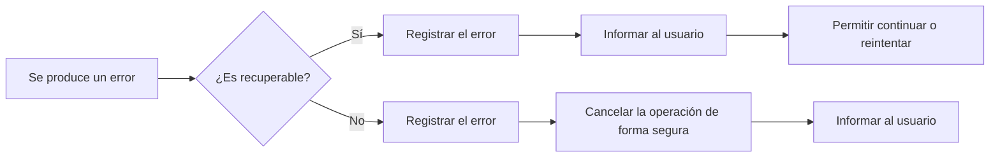
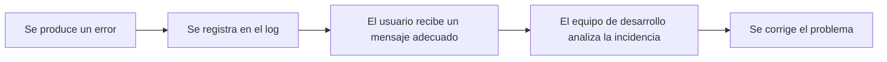
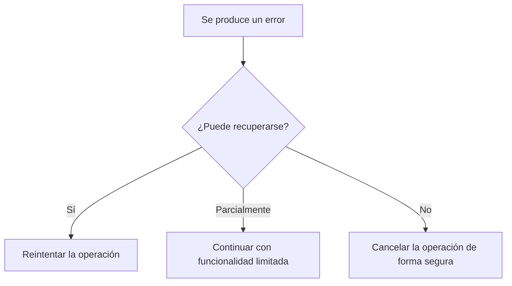
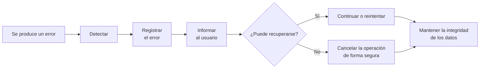

# Gestión de errores

## Introducción

Miren acaba de registrar a un nuevo alumno en **TxurdiGest**. Ha introducido correctamente todos los datos: nombre, apellidos, DNI, correo electrónico y grupo. Tras revisar la información, pulsa el botón **Guardar**.

Durante unos segundos parece que todo funciona con normalidad. Sin embargo, justo en ese momento se produce un problema en el servidor de base de datos y la aplicación no puede completar la operación.

¿Qué debería ocurrir ahora?

¿Mostrar un mensaje técnico incomprensible? ¿Perder toda la información introducida? ¿Revelar detalles internos del sistema? ¿O informar al usuario de forma clara, registrar el problema y permitir que pueda volver a intentarlo más tarde?

La respuesta a estas preguntas constituye uno de los aspectos más importantes del desarrollo de aplicaciones seguras y de calidad.

En el capítulo anterior aprendimos que una correcta **validación de entradas** evita que muchos datos incorrectos lleguen a procesarse. Sin embargo, incluso cuando todos los datos son válidos, pueden aparecer situaciones imprevistas durante la ejecución de la aplicación: una base de datos inaccesible, un archivo que no existe, una conexión de red interrumpida, un servicio externo que deja de responder o un error de programación.

Una aplicación profesional no puede evitar que todos estos problemas ocurran, pero sí puede decidir cómo responder ante ellos.

Gestionar correctamente los errores significa detectar las situaciones anómalas, informar adecuadamente al usuario, registrar la incidencia para facilitar su análisis y, siempre que sea posible, permitir que la aplicación continúe funcionando de forma segura.

Una mala gestión de errores no solo perjudica la experiencia del usuario. También puede comprometer la seguridad de la aplicación al revelar información interna sobre su funcionamiento, facilitando el trabajo de un posible atacante.

En este capítulo aprenderemos a diseñar aplicaciones capaces de responder de forma controlada ante situaciones inesperadas, convirtiendo los errores en un elemento más del diseño del software y no en un simple problema que resolver cuando aparece.

## Objetivos

Al finalizar este capítulo serás capaz de:

- Comprender qué se entiende por gestión de errores en una aplicación web.
- Diferenciar los distintos tipos de errores que pueden producirse durante la ejecución de una aplicación.
- Diseñar respuestas adecuadas para cada tipo de incidencia.
- Mostrar al usuario únicamente la información necesaria, evitando revelar datos internos del sistema.
- Registrar correctamente los errores para facilitar su diagnóstico y mantenimiento.
- Aplicar buenas prácticas que mejoren la robustez, la seguridad y la experiencia de uso de una aplicación web.

## ¿Qué es la gestión de errores?

Durante la ejecución de una aplicación web pueden producirse situaciones que impiden completar una operación con normalidad. Algunas son consecuencia de acciones del usuario, otras se deben a problemas de infraestructura y otras responden a errores de programación o a circunstancias externas que la aplicación no puede controlar.

La **gestión de errores** es el conjunto de técnicas y procedimientos que permiten detectar estas situaciones, responder de forma adecuada y minimizar su impacto tanto para el usuario como para el propio sistema.

Gestionar un error no significa simplemente mostrar un mensaje indicando que algo ha fallado. Una gestión adecuada implica:

- Detectar el problema lo antes posible.
- Evitar que la aplicación quede en un estado inconsistente.
- Informar al usuario de forma clara y comprensible.
- Registrar la incidencia para facilitar su posterior análisis.
- Mantener la seguridad evitando revelar información sensible.
- Permitir, cuando sea posible, que el usuario continúe trabajando.

!!! note "Gestionar no es ocultar"

    Una buena gestión de errores no consiste en esconder los problemas, sino en tratarlos de forma controlada para que no afecten innecesariamente al usuario ni comprometan la seguridad de la aplicación.

En **TxurdiGest**, por ejemplo, pueden producirse situaciones como las siguientes:

- La base de datos deja de estar disponible durante unos segundos.
- Un docente intenta acceder a un expediente para el que no tiene permisos.
- Se interrumpe la conexión con un servicio externo de envío de correos electrónicos.
- Se intenta descargar un documento que ha sido eliminado.
- Se produce un error inesperado durante la ejecución de una consulta.

En todos estos casos la aplicación debe responder de forma diferente, ya que no todos los errores tienen el mismo origen ni requieren el mismo tratamiento.

## ¿Por qué es importante gestionar correctamente los errores?

Una aplicación profesional no se caracteriza porque nunca falle, sino por la forma en que responde cuando aparece un problema.

Los errores forman parte del funcionamiento normal de cualquier sistema informático. Los servidores pueden dejar de responder, las conexiones pueden interrumpirse, los servicios externos pueden estar temporalmente fuera de servicio y siempre existe la posibilidad de que aparezca un defecto de programación.

Si estos problemas no se gestionan adecuadamente pueden producir consecuencias importantes:

- El usuario puede perder la información que estaba introduciendo.
- La aplicación puede quedar bloqueada o en un estado inconsistente.
- Pueden almacenarse datos incompletos o incorrectos.
- Puede revelarse información sensible sobre la arquitectura interna del sistema.
- El mantenimiento y la localización del problema resultarán mucho más complicados.

Por el contrario, una correcta gestión de errores aporta numerosas ventajas:

- Mejora la experiencia de usuario.
- Incrementa la robustez de la aplicación.
- Facilita el mantenimiento del software.
- Reduce el tiempo necesario para localizar incidencias.
- Refuerza la seguridad al evitar la exposición de información interna.

!!! example "Ejemplo"

    Si Miren intenta generar un boletín de notas y el servidor de impresión no está disponible, un mensaje como:

    **Error SQLSTATE[HY000]: Connection refused in DatabaseConnection.php line 127**

    no aporta ninguna información útil al usuario y, además, revela detalles internos del sistema.

    En cambio, un mensaje como:

    **No ha sido posible generar el boletín en este momento. Inténtelo de nuevo dentro de unos minutos.**

    informa correctamente al usuario sin exponer información técnica y permite que el incidente quede registrado para su posterior análisis.

## El ciclo de vida de un error

Cuando se produce un problema durante la ejecución de una aplicación, este no debería limitarse a mostrar un mensaje al usuario y finalizar el proceso. Una aplicación bien diseñada sigue una serie de pasos que permiten detectar el problema, minimizar sus consecuencias y facilitar su resolución.

Este proceso se conoce como **ciclo de vida de un error**.


Cada una de estas etapas cumple una función específica.

### 1. Se produce un error

El error puede tener orígenes muy diversos. Por ejemplo:

- Una consulta a la base de datos falla.
- Un usuario intenta acceder a un recurso sin permisos.
- Un servicio externo deja de responder.
- Se produce un fallo de programación.
- El servidor se queda sin espacio en disco.

En esta fase la aplicación todavía no ha reaccionado; simplemente ha aparecido una situación inesperada.

### 2. La aplicación detecta el problema

Una vez producido el error, la aplicación debe identificar que la operación no puede continuar con normalidad.

Dependiendo del lenguaje o del framework utilizado, esta detección puede realizarse mediante excepciones, códigos de retorno, comprobaciones de estado u otros mecanismos de control.

Lo importante es que el error **no pase desapercibido**.

!!! warning "Nunca ignores un error"

    Ignorar un error y continuar ejecutando la aplicación puede provocar resultados incorrectos, pérdida de información o comportamientos impredecibles mucho más difíciles de diagnosticar posteriormente.

### 3. El error se registra

Antes de informar al usuario, la aplicación debería registrar toda la información necesaria para que el equipo de desarrollo pueda analizar posteriormente lo sucedido.

Habitualmente se almacena información como:

- Fecha y hora.
- Usuario que estaba realizando la operación.
- Acción ejecutada.
- Mensaje técnico del error.
- Archivo o componente donde se produjo.
- Nivel de gravedad.

Estos registros, conocidos como **logs**, resultan imprescindibles para localizar incidencias y facilitar el mantenimiento de la aplicación.

### 4. Se informa al usuario

El usuario necesita saber que la operación no ha podido completarse, pero no necesita conocer los detalles internos del sistema.

Por ello, los mensajes deben ser:

- Claros.
- Comprensibles.
- Respetuosos.
- Útiles para continuar trabajando.

!!! example "Ejemplo"

    Si Miren intenta guardar una matrícula y la base de datos deja de responder, un mensaje adecuado podría ser:

    **No ha sido posible completar la operación en este momento. Inténtelo de nuevo dentro de unos minutos.**

    En ningún caso deberían mostrarse excepciones, consultas SQL, rutas del servidor o información técnica destinada únicamente al equipo de desarrollo.

### 5. La aplicación se recupera o finaliza la operación

Finalmente, la aplicación debe decidir cómo continuar.

Dependiendo del tipo de error podrá:

- Permitir que el usuario vuelva a intentarlo.
- Cancelar únicamente la operación afectada.
- Restaurar el estado anterior de la aplicación.
- Finalizar el proceso de forma controlada.
- Redirigir al usuario a una página de error.

El objetivo siempre es el mismo: evitar que la aplicación quede en un estado inconsistente y proteger tanto la información como la experiencia del usuario.

!!! note "Una buena gestión de errores"

    Una aplicación profesional no elimina todos los errores. Lo que la diferencia de una aplicación poco robusta es que sabe detectarlos, registrarlos, comunicar únicamente la información necesaria y recuperarse de ellos de la forma más segura posible.

## Tipos de errores en una aplicación web

No todos los errores tienen la misma causa ni deben tratarse de la misma forma. Antes de decidir cómo responder, es necesario identificar el origen del problema.

Una clasificación adecuada permite diseñar respuestas específicas para cada situación, mejorando la seguridad, la experiencia de usuario y el mantenimiento de la aplicación.

En **TxurdiGest** podemos encontrar distintos tipos de errores.

### Errores de validación

Se producen cuando los datos introducidos por el usuario no cumplen las reglas establecidas por la aplicación.

Aunque este tipo de errores ya se estudió en el capítulo anterior, forman parte de la gestión global de errores porque impiden completar correctamente una operación.

Ejemplos:

- Un DNI con un formato incorrecto.
- Un correo electrónico no válido.
- Una contraseña que no cumple la política de seguridad.
- Un campo obligatorio vacío.

Estos errores deben detectarse lo antes posible y comunicarse al usuario indicando qué información debe corregir.

!!! tip "Recuerda"

    Los errores de validación no son fallos del sistema. Son situaciones previstas que deben gestionarse como parte del funcionamiento normal de la aplicación.

### Errores de autenticación y autorización

Estos errores aparecen cuando un usuario intenta acceder a la aplicación o realizar una operación para la que no dispone de los permisos necesarios.

Por ejemplo:

- Usuario o contraseña incorrectos.
- Sesión caducada.
- Acceso a una funcionalidad reservada para administradores.
- Intento de modificar información perteneciente a otro usuario.

La aplicación debe impedir la operación y comunicar el problema sin revelar información adicional.

!!! warning "No des pistas"

    Mensajes como **"El usuario existe pero la contraseña es incorrecta"** facilitan el trabajo de un atacante.

    Es preferible utilizar mensajes genéricos como:

    **Usuario o contraseña incorrectos.**

### Errores de lógica de negocio

No todos los problemas son errores técnicos. En muchas ocasiones la operación solicitada incumple una regla propia de la aplicación.

Por ejemplo, en **TxurdiGest**:

- Matricular dos veces al mismo alumno en el mismo curso.
- Intentar cerrar un expediente que todavía tiene asignaturas pendientes.
- Asignar un profesor a un grupo incompatible con su departamento.

La aplicación funciona correctamente, pero la operación solicitada no es válida según las normas de negocio.

### Errores de infraestructura

Se producen cuando alguno de los recursos necesarios para el funcionamiento de la aplicación deja de estar disponible.

Algunos ejemplos son:

- La base de datos no responde.
- El servidor de archivos está inaccesible.
- No existe conexión a Internet.
- El servidor se queda sin espacio en disco.

En estos casos normalmente el usuario no puede solucionar el problema, por lo que la aplicación debe informar de la incidencia y registrar todos los detalles para su posterior análisis.

### Errores de servicios externos

Muchas aplicaciones dependen de servicios proporcionados por terceros.

Por ejemplo:

- Envío de correos electrónicos.
- Pasarelas de pago.
- Servicios de autenticación.
- APIs de organismos oficiales.
- Plataformas de almacenamiento en la nube.

Si alguno de estos servicios deja de responder, la aplicación debe gestionar la situación sin bloquear completamente el resto del sistema.

### Errores inesperados

Son aquellos que no habían sido previstos durante el desarrollo de la aplicación.

Pueden deberse a:

- Defectos de programación.
- Situaciones excepcionales.
- Datos corruptos.
- Combinaciones de circunstancias no contempladas.

Este tipo de errores nunca desaparecerá por completo. Por ese motivo todas las aplicaciones deben disponer de mecanismos que permitan capturarlos, registrarlos y responder de forma controlada.

!!! note "La mejor estrategia"

    Aunque no es posible prever todos los errores, sí es posible preparar la aplicación para reaccionar correctamente cuando aparezcan.

## ¿Qué debe hacer una aplicación cuando ocurre un error?

Cuando se produce un error, la aplicación no debe limitarse a mostrar un mensaje indicando que algo ha fallado. Una respuesta improvisada puede provocar pérdida de información, comportamientos inesperados o incluso comprometer la seguridad del sistema.

Una aplicación profesional debe seguir siempre una estrategia definida para gestionar cualquier incidencia.

El siguiente diagrama resume el proceso recomendado:



Aunque cada aplicación puede adaptar este proceso a sus necesidades, existen una serie de principios que deberían respetarse siempre.

### Detectar el error inmediatamente

La aplicación debe comprobar el resultado de cada operación importante.

Por ejemplo:

- Acceder a la base de datos.
- Guardar un archivo.
- Consumir una API externa.
- Enviar un correo electrónico.
- Realizar una copia de seguridad.

Cuanto antes se detecte el problema, menores serán sus consecuencias.

### Detener únicamente la operación afectada

No todos los errores obligan a detener toda la aplicación.

Si una operación concreta falla, lo recomendable es cancelar únicamente esa operación y permitir que el resto del sistema continúe funcionando con normalidad.

!!! example "Ejemplo"

    Si **TxurdiGest** no puede generar un certificado en formato PDF, el usuario debería seguir pudiendo consultar expedientes, modificar datos personales o realizar otras tareas.

### Registrar toda la información necesaria

Antes de informar al usuario, la aplicación debe almacenar toda la información que permita analizar posteriormente la incidencia.

Un registro adecuado puede incluir:

- Fecha y hora.
- Usuario autenticado.
- Operación realizada.
- Nivel de gravedad.
- Descripción técnica del error.
- Componente afectado.

Estos datos serán de gran utilidad para localizar el origen del problema sin necesidad de reproducirlo.

### Informar al usuario de forma adecuada

El usuario necesita saber que la operación no ha podido completarse, pero no necesita conocer el funcionamiento interno de la aplicación.

Los mensajes deben cumplir cuatro características:

- Claros.
- Breves.
- Comprensibles.
- Orientados a la solución.

Por ejemplo:

✅ **No ha sido posible guardar los cambios. Inténtelo de nuevo dentro de unos minutos.**

En cambio, un mensaje como:

❌ **Fatal error: Uncaught PDOException...**

solo genera confusión y, además, expone información sensible.

### Mantener la aplicación en un estado consistente

Si una operación queda incompleta, la aplicación debe asegurarse de que los datos no quedan almacenados parcialmente.

Por ejemplo, si durante la matrícula de un alumno se registra correctamente la información personal, pero falla la creación del expediente académico, el sistema debería cancelar toda la operación para evitar inconsistencias.

!!! note "Operaciones atómicas"

    Siempre que sea posible, las operaciones que modifican varios datos relacionados deberían ejecutarse como una única unidad de trabajo. Si una parte falla, toda la operación debe deshacerse.

### Permitir la recuperación cuando sea posible

Muchos errores son temporales.

Una pérdida momentánea de conexión o un servicio externo saturado pueden resolverse simplemente permitiendo al usuario volver a intentarlo unos segundos después.

Siempre que sea posible, la aplicación debería facilitar esta recuperación sin obligar al usuario a repetir todo el trabajo realizado.

!!! tip "Una buena experiencia de usuario"

    Si Miren lleva varios minutos rellenando un formulario, un error no debería obligarle a introducir nuevamente toda la información. Siempre que sea posible, la aplicación debería conservar los datos ya introducidos y permitir reintentar la operación.

## Qué información mostrar al usuario y cuál nunca mostrar

Cuando ocurre un error, la aplicación debe informar al usuario de que la operación no ha podido completarse. Sin embargo, existe una diferencia importante entre **informar** y **mostrar información interna del sistema**.

Uno de los errores más frecuentes durante el desarrollo consiste en presentar mensajes técnicos pensados para los desarrolladores en lugar de mensajes comprensibles para los usuarios.

Una buena gestión de errores debe cumplir dos objetivos:

- Ayudar al usuario a comprender qué ha ocurrido.
- Proteger la información interna de la aplicación.

### Qué información debe mostrarse

El mensaje dirigido al usuario debería responder, siempre que sea posible, a tres preguntas:

- ¿Qué ha ocurrido?
- ¿Qué puede hacer ahora?
- ¿Debe volver a intentarlo o ponerse en contacto con el soporte?

Por ejemplo:

| Situación | Mensaje recomendado |
|-----------|---------------------|
| Error temporal del servidor | No ha sido posible completar la operación. Inténtelo de nuevo dentro de unos minutos. |
| Archivo inexistente | El documento solicitado no está disponible. |
| Acceso sin permisos | No dispone de permisos para realizar esta operación. |
| Servicio externo no disponible | El servicio no está disponible en este momento. Inténtelo más tarde. |

Estos mensajes permiten al usuario comprender la situación sin necesidad de conocer detalles técnicos.

### Información que nunca debe mostrarse

Los mensajes de error nunca deberían incluir información interna sobre la aplicación.

Por ejemplo:

- Consultas SQL.
- Rutas del sistema de archivos.
- Nombres de tablas o bases de datos.
- Direcciones IP internas.
- Versiones del servidor o del framework.
- Trazas completas de excepciones (*stack traces*).
- Credenciales o claves de acceso.
- Código fuente.

Toda esta información puede resultar muy útil para un desarrollador durante la fase de depuración, pero también puede proporcionar pistas valiosas a un atacante.

!!! warning "Un error puede convertirse en una vulnerabilidad"

    Muchos ataques comienzan obteniendo información a partir de mensajes de error demasiado detallados. Cuanta más información revele una aplicación sobre su funcionamiento interno, más sencillo será planificar un ataque.

### Un buen mensaje de error

Supongamos que Miren intenta guardar una nueva matrícula y la base de datos deja de responder.

Una respuesta poco adecuada sería:

```text
Fatal error: Uncaught PDOException: SQLSTATE[HY000] [2002] Connection refused
```

Este mensaje revela información sobre la tecnología utilizada, el mecanismo de acceso a la base de datos e incluso puede facilitar el reconocimiento de la infraestructura.

Una respuesta mucho más adecuada sería:

```text
No ha sido posible guardar la matrícula en este momento.
Inténtelo de nuevo dentro de unos minutos.
```

Mientras tanto, toda la información técnica necesaria debería almacenarse en el sistema de registros (*logs*), donde únicamente pueda ser consultada por el personal autorizado.

!!! note "Dos destinatarios diferentes"

    Un mismo error genera dos tipos de información:

    - **El usuario** necesita un mensaje claro, sencillo y orientado a la solución.
    - **El equipo de desarrollo** necesita información técnica suficiente para diagnosticar y resolver el problema.

    Nunca deben mezclarse ambos tipos de información.

## Registro de errores (logging)

Cuando se produce un error, no basta con informar al usuario. La aplicación también debe registrar toda la información necesaria para que el equipo de desarrollo pueda analizar posteriormente lo sucedido.

Este proceso se conoce como **registro de errores** o **logging**.

Los registros permiten conocer qué ocurrió, cuándo ocurrió y en qué circunstancias se produjo el problema, facilitando enormemente las tareas de mantenimiento y depuración.



Los usuarios únicamente ven el mensaje de error. Toda la información técnica queda almacenada en el sistema de registros.

### ¿Qué información debería registrarse?

No existe una única forma de registrar un error, pero, como mínimo, un registro debería incluir la información suficiente para poder reconstruir lo sucedido.

Habitualmente se almacena:

- Fecha y hora del error.
- Usuario autenticado (si lo hubiera).
- Operación que se estaba realizando.
- Nivel de gravedad.
- Mensaje técnico del error.
- Componente donde se produjo.
- Dirección IP o equipo desde el que se realizó la operación.

Cuanta más información útil contenga el registro, más sencillo será localizar el origen del problema.

### Niveles de gravedad

No todos los errores tienen la misma importancia.

Por ello, la mayoría de las aplicaciones clasifican los registros según su nivel de gravedad.

| Nivel | Descripción |
|-------|-------------|
| **DEBUG** | Información útil durante el desarrollo. |
| **INFO** | Eventos normales del funcionamiento de la aplicación. |
| **WARNING** | Situaciones anómalas que no impiden continuar trabajando. |
| **ERROR** | Fallos que impiden completar una operación. |
| **CRITICAL** | Errores graves que afectan al funcionamiento del sistema. |

Esta clasificación permite localizar rápidamente las incidencias más importantes.

### Ejemplo en TxurdiGest

Supongamos que Miren intenta matricular a un alumno y, durante el proceso, la base de datos deja de responder.

El usuario podría ver el siguiente mensaje:

```text
No ha sido posible completar la matrícula en este momento.
Inténtelo de nuevo dentro de unos minutos.
```

Mientras tanto, el sistema podría registrar una información similar a la siguiente:

```text
[2026-03-15 10:42:18] ERROR

Usuario: miren.garcia
Operación: Alta de matrícula
Módulo: Matrículas
Descripción: Error de conexión con la base de datos.
```

Como puede observarse, el usuario recibe únicamente la información necesaria, mientras que el equipo de desarrollo dispone de todos los datos necesarios para investigar la incidencia.

!!! warning "Nunca registres información sensible"

    Los archivos de registro tampoco deben contener datos confidenciales como contraseñas, números completos de tarjetas bancarias, claves API o información médica.

    Los registros pueden ser consultados por administradores del sistema y, si no se protegen adecuadamente, podrían convertirse en una fuente de fuga de información.

### Buenas prácticas para el registro de errores

Al diseñar el sistema de registros conviene seguir algunas recomendaciones:

- Registrar únicamente la información realmente útil.
- Clasificar correctamente el nivel de gravedad.
- Evitar almacenar información confidencial.
- Proteger el acceso a los archivos de registro.
- Revisar periódicamente los registros para detectar incidencias repetitivas.
- Automatizar las alertas cuando se produzcan errores críticos.

!!! tip "El registro no resuelve el error"

    Registrar un error no evita que vuelva a producirse, pero proporciona la información necesaria para comprender su origen y corregirlo de forma definitiva.

## Estrategias para recuperarse de un error

No todos los errores obligan a cancelar una operación. En muchas ocasiones la aplicación puede recuperarse parcial o totalmente, permitiendo que el usuario continúe trabajando sin apenas interrupciones.

Elegir la estrategia adecuada dependerá del tipo de error, de su gravedad y de las consecuencias que pueda tener sobre la integridad de los datos.



A continuación se describen algunas de las estrategias más habituales.

### Reintentar la operación

Algunos errores son temporales.

Por ejemplo:

- Un servicio externo tarda unos segundos en responder.
- Se produce una interrupción momentánea de la red.
- La base de datos está realizando una operación de mantenimiento.

En estos casos puede ser suficiente con volver a intentar automáticamente la operación o permitir que el usuario lo haga manualmente.

!!! example "Ejemplo"

    Si TxurdiGest no consigue enviar un correo de confirmación de matrícula porque el servidor de correo no responde, puede volver a intentarlo unos segundos después sin que el usuario tenga que repetir toda la operación.

### Continuar con funcionalidad limitada

No siempre es necesario detener completamente la aplicación.

Si un componente deja de funcionar, el resto del sistema puede seguir ofreciendo aquellos servicios que no dependen de dicho componente.

Por ejemplo:

- Consultar expedientes aunque el servicio de impresión no esté disponible.
- Modificar datos personales aunque falle el envío de notificaciones.
- Visualizar información aunque no puedan descargarse documentos.

Esta estrategia mejora la disponibilidad del sistema y reduce el impacto de las incidencias.

### Cancelar la operación de forma segura

Cuando el error compromete la integridad de los datos, la mejor decisión es cancelar completamente la operación.

En estos casos es preferible no realizar ningún cambio antes que dejar la información almacenada de forma incompleta.

!!! example "Ejemplo"

    Si durante la matrícula de un alumno falla la creación del expediente académico, la aplicación no debería guardar únicamente parte de la información. Lo correcto es cancelar toda la operación para mantener la coherencia de los datos.

### Solicitar una nueva acción al usuario

En ocasiones la aplicación necesita que el usuario intervenga para poder continuar.

Por ejemplo:

- Volver a iniciar sesión porque la sesión ha caducado.
- Seleccionar nuevamente un archivo que ya no existe.
- Corregir un dato introducido incorrectamente.

En estos casos la aplicación debe explicar claramente qué debe hacer el usuario para resolver la situación.

### Diseñar pensando en el error

Una aplicación robusta no se desarrolla suponiendo que todo funcionará siempre correctamente.

Durante el diseño conviene plantearse preguntas como:

- ¿Qué ocurrirá si la base de datos deja de responder?
- ¿Qué sucede si falla el envío de un correo electrónico?
- ¿Qué pasa si un servicio externo no está disponible?
- ¿Cómo evitar la pérdida de información introducida por el usuario?

Responder a estas preguntas durante el desarrollo permite construir aplicaciones mucho más fiables y fáciles de mantener.

!!! tip "Una aplicación robusta"

    Una aplicación profesional no es aquella en la que nunca se producen errores, sino aquella que está preparada para gestionarlos correctamente cuando aparecen.

## Buenas prácticas

Una gestión adecuada de errores contribuye a mejorar la seguridad, la estabilidad y la calidad de una aplicación web. Aunque cada proyecto tiene sus propias características, existen una serie de recomendaciones que conviene aplicar en cualquier desarrollo.

- Validar siempre los datos antes de procesarlos.
- Detectar los errores lo antes posible.
- Registrar todas las incidencias relevantes.
- Mostrar mensajes claros y comprensibles para el usuario.
- Evitar revelar información interna del sistema.
- Mantener la coherencia de los datos cuando una operación falla.
- Diferenciar los errores recuperables de los que obligan a cancelar la operación.
- Revisar periódicamente los registros para detectar problemas recurrentes.
- Diseñar la aplicación pensando que los errores pueden producirse en cualquier momento.
- Probar el comportamiento de la aplicación en situaciones excepcionales, no solo cuando todo funciona correctamente.

!!! tip "Una buena práctica"

    Pregúntate siempre qué ocurrirá si una operación falla. Si conoces la respuesta antes de escribir el código, probablemente la aplicación será mucho más robusta.

## Errores frecuentes

Durante el desarrollo de aplicaciones es habitual cometer errores relacionados con la gestión de incidencias. Algunos de los más comunes son los siguientes:

- Mostrar excepciones completas al usuario.
- Revelar consultas SQL, rutas del servidor o información técnica.
- No registrar los errores en el sistema de logs.
- Ignorar una excepción y continuar ejecutando la aplicación.
- Utilizar el mismo mensaje para todos los errores.
- No informar al usuario de que una operación ha fallado.
- Dejar datos almacenados parcialmente tras un error.
- Confiar únicamente en la validación realizada en el navegador.
- No probar el comportamiento de la aplicación cuando falla un servicio externo.

!!! warning "Recuerda"

    Muchas vulnerabilidades de seguridad no aparecen porque exista un error, sino porque ese error se gestiona de forma incorrecta.

## ¿Qué cambia para el desarrollador?

Aprender a gestionar errores supone un cambio importante en la forma de desarrollar aplicaciones.

El objetivo deja de ser únicamente que el programa funcione cuando todo va bien. También debe responder correctamente cuando las circunstancias dejan de ser las esperadas.

A partir de este momento, al diseñar una aplicación será necesario plantearse preguntas como:

- ¿Qué puede fallar durante esta operación?
- ¿Cómo detectaré ese problema?
- ¿Qué información necesita realmente el usuario?
- ¿Qué datos debo registrar para poder investigar la incidencia?
- ¿Cómo evitaré que la aplicación quede en un estado inconsistente?

Pensar de esta forma permite desarrollar aplicaciones más robustas, más seguras y mucho más fáciles de mantener.

En definitiva, gestionar correctamente los errores no consiste únicamente en resolver problemas cuando aparecen, sino en diseñar aplicaciones preparadas para convivir con ellos.

## Para recordar

- Los errores forman parte del funcionamiento normal de cualquier aplicación.
- No todos los errores tienen el mismo origen ni requieren la misma respuesta.
- Una aplicación profesional debe detectar, registrar y gestionar los errores de forma controlada.
- El usuario debe recibir mensajes claros y comprensibles.
- La información técnica debe almacenarse en los registros del sistema, nunca mostrarse al usuario.
- Una buena gestión de errores mejora la seguridad, la experiencia de usuario y el mantenimiento de la aplicación.

## Ideas clave

- Gestionar errores es una parte fundamental del desarrollo seguro.
- Un error mal gestionado puede convertirse en una vulnerabilidad de seguridad.
- Los registros (*logs*) son esenciales para diagnosticar y resolver incidencias.
- La aplicación debe mantener siempre la integridad de los datos, incluso cuando una operación falla.
- Diseñar aplicaciones robustas implica prever cómo actuarán cuando aparezcan situaciones inesperadas.

En el siguiente capítulo estudiaremos dos mecanismos fundamentales para proteger una aplicación web: **la autenticación** y **la autorización**. Aprenderemos cómo verificar la identidad de los usuarios y cómo controlar qué acciones puede realizar cada uno de ellos dentro del sistema.
## Resumen de la gestión de errores en TxurdiGest

La siguiente tabla resume cómo debería actuar **TxurdiGest** ante los distintos tipos de errores estudiados en este capítulo.

| Tipo de error | ¿Puede resolverlo el usuario? | ¿Debe registrarse? | ¿Mostrar información técnica? | Respuesta recomendada |
|-------------------------------|:----------------------------:|:-----------------:|:----------------------------:|---------------------------------------------------------|
| Validación de datos | Sí | No* | No | Solicitar la corrección de los datos introducidos. |
| Autenticación | Sí | Sí | No | Informar de que las credenciales no son válidas o solicitar un nuevo inicio de sesión. |
| Autorización | No | Sí | No | Denegar el acceso e informar de que no dispone de permisos suficientes. |
| Lógica de negocio | Sí | Sí | No | Explicar por qué la operación no puede realizarse y cómo resolver la situación. |
| Infraestructura | No | Sí | No | Cancelar la operación de forma segura e informar de que el servicio no está disponible. |
| Servicios externos | No | Sí | No | Permitir reintentar la operación o continuar trabajando si es posible. |
| Error inesperado | No | Sí | No | Registrar toda la información disponible, proteger la aplicación e informar al usuario mediante un mensaje genérico. |

!!! note "Sobre los errores de validación"

    Los errores de validación forman parte del funcionamiento normal de la aplicación. En la mayoría de los casos no es necesario registrarlos individualmente, salvo que se produzcan de forma reiterada o puedan indicar un intento de uso indebido de la aplicación.

## Esquema de síntesis

El siguiente diagrama resume el proceso que debe seguir una aplicación para gestionar correctamente un error.


