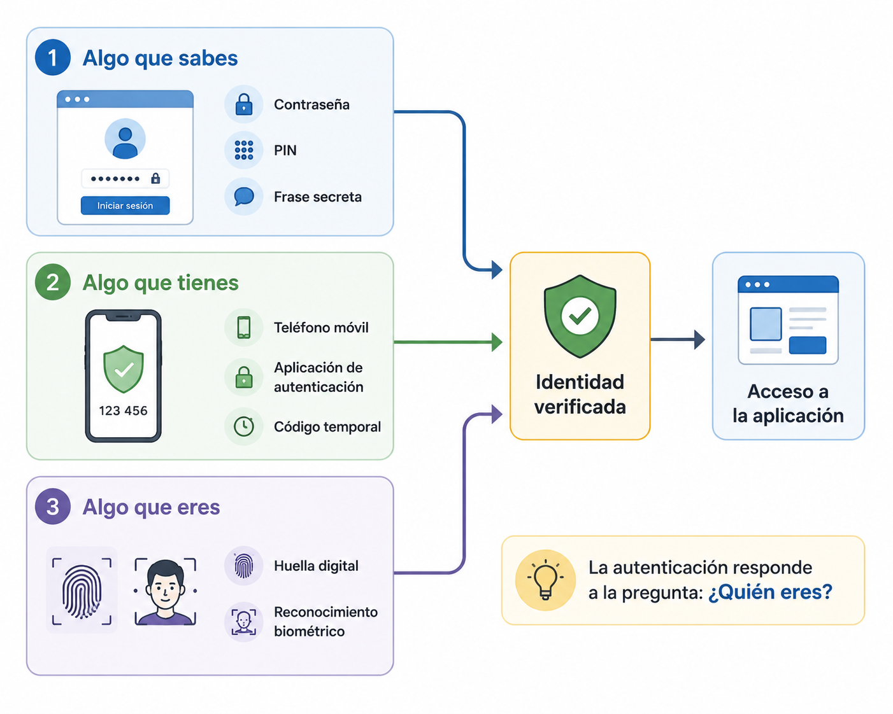
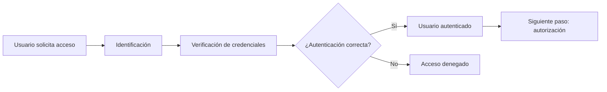

# Autenticación

## Introducción

Los usuarios de **TxurdiGest** acceden diariamente a la aplicación para realizar tareas acordes a sus responsabilidades.

Sin embargo, antes de permitir el acceso, la aplicación debe responder a una pregunta fundamental:

> **¿Es realmente quien dice ser la persona que intenta iniciar sesión?**

Responder a esta pregunta es el objetivo de la **autenticación**.

La autenticación constituye la primera barrera de seguridad de una aplicación web. Si un usuario no puede demostrar su identidad, el sistema no debe permitirle acceder a la información ni ejecutar ninguna operación.

## ¿Qué es la autenticación?

La **autenticación** es el proceso mediante el cual una aplicación verifica la identidad de un usuario antes de permitirle acceder al sistema.

En otras palabras, la autenticación responde a la siguiente pregunta:

> **¿Quién eres?**

Para responderla, el usuario debe aportar una o varias pruebas que demuestren su identidad. Si la aplicación las considera válidas, permitirá el acceso; en caso contrario, lo denegará.

!!! note "Autenticación e identificación"

    Identificarse consiste en indicar quién se es, por ejemplo introduciendo un nombre de usuario. Autenticarse significa demostrar que esa identidad es realmente la correcta.

### Ejemplo en TxurdiGest

Un profesor intenta acceder a **TxurdiGest**.

Introduce su nombre de usuario y su contraseña. La aplicación comprueba que ambos datos corresponden a una cuenta válida.

Si la comprobación es correcta, puede acceder al sistema.

Si no lo es, el acceso se deniega y deberá volver a intentarlo.

En este momento, la aplicación únicamente ha comprobado la identidad del usuario. Todavía no ha decidido qué operaciones podrá realizar dentro del sistema.

!!! tip "Idea clave"

    La autenticación verifica **quién es el usuario**. Las acciones que podrá realizar se decidirán posteriormente mediante la autorización.

## Factores de autenticación

Para demostrar la identidad de un usuario, los sistemas de autenticación utilizan una o varias evidencias conocidas como **factores de autenticación**.

Existen tres categorías principales.

{ width="800" align="center" }

*Figura 2.3. Los factores de autenticación permiten verificar la identidad de un usuario mediante diferentes tipos de información o elementos.*

### Algo que sabes

Es la forma de autenticación más habitual.

El usuario demuestra su identidad mediante información que solo él debería conocer.

Ejemplos:

- Una contraseña.
- Un PIN.
- Una respuesta a una pregunta de seguridad.

### Algo que tienes

El usuario demuestra su identidad utilizando un objeto físico que posee.

Ejemplos:

- Un teléfono móvil.
- Una tarjeta inteligente.
- Una llave de seguridad USB.
- Una aplicación que genera códigos temporales.

### Algo que eres

La identidad se verifica mediante una característica biométrica.

Ejemplos:

- Huella dactilar.
- Reconocimiento facial.
- Reconocimiento del iris.
- Reconocimiento de voz.

!!! note "Biometría"

    Los sistemas biométricos ofrecen una gran comodidad para el usuario, aunque deben utilizarse respetando la normativa de protección de datos y las medidas de seguridad correspondientes.

### Combinación de factores

Cuantos más factores independientes se utilicen, mayor será la seguridad del sistema.

Por ejemplo, para acceder a **TxurdiGest**, Miren podría introducir su contraseña y, además, confirmar el acceso mediante un código recibido en su teléfono móvil.

En este caso, la aplicación estaría utilizando dos factores distintos:

- Algo que sabe (la contraseña).
- Algo que tiene (el teléfono móvil).

Este tipo de autenticación recibe el nombre de **autenticación multifactor (MFA)** y se estudiará con más detalle en un apartado posterior.

!!! warning "No todos los factores ofrecen la misma protección"

    Utilizar dos contraseñas distintas no supone emplear dos factores de autenticación, ya que ambas pertenecen a la categoría de "algo que sabes". Para que exista autenticación multifactor deben combinarse factores de categorías diferentes.

## Autenticación mediante usuario y contraseña

La autenticación mediante **usuario y contraseña** es el mecanismo más utilizado en las aplicaciones web.

Su funcionamiento es sencillo:

1. El usuario introduce su nombre de usuario.
2. Introduce su contraseña.
3. La aplicación comprueba que las credenciales son correctas.
4. Si la verificación es satisfactoria, permite el acceso al sistema.

Aunque este proceso parece simple, una autenticación segura requiere mucho más que comparar una contraseña con la almacenada en una base de datos.

### El nombre de usuario

El nombre de usuario identifica de forma única a cada persona dentro de la aplicación.

Dependiendo del sistema, puede ser:

- Un nombre de usuario.
- Una dirección de correo electrónico.
- Un identificador interno.
- Un número de empleado.

En **TxurdiGest**, cada trabajador dispone de un identificador único para acceder a la aplicación.

### La contraseña

La contraseña es un secreto conocido únicamente por el usuario.

Debe ser suficientemente robusta para dificultar que pueda adivinarse mediante ataques automáticos o por personas que conozcan información sobre el usuario.

Una contraseña segura suele reunir las siguientes características:

- Tiene una longitud suficiente.
- Es difícil de adivinar.
- No contiene información personal.
- No se reutiliza en otros servicios.
- Se cambia cuando existe sospecha de que ha sido comprometida.

!!! tip "Ejemplo"

    **Profesor2026** puede parecer una buena contraseña, pero contiene información fácilmente deducible. Una contraseña larga y difícil de predecir ofrece una protección mucho mayor.

### Las contraseñas nunca deben almacenarse en texto plano

Una de las reglas fundamentales del desarrollo seguro consiste en **no almacenar nunca las contraseñas tal y como las introduce el usuario**.

Si un atacante consiguiera acceder a la base de datos, obtendría inmediatamente todas las credenciales.

En su lugar, las aplicaciones almacenan una representación criptográfica de la contraseña denominada **hash**.

Cuando el usuario inicia sesión, la aplicación calcula nuevamente el hash de la contraseña introducida y lo compara con el almacenado.

Si ambos coinciden, la autenticación es correcta.

!!! note "Más adelante"

    En el capítulo dedicado a la criptografía estudiaremos con detalle qué es un hash y por qué algoritmos como **bcrypt** o **Argon2** son adecuados para almacenar contraseñas.

### Protección frente a intentos de acceso

Una aplicación segura debe impedir que un atacante pueda probar miles de contraseñas de forma automática.

Algunas medidas habituales son:

- Limitar el número de intentos consecutivos.
- Introducir tiempos de espera tras varios errores.
- Bloquear temporalmente la cuenta cuando se detecta un comportamiento anómalo.
- Registrar todos los intentos de autenticación fallidos.

Estas medidas reducen considerablemente el riesgo de ataques por fuerza bruta y de adivinación de contraseñas.

### Ejemplo en TxurdiGest

Un profesor introduce por error su contraseña tres veces seguidas.

TxurdiGest no bloquea definitivamente la cuenta, pero retrasa los siguientes intentos durante unos minutos y registra la incidencia en el sistema de auditoría.

De esta forma se protege la cuenta frente a intentos automáticos sin impedir que el usuario pueda volver a acceder cuando recuerde correctamente su contraseña.

## Autenticación multifactor (MFA)

En muchos casos, una contraseña por sí sola no ofrece suficiente protección.

Puede ser adivinada, robada mediante un ataque o reutilizada desde otro servicio comprometido.

Para reducir este riesgo, muchas aplicaciones utilizan la **autenticación multifactor**, también conocida por las siglas **MFA** (*Multi-Factor Authentication*).

La autenticación multifactor consiste en exigir al usuario **dos o más factores de autenticación de categorías diferentes** antes de permitir el acceso al sistema.

### ¿Cómo funciona?

Supongamos que un miembro del personal administrativo quiere acceder a **TxurdiGest** desde un ordenador nuevo.

El proceso podría ser el siguiente:

1. Introduce su nombre de usuario y su contraseña.
2. La aplicación verifica que las credenciales son correctas.
3. Como segundo paso, solicita un código de verificación generado en su teléfono móvil.
4. El usuario introduce el código.
5. Si ambas comprobaciones son correctas, el acceso queda autorizado.

En este ejemplo se combinan dos factores:

- **Algo que sabe:** la contraseña.
- **Algo que tiene:** el teléfono móvil.

Un atacante necesitaría obtener ambos para acceder a la cuenta.

### Ventajas de la autenticación multifactor

La autenticación multifactor aporta importantes beneficios:

- Reduce el riesgo de accesos no autorizados.
- Protege incluso si la contraseña ha sido robada.
- Dificulta los ataques automatizados.
- Incrementa la seguridad de las cuentas con información sensible.

Por este motivo, su uso está cada vez más extendido en aplicaciones bancarias, plataformas de administración electrónica, servicios en la nube y aplicaciones empresariales.

### ¿Cuándo conviene utilizar MFA?

Aunque puede emplearse en cualquier aplicación, resulta especialmente recomendable cuando:

- Se accede a información confidencial.
- Se realizan operaciones económicas.
- Se gestionan datos personales o sanitarios.
- Los usuarios pueden acceder desde Internet.

En **TxurdiGest**, la autenticación multifactor sería especialmente recomendable para los usuarios con funciones administrativas o con acceso a información académica y personal especialmente sensible.

!!! warning "La autenticación multifactor no sustituye a una buena contraseña"

    El MFA añade una capa adicional de seguridad, pero no elimina la necesidad de utilizar contraseñas robustas. Ambos mecanismos deben complementarse.

!!! tip "Buena práctica"

    Siempre que sea posible, habilita la autenticación multifactor para las cuentas con mayores privilegios o que gestionen información especialmente sensible.

## Buenas prácticas

La autenticación constituye la primera línea de defensa de una aplicación web. Un diseño adecuado reduce el riesgo de accesos no autorizados y protege la información almacenada en el sistema.

Al desarrollar un mecanismo de autenticación conviene seguir estas recomendaciones:

- Solicitar únicamente la información necesaria para identificar al usuario.
- Almacenar las contraseñas mediante algoritmos de hash adecuados, nunca en texto plano.
- Limitar los intentos consecutivos de inicio de sesión.
- Registrar los intentos de autenticación fallidos.
- Utilizar autenticación multifactor cuando el nivel de riesgo lo requiera.
- Obligar a utilizar conexiones seguras mediante HTTPS.
- Evitar mensajes de error que revelen información sobre las cuentas de usuario.

!!! tip "Buena práctica"

    Diseña el sistema suponiendo que, tarde o temprano, alguna contraseña será comprometida. El objetivo es minimizar el impacto de esa situación.

## Errores frecuentes

Al implementar un sistema de autenticación es habitual cometer algunos errores que reducen significativamente la seguridad.

Los más frecuentes son:

- Almacenar contraseñas en texto plano.
- Permitir un número ilimitado de intentos de inicio de sesión.
- Utilizar algoritmos de hash obsoletos.
- Mostrar mensajes diferentes cuando el usuario o la contraseña son incorrectos.
- No utilizar HTTPS para transmitir las credenciales.
- Considerar la autenticación como una funcionalidad y no como un mecanismo de seguridad.

!!! warning "Recuerda"

    Un sistema de autenticación es tan seguro como su punto más débil. Un pequeño error de implementación puede comprometer todas las cuentas de la aplicación.

## ¿Qué cambia para el desarrollador?

Implementar un sistema de autenticación implica verificar de forma fiable la identidad del usuario y proteger sus credenciales durante todo su ciclo de vida. Además del formulario de inicio de sesión, deben contemplarse medidas como el almacenamiento seguro de contraseñas, la limitación de intentos de acceso, el uso de HTTPS y, cuando sea necesario, la autenticación multifactor.

## Resumen de la autenticación en TxurdiGest

| Aspecto | Aplicación en TxurdiGest |
|---------|---------------------------|
| Identificación | El usuario indica su identidad mediante un nombre de usuario o identificador. |
| Autenticación | La aplicación comprueba que las credenciales son válidas. |
| Factores | Puede utilizar uno o varios factores de autenticación. |
| Contraseñas | Nunca se almacenan en texto plano. |
| Protección | Se limitan los intentos de acceso y se registran las incidencias. |
| Objetivo | Garantizar que solo los usuarios legítimos acceden a la aplicación. |

## Resumen

- La autenticación verifica la identidad de un usuario.
- Identificarse no es lo mismo que autenticarse.
- Existen tres categorías principales de factores de autenticación.
- Las contraseñas nunca deben almacenarse en texto plano.
- La autenticación multifactor incrementa significativamente la seguridad.
- La autenticación es el primer mecanismo de protección de una aplicación web.

## Ideas clave

- La autenticación responde a la pregunta **«¿Quién eres?»**.
- Una contraseña, por sí sola, puede no ser suficiente para proteger una cuenta.
- El uso de varios factores dificulta los accesos no autorizados.
- Un sistema de autenticación seguro protege tanto a los usuarios como a la información de la aplicación.

## Esquema de síntesis

