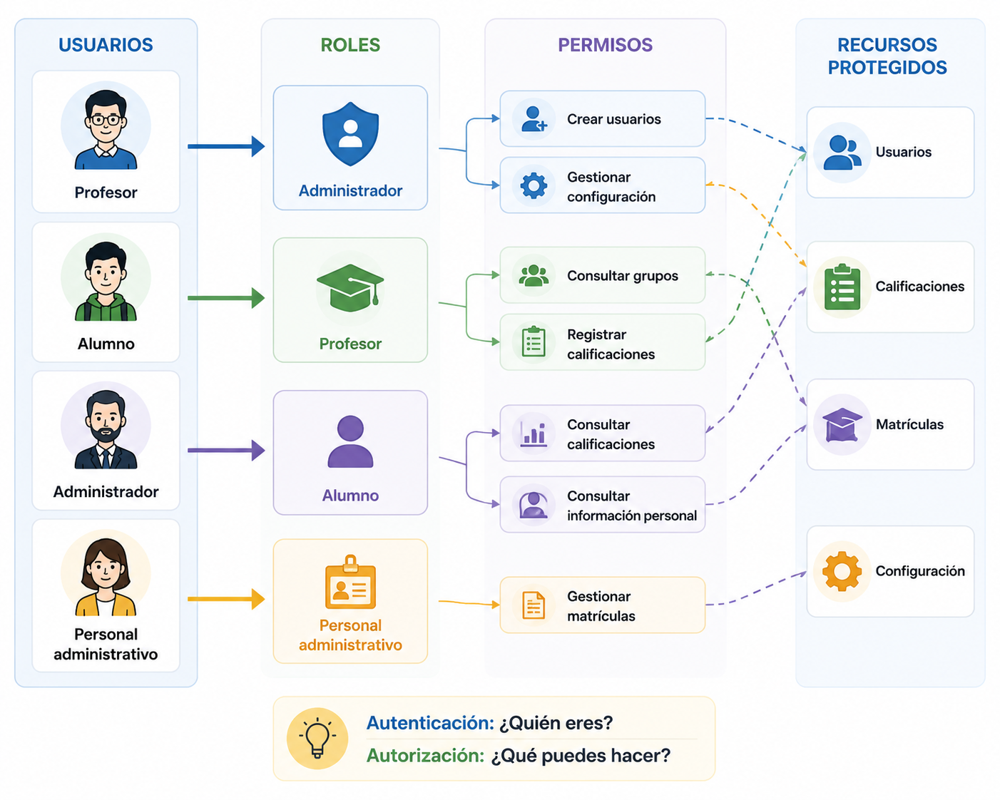
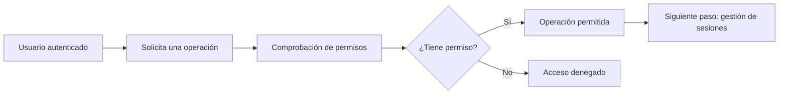

# Autorización

## Introducción

En el capítulo anterior hemos visto cómo una aplicación verifica la identidad de un usuario mediante la autenticación.

Sin embargo, conocer la identidad de un usuario no significa que pueda realizar cualquier operación dentro del sistema.

Una vez autenticado, la aplicación debe decidir a qué recursos puede acceder y qué acciones tiene permitido realizar.

Responder a estas preguntas es el objetivo de la **autorización**.

## ¿Qué es la autorización?

La **autorización** es el proceso mediante el cual una aplicación decide a qué recursos puede acceder un usuario y qué operaciones tiene permitido realizar.

En otras palabras, la autorización responde a la siguiente pregunta:

> **¿Qué puedes hacer?**

Para responderla, la aplicación utiliza la información disponible sobre el usuario, como su rol o los permisos que tiene asignados.

Si el usuario dispone de los permisos necesarios, la operación se permite. En caso contrario, la aplicación la bloquea.

!!! note "Autenticación y autorización"

    La autorización solo puede realizarse después de que el usuario haya sido autenticado. Primero es necesario conocer su identidad y, posteriormente, decidir qué acciones puede realizar.

### Ejemplo en TxurdiGest

Un profesor accede correctamente a **TxurdiGest**.

Al intentar modificar las calificaciones de su grupo, la aplicación comprueba que dispone del permiso necesario y permite la operación.

Sin embargo, si intenta crear una nueva cuenta de usuario, la aplicación deniega la acción porque esa operación está reservada al administrador.

!!! tip "Idea clave"

    La autorización no verifica quién es el usuario, sino qué acciones puede realizar dentro de la aplicación.

## Autenticación y autorización: dos conceptos diferentes

Aunque ambos conceptos suelen aparecer juntos, cumplen funciones distintas dentro de una aplicación web.

La **autenticación** verifica la identidad del usuario.

La **autorización** determina qué recursos puede utilizar y qué operaciones puede realizar una vez identificado.

La siguiente tabla resume las principales diferencias:

| Autenticación | Autorización |
|--------------|--------------|
| Responde a la pregunta **«¿Quién eres?»** | Responde a la pregunta **«¿Qué puedes hacer?»** |
| Se realiza al iniciar sesión. | Se aplica cada vez que el usuario intenta acceder a un recurso o ejecutar una acción. |
| Verifica la identidad del usuario. | Comprueba si dispone de los permisos necesarios. |
| Es el primer paso para acceder a la aplicación. | Solo puede realizarse después de la autenticación. |

En una aplicación segura, ambos procesos trabajan de forma complementaria. Conocer la identidad de un usuario no implica que pueda acceder a toda la información o ejecutar cualquier operación.

## Roles y permisos

En la mayoría de las aplicaciones web, la autorización se basa en la combinación de **roles** y **permisos**.

Un **rol** representa un conjunto de responsabilidades dentro de la aplicación.

Un **permiso** define una acción concreta que un usuario puede realizar sobre un recurso.

En lugar de asignar permisos individualmente a cada usuario, lo habitual es asignarlos a los distintos roles. Después, cada usuario recibe el rol que le corresponde.

Este enfoque simplifica la administración del sistema y facilita el mantenimiento de la seguridad.

{ width="850" align="center" }

*Figura 2.4. La autorización controla qué acciones puede realizar cada usuario mediante roles y permisos asociados.*

### Roles en TxurdiGest

En **TxurdiGest** existen diferentes tipos de usuarios, cada uno con responsabilidades distintas.

| Rol | Ejemplos de permisos |
|------|----------------------|
| Administrador | Crear usuarios, asignar roles y gestionar la configuración de la aplicación. |
| Profesor | Consultar sus grupos, registrar calificaciones y gestionar la información académica de su alumnado. |
| Alumno | Consultar sus calificaciones y su información personal. |
| Personal administrativo | Gestionar matrículas y realizar tareas administrativas. |

Cada usuario únicamente dispone de los permisos necesarios para desarrollar sus funciones.

!!! note "Rol y permiso"

    Un rol no es un permiso. Un rol agrupa varios permisos relacionados para facilitar la gestión de los usuarios.

### Comprobación de permisos

La autorización no se realiza únicamente al iniciar sesión.

Cada vez que un usuario intenta acceder a un recurso o ejecutar una operación, la aplicación debe comprobar que dispone del permiso correspondiente.

Por ejemplo, aunque un alumno conozca la dirección URL utilizada por un profesor para registrar calificaciones, la aplicación deberá impedir el acceso porque su rol no dispone del permiso necesario.

!!! tip "Buena práctica"

    Nunca confíes únicamente en las opciones visibles de la interfaz. La comprobación de permisos debe realizarse siempre en el servidor antes de ejecutar cualquier operación.

## Principio del mínimo privilegio

Uno de los principios básicos de la seguridad informática es el **principio del mínimo privilegio**.

Este principio establece que cada usuario debe disponer únicamente de los permisos imprescindibles para realizar su trabajo, y ninguno más.

Reducir los privilegios disminuye el impacto de posibles errores, accesos indebidos o cuentas comprometidas.

### Ejemplo en TxurdiGest

Un profesor necesita consultar sus grupos y registrar calificaciones, pero no necesita crear nuevos usuarios ni modificar la configuración de la aplicación.

Del mismo modo, el personal administrativo puede gestionar matrículas, pero no debe acceder a la información académica que no sea necesaria para desempeñar sus funciones.

Asignar únicamente los permisos necesarios mejora la seguridad y facilita el control de acceso a la aplicación.

!!! warning "Más permisos no significan más productividad"

    Conceder permisos innecesarios incrementa la superficie de ataque y puede provocar accesos no autorizados o modificaciones accidentales de la información.

## Buenas prácticas

Un sistema de autorización correctamente diseñado reduce el riesgo de accesos no autorizados y protege los recursos de la aplicación.

Al implementar un mecanismo de autorización conviene seguir estas recomendaciones:

- Comprobar los permisos antes de ejecutar cualquier operación.
- Asignar únicamente los permisos necesarios a cada usuario.
- Utilizar roles para simplificar la gestión de permisos.
- Revisar periódicamente los permisos asignados.
- Denegar el acceso por defecto cuando exista cualquier duda sobre la autorización.
- Registrar los intentos de acceso a recursos restringidos.

!!! tip "Buena práctica"

    Comprueba siempre los permisos en el servidor. Las restricciones implementadas únicamente en la interfaz de usuario pueden ser fácilmente eludidas.

## Errores frecuentes

Una implementación incorrecta de la autorización puede permitir que un usuario acceda a información o realice operaciones para las que no está autorizado.

Los errores más habituales son:

- Confiar únicamente en las restricciones de la interfaz de usuario.
- No comprobar los permisos antes de ejecutar una operación.
- Asignar más permisos de los necesarios.
- Compartir cuentas entre varios usuarios.
- Mantener permisos que ya no son necesarios.

!!! warning "Recuerda"

    La autorización debe comprobarse en cada acceso a un recurso protegido. Haber iniciado sesión correctamente no implica que un usuario pueda realizar cualquier acción.

## ¿Qué cambia para el desarrollador?

Implementar un sistema de autorización implica comprobar los permisos antes de ejecutar cualquier operación, independientemente de cómo llegue la petición. La validación debe realizarse siempre en el servidor y aplicarse de forma coherente en toda la aplicación para proteger los recursos frente a accesos no autorizados.

## Resumen de la autorización en TxurdiGest

| Aspecto | Aplicación en TxurdiGest |
|---------|---------------------------|
| Objetivo | Determinar qué acciones puede realizar cada usuario. |
| Roles | Administrador, profesor, alumno y personal administrativo. |
| Permisos | Cada rol dispone únicamente de los permisos necesarios para sus funciones. |
| Comprobación | La aplicación verifica los permisos antes de ejecutar cada operación. |
| Principio | Se aplica el mínimo privilegio para reducir riesgos. |
| Resultado | Cada usuario accede únicamente a los recursos autorizados. |

## Resumen

- La autorización determina qué acciones puede realizar un usuario.
- La autorización siempre se realiza después de la autenticación.
- Los roles agrupan permisos relacionados.
- Cada operación debe comprobar los permisos antes de ejecutarse.
- El principio del mínimo privilegio mejora la seguridad de la aplicación.
  
## Ideas clave

- La autorización responde a la pregunta **«¿Qué puedes hacer?»**.
- Autenticación y autorización son procesos diferentes y complementarios.
- Los roles simplifican la gestión de permisos.
- La comprobación de permisos debe realizarse siempre en el servidor.
- Un usuario solo debe disponer de los permisos imprescindibles para realizar su trabajo.
  
## Esquema de síntesis

