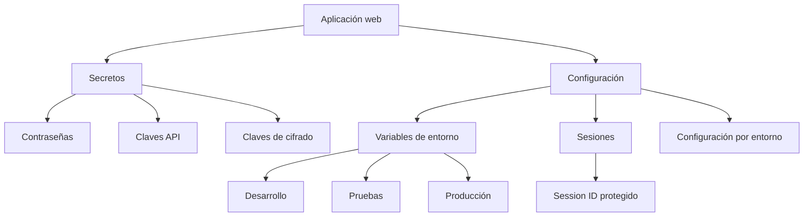

# Gestión de secretos y configuración

## Introducción

En los capítulos anteriores hemos estudiado cómo una aplicación identifica a los usuarios mediante la autenticación y cómo controla las acciones que pueden realizar mediante la autorización.

Sin embargo, la seguridad de una aplicación no depende únicamente de sus usuarios.

Las propias aplicaciones necesitan almacenar información confidencial para poder funcionar correctamente, como contraseñas de bases de datos, claves de cifrado, credenciales de servicios externos o identificadores de sesión.

Proteger esta información resulta fundamental para evitar accesos no autorizados y reducir el impacto de posibles incidentes de seguridad.

En este capítulo estudiaremos qué son los secretos, cómo deben gestionarse de forma segura, cómo configurar una aplicación sin exponer información sensible y qué buenas prácticas deben seguirse para proteger estos datos.

## Objetivos

Al finalizar este capítulo serás capaz de:

- Comprender qué es un secreto dentro de una aplicación web.
- Identificar la información sensible que no debe incorporarse al código fuente.
- Entender cómo utilizar variables de entorno y archivos de configuración.
- Conocer cómo se gestionan las sesiones desde el punto de vista de la seguridad.
- Aplicar buenas prácticas para proteger secretos y configuraciones.

## ¿Qué son los secretos?

En una aplicación web existen datos que deben permanecer confidenciales porque permiten acceder a recursos o realizar operaciones sensibles.

Estos datos reciben el nombre de **secretos**.

Algunos ejemplos habituales son:

- Contraseñas de bases de datos.
- Claves de cifrado.
- Claves de API.
- Credenciales de servicios externos.
- Certificados y claves privadas.
- Secretos utilizados para firmar o verificar información.

Si un atacante obtiene alguno de estos secretos, podría acceder a recursos protegidos, modificar información o incluso comprometer completamente la aplicación.

Por este motivo, los secretos deben protegerse con el mismo nivel de cuidado que la información de los usuarios.

!!! note "Secreto"

    Un secreto es cualquier información que debe mantenerse confidencial para garantizar la seguridad de una aplicación o de los servicios con los que se comunica.

### Ejemplo en TxurdiGest

Para conectarse a la base de datos, **TxurdiGest** necesita conocer el servidor, el usuario y la contraseña de acceso.

Estos datos son imprescindibles para el funcionamiento de la aplicación, pero nunca deben aparecer directamente en el código fuente ni publicarse en un repositorio.

!!! tip "Idea clave"

    Un secreto no protege únicamente a los usuarios; también protege la propia infraestructura de la aplicación.

## Variables de entorno y archivos de configuración

Una aplicación necesita conocer determinados valores para poder funcionar correctamente.

Por ejemplo:

- La dirección del servidor de bases de datos.
- El nombre de la base de datos.
- Las credenciales de acceso.
- Las claves utilizadas para cifrar información.
- Las credenciales de servicios externos.

Aunque estos datos forman parte de la configuración de la aplicación, muchos de ellos son secretos y deben protegerse adecuadamente.

Por este motivo, las aplicaciones modernas suelen separar el código fuente de la configuración mediante **variables de entorno**.

Las variables de entorno permiten almacenar información sensible fuera del código de la aplicación, facilitando además que una misma aplicación pueda utilizar configuraciones distintas en desarrollo, pruebas y producción.

!!! note "Variables de entorno"

    Una variable de entorno es un valor de configuración proporcionado por el sistema operativo o por el entorno de ejecución que la aplicación puede consultar mientras se está ejecutando.

### Ejemplo en TxurdiGest

Durante el desarrollo, **TxurdiGest** utiliza una base de datos de pruebas.

Sin modificar el código de la aplicación, basta con cambiar las variables de entorno para que, al desplegarla en producción, utilice la base de datos definitiva.

Este enfoque evita modificar el código cada vez que cambia el entorno de ejecución.

!!! tip "Buena práctica"

    Mantén el código independiente de la configuración. Así será posible desplegar la misma aplicación en distintos entornos modificando únicamente los valores de configuración.

## Gestión segura de secretos

Almacenar correctamente los secretos es tan importante como utilizarlos.

Una mala gestión de los secretos puede permitir que un atacante acceda a la infraestructura de la aplicación incluso aunque el código no presente vulnerabilidades.

Por este motivo, nunca deben incorporarse secretos directamente en el código fuente.

Tampoco deben almacenarse en repositorios públicos ni compartirse mediante correo electrónico o aplicaciones de mensajería.

Cuando varios desarrolladores trabajan en un mismo proyecto, cada uno debe disponer de sus propios secretos o utilizar mecanismos específicos para compartir la configuración de forma segura.

### Ejemplo en TxurdiGest

Durante el desarrollo de **TxurdiGest**, todos los miembros del equipo utilizan el mismo código fuente.

Sin embargo, cada entorno dispone de su propia configuración y de sus propias credenciales de acceso.

De este modo, las claves de producción permanecen protegidas y nunca se incluyen en el repositorio del proyecto.

!!! warning "Nunca publiques secretos"

    Una vez que una contraseña o una clave privada se ha publicado en un repositorio, debe considerarse comprometida, aunque posteriormente sea eliminada del historial más reciente.

## Gestión de sesiones

Cuando un usuario inicia sesión correctamente, la aplicación necesita recordar su identidad mientras navega por las distintas páginas.

Para ello utiliza una **sesión**, que permite asociar las diferentes peticiones HTTP al mismo usuario.

La sesión suele identificarse mediante un **identificador de sesión** (*Session ID*), que el navegador envía automáticamente en cada petición.

Este identificador es un dato sensible. Si un atacante consigue obtenerlo, podría hacerse pasar por el usuario sin necesidad de conocer su contraseña.

Por este motivo, la gestión de las sesiones forma parte de la configuración de seguridad de una aplicación y debe realizarse cuidadosamente.

### Protección de las sesiones

Para reducir el riesgo de robo o uso indebido de una sesión, las aplicaciones deben aplicar diferentes medidas de protección:

- Utilizar conexiones HTTPS para impedir que el identificador de sesión viaje sin cifrar.
- Configurar las cookies de sesión con los atributos de seguridad adecuados.
- Regenerar el identificador de sesión después de la autenticación.
- Finalizar la sesión tras un periodo de inactividad o cuando el usuario cierre la sesión.

!!! note "Identificador de sesión"

    El identificador de sesión permite reconocer a un usuario entre distintas peticiones HTTP. Debe tratarse como información confidencial.

### Ejemplo en TxurdiGest

Un profesor inicia sesión en **TxurdiGest** y comienza a registrar las calificaciones de su alumnado.

Mientras trabaja, el navegador envía automáticamente el identificador de sesión en cada petición, permitiendo que la aplicación reconozca al usuario sin solicitar nuevamente sus credenciales.

Cuando el profesor cierra la sesión, dicho identificador deja de ser válido y ya no puede utilizarse para acceder a la aplicación.

!!! tip "Buena práctica"

    Una sesión debe durar únicamente el tiempo necesario. Mantener sesiones activas durante largos periodos incrementa el riesgo de accesos no autorizados.

## Buenas prácticas

Una gestión adecuada de los secretos y de la configuración reduce considerablemente la superficie de ataque de una aplicación.

Al desarrollar una aplicación web conviene seguir estas recomendaciones:

- Mantener los secretos fuera del código fuente.
- Utilizar variables de entorno para almacenar información sensible.
- Proteger las sesiones mediante HTTPS y cookies seguras.
- Limitar la duración de las sesiones.
- Utilizar credenciales diferentes para desarrollo, pruebas y producción.
- Revisar periódicamente la configuración de seguridad.

!!! tip "Buena práctica"

    Considera que cualquier secreto publicado deja de ser secreto. Si una credencial se expone, debe sustituirse inmediatamente por otra nueva.

## Errores frecuentes

Una mala gestión de los secretos puede comprometer toda la aplicación, incluso aunque el código no presente vulnerabilidades.

Los errores más habituales son:

- Incluir contraseñas o claves directamente en el código.
- Compartir secretos mediante canales inseguros.
- Publicar archivos de configuración con información sensible.
- Utilizar las mismas credenciales en todos los entornos.
- Mantener sesiones activas durante más tiempo del necesario.

!!! warning "Recuerda"

    La mayoría de las fugas de secretos no se producen por fallos criptográficos, sino por errores de configuración o de gestión.

## ¿Qué cambia para el desarrollador?

Desarrollar una aplicación segura implica proteger tanto el código como la información necesaria para que la aplicación funcione.

El desarrollador debe separar la configuración del código fuente, gestionar correctamente los secretos y configurar adecuadamente las sesiones para reducir el riesgo de accesos no autorizados.

Estas medidas no solo mejoran la seguridad de la aplicación, sino que también facilitan su despliegue y mantenimiento en diferentes entornos.

## Resumen de la gestión de secretos y configuración en TxurdiGest

| Aspecto | Aplicación en TxurdiGest |
|---------|---------------------------|
| Secretos | Credenciales de la base de datos, claves de cifrado y configuración sensible. |
| Configuración | Se mantiene separada del código fuente mediante variables de entorno. |
| Sesiones | La aplicación utiliza identificadores de sesión para reconocer al usuario autenticado. |
| Protección | Los secretos no se almacenan en el código y las sesiones se protegen mediante una configuración segura. |
| Objetivo | Proteger tanto la infraestructura de la aplicación como la información de los usuarios. |

## Para recordar

- Los secretos permiten acceder a recursos sensibles de la aplicación.
- La configuración debe mantenerse separada del código fuente.
- Las variables de entorno facilitan una gestión segura de la configuración.
- El identificador de sesión debe protegerse como cualquier otro secreto.
- Una buena configuración reduce el riesgo de incidentes de seguridad.

## Ideas clave

- No toda la información sensible pertenece a los usuarios; la aplicación también tiene sus propios secretos.
- Los secretos nunca deben incorporarse al código fuente.
- La configuración debe adaptarse a cada entorno sin modificar la aplicación.
- Las sesiones permiten mantener autenticado al usuario y deben protegerse adecuadamente.
- La gestión de secretos y configuración es un elemento esencial del desarrollo web seguro.

## Esquema de síntesis

