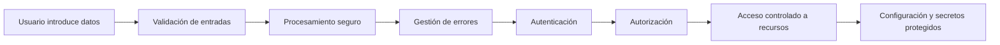
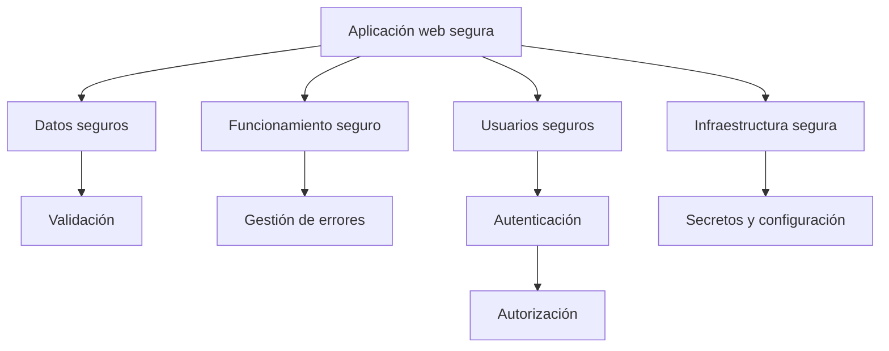

# Conclusiones

## Cierre del bloque

En este bloque hemos estudiado algunos de los mecanismos fundamentales que permiten desarrollar aplicaciones web más seguras.

La seguridad no depende de una única técnica aislada. Una aplicación segura se construye aplicando diferentes medidas durante todo su ciclo de desarrollo.

Validar correctamente los datos, gestionar los errores, controlar el acceso de los usuarios y proteger la configuración interna son aspectos diferentes, pero todos forman parte de un mismo objetivo:

> **Construir aplicaciones capaces de proteger la información y funcionar de forma segura ante situaciones inesperadas.**

A lo largo de este bloque hemos utilizado **TxurdiGest** como caso de estudio para analizar cómo aplicar estas medidas en una aplicación web real.

---

## Conceptos fundamentales

### Validación de entradas

Toda información recibida por una aplicación debe considerarse potencialmente insegura.

Los datos introducidos por los usuarios, enviados mediante formularios o recibidos a través de APIs deben ser validados antes de ser procesados.

La validación permite comprobar que la información:

- Tiene el formato esperado.
- Cumple las restricciones definidas.
- No contiene valores no permitidos.
- Puede ser utilizada de forma segura por la aplicación.

Una aplicación nunca debe confiar directamente en los datos recibidos desde el exterior.

---

### Gestión de errores

Los errores forman parte del funcionamiento normal de cualquier aplicación.

Una aplicación segura debe ser capaz de:

- Detectar los errores.
- Registrar la información necesaria para analizarlos.
- Informar correctamente al usuario.
- Evitar mostrar información interna del sistema.

Un error mal gestionado puede convertirse en una vulnerabilidad si revela información sensible o deja la aplicación en un estado incorrecto.

---

### Autenticación

La autenticación permite verificar la identidad de un usuario.

Responde a la pregunta:

> **¿Quién eres?**

Para ello pueden utilizarse diferentes factores:

- Algo que sabes.
- Algo que tienes.
- Algo que eres.

Una autenticación segura requiere proteger las credenciales y aplicar medidas adicionales cuando el riesgo lo aconseje, como la autenticación multifactor.

---

### Autorización

La autorización determina qué acciones puede realizar un usuario después de haber sido identificado.

Responde a la pregunta:

> **¿Qué puedes hacer?**

Mediante roles y permisos, la aplicación controla el acceso a los recursos y evita que un usuario realice operaciones para las que no está autorizado.

El principio fundamental es:

> Cada usuario debe disponer únicamente de los permisos necesarios para realizar sus funciones.

---

### Gestión de secretos y configuración

Las aplicaciones necesitan información interna para poder funcionar correctamente.

Entre estos datos encontramos:

- Contraseñas de bases de datos.
- Claves de cifrado.
- Claves API.
- Configuraciones específicas de cada entorno.
- Información relacionada con las sesiones.

Estos datos deben protegerse y mantenerse separados del código fuente.

Una aplicación segura no solo protege los datos de los usuarios, sino también sus propios secretos internos.

---

## Cómo se relacionan los diferentes mecanismos

Los mecanismos estudiados en este bloque no funcionan de forma independiente.

Todos forman parte de una cadena de protección:

Cada mecanismo cubre una necesidad diferente:

| Mecanismo | Objetivo |
|-----------|----------|
| Validación | Controlar los datos recibidos. |
| Gestión de errores | Responder correctamente ante fallos. |
| Autenticación | Verificar la identidad del usuario. |
| Autorización | Controlar las acciones permitidas. |
| Gestión de secretos | Proteger la información interna de la aplicación. |

---

## Buenas prácticas generales

A lo largo del bloque hemos visto algunas recomendaciones que deben aplicarse en cualquier desarrollo web:

- No confiar nunca en los datos recibidos desde el exterior.
- Separar la información mostrada al usuario de la información técnica interna.
- Proteger las credenciales y secretos de la aplicación.
- Aplicar siempre controles de acceso en el servidor.
- Utilizar el principio del mínimo privilegio.
- Registrar los errores sin almacenar información sensible.
- Diseñar la aplicación pensando que pueden producirse fallos.

---

## Errores frecuentes

Algunos errores habituales durante el desarrollo de aplicaciones web son:

- Confiar únicamente en la validación realizada en el navegador.
- Mostrar mensajes de error demasiado detallados.
- Almacenar contraseñas o secretos en el código fuente.
- Permitir que un usuario acceda a recursos sin comprobar sus permisos.
- Asignar más privilegios de los necesarios.
- Considerar la seguridad como una fase final del proyecto.

!!! warning "La seguridad debe integrarse desde el principio"

    La seguridad no consiste en añadir medidas al final del desarrollo. Debe formar parte del diseño, la implementación y el mantenimiento de la aplicación.

---

## ¿Qué cambia para el desarrollador?

A partir de este bloque, además de desarrollar funcionalidades, conviene incorporar de forma sistemática preguntas relacionadas con la seguridad:

- ¿Qué datos puede controlar un usuario?
- ¿Qué ocurre si la información recibida es incorrecta?
- ¿Qué pasa si una operación falla?
- ¿Quién puede acceder a cada recurso?
- ¿Dónde se almacenan los secretos de la aplicación?

Desarrollar de forma segura implica anticiparse a los problemas y diseñar mecanismos para reducir sus consecuencias.

---

## Checklist de desarrollo seguro

Antes de considerar una funcionalidad terminada, conviene comprobar:

| Comprobación | Realizada |
|-------------|-----------|
| Los datos recibidos son validados. | ☐ |
| Los errores se gestionan correctamente. | ☐ |
| Los mensajes al usuario no revelan información interna. | ☐ |
| Las contraseñas y secretos están protegidos. | ☐ |
| Los permisos se comprueban en el servidor. | ☐ |
| La configuración sensible está separada del código. | ☐ |

---

## Resumen

- La seguridad es un conjunto de mecanismos relacionados.
- Una aplicación segura debe proteger datos, usuarios y configuración interna.
- La validación evita procesar información incorrecta.
- La autenticación identifica usuarios.
- La autorización controla sus acciones.
- Los secretos deben mantenerse fuera del código fuente.

---

## Ideas clave

- La seguridad debe formar parte del diseño de la aplicación.
- Ningún mecanismo aislado es suficiente para proteger completamente un sistema.
- Validación, errores, autenticación, autorización y gestión de secretos trabajan juntos.
- Un buen desarrollador no solo crea aplicaciones funcionales, sino aplicaciones resistentes ante situaciones inesperadas.

---

## Esquema de síntesis

