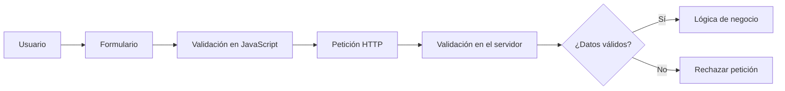

# Validación de entradas

Toda información que llega desde el exterior debe considerarse no confiable hasta que la aplicación haya comprobado que cumple las reglas previstas.

En el bloque anterior se definió qué significa validar y por qué la validación debe formar parte del diseño. Ahora el objetivo es llevar esas reglas al código.

## Cliente y servidor

En una aplicación web, la validación puede realizarse tanto en el navegador como en el servidor, pero ambas cumplen funciones diferentes.

| Cliente | Servidor |
|---|---|
| Mejora la experiencia del usuario. | Protege la aplicación. |
| Puede mostrar errores de forma inmediata. | Decide si el dato se acepta o se rechaza. |
| Se ejecuta en el navegador. | Se ejecuta en un entorno controlado por la aplicación. |
| Puede modificarse o evitarse. | No depende del comportamiento del navegador. |

Por tanto, una aplicación puede utilizar validación en ambos lados, pero **la validación definitiva debe realizarse siempre en el servidor**.

!!! warning "No confíes en el navegador"

    Que un formulario impida introducir un valor no significa que ese valor no pueda llegar al servidor mediante una petición modificada o construida manualmente.

## Flujo recomendado

Un flujo habitual puede representarse así:



La validación del cliente permite detectar errores antes de enviar la petición. La validación del servidor vuelve a comprobar los datos y decide si pueden utilizarse.

## Ejemplo en TxurdiGest

Supongamos que un profesor introduce una calificación.

La interfaz puede limitar el campo a valores entre `0` y `10`, pero el servidor debe comprobar igualmente el dato recibido.

```text
Valor introducido: 8
        ↓
JavaScript comprueba 0–10
        ↓
Petición HTTP
        ↓
PHP vuelve a comprobar 0–10
        ↓
Se procesa la calificación
```

Si alguien modifica la petición y envía:

```text
nota=25
```

el servidor debe rechazarla aunque el navegador original nunca hubiera permitido introducir ese valor.

## Implementación

En este apartado trabajaremos tres perspectivas complementarias:

- [Validación en JavaScript](javascript.md): cómo detectar errores y mejorar la experiencia del usuario.
- [Validación en PHP](php.md): cómo aplicar las comprobaciones definitivas en el servidor.
- [Laboratorio](laboratorio.md): cómo demostrar que una validación realizada únicamente en el cliente puede evitarse.

## Resumen

- Toda entrada externa debe validarse.
- JavaScript puede ayudar al usuario, pero no constituye una barrera de seguridad.
- El servidor debe validar siempre los datos recibidos.
- Las reglas de validación deben ser coherentes entre cliente y servidor.
