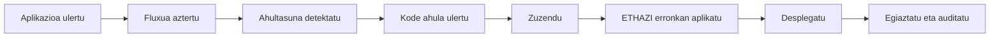

# 0. Moduluaren sarrera

## 1. Sarrera

Modulu hau ez da pentesting ikastaro bat. Helburua da web aplikazio seguruagoak garatzea DAWeko lan errealaren barruan: diseinatu, programatu, zabaldu eta egiaztatu.

Apunte hauen xedea metodo praktiko bat ematea da: akats ohikoak detektatu, kode errealean zuzendu, eta hobekuntzak ETHAZI erronketan aplikatu.

## 2. Helburuak

- Modulua nola antolatuta dagoen eta nola ebaluatuko den ulertzea.
- Segurtasun ofentsiboa eta web garapen segurua bereiztea.
- Bloke bakoitzean erabiliko dugun lan-fluxua ezagutzea.
- Praktiketarako eta egiaztapenerako gutxieneko ingurunea prestatzea.
- Ikasturte osoan mantenduko diren kalitate-irizpideak adostea.

## 3. Aurretiazko kontzeptuak

Modulua aprobetxatzeko, oinarrizko ezagutza hauek behar dira:

- HTTP, formularioak eta saioak.
- PHP eta JavaScript.
- SQL oinarrizkoa.
- Git eta GitHub.
- Apache edo Docker bidezko oinarrizko despliegua.

Ez da beharrezkoa zibersegurtasunean aditua izatea hasteko.

## 4. Egoera erreala

DAWeko testuinguru tipikoa:

- Aplikazioak lokalean ondo funtzionatzen du, baina produkzioan errore arrastoak erakusten ditu.
- `.env` sekretuekin duen repo bat igotzen da.
- Frontendean balioztatzen da, baina backend-ean ez.
- Bug bat konpontzen da, baina ez da egiaztatzen ahultasuna desagertu den.

Ondorioa: app-ak "funtzionatzen" du, baina ez da segurua.

## 5. Azalpena

Moduluaren metodologia ziklo honetan oinarritzen da:



Tresna nagusiak lan motaren arabera:

| Mota | Tresnak |
|---|---|
| Analisia | Burp Suite, DevTools |
| Zuzenketa | Editorea, Git, kode berrikuspenak |
| Egiaztapena | OWASP ZAP, Security Headers, SSL Labs |
| Mendekotasunak | `composer audit`, `npm audit` |
| Despliegua | Docker, Apache, AWS |

## 6. Kode ahula

Hasierako praktika txar baten adibide sinplea (ez egin):

```dotenv
APP_ENV=production
APP_DEBUG=true
DB_PASSWORD=admin123
AWS_SECRET_ACCESS_KEY=AKIAxxxxxxxx
```

Eta PHPn:

```php
<?php
echo $_GET['q'];
```

Berehalako arazoak:

- Sekretuak agerian.
- Debug aktibo produkzioan.
- Irteera kodetu gabe (XSS arriskua).

## 7. Laborategi gidatua

Ikastaroaren lehen praktika (20-30 min):

1. Praktikako proiektua klonatu.
2. Ingurune lokala martxan jarri.
3. Burp Suite-rekin eskaera bat atzeman.
4. Balioztatu gabeko sarrera bat identifikatu.
5. Erantzule den kode zatia berrikusi.
6. Gutxieneko zuzenketa aplikatu.
7. Jokabide ez-segurua desagertu dela egiaztatu.
8. Ebidentzia checklist-ean erregistratu.

## 8. Kodearen analisia

Beti erantzun beharreko galderak:

- Zer sartzen da bezerotik eta non balioztatzen da.
- Zer irteten da nabigatzailera eta nola kodetzen da.
- Zein datu dira sentikorrak eta non gordetzen dira.
- Zein bide edo ekintzak behar duten baimena.
- Zein probek frogatzen duten zuzenketak funtzionatzen duela.

## 9. Zuzenketa

Modulu honetako gutxieneko zuzenketa irizpideak:

- Backend-ean balioztatu, ez bakarrik frontend-ean.
- HTML, atributu eta URL irteerak dagokionean kodetu.
- Ez igo sekreturik repositoriora.
- Produkzioan debug desaktibatu.
- Tresna batekin + eskuzko proba batekin egiaztatu.

Oinarrizko checklist-a:

- [ ] Zerbitzarian sarrera-baliozkotzea existitzen da.
- [ ] Ez dago sekreturik kodean edo commit-etan.
- [ ] Irteera dinamikoa behar bezala kodetzen da.
- [ ] Egiaztapen ebidentzia dokumentatzen da.

## 10. ETHAZI erronkan aplikazioa

Erronkekin lotura:

- 1. erronka (PHP + JS + CSS): DVWArekin ikasi eta zuzenketa erronkako proiektura eraman.
- 2. erronka (Laravel + Vue): kasu ahulekin lan egin kontrolagailuetan, middleware-an eta osagaietan.

Bi kasuetan, hobekuntza taldearen lan-fluxu errealean txertatuta geratu behar da.

## 11. Laburpena

- Modulu honek web software seguruagoa eraikitzen irakasten du.
- Fokua kodean, desplieguean eta egiaztapenean dago.
- Bloke guztiek lan-egitura bera jarraituko dute.
- Segurtasuna ebidentzien bidez ebaluatzen da, ez teoria isolatuarekin.

## 12. Ariketak

1. Aipatu produkzioan `APP_DEBUG=true` uztearen hiru arrisku.
2. Azaldu zergatik ez den nahikoa frontend-ean bakarrik balioztatzea.
3. Definitu bi ebidentzia objektibo ahultasun bat benetan konpondu dela esateko.
4. Idatzi 5 puntuko mini-checklist bat formulario bat despliegatu aurretik berrikusteko.

## 13. Gehiago jakiteko

- OWASP ASVS: aplikazioetarako segurtasun baldintzen gida.
- OWASP Cheat Sheet Series: gai bakoitzerako gomendio praktikoak.
- Laravel dokumentazio ofiziala (balioztatzea, CSRF, baimenak).
- MDN dokumentazioa web segurtasunari eta HTTP goiburuei buruz.
