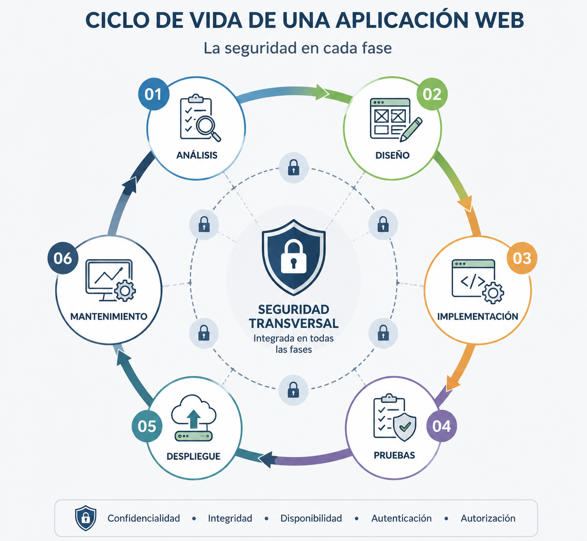
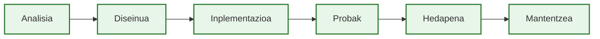

# Web garapen seguruaren sarrera

Egunero erabiltzen ditugu web aplikazioak banku-eragiketak egiteko, Internet bidez erosketak egiteko, historia klinikoak kudeatzeko, zerga-aitorpenak aurkezteko edo beste pertsona batzuekin komunikatzeko. Aplikazio horietan guztietan, segurtasuna softwarearen kalitatearen parte da. Akats batek informazioa arriskuan jar dezake, zerbitzu bat eten dezake edo baimenik gabeko ekintzak ahalbidetu ditzake.

Web garapen modernoak segurtasuna proiektuaren lehen faseetatik txertatzen du, eta ez azken berrikuspen gisa. Aplikazio seguruak eraikitzea garapen-taldearen erantzukizuna da, eta funtsezko konpetentzia da edozein garatzaile profesionalentzat.

!!! abstract "Orrialde honen helburuak"

    Orrialde hau amaitzean gai izango zara:

    - Web aplikazio seguruak garatzeak zer esan nahi duen ulertzeko.
    - Garapen segurua eta pentestinga bereizteko.
    - Segurtasuna softwarearen bizi-zikloaren parte zergatik den ulertzeko.
    - Modulu honek DAW zikloaren barruan duen rola ulertzeko.
    - Ikasturtean zehar nola lan egingo den ezagutzeko.

---

## Zer esan nahi du web aplikazio seguruak garatzeak?

Web aplikazio seguruak garatzea ez da babes-geruza bat amaieran gehitzea, ezta arazoa dagoenean erreakzionatzea ere. Aplikazio baten analisian, diseinuan, inplementazioan, probetan, hedapenean eta mantentze-lanetan erabaki egokiak hartzea da, arriskuak murrizteko eta fidagarritasuna handitzeko.

Garatzailearen ikuspegitik, segurtasunak esan nahi du aplikazioak aurreikusitako funtzioa betetzeko gai izatea, baita ustekabeko sarrerak jasotzen dituenean, beste sistema batzuekin elkarreraginean ari denean edo denborarekin eboluzionatzen duenean ere.

Aplikazio bat ez da segurua erabaki zuzen bakar batengatik, baizik eta erabaki koherente askoren baturagatik. Informazioa behar bezala balioztatzea, baliabideetarako sarbidea kontrolatzea, erantzukizunak bereiztea edo osagaien arteko komunikazioa babestea helburu beraren parte dira: kalitatezko softwarea garatzea.

Modulu honetan segurtasuna ez da garapenetik bereizitako diziplina gisa landuko, baizik eta hobeto garatzeko modu gisa.

---

## Zergatik da garrantzitsua garatzaile batentzat?

Garapenean hartzen den erabaki bakoitzak zuzenean eragiten dio softwarearen azken kalitateari. Segurtasuna produktuaren beste ezaugarri bat da, errendimendua, mantengarritasuna edo erabilgarritasuna bezala.

Aplikazio bat segurtasun-irizpiderik gabe garatzen denean, arazoak berandu atzematen dira, eta horiek zuzentzea askoz ere garestiagoa izaten da. Segurtasuna hasieratik txertatzeak akatsak murrizten ditu, mantentzea errazten du eta azken produktuan konfiantza handitzen du.

Garatzaile profesional batentzat, segurtasun-irizpideekin lan egiteak eraikitzen duen softwarearen gaineko erantzukizun osoagoa hartzea esan nahi du.

!!! note "Segurtasuna eta softwarearen kalitatea"

    Modulu honetan segurtasuna softwarearen kalitatearen dimentsio gisa landuko da. Ez da zeregin independentea, ezta proiektuaren amaierarako gordetako jarduera ere.

---

## Garapen segurua eta pentestinga

Bi kontzeptuak lotuta dauden arren, helburu desberdinak dituzte.

Web garapen seguruaren helburua aplikazioa eraikitzen den bitartean arazoak prebenitzea da. Pentestingak, aldiz, dagoeneko garatutako aplikazio batean probak eginez ahuleziak aurkitzea du helburu.

Modulu honetan helburua aplikazio sendoagoak eraikitzen ikastea izango da, ez eraso-teknika aurreratuak ikastea.

| Web garapen segurua | Pentestinga |
|------------------------|------------|
| Garapenean zehar arazoak prebenitzen ditu | Arazoak proben bidez detektatzen ditu |
| Proiektuaren fase guztietan txertatzen da | Dagoeneko garatutako aplikazioetan egiten da |
| Garatzailearen eguneroko lanaren parte da | Ohikoena auditore edo espezialista batek egitea da |
| Ahulezien probabilitatea murrizten du | Ahuleziarik dagoen ebaluatzen du |

Desberdintasun horrek ikasturte osoaren ikuspegia markatuko du.

---

## Segurtasuna softwarearen bizi-zikloan zehar

Segurtasuna ez da garapenaren fase bakar batean agertzen. Aplikazioaren bizi-ziklo osoan egon behar du presente.

Analisian, eskakizun osoagoak definitzen laguntzen du. Diseinuan, osagaien arteko erantzukizunak eta mugak ezartzen laguntzen du. Inplementazioan, programazio-erabaki zehatzak gidatzen ditu. Probek erabaki horiek behar bezala funtzionatzen dutela egiaztatzen dute. Hedapenak irizpide horiek produkzio-ingurunera eramaten ditu, eta mantentze-lanek aplikazioak eboluzionatu ahala seguru izaten jarraitzea bermatzen dute.

Diagramak ideia nagusi bat islatzen du: segurtasunak etengabe laguntzen dio garapenari, eta aplikazioa aldatzen den bakoitzean berrikusi egin behar da.

!!! note "Funtsezko ideia"

    Ahulezi gehienak ez dira agertzen programazio-lengoaia bat berez ez-segurua delako, baizik eta garapenean erabaki okerrak edo osatugabeak hartzen direlako.

---

## Modulu honek DAW zikloaren barruan duen rola

Modulu hau zeharkako konpetentzia gisa kokatzen da Web Aplikazioen Garapeneko goi-mailako zikloko bigarren mailan.

Ez du programazio, datu-base, hedapen edo interfaze-diseinuko moduluak ordezkatu nahi. Helburua da horietan guztietan egiten den lanean segurtasun-irizpideak txertatzea.

Ikasturtean zehar, garapenean ohikoak diren erabakiak aztertuko dira, eta haietako bakoitzari lotutako arriskuak nola murriztu aztertuko da. Horrela, segurtasuna ez da ezagutza isolatu gisa ikusiko, garapen-prozesuaren parte natural gisa baizik.

---

## Nola lan egingo dugu ikasturtean zehar

Modulua **ETHAZI** metodologiari jarraituz garatuko da, erronketan oinarritutako ikaskuntzarekin.

Kontzeptu nagusiak bloke bakoitzaren hasieran aurkeztuko dira, eta ondoren, ikasturtean garatutako proiektuetan zuzenean aplikatuko dira.

Ikaskuntzaren zati handiena ikasleek bigarren mailako bi erronkak garatzen dituzten bitartean egingo da. Dokumentazioa erreferentzia tekniko gisa erabiliko da kontzeptuak ulertzeko, erabakiak justifikatzeko eta aplikazioen garapenean jardunbide egokiak aplikatzeko.

Helburua ez da ahuleziak memorizatzea, baizik eta garapen-erabaki hobeak hartzen ikastea.

---

## Modulu honetan zer ez duzu ikasiko

Modulu honek ez du pentestingean edo hacking ofentsiboan espezialistak prestatzea helburu.

Era berean, ez du dauden ahulezi guztiak edo eskuragarri dauden auditoretza-tresna guztiak modu zorrotzean aztertzea helburu.

Bere xedea da web aplikazio seguruagoak, sendoagoak eta mantengarriagoak garatzeko aukera emango duten irizpide teknikoak ematea.

---

## Laburpena

Web garapen segurua da segurtasuna garapen-prozesuaren parte natural gisa txertatzea. Ez da proiektuaren amaieran babes-mekanismoak gehitzea, baizik eta aplikazioaren analisitik mantentze-lanetaraino erabaki egokiak hartzea.

Modulu honek filosofia hori hartzen du, eta DAW zikloko erronketan txertatzen du, segurtasuna garatzailearen eguneroko lanaren parte izan dadin.

Hurrengo orrian web aplikazio baten egitura eta osagai desberdinen arteko elkarreragina aztertuko ditugu. Arkitektura hori ulertzea izango da segurtasun-arriskuak non ager daitezkeen identifikatzeko eta horiek prebenitzeko lehen urratsa.

---

## Funtsezko ideiak

- Segurtasuna softwarearen kalitate-ezaugarri bat da.
- Modu seguruan garatzeak bizi-ziklo osoan erabaki egokiak hartzea eskatzen du.
- Garapen segurua eta pentestinga diziplina osagarriak dira, baina helburu desberdinekin.
- Segurtasunak aplikazio baten garapeneko fase guztiak laguntzen ditu.
- Modulu honek segurtasuna garatzailearen ohiko lanaren eta ETHAZI erronken barruan txertatzen du.

---
