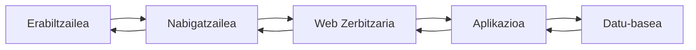
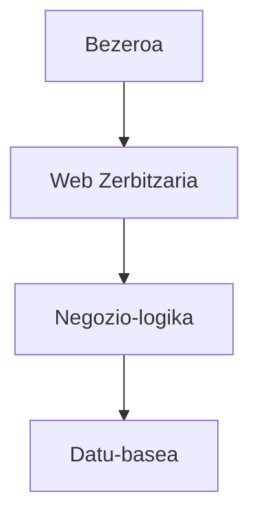

# Web aplikazio baten arkitektura

Web aplikazio seguru bat garatu aurretik, beharrezkoa da nola antolatuta dagoen ulertzea. Web aplikazio bat ez da programa bakar bat, erabiltzaileei zerbitzua eskaintzeko elkarlanean aritzen diren osagaien multzo bat baizik.

Osagai bakoitzak erantzukizun desberdina du, eta gainerakoekin fluxu jakin bati jarraituz komunikatzen da. Antolaketa hori ulertzeak segurtasun-arriskuak non ager daitezkeen eta horiek murrizteko zer neurri hartu behar diren identifikatzeko aukera ematen du.

Kapitulu honetan web aplikazio baten oinarrizko arkitektura aztertuko da, eskaera batek nabigatzailetik datu-basera egiten duen ibilbidea, eta tartean dauden elementu bakoitzak betetzen duen funtzioa.

---

## Zer da web aplikazio bat?

Web aplikazio bat software-sistema bat da, eta erabiltzaileek nabigatzaile baten bidez eskuratzen dute. Mahaigaineko aplikazio batekin alderatuta, prozesamenduaren zatirik handiena urruneko zerbitzari batean egiten da; nabigatzaileak, berriz, informazioa bistaratzen du eta erabiltzailearekin elkarreragina ahalbidetzen du.

Garatzailearen ikuspegitik, web aplikazio bat osagai espezializatuen multzo gisa uler daiteke: osagai horiek elkarlanean aritzen dira eskaerak prozesatzeko, negozio-logika aplikatzeko, datuak eskuratzeko eta bezeroari erantzuna itzultzeko.

Erantzukizunen banaketa horrek aplikazioaren mantentzea errazten du, eskalagarritasuna hobetzen du eta sistemaren atal bakoitzean segurtasun-neurri espezifikoak txertatzeko aukera ematen du.

---

## Osagai nagusiak

Arkitektura ugari badaude ere, web aplikazio moderno gehienek honako elementu nagusi hauek partekatzen dituzte.

| Osagaia | Funtzio nagusia |
|------------|-------------------|
| Bezeroa | Erabiltzailearekin elkarreragiten du, eta zerbitzarira eskaerak bidaltzen ditu. |
| Web zerbitzaria | HTTP eskaerak jasotzen ditu, eta aplikaziora bideratzen ditu. |
| Aplikazioa | Negozio-logika inplementatzen du, eta eskaerak prozesatzen ditu. |
| Datu-basea | Behar den informazioa gordetzen eta berreskuratzen du. |

Osagai bakoitzak erantzukizun desberdinak ditu, eta, ondorioz, segurtasun-arrisku desberdinak ere bai.

---

## Web eskaera baten ibilbidea

Erabiltzaile batek web aplikazio batekin elkarreragiten duenean, sistemako osagai desberdinen arteko komunikazio-sekuentzia bat hasten da.

Prozesua honako urrats hauetan laburbil daiteke:

1. Erabiltzaileak ekintza bat egiten du nabigatzailetik.
2. Nabigatzaileak HTTP eskaera bidaltzen dio zerbitzariari.
3. Zerbitzariak eskaera aplikazioari ematen dio.
4. Aplikazioak behar den logika exekutatzen du eta, beharrezkoa bada, datu-basea kontsultatzen du.
5. Aplikazioak erantzuna sortzen du.
6. Zerbitzariak erantzun hori nabigatzailera itzultzen du.
7. Nabigatzaileak emaitza erabiltzaileari erakusten dio.

Ibilbide honetan, informazioak osagai desberdinak zeharkatzen ditu; osagai bakoitzak bere funtzioak eta erantzukizunak ditu.

---

## Bezeroa eta zerbitzaria: erantzukizunak

Web aplikazio batean, bezeroak eta zerbitzariak elkarlanean jarduten dute, baina ez dute lan bera egiten.

Bezeroak erabiltzaile-interfazearen ardura du nagusiki: informazioa erakustea, erabiltzaileak sartzen dituen datuak jasotzea eta erabilera-esperientzia hobetzea, HTML, CSS eta JavaScript bezalako teknologien bidez.

Zerbitzaria, bere aldetik, negozio-logika exekutatzeaz, jasotako informazioa balioztatzeaz, autentikazioa kudeatzeaz, baimenak kontrolatzeaz eta gordetako datuetara sartzeaz arduratzen da.

Bereizketa hori garrantzitsua da, bezeroarengandik datorren edozein informazio manipula daitekeelako. Horregatik, segurtasun-erabaki kritikoak beti zerbitzarian egiaztatu behar dira.

!!! warning "Ez fidatu inoiz bezeroaz"

    Nabigatzailea erabiltzailearena da, ez garatzailearena. Bezerotik bidalitako edozein datu aldatu daiteke zerbitzarira iritsi aurretik, eta beti balioztatu behar da.

---

## Geruzatan oinarritutako arkitektura

Softwarearen mantentzea eta eboluzioa errazteko, aplikazioak normalean erantzukizun ondo definituak dituzten geruzetan antolatzen dira.

Antolaketa horrek hainbat abantaila eskaintzen ditu:

- Erantzukizunen bereizketa sustatzen du.
- Osagaien arteko akoplamendua murrizten du.
- Mantentzea eta probak errazten ditu.
- Segurtasun-kontrolak maila desberdinetan aplikatzeko aukera ematen du.
- Geruza bat ordeztea edo eboluzionatzea ahalbidetzen du, gainerakoak erabat aldatu gabe.

Laravel edo Spring Boot bezalako framework moderno askok antolaketa-printzipio horri jarraitzen diote, nahiz eta barne-egitura konplexuagoak erabili.

---

## Non agertzen dira segurtasun-arriskuak?

Segurtasun-arriskuak ez dira osagai bakar batean kontzentratzen. Informazioa jasotzen, prozesatzen, gordetzen edo transmititzen den edozein puntutan ager daitezke.

Adibide batzuk:

- Erabiltzaileak sartutako datuak behar bezala balioztatzen ez direnean.
- Datu-baseko kontsultak modu ez-seguruan eraikitzen direnean.
- Saioen edo kredentzialen kudeaketa desegokia denean.
- Bezeroaren eta zerbitzariaren arteko komunikazioa zifratu gabe dagoenean.
- Hedapenean konfigurazio okerrak daudenean.

Arkitektura ulertzeak puntu horiek kokatzeko eta garapenaren lehen faseetatik babes-neurriak aplikatzeko aukera ematen du.

---

## Gogoratzeko

Web aplikazio bat ez da kode hutsa. Elkarren artean elkarlanean aritzen diren osagaien multzo bat da, zerbitzu bat emateko.

Osagai horiek nola erlazionatzen diren ulertzea da arriskuak non ager daitezkeen identifikatzeko eta garapenean zehar horiek murrizteko lehen urratsa.

---

## Funtsezko ideiak

- Web aplikazio bat erantzukizun desberdinak dituzten hainbat osagaik osatzen dute.
- Bezeroak eta zerbitzariak elkarlanean aritzen dira, baina ez dituzte funtzio berak betetzen.
- Informazioak geruza desberdinak zeharkatzen ditu erantzun bat sortu aurretik.
- Erantzukizunen bereizketak mantengarritasuna eta segurtasuna hobetzen ditu.
- Arkitektura ulertzeak ahuleziak ager daitezkeen puntuak identifikatzea errazten du.

---

## Nabigazioa

**Aurreko orria:** [Web garapen seguruaren sarrera](1.introduccion-desarrollo-web-seguro.md)

**Hurrengo orria:** [HTTP protokoloa](3.protocolo-http.md)
