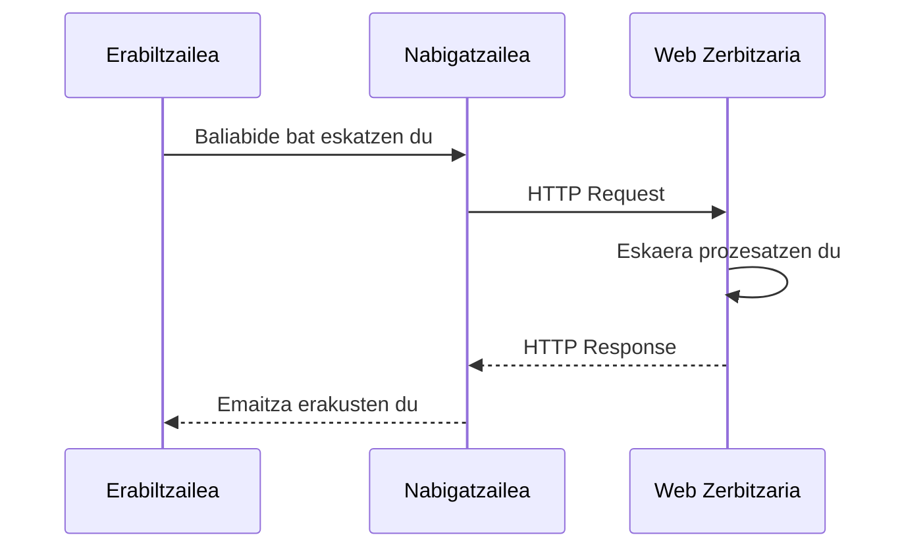
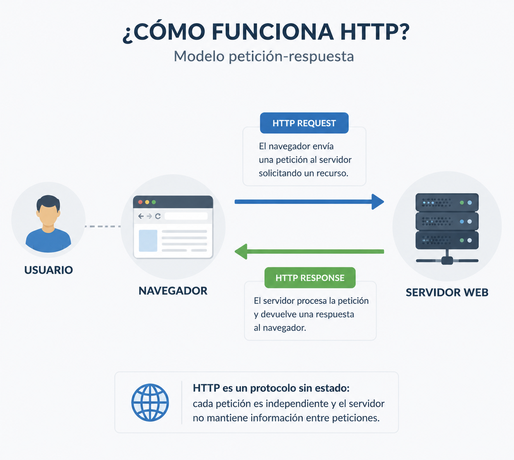
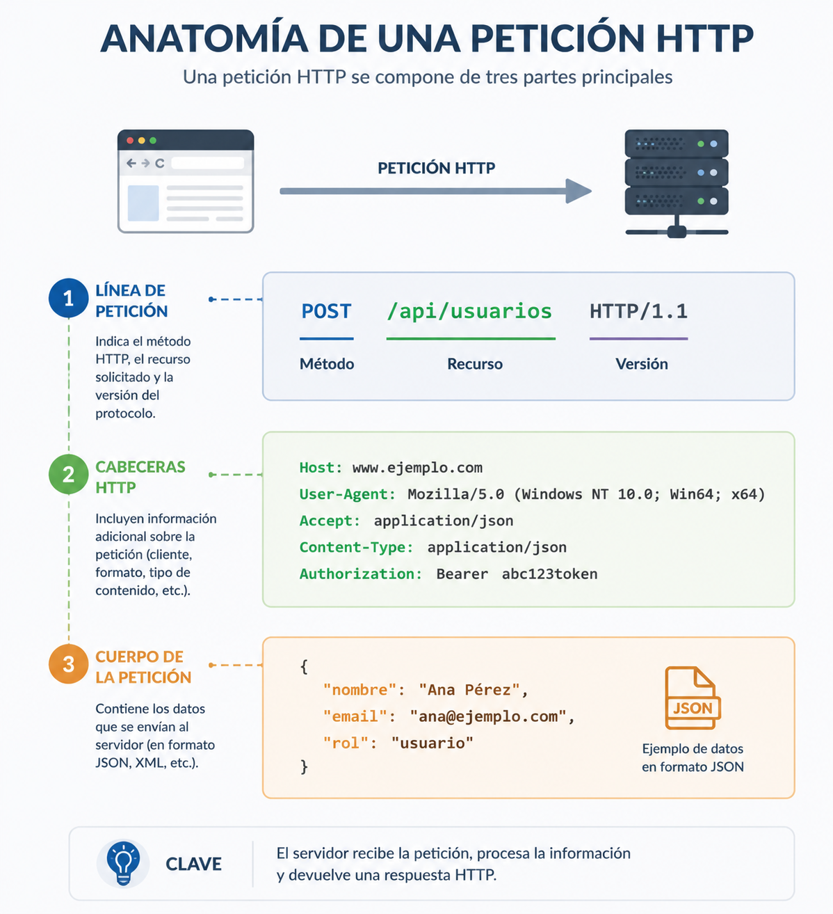
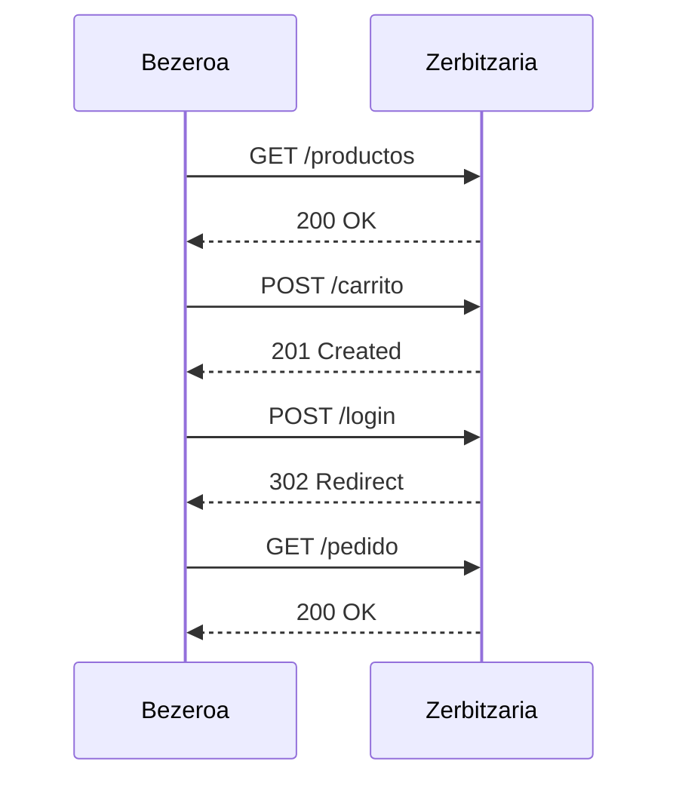

# HTTP protokoloa

Web aplikazio baten arkitekturak bere osagaiak nola antolatzen diren eta bakoitzak zer funtzio betetzen duen azaltzen du. Hala ere, oraindik galdera bat dago erantzuteko: nola komunikatzen dira osagai horiek?

Erabiltzaile batek botoi bat sakatzen duenean, formulario bat bidaltzen duenean edo web orri batera sartzen denean, nabigatzaileak informazioa trukatu behar du zerbitzari batekin. Komunikazio horrek arau komunak jarraitu behar ditu, biek elkar ondo ulertu ahal izateko. HTTP protokoloak, hain zuzen ere, arau horiek definitzen ditu.

HTTPren funtzionamendua ulertzea funtsezkoa da edozein web garatzailerentzat. Autentikazioarekin, saioekin, APIekin, erroreen kudeaketarekin edo segurtasunarekin lotutako erabaki asko zuzenean protokolo honek nola funtzionatzen duenaren araberakoak dira.

Kapitulu honetan HTTP komunikazio bat nola garatzen den aztertuko da, bezeroak eta zerbitzariak zer informazio trukatzen duten, eta protokolo honek garapen seguruaren ikuspegitik zer ondorio dituen.

---

## Zergatik existitzen da HTTP?

Erabiltzaile batek web orri baten helbidea nabigatzailean idazten duenean edo esteka batean klik egiten duenean, erantzun ia berehalakoa jasotzea espero du. Hala ere, nabigatzailea eta zerbitzaria programa desberdinak dira, eta ekipo desberdinetan exekutatzen dira; askotan, milaka kilometrora banatuta egoten dira. Informazioa trukatu ahal izateko, hizkuntza komun bat erabili behar dute.

Hizkuntza hori **HyperText Transfer Protocol (HTTP)** da.

HTTP komunikazio-protokolo bat da, eta bezeroak eta zerbitzariak eskaerak eta erantzunak trukatzeko jarraitu behar dituzten arauak ezartzen ditu. Arau horiei esker, edozein nabigatzaile modernok edozein web zerbitzarirekin komunikatu daiteke, sistema eragilea, erabilitako programazio-lengoaia edo aplikazioa garatzeko erabilitako teknologia edozein dela ere.

HTTP komunikazio batean gutxienez bi elementuk hartzen dute parte beti:

- **Bezero batek**, normalean web nabigatzaile batek, baliabide bat eskatzen du.
- **Zerbitzari batek**, eskaera jasotzen du, prozesatzen du eta erantzuna itzultzen du.

Eskatutako baliabidea HTML orri bat, irudi bat, PDF dokumentu bat, JSON fitxategi bat, bideo bat edo zerbitzariak eman dezakeen beste edozein eduki izan daiteke.

HTTP protokoloak ez du definitzen aplikazio bat nola inplementatu behar den, ezta zerbitzariak zein lengoaia erabili behar duen ere. Nabigatzaile berak, itxurazko diferentziarik gabe, PHP, Laravel, Java, .NET, Node.js edo Python bidez garatutako aplikazioetara sar daiteke, denek komunikazio-protokolo bera erabiltzen dutelako.

Independentzia teknologiko hori Webaren hazkunde handia ahalbidetu duten faktoreetako bat izan da. Garatzaileek proiektu bakoitzerako egokienak iruditzen zaizkien tresnak hauta ditzakete; nabigatzaileak, berriz, HTTP bidez komunikatzen jarraitzen du beti.

!!! note "HTTP estandar bat da"

    HTTP **IETFk (Internet Engineering Task Force)** definitutako estandar irekia da. Horri esker, nabigatzaileen edo zerbitzarien edozein fabrikatzailek protokoloa inplementa dezake zehaztapen berak jarraituz, sistemen arteko elkarreragingarritasuna bermatuz.

Garapen seguruaren ikuspegitik, HTTP ulertzea komunikazio-protokolo bat ezagutzea baino askoz gehiago da. Bezeroaren eta zerbitzariaren artean datuak nola bidaiatzen diren, eskaera bakoitzean zer informazio transmititzen den eta segurtasun-arriskuak zein puntutan ager daitezkeen ulertzea esan nahi du. Moduluaren gainerakoa oinarri horren gainean eraikiko da.

!!! example "Garatzailearen ikuspegitik"

    Erabiltzaile batek botoi bat sakatzen duen bakoitzean, saioa hasten duen bakoitzean, formulario bat bidaltzen duen bakoitzean edo informazioa kontsultatzen duen bakoitzean, nabigatzaileak HTTP eskaera bat edo gehiago sortzen ditu.

    Eskaera horiek zer daukaten eta zerbitzariak nola erantzuten duen ulertzeak, geroago, nabigatzailearen DevTools, Burp Suite edo OWASP ZAP bezalako tresnen funtzionamendua interpretatzeko aukera emango du; eta, gainera, ulertaraziko du zergatik segurtasun-neurri jakin batzuk zerbitzarian inplementatu behar diren, eta ez bezeroan bakarrik.

    ---

## Nola garatzen da HTTP komunikazioa

HTTP komunikazio guztiek oso eredu sinplea jarraitzen dute: bezero batek eskaera egiten du, eta zerbitzari batek erantzuna itzultzen du.

Bezeroa normalean web nabigatzaile bat izaten da, baina mugikorreko aplikazio bat, mahaigaineko programa bat edo API bat kontsumitzen duen beste aplikazio bat ere izan daiteke. Zerbitzariak eskaera jasotzen du, prozesatzen du eta erantzun egokia sortzen du.

Komunikazio horri **eskaera-erantzun eredua (request-response)** deitzen zaio, eta ia web aplikazio guztien oinarrizko funtzionamendua da.

Hurrengo diagramak prozesu hori laburbiltzen du.



{ width="700" }

Diagrama oso sinplea dirudien arren, aplikazio erreal batean hamarnaka edo ehunka HTTP eskaera gerta daitezke orri bakar bat eraikitzeko. Nabigatzaileak HTML dokumentu nagusia eskatzen du, baina baita estilo-orriak, JavaScript fitxategiak, irudiak, tipografiak eta interfazea behar bezala irudikatzeko beharrezkoak diren beste baliabide batzuk ere deskargatzen ditu.

Horregatik, nabigatzailearen garapen-tresnak edo Burp Suite irekitzean, ohikoa da erabiltzailearen ekintza bakar bati lotutako eskaera ugari ikustea.

### Adibide sinple bat

Demagun erabiltzaile batek honako helbide hau idazten duela nabigatzailean:

``` 
https://www.ejemplo.com/productos
```

Une horretatik aurrera, honakoaren antzeko ekintza-sekuentzia bat gertatzen da:

1. Nabigatzaileak HTTP eskaera prestatzen du `/productos` baliabidea eskatzeko.
2. Eskaera zerbitzarira bidaltzen da.
3. Zerbitzariak eskaera interpretatu eta dagokion logika exekutatzen du.
4. Beharrezkoa bada, datu-basea kontsultatzen du.
5. HTTP erantzuna sortzen du.
6. Nabigatzaileak erantzuna jasotzen du.
7. Azkenik, edukia erabiltzaileari bistaratzen dio.

Prozesu hori guztia normalean segundoaren hamarren gutxi batzuetan osatzen da.

!!! note "Elkarrizketa laburra"

    HTTPk ez du bezeroaren eta zerbitzariaren arteko elkarrizketa iraunkorrik mantentzen. Eskaera bakoitza aurrekoetatik independentea da, eta zerbitzariak erantzuna itzultzen duenean amaitzen da.

Ezaugarri honek ondorio oso garrantzitsua izango du, aurrerago aztertuko duguna: **HTTP egoerarik gabeko protokoloa da (stateless)**. Hori dela eta, cookieak eta saioak bezalako mekanismoak erabili beharko dira eskaera desberdinen arteko informazioa gogoratzeko.

!!! example "Garatzailearen ikuspegitik"

    Aplikazio batek eragiketa bakarra egiten duela "dirudienean", normalean HTTP eskaera ugari trukatzen ari da.
    Eskaera horiek behatzen ikasteak aplikazio modernoak nola funtzionatzen duten ulertzeko, erroreak lokalizatzeko eta garapenean segurtasun-arazoak aztertzeko aukera emango du.
    ---

## HTTP eskaera baten anatomia

Bezero batek zerbitzari bati baliabide bat eskatzen dion bakoitzean, **HTTP eskaera** (*HTTP Request*) bidaltzen du. Eskaera hori mezu egituratu bat da, eta zerbitzariak zer baliabide eskatzen den eta eskaera nola prozesatu behar duen interpretatzeko behar duen informazio guztia dauka.

Erabiltzaile gehienek inoiz ikusten ez badute ere, web aplikazio guztiek milaka HTTP eskaera trukatzen dituzte egunero.

Hurrengo eskaera produktu-zerrenda batera sartzeko eskaera sinple bati dagokio.

```http
GET /productos HTTP/1.1
Host: www.ejemplo.com
User-Agent: Mozilla/5.0
Accept: text/html
Accept-Language: es-ES
Connection: keep-alive
```

Lehen begiratuan loturarik gabeko lerro multzo bat dirudien arren, bakoitzak esanahi zehatza du.

### Eskaera-lerroa

Lehen lerroak funtsezko hiru datu adierazten ditu:

```http
GET /productos HTTP/1.1
```

- **GET** → erabilitako HTTP metodoa.
- **/productos** → eskatutako baliabidea.
- **HTTP/1.1** → erabilitako protokoloaren bertsioa.

Informazio horri esker, zerbitzariak bezeroak zer eragiketa egin nahi duen identifika dezake.

### HTTP goiburuak

Eskaera-lerroaren ondoren, **goiburu** (*HTTP Headers*) batzuk agertzen dira.

Goiburuek eskaerari buruzko informazio osagarria ematen dute. Batzuek eskaera zein zerbitzaritara doan identifikatzen dute; beste batzuek erabilitako nabigatzailea deskribatzen dute edo bezeroak zer motatako erantzuna jaso nahi duen adierazten dute.

Aurreko adibidean ohikoenetako batzuk agertzen dira.

| Goiburua | Funtzioa |
|----------|---------|
| Host | Helmugako zerbitzaria adierazten du. |
| User-Agent | Nabigatzailea edo bezero-aplikazioa identifikatzen du. |
| Accept | Bezeroak jaso dezakeen eduki mota zehazten du. |
| Accept-Language | Hobetsitako hizkuntza adierazten du. |
| Connection | Zerbitzariarekiko konexioa nola kudeatu definitzen du. |

Moduluan zehar autentikazioarekin, cookieekin, cachearekin edo segurtasunarekin lotutako beste goiburu batzuk ere agertuko dira.

!!! note "Goiburuak metadatuak dira"

    Goiburuak ez dira eskaeraren edukiaren parte. Zerbitzariari eskaera behar bezala interpretatzen laguntzen dion informazio osagarria ematen dute.

### Eskaeraren gorputza

Eskaera guztiek ez dute gorputza (*Body*) izaten.

**GET** bezalako metodoek normalean informazio guztia URLan bertan bidaltzen dute; horregatik, normalean ez dute datu osagarririk eramaten.

Hala ere, **POST**, **PUT** edo **PATCH** bezalako beste metodo batzuek eskaeraren gorputza erabiltzen dute informazioa zerbitzarira bidaltzeko.

Adibidez, erabiltzaile batek saioa hasteko formularioa betetzen duenean, bidalitako datuak normalean eskaeraren gorputzean doaz.

```http
POST /login HTTP/1.1
Host: www.ejemplo.com
Content-Type: application/x-www-form-urlencoded

usuario=juan&password=123456
```

Adibide honetan, lehen bi lerroak HTTP eskaerari dagozkio, eta formularioaren datuak mezuaren gorputzean agertzen dira.

{ width="650" }

Ikastaroaren gainerakoan eskaera erreal ugari aztertuko ditugu nabigatzailearen garapen-tresnak eta Burp Suite erabiliz, informazio hori bezeroaren eta zerbitzariaren artean nola bidaiatzen duen ulertzeko.

!!! example "Garatzailearen ikuspegitik"

    HTTP eskaera batek nabigatzailean ikus daitekeen URLak baino askoz informazio gehiago dauka.
    Bere goiburuak eta gorputza interpretatzen ikasteak formularioak, APIak, autentikazioa, cookieak eta aurrerago aztertuko diren ahulezia asko nola funtzionatzen duten ulertzeko aukera emango du.
    ---

## HTTP erantzun baten anatomia

Zerbitzariak eskaera jaso eta prozesatu ondoren, **HTTP erantzun** bat (*HTTP Response*) sortzen du. Mezu horrek eskaeraren emaitza eta bezeroak nola interpretatu behar duen jakiteko behar duen informazio guztia jasotzen du.

HTTP erantzun baten egitura eskaerarena bezalakoa da. Hasierako lerro batez, goiburu multzo batez eta, normalean, eskatutako edukia duen gorputz batez osatuta dago.

Hurrengo adibidean erantzun sinple bat ikus daiteke.

```http
HTTP/1.1 200 OK
Content-Type: text/html; charset=UTF-8
Content-Length: 1256
Date: Tue, 29 Jul 2025 10:15:00 GMT

<html>
...
</html>
```

Atal horietako bakoitzak funtzio zehatza betetzen du.

### Egoera-lerroa

Lehen lerroak eskaeraren emaitzari buruzko informazioa ematen du.

```http
HTTP/1.1 200 OK
```

Hiru elementuk osatzen dute:

- **HTTP/1.1** → erabilitako protokoloaren bertsioa.
- **200** → egoera-kodea.
- **OK** → emaitzaren deskribapen testuala.

Egoera-kodea erantzuneko elementu garrantzitsuenetako bat da, bezeroari eragiketa ondo egin den edo arazoren bat gertatu den jakinarazten diolako.

Hurrengo atalean ohikoenak diren egoera-kodeak xehetasunez aztertuko ditugu.

### HTTP goiburuak

Egoera-lerroaren ondoren, erantzunaren goiburuak agertzen dira.

Goiburu horiek zerbitzariak itzulitako edukiari eta nabigatzaileak hori tratatzeko moduari buruzko informazio osagarria ematen dute.

Ohikoenetako batzuk hauek dira:

| Goiburua | Funtzioa |
|----------|---------|
| Content-Type | Itzulitako eduki mota adierazten du. |
| Content-Length | Edukiaren tamaina zehazten du. |
| Date | Erantzuna sortu den data eta ordua. |
| Cache-Control | Erantzuna cachean nola gorde daitekeen definitzen du. |
| Set-Cookie | Cookieak bidaltzen dizkio nabigatzaileari. |

Moduluan zehar segurtasunarekin bereziki lotutako beste goiburu batzuk ere agertuko dira, hala nola **Content-Security-Policy**, **Strict-Transport-Security** edo **X-Frame-Options**.

!!! note "Goiburuek ere babesten dute"

    Segurtasun-neurri moderno askok ez dute aplikazioaren kodea aldatzea eskatzen; nahikoa da zerbitzariak bidalitako HTTP goiburu jakin batzuk ondo konfiguratzea.

### Erantzunaren gorputza

Gorputzak (*Body*) bezeroak eskatutako baliabidea dauka.

Aplikazioaren arabera, edukia oso desberdina izan daiteke.

Adibidez:

- HTML orri bat.
- Irudi bat.
- PDF dokumentu bat.
- CSS fitxategi bat.
- JavaScript fitxategi bat.
- API batek itzulitako JSON objektu bat.
- Bideo bat edo beste edozein baliabide.

Web aplikazio moderno batean oso ohikoa da zerbitzariak **JSON** formatuan erantzutea, bereziki frontend-a eta backend-a bereizita daudenean.

Aurrerago, JavaScript, Vue eta Laravelrekin lan egiten dugunean, ikusiko dugu bezeroaren eta zerbitzariaren artean trukatutako erantzun askok ez dutela HTML orri osoa eramaten; nabigatzaileak interfazea eguneratzeko erabiltzen dituen datuak baino ez dituzte eramaten.

!!! example "Garatzailearen ikuspegitik"

    HTTP erantzun bat ulertzeak nabigatzailean ikus daitekeen edukia baino askoz gehiago interpretatzeko aukera ematen du.
    Egoera-kodeek, goiburuek eta eduki motak informazio oso baliotsua eskaintzen dute erroreak arazteko, aplikazioak optimizatzeko eta segurtasun-arazoak detektatzeko.
    ---

## HTTP metodo ohikoenak

HTTP eskaera bakoitzak zerbitzariari adierazten dio baliabide baten gainean zer eragiketa egin nahi duen. Horretarako, **HTTP metodo** bat erabiltzen du; **HTTP Method** edo **HTTP Verb** ere deitzen zaio.

Metodoa eskaeraren lehen lerroaren parte da, eta bezeroaren asmoa adierazten du. Ez da gauza bera informazioa eskatzea, baliabide berri bat sortzea, aldatzea edo ezabatzea.

Web aplikazioen garapenean gehien erabiltzen diren metodoak hauek dira.

| Metodoa | Helburua | Adibidea |
|---------|-----------|---------|
| GET | Informazioa lortu | Produktu bat kontsultatu |
| POST | Baliabide berri bat sortu | Erabiltzaile bat erregistratu |
| PUT | Baliabide bat osorik ordezkatu | Profil bat eguneratu |
| PATCH | Baliabide bat partzialki aldatu | Pasahitz bat aldatu |
| DELETE | Baliabide bat ezabatu | Iruzkin bat ezabatu |

HTTP protokoloak beste metodo batzuk ere definitzen baditu ere, bost hauek web aplikazio moderno baten behar gehienak estaltzen dituzte.

### GET

**GET** metodoak zerbitzariari informazioa eskatzen dio, aplikazioaren egoera aldatu gabe.

Adibidez, erabiltzaile batek produktu baten orria bisitatzen duenean, albiste bat kontsultatzen duenean edo bere profilera sartzen denean, nabigatzaileak normalean GET eskaera bidaltzen du.

```http
GET /productos/15 HTTP/1.1
```

GET eskaerak informazioa kontsultatzeko bakarrik erabili behar dira, ez datuak aldatzen dituzten eragiketak egiteko.

### POST

**POST** metodoak informazioa zerbitzarira bidaltzen du, baliabide berri bat sortzeko edo ekintza bat exekutatzeko.

Ohikoa da erregistro-formularioetan, saio-hasieran, iruzkinak bidaltzean edo eskaerak sortzean erabiltzea.

```http
POST /usuarios HTTP/1.1
```

Normalean, bidalitako datuak eskaeraren gorputzean bidaiatzen dira.

### PUT

**PUT** metodoak dagoen baliabide bat osorik ordezkatzen du.

Baliabidea existitzen bada, bere edukia bezeroak bidalitako informazio berriarekin ordezkatzen da.

```http
PUT /usuarios/15 HTTP/1.1
```

REST aplikazioetan eguneratze osoetarako erabiltzen da maiz.

### PATCH

**PATCH** metodoak baliabidearen zati bat bakarrik aldatzen du.

Adibidez, erabiltzaile baten helbide elektronikoa bakarrik aldatzea edo profil-argazkia eguneratzea.

```http
PATCH /usuarios/15 HTTP/1.1
```

Gaur egun, web aplikazio modernoetan gehien erabiltzen den metodoetako bat da.

### DELETE

**DELETE** metodoak baliabide bat ezabatzeko eskaera egiten du.

```http
DELETE /usuarios/15 HTTP/1.1
```

Zerbitzariak erabakiko du azkenean eragiketa hori baimenduta dagoen ala ez, erabiltzailearen baimenen eta aplikazioaren negozio-arauen arabera.

!!! warning "Metodoak ez du segurtasuna bermatzen"

    HTTP metodoak ondo erabiltzeak aplikazio baten antolaketa hobetzen du, baina ez du eragozten erabiltzaile batek baimenik gabeko eragiketak egiten saiatzea. Segurtasun-egiaztapen guztiak beti zerbitzarian egin behar dira.

### HTTP metodoak eta aplikazio modernoak

Laravel, Spring Boot edo ASP.NET bezalako frameworkekin garatutako aplikazioetan, HTTP metodoak aplikazioaren diseinuaren beraren parte dira.

Era berean, Vue, React edo Angular bezalako frontend liburutegi eta frameworkek metodo horiek erabiltzen dituzte REST APIekin komunikatzeko, eskaera asinkronoen bidez.

Metodo bakoitza noiz erabili behar den ulertzeak aplikazio koherenteagoak, mantengarriagoak eta egungo estandarrekin lerrokatuagoak garatzea errazten du.

!!! example "Garatzailearen ikuspegitik"

    HTTP metodoa ondo aukeratzea ez da estilo kontu hutsa. Beste garatzaile batzuek aplikazioaren asmoa hobeto ulertzea ahalbidetzen du, eta APIekin, proba-tresnekin eta framework modernoekin integrazioa errazten du.
    
    ---

## HTTP egoera-kodeak

HTTP erantzun bakoitzak **egoera-kode** (*HTTP Status Code*) bat dauka, egindako eskaeraren emaitza bezeroari jakinarazteko.

Kode horri esker, nabigatzaile batek, mugikorreko aplikazio batek edo beste edozein bezerok jakin dezake eragiketa ondo egin den ala arazoren bat gertatu den.

Egoera-kodeak hiru zifraz osatuta daude, eta bost kategoria handitan multzokatzen dira.

| Kategoria | Esanahia |
|-----------|-------------|
| 1xx | Informazioa |
| 2xx | Eskaera ondo prozesatu da |
| 3xx | Berbideratzea |
| 4xx | Bezeroak eragindako errorea |
| 5xx | Zerbitzarian sortutako errorea |

Eguneroko garapenean ez da beharrezkoa protokoloak definitutako kode guztiak buruz ikastea. Hala ere, komeni da ohikoenak ezagutzea.

### Erantzun arrakastatsuak (2xx)

Zerbitzariak eskaera ondo prozesatu duela adierazten dute.

| Kodea | Esanahia | Ohiko erabilera |
|---------|-------------|--------------|
| 200 OK | Eragiketa ondo egin da | Informazio-kontsulta |
| 201 Created | Baliabidea ondo sortu da | Erabiltzaileen, eskaeren edo produktuen alta |
| 204 No Content | Eragiketa zuzena, erantzun-edukirik gabe | Ezabaketak edo eguneratzeak |

### Berbideratzeak (3xx)

Bezeroak beste helbide batera eskaera berri bat egin behar duela adierazten dute.

| Kodea | Esanahia |
|---------|-------------|
| 301 Moved Permanently | Berbideratze iraunkorra |
| 302 Found | Aldi baterako berbideratzea |
| 304 Not Modified | Baliabidea ez da aldatu azken kontsultatik |

Berbideratzeak ohikoak dira saioa hasi ondoren edo orri baten kokapena aldatzen denean.

### Bezeroaren erroreak (4xx)

Kode horiek adierazten dute zerbitzariak eskaera jaso duela, baina ezin duela prozesatu bezeroarekin lotutako arazoren bat dela eta.

| Kodea | Esanahia |
|---------|-------------|
| 400 Bad Request | Eskaerak formatu-erroreak ditu |
| 401 Unauthorized | Autentikatu behar da |
| 403 Forbidden | Erabiltzailea autentikatuta dago, baina ez du baimenik |
| 404 Not Found | Eskatutako baliabidea ez da existitzen |

Garrantzitsua da **401** eta **403** bereiztea, egoera desberdinak adierazten dituztelako.

- **401** esan nahi du erabiltzaileak oraindik ez duela bere identitatea frogatu.
- **403**k adierazten du zerbitzariak erabiltzailearen identitatea ezagutzen duela, baina ez diola eragiketa hori egiten uzten.

### Zerbitzariaren erroreak (5xx)

Kode horiek adierazten dute arazoa eskaera prozesatzean gertatu dela.

| Kodea | Esanahia |
|---------|-------------|
| 500 Internal Server Error | Aplikazioaren barne-errorea |
| 502 Bad Gateway | Zerbitzarien arteko komunikazio-errorea |
| 503 Service Unavailable | Zerbitzua aldi baterako erabilgarri ez |

Ondo garatutako aplikazio batean, errore horiek ez lukete oso maiz gertatu behar, eta erregistratu egin behar dira analisia eta zuzenketa errazteko.

!!! note "Egoera-kodeak diseinuaren parte ere badira"

    Ondo diseinatutako API edo web aplikazio batek egoera-kode egokiak erabiltzen ditu eragiketa bakoitzaren emaitza argi komunikatzeko. Kodea ondo aukeratzeak beste aplikazio batzuekin integrazioa errazten du, eta erroreen arazketa sinplifikatzen du.

!!! example "Garatzailearen ikuspegitik"

    Aplikazio batek espero zenuen bezala funtzionatzen ez duenean, begiratu beharreko lehen datuetako bat HTTP egoera-kodea da.
    Nabigatzailearen DevTools, Burp Suite edo OWASP ZAP bezalako tresnek kode hori erantzun guztietan erakusten dute, eta garapenean arazoak aurkitzeko lehen pistetako bat bihurtzen dute.
    ---

## HTTPren mugak eta saioen jatorria

Orain arte ikusi dugu HTTPk bezeroaren eta zerbitzariaren arteko eskaerak eta erantzunak trukatzeko aukera ematen duela. Hala ere, protokolo honek ezaugarri oso garrantzitsu bat dauka: **ez ditu aurreko komunikazioak gogoratzen**.

HTTP eskaera bakoitza gainerakoetatik erabat independentea da. Zerbitzari batek eskaera bat jasotzen duenean, prozesatu egiten du, erantzuna sortzen du eta komunikazio hori amaitutzat ematen du. Segundo batzuk geroago erabiltzaile berak beste eskaera bat egiten badu, zerbitzariak lehen aldiz komunikatuko balitz bezala tratatuko du.

Horregatik esaten da **HTTP egoerarik gabeko protokoloa dela** (*stateless*).

### Zer esan nahi du HTTP egoerarik gabeko protokoloa izateak?

Imajina dezagun erabiltzaile bat online denda batera sartzen dela.

1. Produktuen katalogoa kontsultatzen du.
2. Artikulu bat gehitzen du saskira.
3. Saskia bistaratzen du.
4. Saioa hasten du.
5. Erosketa amaitzen du.

Erabiltzailearen ikuspegitik, ekintza horiek guztiak nabigazio-saio beraren parte dira.

Hala ere, HTTP protokoloaren ikuspegitik, horietako bakoitza guztiz independentea den eskaera bati dagokio.



HTTPk mekanismo osagarririk izango ez balu, zerbitzariak ez luke modurik izango eskaera horiek guztiak erabiltzaile berari dagozkiola jakiteko.

Eskaera bakoitza guztiz berria balitz bezala iritsiko litzateke.

### Arazo bat aplikazio modernoentzat

Web aplikazio gehienek informazioa gogoratu behar dute eskaera desberdinen artean.

Adibidez:

- Zein erabiltzailek hasi duen saioa jakitea.
- Erosketa-saskiaren edukia mantentzea.
- Hautatutako hizkuntza gogoratzea.
- Nabigazio-hobespen jakin batzuk mantentzea.
- Sarbide-baimenak edo rolak identifikatzea.

Testuinguru hori gordetzeko mekanismorik gabe, eskaera bakoitzean erabiltzaileak hutsetik hasi beharko luke.

Ezinezkoa litzateke merkataritza elektronikoko plataformak, sare sozialak, online banka edo eduki-kudeatzaileak bezalako aplikazioak garatzea.

### Nola konpontzen da arazo hau?

HTTP egoerarik gabeko protokoloa den arren, web aplikazioek hainbat mekanismo erabiltzen dituzte eskaeren artean informazioa mantentzeko.

Bi garrantzitsuenak hauek dira:

- **Cookieak**, datu txikiak nabigatzailean gordetzeko aukera ematen dutenak.
- **Saioak**, hainbat eskaera erabiltzaile berarekin lotzeko aukera ematen dutenak, informazioa zerbitzarian mantenduz.

Mekanismo horiek ez dute HTTPren funtzionamendua aldatzen. Egin dutena da aplikazioak eskaera desberdinak elkarreragin beraren parte gisa ezagutzeko behar duen informazioa gehitzea.

Hurrengo kapituluan cookieek eta saioek nola funtzionatzen duten zehaztasunez aztertuko dugu, nola elkarlanean aritzen diren eta zergatik diren funtsezko elementuak ia edozein web aplikaziotan.

!!! note "HTTPk egoerarik gabeko protokoloa izaten jarraitzen du"

    Aplikazio batek erabiltzailea hainbat eskaeren artean gogoratu arren, HTTPk ez dio egoerarik gabeko protokoloa izateari uzten. Cookieek, saioek eta antzeko beste mekanismo batzuek ahalbidetzen dute komunikazioaren testuingurua mantentzea.

!!! example "Garatzailearen ikuspegitik"

    Autentikazioarekin eta sarbide-kontrolarekin lotutako ahulezia asko ez dira HTTP protokoloaren ondorio, cookieen, saioen edo erabiltzailearen identitatearen kudeaketa okerraren ondorio baizik.

    Desberdintasun hori ulertzea funtsezkoa izango da hurrengo kapituluetan aztertuko ditugun autentikazio-mekanismoak ulertzeko.

    ---

## Zer ondorio ditu HTTPk segurtasunerako?

Orain arte HTTP bezeroen eta zerbitzarien arteko komunikazio-protokolo gisa aztertu dugu. Hala ere, garapen seguruaren ikuspegitik, HTTP informazioa trukatzeko mekanismo hutsa baino askoz gehiago da.

Web aplikazio baten eta haren erabiltzaileen arteko komunikazio osoa HTTP eskaeren eta erantzunen bidez bidaiatzen da. Horregatik, autentikazioarekin, baimenekin, datu-trukearekin, cookieekin, saioekin edo APIekin lotutako edozein erabaki mezu-truke horretan islatzen da.

HTTP nola funtzionatzen duen ulertzeak honako galdera hauei erantzuten laguntzen du:

- Zer informazio bidaltzen dio benetan nabigatzaileak zerbitzariari?
- Non bidaiatzen dute autentikazio-kredentzialek?
- Nola mantentzen du aplikazio batek erabiltzailearen identitatea?
- Zer datu alda ditzake erasotzaile batek zerbitzarira iritsi aurretik?
- Zer informazio itzultzen du aplikazioak erantzun bakoitzean?

Galdera horiei ondo erantzutea funtsezkoa da aplikazio sendoagoak garatzeko eta segurtasun-arriskuak murrizteko.

### HTTPk ez ditu erabiltzaile legitimoak eta erasotzaileak bereizten

Protokoloaren ikuspegitik, HTTP eskaera guztiek formatu bera dute.

HTTPk ez daki eskaera erabiltzaile baimendu batetik, erasotzaile batetik edo tresna automatizatu batetik datorren. Bere funtzio bakarra bezeroaren eta zerbitzariaren artean informazioa garraiatzea da.

Horregatik, eskaera bakoitzaren baliozkotasuna egiaztatzeko erantzukizuna aplikazioarena da beti.

Zerbitzariak, besteak beste, honako alderdi hauek egiaztatu behar ditu:

- Jasotako datuak baliozkoak direla.
- Behar denean erabiltzailea autentikatuta dagoela.
- Eragiketa egiteko nahikoa baimen dituela.
- Eskatutako baliabideak parteka daitezkeela.
- Itzulitako informazioak alferrikako daturik ez duela agerian uzten.

Egiaztapen horiek aplikazioaren garapenaren parte dira, ez HTTP protokoloaren parte.

### HTTP ulertzeak arazoen analisia errazten du

Garapenean ohikoa da HTTP eskaerak eta erantzunak behatzeko aukera ematen duten tresnak erabiltzea.

Horien bidez posible da:

- Aplikazio baten funtzionamendua aztertzea.
- Komunikazio-erroreak lokalizatzea.
- Zerbitzarira bidalitako datuak egiaztatzea.
- HTTP goiburuak berrikustea.
- Egoera-kodeak egiaztatzea.
- Konfigurazio ez-seguruak detektatzea.

Moduluaren hurrengo blokeetan nabigatzailearen garapen-tresnak, Burp Suite eta OWASP ZAP ohikotasunez erabiliko ditugu trafiko hori aztertzeko eta aplikazioen portaera hobeto ulertzeko.

!!! note "Segurtasuna komunikazioa ulertzetik hasten da"

    Babes-mekanismoak aplikatu aurretik, bezeroaren eta zerbitzariaren artean informazioa nola trukatzen den ulertu behar da. Horrela bakarrik identifika daiteke non agertzen diren arriskuak eta nola murriztu daitezkeen garapen-erabakien bidez.

!!! example "Garatzailearen ikuspegitik"

    HTTP ulertzen duen garatzaile batek errazago interpretatzen ditu aplikazio baten inplementazioan agertzen diren arazoak.

    Hasieran programazio-erroreak diruditen gorabehera askok, azkenean, gaizki eraikitako eskaera batekin, ustekabeko erantzun batekin edo komunikazio-protokoloaren konfigurazio oker batekin dute zerikusia.
    
    ---

## Gogoratzeko

Kapitulu honetan HTTP protokoloaren oinarrizko funtzionamendua aztertu da, bezeroen eta zerbitzarien arteko komunikazio-mekanismo gisa.

HTTP eskaera eta erantzun baten egitura aztertu da, metodo eta egoera-kode nagusien funtzioa, eta zergatik jotzen den HTTP egoerarik gabeko protokolotzat.

Kontzeptu horiek beharrezko oinarria dira moduluaren gainerakoa ulertzeko; izan ere, autentikazioa, saioak, APIak, hedapena eta web aplikazioen auditoria zuzenean protokolo honetan oinarritzen dira.

---

## Funtsezko ideiak

- HTTPk bezeroen eta zerbitzarien arteko komunikazio-arauak definitzen ditu.
- HTTP komunikazio orok eskaera eta erantzun eredua jarraitzen du.
- Eskaerak eta erantzunak hasierako lerro batez, goiburuez eta, kasu askotan, gorputz batez osatzen dira.
- HTTP metodoek eskatutako eragiketaren asmoa adierazten dute.
- Egoera-kodeek eskaera bakoitzaren emaitza jakinarazten dute.
- HTTP egoerarik gabeko protokoloa da; horregatik, mekanismo osagarriak behar ditu eskaera desberdinen artean testuingurua mantentzeko.
- HTTP ulertzea ezinbestekoa da web aplikazio seguruak garatzeko, hedatzeko eta auditatzerakoan.

---
