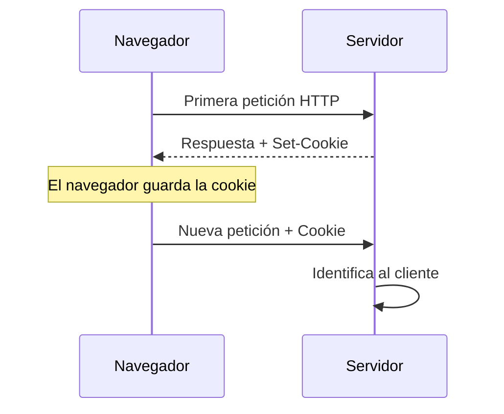
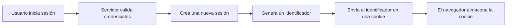
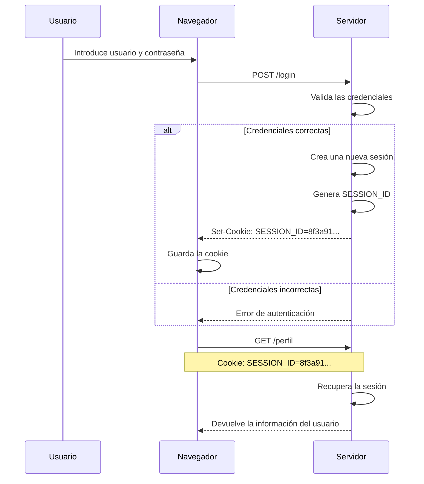

# Cookieak, saioak eta egoeraren kudeaketa

Aurreko kapituluan ikusi dugu HTTP egoerarik gabeko protokoloa dela. Eskaera bakoitza modu independentean prozesatzen da eta, erantzuna bidali ondoren, zerbitzariak ez du komunikazio horri buruzko informaziorik gordetzen.

Hala ere, web aplikazio gehienek informazioa gogoratu behar dute eskaera desberdinen artean. Erabiltzaile batek behin bakarrik hasten du saioa, erosketa-gurdia mantentzen du online denda batean nabigatzen duen bitartean, edo dokumentu batean lanean jarraitzen du orri bakoitzean berriro identifikatu beharrik gabe.

Nola da posible HTTPk ezer gogoratzen ez badu?

Erantzuna web aplikazioek erabiltzen dituzten egoera-kudeaketako mekanismoetan dago. Horien artean, **cookieek** eta **saioek** funtsezko zeregina dute.

Kapitulu honetan aztertuko dugu zergatik diren beharrezkoak, nola funtzionatzen duten eta nola egiten duten elkarlana aplikazio batek erabiltzaile bat identifikatu eta haren interakzioaren testuingurua mantendu ahal izateko. Halaber, kudeaketa okerraren arriskuak eta mekanismo horiek babesteko neurri nagusiak aztertuko ditugu.

---
## HTTP protokoloaren arazoa

Azaldu den bezala, HTTPk ez du informaziorik gordetzen eskaeren artean. Zerbitzarira iristen den eskaera bakoitza mezu independente gisa prozesatzen da, aurreko komunikazioak gogoratu gabe.

Ezaugarri horrek protokoloaren funtzionamendua sinplifikatzen du eta eskalagarritasuna errazten du, baina arazo garrantzitsua planteatzen du web aplikazio modernoentzat.

Pentsa dezagun merkataritza elektronikoko plataforma batean. Erabiltzaile batek honako ekintza hauek egin ditzake:

- Produktuen katalogoa kontsultatu.
- Hainbat artikulu gehitu erosketa-gurdira.
- Saioa hasi.
- Bidalketa-helbidea aldatu.
- Erosketa amaitu.

Erabiltzailearen ikuspegitik, ekintza horiek guztiak aplikazioarekiko interakzio bakar baten parte dira.

Hala ere, HTTPren ikuspegitik, horietako bakoitza erabat independentea den eskaera bati dagokio.

Zerbitzariak mekanismo gehigarririk izango ez balu, ezin izango lieke erantzun galdera erraz hauei:

- Nork egin du eskaera hau?
- Duela minutu batzuk saioa hasi duen erabiltzaile bera al da?
- Zer produktu ditu une honetan erosketa-gurdian?
- Zer baimen ditu esleituta?
- Zer konfigurazio-hobespen aukeratu zituen?

Informazio hori gabe, egunero erabiltzen ditugun aplikazio askoren garapena ezinezkoa litzateke.

!!! note "Arazoa ez da HTTP"

    HTTPk diseinatu zen bezala funtzionatzen du zehazki. Eskaera desberdinen artean informazioa mantentzeko beharra agertzen da, aplikazio modernoek erabiltzaile bakoitzarekin izandako interakzioaren testuingurua gordetzea behar dutelako.

Irtenbidea da hainbat eskaera independente erlazionatzeko aukera ematen duten mekanismoak gehitzea, bezeroaren eta zerbitzariaren arteko elkarrizketa beraren parte balira bezala.

Hurrengo ataletan ikusiko dugu cookieek eta saioek nola konpontzen duten arazo hori modu koordinatuan.
## Zer da cookie bat

**Cookie** bat zerbitzari batek nabigatzaileari bidaltzen dion informazio-zati txiki bat da, nabigatzaileak gorde dezan eta dagokionean etorkizuneko eskaeretan berriro bidal dezan.

Helburu nagusia da HTTP eskaera desberdinak elkarrekin erlazionatu ahal izatea. Mekanismo honi esker, zerbitzariak antzeman dezake hainbat eskaera nabigatzaile beretik datozela eta interakzioaren testuingurua mantendu dezake.

Garrantzitsua da ulertzea cookie bat **ez dela programa bat**, **ez duela koderik exekutatzen** eta **ez duela aplikazioa barruan**. Besterik gabe, informazio-kantitate txiki bat gordetzen du **izena-balioa** bikoteen forman.

Adibidez, cookie batek saio-identifikatzaile bat izan dezake:

```http
Set-Cookie: SESSION_ID=8f3a91b2c4d7...
```

Nabigatzaileak erantzun hau jasotzen duenean, automatikoki gordetzen du cookiea.

Webgune berera zuzendutako hurrengo eskaeretan, berriro bidaliko du **Cookie** goiburua erabiliz.

```http
Cookie: SESSION_ID=8f3a91b2c4d7...
```

Horrela, zerbitzariak antzeman dezake bi eskaerak nabigatzaile berarenak direla.

### Cookie baten trukea

Prozesu osoa honako urrats hauetan labur daiteke.



Cookieak ondorengo eskaerekin batera doan identifikatzaile gisa jokatzen du.

Azpimarratzekoa da nabigatzaileak prozesu hau automatikoki kudeatzen duela. Erabiltzaileak ez du esku hartu behar cookiea gordetzeko, ezta berriro bidaltzeko ere.

### Zer informazio izan dezake cookie batek

Teknikoki cookie batek informazio mota desberdinak gorde ditzakeen arren, aplikazio modernoetan normalean identifikatzaile bat bakarrik gordetzeko erabiltzen da.

Identifikatzaile horri esker, erabiltzaileari lotutako informazioa zerbitzarian lokaliza daiteke, datu sentikorrak zuzenean nabigatzailean gordetzea saihestuz.

Beste egoera batzuetan, cookieak hobespen hauek gogoratzeko ere erabil daitezke:

- Aplikazioaren hizkuntza.
- Gai argia edo iluna.
- Cookieen oharraren onarpena.
- Pertsonalizazio-aukera jakin batzuk.

Nolanahi ere, cookieek behar-beharrezkoa den informazioa bakarrik gorde behar dute.

!!! note "Cookieak identifikatu egiten du; ez du informazio guztia gordetzen"

    Oso ohikoa den ideia okerra da cookieak erabiltzailearen datu guztiak barruan dituela pentsatzea.

    Errealitatean, ohikoena da identifikatzaile bat bakarrik gordetzea. Informazio garrantzitsua zerbitzarian geratzen da eta identifikatzaile hori erabiliz berreskuratzen da.

!!! example "Garatzailearen ikuspegitik"

    Erabiltzaile batek saioa hasten duenean, normalean aplikazioak ez du haren izena, pasahitza edo baimenak cookiearen barruan gordetzen.

    Ohikoena da saio-identifikatzaile bat bakarrik gordetzea eta eskaera bakoitzean informazio guztia zerbitzaritik berreskuratzeko erabiltzea.

## Zer da saio bat

**Saio** bat zerbitzariari HTTP eskaera desberdinen artean erabiltzaile bati buruzko informazioa mantentzeko aukera ematen dion mekanismoa da.

Cookieak nabigatzailean gordetzen diren bitartean, saio baten informazioa zerbitzarian geratzen da. Horri esker, datu garrantzitsuak mantendu daitezke sarearen bidez etengabe bidali gabe.

Aplikazio batek saio bat sortzen duenean, hura ordezkatzen duen identifikatzaile bakar bat sortzen du. Identifikatzaile hori cookie baten bidez bidaltzen da nabigatzailera, eta gero zerbitzarian dagokion informazioa lokalizatzeko erabiliko da.

Horrela, nabigatzaileak saioaren identifikatzailea bakarrik bidali behar du. Lotutako datu guztiak zerbitzarian babestuta geratzen dira.

### Zer informazio eduki ohi du saio batek?

Saio baten edukia aplikazio bakoitzaren beharren araberakoa da, baina ohikoa da honelako informazioa gordetzea:

- Autentifikatutako erabiltzailearen identifikatzailea.
- Haren izena edo profil-oinarrizko informazioa.
- Esleitutako baimenak edo rolak.
- Hautatutako hizkuntza.
- Erosketa-gurdiaren edukia.
- Nabigazioan zehar behar diren aldi baterako datuak.

Informazio hori guztia zerbitzarian geratzen da eta aplikazioak berak bakarrik du sarbidea.

### Non gordetzen da saio bat?

Saio baten informazioa hainbat modutan gorde daiteke.

Adibidez:

- Memorian.
- Zerbitzariko fitxategietan.
- Datu-base batean.
- Redis edo Memcached bezalako sistema banatuetan.

Aukera aplikazioaren tamainaren, erabiltzaile kopuruaren eta errendimendu-eskakizunen araberakoa da.

Garatzailearen ikuspegitik, garrantzitsuena da ulertzea **saioa zerbitzariarena dela**, eta nabigatzaileak hura lokalizatzeko behar den identifikatzailea bakarrik gordetzen duela.

### Saio baten bizi-zikloa

Erabiltzaile batek saioa ondo hasten duenean, zerbitzariak normalean honako eragiketa hauek egiten ditu:

1. Jasotako kredentzialak balioztatzen ditu.
2. Saio berri bat sortzen du.
3. Identifikatzaile bakar bat sortzen du.
4. Identifikatzaile hori erabiltzailearen informazioarekin lotzen du.
5. Identifikatzailea nabigatzailera bidaltzen du cookie baten bidez.

Ondorengo eskaeretan, nabigatzaileak automatikoki bidaliko du cookie hori, eta zerbitzariak dagokion saioa berreskuratuko du.



### Saioak ez du HTTP ordezkatzen

Garrantzitsua da ulertzea saio batek ez duela HTTP protokoloaren funtzionamendua aldatzen.

Eskaera bakoitzak independentea izaten jarraitzen du, eta protokoloak egoerarik gabeko sistema izaten jarraitzen du.

Aplikazioak egiten duena da cookie bidez bidalitako identifikatzailea erabiltzea zerbitzarian gordetako informazioa berreskuratzeko eta eskaera bakoitzaren testuingurua berreraikitzeko.

!!! note "Informazio garrantzitsua zerbitzarian geratzen da"

    Saioak datu garrantzitsuak mantentzeko aukera ematen du, nabigatzailera etengabe bidali beharrik gabe.

    Horrek informazio sentikorraren esposizioa murrizten du eta sarbide-kontrola errazten du aplikazioaren aldetik.

!!! example "Garatzailearen ikuspegitik"

    Erabiltzaile batek Laravelen, PHPn edo beste edozein framework modernotan saioa hasten duenean, normalean ez dira haren datu pertsonalak eskaera bakoitzean bidaltzen.

    Nabigatzaileak saioaren identifikatzailea bakarrik transmititzen du. Zerbitzaria da identifikatzaile hori erabiliz behar den informazio guztia berreskuratzen duena.

    ---

## Nola egiten duten elkarlana cookieek eta saioek

Cookieak eta saioak ez dira mekanismo alternatiboak, osagarriak baizik.

Bakoitzak funtzio desberdina betetzen du aplikazioaren barruan.

- **Cookieak** nabigatzailea eskaera bakoitzean identifikatzeko aukera ematen du.
- **Saioak** erabiltzaile horri lotutako informazioa zerbitzariaren barruan gordetzen du.

Elkarrekin lanean, aplikazio batek erabiltzailea nor den gogoratzea ahalbidetzen dute, haren informazio guztia eskaera bakoitzean bidali beharrik gabe.

### Adibide oso bat

Demagun erabiltzaile bat aplikazio batera sartzen dela eta bere kredentzialak sartzen dituela.

1. Nabigatzaileak saioa hasteko formularioa bidaltzen du.
2. Zerbitzariak erabiltzailea eta pasahitza balioztatzen ditu.
3. Kredentzialak zuzenak badira, saio berri bat sortzen du.
4. Saioak identifikatzaile bakar bat jasotzen du.
5. Zerbitzariak identifikatzaile hori nabigatzailera bidaltzen du cookie baten bidez.
6. Nabigatzaileak automatikoki gordetzen du cookiea.
7. Hurrengo eskaeretan, nabigatzaileak cookiea bidaliko du eskaerarekin batera.
8. Zerbitzariak identifikatzaile hori erabiliko du dagokion saioa berreskuratzeko.

Prozesua honela irudika daiteke.



Prozesuaren alderdirik garrantzitsuena da **erabiltzailearen informazio osoa inoiz ez dela eskaera bakoitzean bidaiatzen**.

Nabigatzaileak saioaren identifikatzailea bakarrik bidaltzen du.

Informazio guztia zerbitzarian gordeta geratzen da.

### Zer gertatzen da hurrengo eskaeretan?

Saioa hasi ondoren, nabigatzaileak automatikoki sartuko du cookiea webgune berera zuzendutako eskaera guztietan.

Adibidez:

```http
GET /perfil HTTP/1.1
Host: ejemplo.com
Cookie: SESSION_ID=8f3a91b2c4d7...
```

Zerbitzariak eskaera hori jasotzen duenean:

1. Cookiea irakurtzen du.
2. Saio-identifikatzailea lortzen du.
3. Saio hori bere biltegiratzean bilatzen du.
4. Erabiltzailearen informazioa berreskuratzen du.
5. Eskaera normaltasunez prozesatzen du.

Prozesu hori guztia erabat gardena da erabiltzailearentzat.

### Zergatik ez gorde informazio guztia cookiean?

Errazagoa irudi lezake erabiltzailearen izena, baimenak edo erosketa-gurdiaren edukia zuzenean cookiearen barruan gordetzea.

Hala ere, irtenbide horrek eragozpen garrantzitsuak ditu.

- Informazioa eskaera guztietan bidaiatuko litzateke.
- HTTP trafikoaren tamaina handituko litzateke.
- Zailagoa izango litzateke datuak sinkronizatuta mantentzea.
- Beharrezkoa ez den informazioa nabigatzailearen aurrean agerian utziko luke.

Hori dela eta, aplikazio moderno gehienek cookiea identifikatzaile gisa bakarrik erabiltzen dute, eta gainerako informazioa saioaren barruan mantentzen dute.

!!! note "Cookieak eta saioak mekanismo bakarra osatzen dute"

    Askotan bereizita aztertzen diren arren, praktikan elkarrekin lan egiten dute.

    Cookieak saioa identifikatzeko aukera ematen du, eta saioak eskaera bakoitza behar bezala prozesatzeko behar den testuingurua ematen du.

!!! example "Garatzailearen ikuspegitik"

    Garatzaile batek PHPko `$_SESSION` edo Laravelen saio-sistema erabiltzen duenean, normalean ez du kezkatu behar informazioa nabigatzailera bidaltzeaz.

    Frameworkak saioa sortzen du, identifikatzailea sortzen du, cookiea bidaltzen du eta eskaera bakoitzean lotutako informazioa automatikoki berreskuratzen du.

---

## Segurtasun-praktika onak

Cookieek eta saioek erabiltzailearen identitatea eskaera desberdinen artean mantentzeko aukera ematen dute. Hala ere, konfigurazio oker batek saioen lapurreta, baimenik gabeko sarbidea edo nortasun-ordezkapena erraztu dezake.

Horregatik, aplikazio modernoek mekanismo desberdinak txertatzen dituzte, bai saioa identifikatzen duen cookiea bai zerbitzarian gordetako informazioa babesteko.

### Saio-cookiea babestea

Saioaren identifikatzailea duen cookiea bereziki sentikorra da. Erasotzaile batek identifikatzaile hori lortzen badu, erabiltzaile legitimoaren plantak egiteko erabiltzen saia liteke.

Arrisku hori murrizteko, gomendagarria da hainbat babes-neurri aplikatzea.

#### HTTPS erabiltzea

Saio-cookieak konexio zifratuen bidez bakarrik transmititu behar dira.

Aplikazio batek HTTPS erabiltzen duenean, informazioa babestuta bidaiatzen da komunikazioan zehar entzute edo aldaketen aurrean.

Hurrengo kapituluan xeheago aztertuko dugu nola ematen duen HTTPSk babes hori.

#### Secure atributua erabiltzea

**Secure** atributuak nabigatzaileari adierazten dio cookiea HTTPS bidezko komunikazioan bakarrik bidali behar dela.

Horrela, saihestu egiten da nahi gabe zifratu gabeko konexioen bidez transmititzea.

#### HttpOnly atributua erabiltzea

**HttpOnly** atributuak eragozten du orrialdeko JavaScript kodeak cookiearen edukira zuzenean sartzea.

Neurri honek murriztu egiten du zenbait ahultasunek, adibidez Cross-Site Scripting (XSS) eraso batzuek, saioaren identifikatzailea eskuratzeko arriskua.

#### SameSite atributua erabiltzea

**SameSite** atributuak laguntzen du cookiea noiz bidali daitekeen mugatzen, beste webgune batzuetatik datozen eskaeretan.

Haren erabilerak murrizten laguntzen du aplikazio desberdinen artean cookieak automatikoki bidaltzearekin lotutako eraso jakin batzuk, aurrerago ikusiko dugun bezala CSRFren aurkako babesa aztertzean.

### Saioa babestea

Cookiea babesteaz gain, saioa bera ere behar bezala kudeatu behar da.

Ohiko gomendio batzuk hauek dira:

- Nahikoa ausazkoak diren saio-identifikatzaileak sortzea.
- Saioa hasi ondoren identifikatzailea birsortzea.
- Erabiltzaileak saioa ixtean saioa ezabatzea.
- Iraungitze-denbora egokiak ezartzea.
- Saioaren barruan beharrezkoa ez den informazioa ez gordetzea.

Neurri horiek murriztu egiten dute saio zaharrak berrerabiltzeko edo aurretik ezagunak ziren identifikatzaileak aprobetxatzeko aukera.

### Framework modernoek laguntzen dute

Laravel bezalako frameworkek neurri horietako asko automatikoki inplementatzen dituzte.

Adibidez, saio-identifikatzailea birsortzen dute saioa hasi ondoren, CSRFren aurkako babes-mekanismoak konfiguratzen dituzte eta **HttpOnly**, **Secure** edo **SameSite** bezalako atributuak erraz ezartzeko aukera ematen dute.

Hala ere, garrantzitsua da mekanismo bakoitzak zer arazo konpontzen duen ulertzea. Framework bat erabiltzeak ez du kentzen garatzailearen erantzukizuna aplikazioa behar bezala konfiguratzeko.

!!! warning "Saio-cookie batek babes berezia merezi du"

    Aplikazio gehienetan, saio-identifikatzailea nahikoa da erabiltzailea ezagutzeko.

    Erasotzaile batek identifikatzaile hori iraungi aurretik erabiltzea lortzen badu, aplikazioan sartu ahalko litzateke erabiltzaile legitimoaren baimen berberekin.

!!! example "Garatzailearen ikuspegitik"

    Cookieak behar bezala konfiguratzea eta saioak egoki kudeatzea edozein web aplikazioren garapen seguruaren parte da.

    Framework modernoek lan hori errazten dute, baina azpiko mekanismoak ezagutzeak haien funtzionamendua hobeto ulertzeko eta konfigurazio okerrak detektatzeko aukera ematen du.

---

## Gogoratzeko

HTTP egoerarik gabeko protokoloa da, eta, bere kabuz, ezin du erabiltzaile baten identitatea gogoratu eskaera desberdinen artean.

Web aplikazioek arazo hori konpontzen dute cookieak eta saioak batera erabiliz.

Cookieak saio-identifikatzaile baten bidez nabigatzailea identifikatzea ahalbidetzen du, eta saioak zerbitzarian gordetzen du interakzioaren testuingurua mantentzeko behar den informazioa.

Elkarlan hori ulertzea funtsezkoa da autentifikazioa, sarbide-kontrola eta hurrengo kapituluetan aztertuko ditugun segurtasun-mekanismo askoren funtzionamendua ulertzeko.

---

## Ideia nagusiak

- HTTPk ez ditu aurreko eskaerak gogoratzen.
- Cookieek aukera ematen dute eskaera desberdinen artean nabigatzailea identifikatzeko.
- Saioek erabiltzailearen informazioa zerbitzarian gordetzen dute.
- Cookieak eta saioak elkarrekin lan egiten dute aplikazioaren egoera mantentzeko.
- Informazio sentikorra zerbitzarian geratu behar da ahal den guztietan.
- Saio-cookieak konfigurazio egoki baten bidez babestu behar dira.
- Framework modernoek mekanismo horien zati handi bat inplementatzen dute, baina garatzaileak haien funtzionamendua ulertu behar du.

---

## Nabigazioa

**Aurreko orria:** [HTTP protokoloa](3.protocolo-http.md)

**Hurrengo orria:** [HTTPS eta ziurtagiri digitalak](5.https-certificados.md)

**Itzuli blokearen aurkibidera:** [Web garapen seguruaren oinarriak](index.md)
