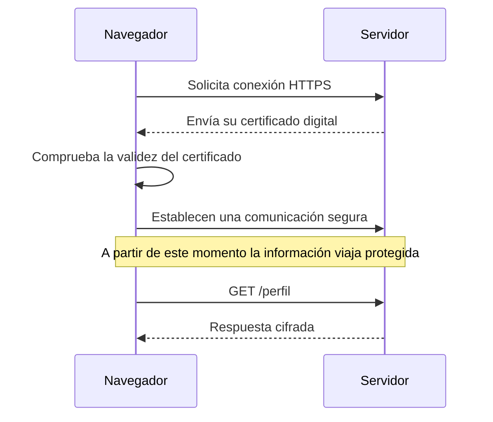
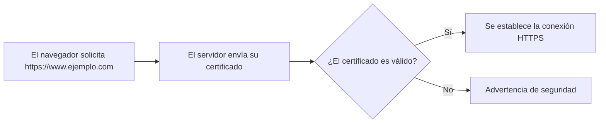
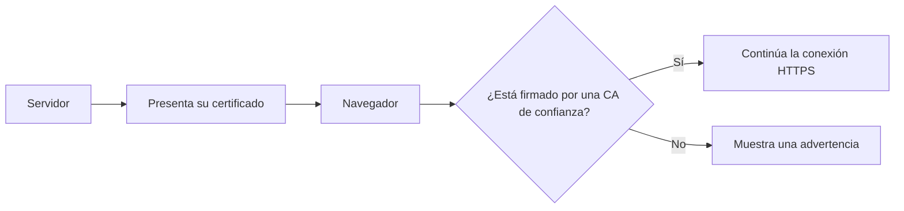

# HTTPS eta ziurtagiri digitalak

Aurreko kapituluetan ikasi dugu nola komunikatzen diren nabigatzailea eta zerbitzaria HTTP protokoloaren bidez, eta nola cookieek eta saioek web aplikazio baten egoera mantentzeko aukera ematen duten.

Hala ere, orain arte suposatu dugu komunikazio hori modu seguruan egiten dela. Zer gertatzen da hirugarren batek sarean bidaiatzen duen informazioa behatu edo alda badezake?

Aplikazio batek datu sentikorrak trukatzen dituenean —hala nola kredentzialak, informazio pertsonala edo banku-datuak—, ezinbestekoa da bezeroaren eta zerbitzariaren arteko komunikazioa babestea.

Arazo hori konpontzeko **HTTPS** erabiltzen da; HTTPri segurtasun-geruza bat eransten dion protokoloa da, zifratze- eta autentifikazio-tekniken bidez.

Kapitulu honetan aztertuko dugu zer arazo konpontzen dituen HTTPSk, nola funtzionatzen duen ikuspegi orokor batean, zer eginkizun duten ziurtagiri digitalek eta zergatik erabili behar duen garatzaile orok bere aplikazioetan.

---

## HTTPren arazoa

HTTP bezeroen eta zerbitzarien arteko komunikazioa sare batean errazteko diseinatu zen. Hala ere, jatorrizko bertsioan ez du transmititzen den informazioa babesteko mekanismorik txertatzen.

Horrek esan nahi du eskaerak eta erantzunak testu argian bidaiatzen direla. Nabigatzailearen eta zerbitzariaren artean kokatutako edozein gailuk, zenbait egoeratan, informazio hori irakurri edo are aldatu ere egin lezake.

Demagun erabiltzaile batek saioa hasten duela web aplikazio batean HTTP konexioa erabiliz.

```http
POST /login HTTP/1.1
Host: ejemplo.com

usuario=jgarcia
password=MiClave123
```

Komunikazio hori babestuta ez badago, sare-trafikorako sarbidea duen hirugarren batek erraz harrapa ditzake bai erabiltzaile-izena bai pasahitza.

Baina kredentzialak ez dira arriskuan gera daitezkeen datu sentikor bakarrak.

Web aplikazio batek honelako informazioa transmiti dezake:

- Datu pertsonalak.
- Helbide elektronikoak.
- Informazio medikoa.
- Banku-txartelen zenbakiak.
- Saio-cookieak.
- Dokumentu pribatuak.

Informazio hori guztia aurreikusitako hartzailearengana bakarrik iritsi beharko litzateke.

### Hiru arrisku nagusi

Aplikazio batek babesik gabeko HTTP erabiltzen duenean, oinarrizko hiru arazo agertzen dira.

#### Konfidentzialtasuna

Transmisioan zehar baimenik gabeko pertsonek informazioa irakur dezakete.

#### Osotasuna

Datuak helmugara iritsi aurretik alda daitezke, erabiltzaileak edo aplikazioak hori detektatu gabe.

Adibidez, erasotzaile batek erantzun baten edukia alda lezake edo esteka bat moldatu nabigatzailera iritsi aurretik.

#### Benetakotasuna

Nabigatzaileak ziur egon behar du benetan espero den zerbitzariarekin komunikatzen ari dela, eta ez haren itxura egin nahi duen zerbitzari faltsu batekin.

Autentifikazio-mekanismorik gabe, posible litzateke erabiltzailea engainatzea informazio sentikorra erasotzaile batek kontrolatutako zerbitzari batera bidal zezan.

!!! warning "HTTP ez da berez segurugabea"

    HTTPk komunikazio-protokolo gisa bere funtzioa ondo betetzen du.

    Arazoa agertzen da konfidentzialtasuna, osotasuna edo autentifikazioa behar duen informazioa transmititzeko erabiltzen denean.

Horregatik, aplikazio modernoek HTTPS erabiltzen dute nabigatzailearen eta zerbitzariaren arteko komunikazioak babesteko mekanismo gisa.

## Zer ematen du HTTPSk

HTTPS (**HyperText Transfer Protocol Secure**) HTTPren bertsio segurua da.

Ez du HTTP ordezkatzen; aitzitik, babes-geruza bat eransten dio, informazioa modu konfidentzialean trukatzeko eta komunikazioa ezartzen den zerbitzariaren identitatea egiaztatzeko.

Garatzailearen ikuspegitik, HTTPSk aurreko atalean planteatutako hiru arazoak konpontzen ditu.

### Konfidentzialtasuna

Nabigatzaileak eta zerbitzariak trukatzen duten informazioa zifratuta bidaiatzen da.

Horrek esan nahi du, hirugarren batek sare-trafikoa atzematea lortzen badu ere, ezin izango duela erraz haren edukia interpretatu.

Adibidez, honelako eskaera bat:

```http
POST /login HTTP/1.1

usuario=jgarcia
password=MiClave123
```

jadanik ez da testu irakurgarri gisa bidaiatzen, eta nabigatzaileak eta zerbitzariak bakarrik interpreta ditzaketen datu zifratu gisa transmititzen da.

### Osotasuna

HTTPSk bermatzen du informazioa ez dela aldatu transmisioan zehar.

Hirugarren batek eskaera edo erantzun bat aldatzen saiatuko balitz, nabigatzaileak detektatuko luke komunikazioak osotasuna galdu duela, eta jasotako datuak baztertuko lituzke.

Horrek eragozten du erasotzaile batek orri baten edukia aldatzea, estekak manipulatzea edo bezeroaren eta zerbitzariaren artean bidalitako informazioa aldatzea.

### Benetakotasuna

Komunikazioa babesteaz gain, HTTPSk egiaztatzeko aukera ematen du nabigatzailea zerbitzari egokira konektatuta dagoela.

Komunikazio segurua hasi aurretik, zerbitzariak bere identitatea egiaztatzen duen ziurtagiri digitala aurkezten du.

Nabigatzaileak ziurtagiri hori egiaztatzen du informazio sentikorra trukatu aurretik.

Prozesu horri esker, erabiltzaileak arrazoizko konfiantza izan dezake benetan espero den zerbitzariarekin ari dela komunikatzen, eta ez hura ordezkatu nahi duen beste batekin.

### Babestutako konexio bat

Prozesu orokorra honela labur daiteke.



Barruan prozesu honek mekanismo kriptografiko desberdinak erabiltzen baditu ere, garatzaile batentzat nahikoa da ideia orokorra ulertzea: informazio sentikorra trukatu aurretik, nabigatzaileak zerbitzariaren identitatea egiaztatzen du eta komunikaziorako kanal segurua ezartzen du.

!!! note "HTTPSk komunikazioa babesten du"

    HTTPSk ez du aplikazio bat automatikoki segurua bihurtzen.

    Haren funtzioa da informazioa babestea nabigatzailearen eta zerbitzariaren artean bidaiatzen duen bitartean. Aplikazioaren kodearen beraren segurtasuna, aldiz, nola diseinatu eta inplementatu denaren araberakoa izango da.

!!! example "Garatzailearen ikuspegitik"

    Gaur egun, autentifikazioa, datu pertsonalak edo informazio sentikorra kudeatzen duen edozein aplikaziok HTTPS erabili behar du hasieratik bertatik, bai probetan bai ekoizpenean.

## Zer da ziurtagiri digital bat

**Ziurtagiri digital** bat dokumentu elektroniko bat da, HTTPS konexio batean zerbitzari baten identitatea egiaztatzeko balio duena.

Nabigatzaile batek webgune batekin konexio segurua ezartzen duenean, zerbitzariaren lehen ekintzetako bat bere ziurtagiri digitala bidaltzea izaten da.

Ziurtagiri horrek informazioa dauka, nabigatzaileak egiaztatu ahal izan dezan zerbitzari egokiarekin komunikatzen ari dela, eta ez hura ordezkatu nahi duen beste batekin.

Beste datu batzuen artean, ziurtagiri batek normalean hau jasotzen du:

- Zein domeinurako jaulki den.
- Ziurtagiriaren jabearen identitatea.
- Zerbitzariaren gako publikoa.
- Baliozkotasun-aldia.
- Ziurtagiria jaulki duen erakundea.
- Haren benetakotasuna bermatzen duen sinadura digitala.

Barnean informazio kriptografikoa baduen arren, garatzaile batentzat garrantzitsuena haren funtzioa ulertzea da: **nabigatzaileak zerbitzariaren identitatea egiaztatzea, komunikazio segurua hasi aurretik.**

### Zer gertatzen da HTTPS gune batera sartzen garenean?

Erabiltzaile batek honelako helbide bat idazten duenean:

```text
https://www.ejemplo.com
```

nabigatzaileak HTTPS konexioa hasten du eta zerbitzariari bere ziurtagiri digitala eskatzen dio.

Ondoren, hainbat egiaztapen automatiko egiten ditu.

1. Ziurtagiria ez dela iraungi egiaztatzen du.
2. Domeinua eskatutako gunearekin bat datorrela egiaztatzen du.
3. Ziurtagiria konfiantzazko erakunde batek jaulki duela egiaztatzen du.
4. Ziurtagiriaren sinadura digitala baliozkoa dela egiaztatzen du.

Egiaztapen horiek guztiak zuzenak badira, nabigatzaileak konexio segurua ezartzen jarraitzen du.

Bestela, ohar bat erakusten du, zerbitzariaren identitatea ezin duela bermatu adieraziz.



### Nabigatzailearen giltzarrapoa

Egiaztapen guztiak egokiak direnean, nabigatzaileak helbide-barran giltzarrapoaren ikono ezaguna erakusten du.

Ikur horrek **ez du esan nahi aplikazioa guztiz segurua denik**.

Honako hau bakarrik adierazten du:

- Komunikazioa HTTPS bidez babestuta dagoela.
- Zerbitzariaren identitatea baliozko ziurtagiri baten bidez egiaztatu dela.

Aplikazio batek HTTPS erabil dezake eta, hala ere, programazio-erroreak edo segurtasun-ahuleziak izan.

!!! note "Ziurtagiriak zerbitzaria identifikatzen du"

    Ziurtagiri digitalak ez du aplikazioa berez babesten.

    Haren funtzioa da zerbitzariaren identitatea frogatzea eta komunikazio segurua ezartzea ahalbidetzea.

!!! example "Garatzailearen ikuspegitik"

    Aplikazio bat Interneten argitaratzen dugunean, baliozko ziurtagiri digital bat instalatzea argitalpen-prozesuaren funtsezko zatia da.

    Hura gabe, nabigatzaile modernoek erabiltzaileari ohartaraziko diote zerbitzariaren identitatea ezin dela behar bezala egiaztatu.
## Ziurtapen-agintaritzak

Ziurtagiri digital bat erabilgarria izateko, harengan konfiantza izatea ahalbidetzen duen mekanismo bat egon behar da.

Pentsa dezagun eguneroko egoera batean. Edonork inprima dezake "Ni naiz esaten dudana" dioen dokumentu bat, baina dokumentu horrek ez du baliorik izango babesten duen konfiantzazko erakunderik ez badago.

Ziurtagiri digitalekin antzeko zerbait gertatzen da.

**Ziurtapen Agintaritzak** (*Certification Authorities* edo **CA**) ziurtagiri digitalak jaulkitzeaz eta eskatzen dituenaren identitatea egiaztatzeaz arduratzen diren erakundeak dira.

CA batek ziurtagiri bat jaulkitzen duenean, digitalki sinatzen du. Sinadura horri esker, nabigatzaileak egiaztatu dezake ziurtagiria aldez aurretik fidatzen den erakunde batek jaulki duela.

### Zergatik fidatzen da nabigatzailea?

Nabigatzaile nagusiek fidagarritzat jotzen diren Ziurtapen Agintaritzen zerrenda bat txertatzen dute.

HTTPS konexio batean ziurtagiri bat jasotzen dutenean, erakunde horietako batek sinatu duen egiaztatzen dute.

Erantzuna baiezkoa bada eta gainerako egiaztapenak ere zuzenak badira, konexioak normaltasunez jarraitzen du.

Bestela, nabigatzaileak ohartarazpen bat erakusten du, zerbitzariaren identitatea ezin duela bermatu adieraziz.



### Autosinatutako ziurtagiriak

Aplikazio baten garapenean ohikoa da **autosinaturiko ziurtagiriak** erabiltzea.

Kasu honetan, garatzaileak berak sortu eta sinatzen du ziurtagiria, Ziurtapen Agintaritza batera jo gabe.

Teknikoki konexio zifratu bat ezartzeko balio badute ere, nabigatzaileek ezin dute haien benetakotasuna egiaztatu, eta horregatik segurtasun-ohartarazpena erakusten dute.

Ziurtagiri mota hauek erabilgarriak dira garapen- edo laborategi-inguruneetan, baina ez lirateke aplikazio publikoetan erabili behar.

### Ziurtagiriak ekoizpenean

Aplikazio bat Interneten argitaratzera doanean, beharrezkoa da Ziurtapen Agintaritza aitortu batek jaulkitako ziurtagiri bat instalatzea.

Gaur egun, ziurtagiri doakoak ematen dituzten erakundeak daude, **Let's Encrypt** adibidez; horri esker, ia edozein webgunek HTTPS erabil dezake kostu ekonomikorik gabe.

Garatzailearen ikuspegitik, garrantzitsuena gogoratzea da argitaratutako aplikazio batek beti eskaini beharko lukeela HTTPS konexioa, baliozko ziurtagiri batekin.

!!! note "Erakunde jaulkitzaileaz fidatzen gara"

    Nabigatzaileak ez du aldez aurretik ezagutzen komunikatzen den zerbitzaria.

    Ezagutzen duena eta fidatzen dena ziurtagiria jaulki eta sinatu duen Ziurtapen Agintaritza da.

!!! example "Garatzailearen ikuspegitik"

    Garapenean, normala da autosinatutako ziurtagiriekin lan egitea eta nabigatzailearen ohartarazpena onartzea.

    Hala ere, aplikazio bat ekoizpenean zabaldu aurretik, aitortutako Ziurtapen Agintaritza batek jaulkitako ziurtagiri bat instalatu behar da.

## Zer aldatzen da garatzailearentzat

HTTPS nola funtzionatzen duen ulertzea garrantzitsua da, baina modulu honen helburua ez da komunikazio-protokoloak diseinatzea, web aplikazio seguruak garatzea baizik.

Ikuspegi horretatik, HTTPS erabiltzea aukera izateari uzten dio eta edozein aplikazio modernoren oinarrizko eskakizun bihurtzen da.

### HTTPS hasieratik erabiltzea

Aplikazio baten garapenean, gomendagarria da ahal den guztietan beti HTTPS erabiliz lan egitea.

Horrela, garapen-ingurunea ekoizpen-ingurunera hurbiltzen da, eta lehenago antzeman daitezke cookieen, saioen edo autentifikazioaren konfigurazioarekin lotutako arazo batzuk.

Framework moderno askok HTTPSrekin tokiko inguruneak erraz konfiguratzeko aukera ematen dute, garapen-ziurtagirien bidez.

### Autentifikazioa babestea

Sarbide-kredentzialak ez lirateke inoiz HTTP bidez transmititu behar.

Erabiltzaile batek bere erabiltzaile-izena eta pasahitza sartzen dituenean, informazio horrek beti HTTPS konexio baten bidez bidaiatu behar du.

Gauza bera gertatzen da erregistro-formularioekin, pasahitza berreskuratzeko formularioekin edo datu pertsonalak aldatzeko formularioekin.

### Saio-cookieak babestea

Aurreko kapituluan ikusi genuen bezala, saio-cookieek erabiltzailea identifikatzen dute aplikazioarekin duen interakzioan zehar.

Cookie horiek HTTP bidez bidaiatuko balute, hirugarren batek atzeman ahal izango lituzke.

Horregatik, aplikazio modernoek HTTPS erabiltzen dute **Secure** atributuarekin batera, saio-cookieak konexio zifratuen bidez bakarrik transmititzeko.

### APIak babestea

Egungo aplikazioek API RESTekin komunikatu ohi dute, zerbitzu desberdinen artean informazioa trukatzeko.

API horiek datu pertsonalak, kredentzialak edo informazio sentikorra kudeatzen dituztenean, HTTPS ere erabili behar dute.

Eskakizun hori programazio-lengoaiatik edo erabilitako frameworketik independentea da.

### HTTPSk ez du garapen segurua ordezkatzen

Garrantzitsua da gogoratzea HTTPSk nabigatzailearen eta zerbitzariaren arteko komunikazioa bakarrik babesten duela.

Ez ditu saihesten programazio-erroreak, kodeko ahuleziak edo aplikazioaren konfigurazio okerrak.

Adibidez, aplikazio batek HTTPS erabil dezake eta oraindik ere honelako erasoen aurrean ahula izan:

- Cross-Site Scripting (XSS).
- SQL injekzioa.
- Cross-Site Request Forgery (CSRF).
- Sarbide-kontrol eskasa.
- Datuen balioztapen okerra.

HTTPS garapen seguruaren funtsezko zatia da, baina ez ditu ordezkatzen ikastaroan zehar aztertuko ditugun gainerako babes-neurriak.

!!! note "HTTPS oinarrizko eskakizuna da"

    Gaur egun, praktika egokitzat jotzen da HTTPS erabiltzea edozein web aplikaziotan, informazio bereziki sentikorrik kudeatu ez arren.

    Segurtasuna hobetzeaz gain, nabigatzaile askok zenbait funtzionaltasun mugatzen dituzte aplikazio batek konexio segururik erabiltzen ez duenean.

!!! example "Garatzailearen ikuspegitik"

    Modulu honetan garatutako proiektuetan, inguruneak ahalbidetzen duenean, beti HTTPS erabiliz lan egingo dugu.

    Praktika horrek erraztuko du hurrengo blokeetan agertuko diren beste segurtasun-mekanismo batzuk ulertzea.

    ---

## Gogoratzeko

HTTPk nabigatzailearen eta zerbitzariaren arteko komunikazioa ahalbidetzen du, baina ez du transmititzen den informazioa babesten.

HTTPSk segurtasun-geruza bat eransten du, komunikazioaren konfidentzialtasuna, osotasuna eta benetakotasuna bermatuz, teknika kriptografikoak eta ziurtagiri digitalak erabiliz.

Ziurtagiriek zerbitzariaren identitatea egiaztatzeko aukera ematen dute, eta Ziurtapen Agintaritzek nabigatzaileak ziurtagiri horiek balioztatu ahal izateko behar den konfiantza-maila ematen dute.

Garatzaile batentzat, HTTPS erabiltzea web aplikazio seguruak eraikitzeko lehen eskakizunetako bat da, nahiz eta beti osatu behar den gainerako segurtasun-mekanismoen inplementazio zuzenarekin.

---

## Ideia nagusiak

- HTTPk informazioa babesik gabe transmititzen du.
- HTTPSk nabigatzailearen eta zerbitzariaren arteko komunikazioa babesten du.
- HTTPSk konfidentzialtasuna, osotasuna eta benetakotasuna ematen ditu.
- Ziurtagiri digitalek zerbitzariaren identitatea egiaztatzea ahalbidetzen dute.
- Ziurtapen Agintaritzek ziurtagiriak balioztatu eta sinatzen dituzte.
- Autosinatutako ziurtagiriak erabilgarriak dira garapenerako, baina ez ekoizpenerako.
- HTTPSk komunikazioa babesten du, baina ez ditu aplikazioaren ahuleziak ezabatzen.
- Web aplikazio moderno orok HTTPS erabili beharko luke.

---

## Nabigazioa

**Aurreko orria:** [Cookies, sesiones y gestión del estado](4.cookies-sesiones.md)

**Hurrengo orria:** [Herramientas de análisis web](6.herramientas-analisis-web.md)

**Itzuli blokearen aurkibidera:** [Fundamentos del desarrollo web seguro](index.md)
