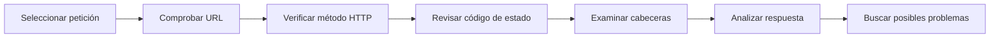
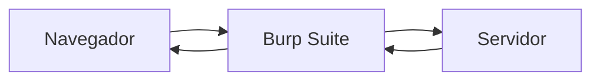

# Web analisi-tresnak

Aurreko kapituluetan aztertu dugu nola komunikatzen diren nabigatzailea eta zerbitzaria, nola mantentzen den egoera cookieen eta saioen bidez, eta nola babesten duen HTTPSk informazioa komunikazioan zehar.

Hala ere, garatzaile batek ezin du mekanismo horiek ikuspegi teorikotik bakarrik ezagutzera mugatu. Era berean, egiaztatu behar du bere aplikazioak espero duen bezala jokatzen duela, eta eskaera batean benetan zer gertatzen den interpretatzeko gai izan behar du.

Horretarako, analisi-tresna desberdinak daude; bezeroaren eta zerbitzariaren arteko komunikazioa behatzeko, cookieak ikuskatzeko, HTTP erantzunak aztertzeko eta garapenean zehar ager daitezkeen arazoak detektatzeko aukera ematen dute.

Kapitulu honetan web garatzaile batek gehien erabiltzen dituen tresnak ezagutuko ditugu, eta ikasiko dugu nola erabili garapen- eta arazketa-prozesuaren ohiko zati gisa.

---

## Zergatik aztertu web aplikazio bat?

Aplikazio bat garatzen dugunean, normalean idazten dugun kodean pentsatzen dugu.

Hala ere, lanaren zati garrantzitsu bat da kode horrek espero den portaera zehatza sortzen duela egiaztatzea.

Adibidez, garatzaile batek honelako galderei erantzun behar izan diezaieke:

- Zer HTTP eskaera bidali du oraintxe nabigatzaileak?
- Zer erantzun itzuli du zerbitzariak?
- Saio-cookiea ondo bidali al da?
- Zer HTTP egoera-kode jaso da?
- Zenbat denbora behar izan du erantzunak?
- Zergatik itzultzen du eskaera batek 403 edo 500 errorea?

Galdera horiei kodea bakarrik irakurriz erantzutea zaila izaten da.

Analisi-tresnek nabigatzailearen eta zerbitzariaren arteko komunikazioa zuzenean behatzeko aukera ematen dute; horri esker, errazagoa da erroreak aurkitzea eta aplikazio baten barne-funtzionamendua ulertzea.

### Aztertzea garapenaren parte da

Analisiak ez dira segurtasuneko adituentzat edo sistemetako administratzaileentzat bakarrik gordetako jarduera gisa ulertu behar.

Edozein garatzaileren eguneroko lanaren parte da.

Garapenean zehar ohikoa da eskaerak ikuskatzea, HTTP goiburuak berrikustea, cookieak egiaztatzea edo erantzunak aztertzea aplikazioak behar bezala funtzionatzen duela baieztatzeko.

Arazo bat zenbat eta lehenago detektatu, orduan eta errazago zuzentzen da.

!!! note "Behatu, aldatu aurretik"

    Gorabehera asko konpon daitezke, besterik gabe, nabigatzaileak eta zerbitzariak benetan zer informazio trukatzen duten behatuz.

    Kodea aldatu aurretik, komeni da komunikazioan zer gertatzen ari den egiaztatzea.

!!! example "Garatzailearen ikuspegitik"

    Analisi-tresnek aplikazio baten benetako portaera ulertzeko aukera ematen dute, eta ebidentzietan oinarritutako erabakiak hartzen laguntzen dute, ez suposizioetan.

## Nabigatzailearen garapen-tresnak

Nabigatzaile modernoek web orri baten barne-funtzionamendua ikuskatzeko aukera ematen duten garapen-tresnen multzoa txertatzen dute.

Tresna horiek, normalean **DevTools** (*Developer Tools*) izenez ezagutzen direnak, edozein web garatzaileren eguneroko lanaren parte dira.

Funtzionalitate ugari eskaintzen dituzten arren, modulu honetan batez ere nabigatzailearen eta zerbitzariaren arteko komunikazioarekin lotutakoak erabiliko ditugu.

Nabigatzaile gehienetan **F12** tekla sakatuta edo testuinguru-menuko **Inspeccionar** aukeraren bidez ireki daitezke.

### Gehien erabiltzen diren fitxak

DevTools-ek fitxa asko dituzte, baina gutxi batzuek biltzen dute garapen-lanaren zatirik handiena.

| Pestaña | Utilidad principal |
|----------|--------------------|
| **Elements** | HTML egitura eta CSS estiloak ikuskatu eta aldatzea. |
| **Console** | Mezuak eta erroreak erakutsi, eta JavaScript aginduak exekutatzea. |
| **Network** | HTTP eskaerak eta erantzunak aztertzea. |
| **Application** (Chrome) / **Storage** (Firefox) | Cookieak, biltegiratze lokala eta nabigatzaileko bestelako datuak ikuskatu. |

Modulu honetan batez ere **Network** eta **Application** fitxak erabiliko ditugu; izan ere, aurreko kapituluetan aztertutako mekanismo asko zuzenean behatzeko aukera ematen dute.

### DevTools ikaskuntza-tresna gisa

Garapen-tresnek ez dute erroreak aurkitzeko bakarrik balio.

Aplikazio web batek exekuzioan dagoen bitartean nola funtzionatzen duen ulertzeko ere balio dute.

Adibidez, haiekin honako hauek behatu ahal izango ditugu:

- Zer baliabide eskatzen dituen nabigatzaileak.
- Zer HTTP goiburu trukatzen diren.
- Zer egoera-kode itzultzen duen zerbitzariak.
- Zer cookie sortzen diren saioa hastean.
- Zenbat denbora behar duen eskaera bakoitzak.
- API batek zer informazio itzultzen duen.

Behaketa-gaitasun hori bereziki erabilgarria da ikaskuntzan, kontzeptu teorikoak aplikazio baten benetako portaerarekin lotzeko aukera ematen baitu.

!!! note "Ezinbesteko tresna bat"

    DevTools tresnak edozein web garatzaileren ohiko lan-ingurunearen parte dira.

    Horiek ondo erabiltzen ikastea programazio-lengoaia edo erabilitako frameworka ezagutzea bezain garrantzitsua da.

!!! example "Garatzailearen ikuspegitik"

    Modulu honetan DevTools etengabe erabiliko ditugu erronketan garatutako aplikazioen funtzionamendua egiaztatzeko eta nabigatzailearen eta zerbitzariaren arteko komunikazioa espero dugun bezala gertatzen dela baieztatzeko.

## HTTP eskaera bat aztertzen

Garapen-tresnetako **Network** fitxak nabigatzaileak web aplikazio batekin elkarreraginean egiten dituen eskaera guztiak behatzeko aukera ematen du.

Orri bat kargatzen den bakoitzean, formulario bat bidaltzen denean edo API bat kontsultatzen denean, sarrera berri bat agertzen da komunikazio horri buruzko informazio xehatuarekin.

Tresna hau bereziki erabilgarria da aplikazio bat espero dugun bezala dabilen egiaztatzeko edo arazo baten jatorria aurkitzeko.

### Zer informazio ematen du eskaera batek

**Network** fitxan eskaera bat hautatzean, honelako informazioa kontsulta dezakegu:

- Eskatutako URLa.
- Erabilitako HTTP metodoa.
- Zerbitzariak itzulitako egoera-kodea.
- Eskaeraren eta erantzunaren HTTP goiburuak.
- Zerbitzarira bidalitako edukia.
- Erantzun gisa jasotako edukia.
- Komunikazioa osatzeko behar izan den denbora.

Informazio horrek guztiz zehaztasunez ulertzeko aukera ematen du nabigatzailearen eta zerbitzariaren artean zer gertatzen den.

### Adibide bat

Demagun erabiltzaile bat aplikazio baten orri nagusira sartzen dela.

**Network** fitxak honelako eskaera bat erakuts lezake:

```text
Nombre        Método   Estado   Tipo
------------------------------------------
index.html    GET      200      document
styles.css    GET      200      stylesheet
app.js        GET      200      script
logo.png      GET      200      image
```

Informazio horretatik egiaztatu dezakegu:

- Orri nagusia behar bezala kargatu dela.
- CSS eta JavaScript fitxategiak errorerik gabe deskargatu direla.
- Irudiak ere behar bezala jaso direla.
- Ez dela karga-errorea duen baliabiderik ageri.

### Eskaera bat pausoz pauso aztertzen

Eskaera zehatz bat hautatzen dugunean, analisi-prozesu txiki bat jarrai dezakegu.

1. Eskatutako URLa egiaztatu.
2. Erabilitako HTTP metodoa baieztatu.
3. Erantzunaren egoera-kodea berrikusi.
4. HTTP goiburuak aztertu.
5. Bidalitako eta jasotako edukia aztertu.
6. Eskaerak behar izan duen denbora egiaztatu.

Prozedura hau erabilgarria da bai erroreak aurkitzeko bai aplikazio baten barne-funtzionamendua ulertzeko.



### Teoria eta praktika lotzen

Aurreko kapituluetan HTTP, cookieak, saioak eta HTTPS bezalako kontzeptuak aztertu ditugu.

**Network** fitxak mekanismo horiek guztiak zuzenean behatzeko aukera ematen du.

Adibidez, honako hauek egiaztatu ahal izango ditugu:

- Eskaera bakoitzak zer HTTP metodo erabiltzen duen.
- Zerbitzariak zer egoera-kode itzultzen duen.
- Zer HTTP goiburu trukatzen diren.
- Komunikazioak HTTP edo HTTPS erabiltzen duen.
- Nabigatzaileak eskaerarekin batera cookieak bidaltzen dituen.

Horrela, teoria kontzeptu abstraktuen multzo hutsa izateari uzten dio, eta aplikazio baten exekuzioan behatu daitekeen informazio bihurtzen da.

!!! note "Eskaera guztiak ez dira web orriei dagozkienak"

    Orri moderno batek eskaera osagarri ugari egin ohi ditu irudiak, estilo-orriak, JavaScript fitxategiak kargatzeko edo APIak kontsultatzeko.

    **Network** fitxak horiek guztiak banaka aztertzeko aukera ematen du.

!!! example "Garatzailearen ikuspegitik"

    Aplikazio batek espero genuen bezala funtzionatzen ez duenean, lehen ekintzetako bat **Network** fitxa irekitzea eta zer eskaera egin diren eta zer erantzun itzuli dituen zerbitzariak egiaztatzea da.

## Cookieak eta saioak behatzen

Aurreko kapituluan ikasi genuen cookieek eta saioek web aplikazio baten egoera mantentzeko aukera ematen dutela HTTP eskaera desberdinen artean.

Nabigatzailearen garapen-tresnek mekanismo horiek nola funtzionatzen duten zuzenean egiaztatzeko aukera ematen dute, eta nabigatzaileak webgune bakoitzerako gordetzen duen informazioa behatzeko.

Chrome eta Microsoft Edgen, informazio hori **Application** fitxatik kontsulta daiteke; Firefoxek, berriz, funtzionalitate baliokideak eskaintzen ditu **Storage** fitxan.

### Cookieak ikuskatzeko

Garapen-tresnen barruan **Cookies** atala hautatzean, nabigatzaileak uneko webguneari lotutako cookie guztiak erakusten ditu.

Cookie bakoitza hainbat atributurekin agertzen da, adibidez:

- Izena.
- Balioa.
- Domeinua.
- Bidea (*Path*).
- Iraungitze-data.
- **Secure** adierazlea.
- **HttpOnly** adierazlea.
- **SameSite** adierazlea.

Informazio horrek aplikazioak erabiltzailearen identifikazioa nola kudeatzen duen egiaztatzeko aukera ematen du, eta cookieak behar bezala konfiguratu diren baieztatzeko balio du.

> **Aquí insertaremos la Figura 4: Cookies almacenadas por el navegador.**

### Cookieak saioekin lotzen

Erabiltzaile batek aplikazio batean saioa hasten duenean, ohikoa da honako hauetako baten antzeko cookie bat agertzea:

```text
PHPSESSID

laravel_session

JSESSIONID

ASP.NET_SessionId
```

Izena erabilitako teknologiaren araberakoa den arren, denek oso antzeko funtzioa betetzen dute: zerbitzariari dagokion saioa berreskuratzeko aukera emango dion identifikatzailea gordetzea.

Garrantzitsua da gogoratzea **saioa ez dagoela nabigatzailean gordeta**.

Nabigatzaileak saio-identifikatzailea bakarrik gordetzen du cookie baten bidez. Erabiltzaileari lotutako informazio guztia zerbitzarian gordetzen da.

Behaketa honek aukera ematen du aurreko kapituluan aztertutako kontzeptu garrantzitsuenetako bat praktikan egiaztatzeko.

### Segurtasun-atributuak egiaztatzen

Saioaren identifikatzaileaz gain, garapen-tresnek aukera ematen dute cookieek hainbat babes-mekanismo behar bezala erabiltzen dituzten egiaztatzeko.

Adibidez, egiaztatu ahal izango dugu cookie batek:

- HTTPS bidez bakarrik transmititzen den (**Secure**).
- JavaScripttik atzitu ezin den (**HttpOnly**).
- Beste webgune batzuetara bidalketa mugatzen duen **SameSite** bidez.

Egiaztapen horiek bereziki erabilgarriak dira autentifikazioa edo informazio sentikorra kudeatzen duten aplikazioen garapenean.

### Aplikazioa hobeto ulertzeko tresna bat

Cookieak ikuskatzekoak ez du erroreak aurkitzeko bakarrik balio.

Era berean, lagungarria da ulertzeko nola mantentzen duen aplikazio batek erabiltzailearen identitatea eskaera desberdinen artean eta nola inplementatzen dituen autentifikazio-mekanismoak.

Informazio hori **Network** fitxarekin lotzeak eskaera baten ibilbide osoa jarraitzeko aukera ematen du: nabigatzaileak cookiea bidaltzen duenetik zerbitzariak sortutako erantzunera arte.

!!! note "Saioak ez dira nabigatzailean agertzen"

    Garapen-tresnek nabigatzaileak gordetako cookieak erakusten dituzte, baina ez saioen edukia.

    Saioaren informazioa beti zerbitzarian geratzen da, eta aplikazio beretik bakarrik da eskuragarria.

!!! example "Garatzailearen ikuspegitik"

    Garapen-tresnen bidez cookieak egiaztatzea modu azkarra da autentifikazioak ondo funtzionatzen duela eta segurtasun-atributuak aurreikusitako moduan konfiguratu direla baieztatzeko.

## Sare-trafikoa aztertzen

Nabigatzailearen garapen-tresnek komunikazioa nabigatzailearen beraren ikuspegitik behatzeko aukera ematen dute.

Hala ere, sare batean benetan zirkulatzen duen trafikoa aztertzeko gai diren tresnak ere badaude.

Ezagunenetako bat **Wireshark** da, protokoloen analizatzaile bat, garatzaileek ez ezik sistemetako administratzaileek, sare-ingeniariek eta segurtasun-espezialistek ere erabiltzen dutena.

Haren funtzioa da sare-interfaze batetik zirkulatzen duten paketeak harrapatzea eta haietan dagoen informazioa erakustea.

### Zer beha daiteke Wiresharkekin?

Wiresharkek komunikazio-protokolo ugari aztertzeko aukera ematen du.

Modulu honen testuinguruan, bereziki interesgarria da honako hau egiaztatzea:

- HTTP eta HTTPS konexioak.
- DNS eskaerak.
- TCP konexioen ezarpena.
- Bezeroaren eta zerbitzariaren arteko pakete-trukea.

Informazio honek datuak sarean benetan nola bidaiatzen duten ulertzen laguntzen du.

### HTTP eta HTTPSen arteko aldea

Demostrazio argigarrienetako bat HTTP konexio bat eta HTTPS konexio bat alderatzea da.

Aplikazio batek HTTP erabiltzen duenean, transmititutako informazioaren zati handi bat zuzenean beha daiteke sare-kapturan.

Adibidez, honako hauek identifika daitezke:

- Eskatutako URLa.
- HTTP goiburuak.
- Eskaera eta erantzun askoren edukia.
- Formularioen bidez bidalitako informazioa.

Aitzitik, aplikazioak HTTPS erabiltzen duenean, komunikazioaren edukia zifratuta agertzen da.

Datu tekniko jakin batzuk ikusgai izaten jarraitzen duten arren —IP helbideak edo konexioaren ezarpena, adibidez—, nabigatzailearen eta zerbitzariaren artean trukatutako edukia ezin da zuzenean interpretatu.

> **Aquí insertaremos la Figura 5: Captura de tráfico HTTP con Wireshark.**

> **Aquí insertaremos la Figura 6: Captura de tráfico HTTPS con Wireshark.**

Bi kapturak alderatzeak berehala ulertzeko aukera ematen du zergatik den hain garrantzitsua HTTPS erabiltzea informazio sentikorra kudeatzen duten aplikazioetan.

### Wireshark ikaskuntza-tresna gisa

Modulu honetan ez dugu Wireshark erabiliko auditoretzak egiteko edo sareen analisi aurreratuak egiteko.

Helburua izango da web aplikazioak benetan nola komunikatzen diren ikusarazten laguntzea eta aurreko kapituluetan aztertutako kontzeptuak indartzea.

HTTP eta HTTPS trafikoa zuzenean behatzeak errazten du ulertzea zergatik den komunikazioen babesa web garapen segururako oinarrizko eskakizuna.

!!! note "Beste ikuspegi bat"

    Garapen-tresnek komunikazioa nabigatzailearen ikuspegitik erakusten duten bitartean, Wiresharkek trafikoa sarearen ikuspegitik behatzeko aukera ematen du.

    Bi tresnek informazio osagarria eskaintzen dute.

!!! example "Garatzailearen ikuspegitik"

    Laborategiko ingurune batean Wireshark erabiltzeak bezeroaren eta zerbitzariaren artean informazioa nola bidaiatzen duen ulertzen laguntzen du, eta zergatik den HTTPS ezinbestekoa aplikazio modernoetan.

## Beste analisi-tresna batzuk

Nabigatzailean integratutako tresnez eta Wireshark bezalako trafiko-analizatzaileez gain, badira nabigatzailearen eta zerbitzariaren arteko komunikazioa ikuskatzeko aplikazio espezializatuak.

Ezagunenetako bat **Burp Suite** da, web aplikazioen garapenean, segurtasun-probetan eta auditoretzetan oso erabilia den tresna.

Haren funtzionamendua nabigatzailearen eta zerbitzariaren artean **proxy** gisa jardutean oinarritzen da.

Aplikazioarekin zuzenean komunikatu beharrean, nabigatzaileak eskaerak Burp Suitera bidaltzen ditu. Tresnak jasotzen ditu, garatzaileari erakusten dizkio, eta ondoren zerbitzarira birbidaltzen ditu.

Modu berean, zerbitzariaren erantzunak ere Burp Suitetik pasatzen dira nabigatzailera iritsi aurretik.



Funtzionamendu horri esker, HTTP eskaerak eta erantzunak xehetasunez behatu daitezke, trukatutako goiburuak egiaztatu, edo aplikazio batek exekuzioan zehar nola jokatzen duen aztertu.

### Zertarako erabil dezake garatzaile batek?

Burp Suitek funtzionalitate aurreratu ugari dituen arren, modulu honetan web aplikazio baten funtzionamendua ulertzearekin lotutakoak interesatzen zaizkigu bereziki.

Adibidez, aukera ematen du:

- HTTP eta HTTPS eskaerak behatzeko.
- Nabigatzaileak bidalitako goiburuak aztertzeko.
- Zerbitzariaren erantzunak ikuskatzeko.
- Bezeroaren eta zerbitzariaren arteko informazio-trukea ulertzeko.
- Formularioen eta APIen funtzionamendua egiaztatzeko.

Zeregin horiek erabilgarriak dira garapenean, eta aplikazio baten portaera hobeto ulertzen laguntzen dute.

### Lehen kontaktu bat

Modulu honetan Burp Suite Community Edition-en oinarrizko funtzionalitate batzuk bakarrik erabiliko ditugu, helburu didaktikoekin.

Helburua ez da teknika erasokorrak ikastea edo segurtasun-auditoretzak egitea; baizik eta nabigatzailearen eta zerbitzariaren artean informazioa nola zirkulatzen duen ulertzea, eta web aplikazio baten komunikazioak nola azter daitezkeen ikustea.

!!! note "Asko erabiltzen den tresna bat"

    Burp Suite erreferentziazko tresna da web aplikazioen garapenaren eta segurtasunaren arloan.

    Modulu honetan behaketa- eta ikaskuntza-tresna gisa erabiliko dugu.

!!! example "Garatzailearen ikuspegitik"

    Aplikazio baten kodea aldatu aurretik, erabilgarria da HTTP eskaerak eta erantzunak benetan nola trukatzen diren behatzea. Burp Suite bezalako tresnek analisi-prozesu hori errazten dute.

## Zein tresna erabili?

| Herramienta | ¿Qué permite observar? | Uso habitual |
|--------------|------------------------|--------------|
| **DevTools** | HTML, CSS, JavaScript, HTTP eskaerak, cookieak | Eguneroko garapena |
| **Wireshark** | Sare-trafikoa eta protokoloak | Komunikazioen analisia |
| **Burp Suite** | HTTP/HTTPS eskaerak eta erantzunak | Garapena, arazketa eta aplikazio-probak |

## Zer aldatzen da garatzailearentzat

Analisi-tresnak edozein web garatzaileren eguneroko lanaren parte dira.

Ez dira errorea agertzen denean bakarrik erabiltzen. Aplikazio bat behar bezala jokatzen duela egiaztatzeko, nabigatzailearen eta zerbitzariaren arteko komunikazioa baieztatzeko eta diseinu-erabakiak aurreikusitako moduan inplementatu direla egiaztatzeko ere balio dute.

Modulu honetan zehar tresna horiek ohiko moduan erabiliko ditugu erronketan garatutako aplikazioen funtzionamendua behatzeko.

Adibidez, honako hauek egiaztatu ahal izango ditugu:

- Aplikazio batek zer eskaera egiten dituen orri bat kargatzean.
- Zer erantzun itzultzen dituen zerbitzariak.
- Nola bidaltzen diren saio-cookieak.
- Komunikazioak HTTPS erabiltzen duen.
- Nabigatzaileak eta API batek zer informazio trukatzen duten.
- HTTP egoera-kode nagusiak nola interpretatu.

Ikuspegi horrek behaketan eta egiaztapenean oinarritutako lan-modua garatzea ahalbidetuko du, erabakiak iturburu-kodean bakarrik oinarrituta hartzea saihestuz.

Denborarekin, analisi-tresnak kontsultatzea kodea idaztea edo araztaile bat erabiltzea bezain ohiko praktika bihurtuko da.

!!! note "Behatu, zuzendu aurretik"

    Aplikazio batek behar bezala funtzionatzen ez duenean, gomendagarria da lehenik nabigatzailearen eta zerbitzariaren arteko komunikazioan zer gertatzen den egiaztatzea.

    Askotan, arazoa aurkitzeko behar den informazioa analisi-tresnetan bertan dago eskuragarri.

!!! example "Garatzailearen ikuspegitik"

    Garatzaile batek ez du HTTP goiburu guztiak edo egoera-kode guztiak buruz ikasi behar.

    Garrantzitsuena da tresna egokiak erabiltzen jakitea informazio hori behar denean eskuratzeko.

---

## Gogoratzeko

Analisi-tresnek web aplikazio baten benetako portaera behatzeko aukera ematen dute martxan dagoen bitartean.

Nabigatzailearen DevTools tresnek HTTP eskaeren analisia, zerbitzariaren erantzunak, cookieak eta eguneroko garapenarekin lotutako beste elementu batzuk aztertzea errazten dute.

Wiresharkek sarean zirkulatzen duen trafikoaren ikuspegia eskaintzen du, eta HTTP komunikazio baten eta HTTPS bidez babestutako beste baten arteko aldea ulertzeko aukera ematen du.

Burp Suitek bitartekari gisa jarduten du nabigatzailearen eta zerbitzariaren artean, eta oso modu erabilgarria ematen du garapenean eta probetan zehar HTTP komunikazioa ikuskatzeko.

Tresna horiek erabiltzen ikasteak aplikazio baten funtzionamendua hobeto ulertzeko eta arazoak azkarrago aurkitzeko aukera ematen du.

---

## Ideia nagusiak

- Analisi-tresnek web aplikazio baten benetako portaera behatzeko aukera ematen dute.
- DevTools tresnak edozein garatzaileren ohiko lan-ingurunearen parte dira.
- **Network** fitxak HTTP eskaerak eta erantzunak aztertzeko aukera ematen du.
- **Application** edo **Storage** fitxak nabigatzaileak gordetako cookieak ikuskatzeko aukera ematen du.
- Wiresharkek sare-trafikoa erakusten du, eta HTTP eta HTTPS komunikazioak alderatzeko aukera ematen du.
- Burp Suitek nabigatzailearen eta zerbitzariaren arteko komunikazioa aztertzea errazten du.
- Aplikazio bat behatzea garapen-prozesuaren funtsezko zatia da.

---

## Nabigazioa

**Aurreko orria:** [HTTPS y certificados digitales](5.https-certificados.md)

**Hurrengo orria:** [Resumen del bloque](7.resumen.md)

**Itzuli blokearen aurkibidera:** [Fundamentos del desarrollo web seguro](index.md)
