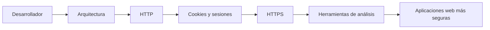

# Blokearen laburpena

Bloke honetan zehar, web garapen seguruaren ikuspegi orokor bat eraiki dugu garatzaile baten ikuspegitik.

Mekanismo isolatuak aztertzea baino gehiago, helburua izan da ulertzea nola komunikatzen diren web aplikazioak, nola mantentzen duten egoera, nola babesten duten informazioa eta zer tresnek ahalbidetzen duten haien funtzionamendua aztertzea.

Ezagutza horiek dira moduluaren hurrengo blokeak oinarrituko diren oinarria.

---

## Zer ikasi dugu

Bloke honetan zehar web aplikazio moderno baten funtzionamenduan parte hartzen duten funtsezko kontzeptuak landu ditugu.

Lehenik eta behin, ulertu dugu aplikazio seguruak garatzea ez dela soilik ahuleziak zuzentzea, baizik eta segurtasun-irizpideak softwarearen bizi-ziklo osoan txertatzea.

Ondoren, web aplikazio baten oinarrizko arkitektura eta eskaera batean nabigatzaileak, zerbitzariak eta datu-baseek betetzen duten rola aztertu ditugu.

Gero, HTTP protokoloa aztertu dugu, eskaerak eta erantzunak nola trukatzen diren ulertuz, eta egoera-kodeek komunikazio baten emaitza interpretatzeko nola balio duten ikusiz.

Ondoren ikusi dugu HTTP egoerarik gabeko protokoloa dela, eta aplikazioek cookieak eta saioak erabiltzen dituztela erabiltzailearen identitatea eskaera desberdinen artean mantentzeko.

Era berean, egiaztatu dugu HTTPSk komunikazioa nola babesten duen ziurtagiri digitalen bidez, eta nola Ziurtapen Agintaritzek zerbitzariaren identitatea egiaztatzea ahalbidetzen duten.

Azkenik, analisi-tresna desberdinak erabiltzen ikasi dugu web aplikazio baten benetako portaera behatzeko eta teoria praktikarekin lotzeko.

## Ikuspegi orokorra

Bloke honetan aztertutako kontzeptuak ez dira gai independente gisa ulertu behar.

Horietako bakoitzak web aplikazio baten funtzionamenduaren zati bati erantzuten dio, eta guztiak elkarren osagarri dira.

Arkitekturak aplikazio baten osagai desberdinak nola antolatzen diren definitzen du.

HTTPk nabigatzailearen eta zerbitzariaren arteko komunikazio-arauak ezartzen ditu.

Cookieek eta saioek egoera mantentzea ahalbidetzen dute eskaera desberdinen artean.

HTTPSk komunikazio hori babesten du baimenik gabeko sarbideen aurrean, eta zerbitzariaren identitatea bermatzen du.

Azkenik, analisi-tresnek mekanismo horiek guztiak aplikazio baten exekuzioan zehar behatzeko eta espero den bezala funtzionatzen dutela egiaztatzeko aukera ematen dute.

Ikuspegi global hori funtsezkoa da edozein web garatzailerentzat; izan ere, aplikazio bat nola eraiki ulertzeaz gain, haren portaera nola aztertu eta oinarri teknikodun erabakiak nola hartu ulertzeko aukera ematen du.

## Zer egiteko gai izan beharko zenuke

Bloke hau amaitzean, honako hau egiteko gai izan beharko zenuke:

- Web aplikazio bat modu seguruan garatzeak zer esan nahi duen azaltzea.
- Web aplikazio baten oinarrizko arkitektura deskribatzea.
- HTTP eskaera eta erantzun bat interpretatzea.
- HTTP egoera-kode nagusiak bereiztea.
- Cookieek eta saioek aplikazio baten egoera nola mantentzen duten azaltzea.
- HTTPSk HTTPren aldean zer ematen duen ulertzea.
- Ziurtagiri digital baten eta Ziurtapen Agintaritza baten funtzioa identifikatzea.
- Nabigatzailearen garapen-tresnak erabiltzea web aplikazio bat aztertzeko.
- Wireshark eta Burp Suite bidez lortutako oinarrizko informazioa interpretatzea.

Ezagutza horiek dira moduluaren hurrengo blokeak lantzeko beharrezko oinarria; bloke horietan kontzeptu hauek aplikazio errealetan aplikatzen hasiko gara.

## Hurrengo blokerako prest

Orain arte aztertu dugu nola funtzionatzen duen web aplikazio batek, eta zer mekanismok ahalbidetzen duten nabigatzailearen eta zerbitzariaren arteko komunikazioa babestu eta aztertzea.

Hurrengo bloketik aurrera, aplikazio baten garapenean ager daitezkeen arriskuekin lan egiten hasiko gara, eta arrisku horiek murrizteko diseinu- eta inplementazio-erabakiekin.

Bloke honetan ikasitako kontzeptuak etengabe agertzen jarraituko dute; izan ere, arkitektura, HTTP komunikazioa, cookieak, saioak edo HTTPS ulertzea ezinbestekoa da moduluaren gainerakoa ulertzeko.

Beste era batera esanda, bloke hau da ondorengo eduki guztiak eraikitzeko oinarri komuneko hizkuntza.

---

## Ideia nagusiak

- Web garapen segurua aplikazio baten diseinuan hasten da eta bere bizi-ziklo osoan zehar jarraitzen du.
- Web aplikazio baten arkitektura ulertzeak haren osagai desberdinak nola komunikatzen diren interpretatzeko aukera ematen du.
- HTTPk nabigatzailearen eta zerbitzariaren arteko komunikazioa definitzen du.
- Cookieek eta saioek egoera mantentzea ahalbidetzen dute eskaeren artean.
- HTTPSk komunikazioa babesten du eta zerbitzariaren identitatea egiaztatzen du ziurtagiri digitalen bidez.
- Analisi-tresnek web aplikazio baten benetako portaera behatzeko aukera ematen dute.
- Kontzeptu horiek guztiak web garatzaile baten ohiko lanaren parte dira.

---

## Nabigazioa

**Aurreko orria:** [Herramientas de análisis web](6.herramientas-analisis-web.md)

**Itzuli blokearen aurkibidera:** [Fundamentos del desarrollo web seguro](index.md)
