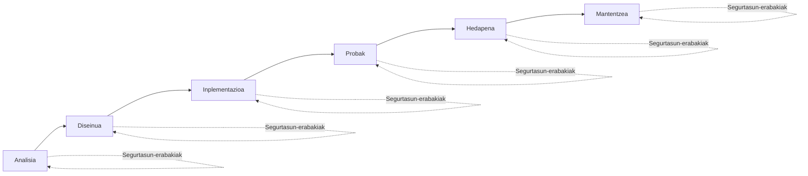
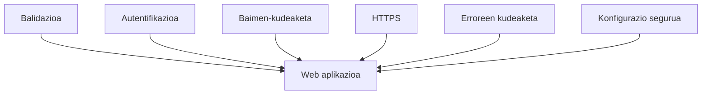
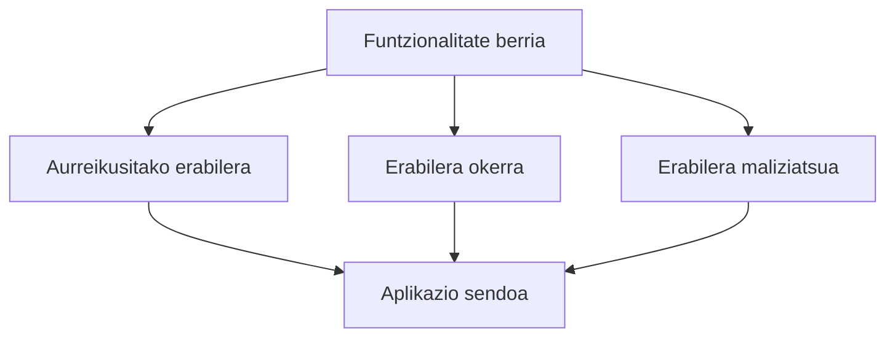

# Garapen seguruaren sarrera

Aurreko blokean web aplikazio batek nola funtzionatzen duen eta nabigatzailea eta zerbitzaria HTTP eta HTTPS bidez nola komunikatzen diren aztertu dugu.

Halaber, cookieen, saioen eta aplikazio baten exekuzioan duen portaera behatzeko aukera ematen duten tresnen zeregina aztertu dugu.

Mekanismo horiek ezagutzea ezinbestekoa da edozein web garatzailerentzat, aplikazio modernoak eraikitzen diren oinarria baita.

Hala ere, aplikazio batek nola funtzionatzen duen ulertzeak ez du bermatzen segurua denik.

Segurtasuna, neurri handi batean, analisi, diseinu, inplementazio, hedapen eta mantentze faseetan hartzen diren erabakien araberakoa da.

Bloke honetan erabaki horiek aztertzen hasiko gara, eta gure softwarearen kalitatean, sendotasunean eta segurtasunean nola eragiten duten ikusiko dugu.

---

## Segurtasuna lehen erasoa baino askoz lehenago hasten da

Segurtasun informatikoaz hitz egiten denean, ohikoa da erasoetan, ahultasunetan edo ziberkriminaletan pentsatzea.

Hala ere, garatzaile baten ikuspegitik, segurtasuna askoz lehenago hasten da.

Aplikazio bat diseinatzen den unean hasten da, eta garapen osoan zehar jarraitzen du.

Erabaki tekniko bakoitzak arriskuak murrizten lagun dezake edo, kontrara, aurrerago ahultasun bihur daitezkeen arazoak sar ditzake.

Adibidez:

- Nola balidatuko dira erabiltzaileak sartutako datuak?
- Nork izango du aplikazioaren baliabide bakoitzerako sarbidea?
- Non gordeko dira kredentzialak eta sarbide-gakoak?
- Zer informazio erakutsiko da errore bat gertatzen denean?
- Nola babestuko dira zerbitzariarekiko komunikazioak?

Galdera horiei zuzen erantzutea garatzaile baten eguneroko lanaren parte da.

Horregatik, modu seguruan garatzea ez da erroreak agertzen direnean soilik zuzentzea; proiektuaren hasieratik erabaki onak hartzea da.

!!! note "La seguridad acompaña todo el ciclo de vida"

	Segurtasuna ez da software garapenaren fase independente bat.

	Diseinuaren lehen erabakietatik hasi eta aplikazioa produkzioan jarri ondorengo mantentzera arte presente egon behar du.

!!! example "Desde la perspectiva del desarrollador"

	Aplikazio batek ondo funtziona dezake eta, hala ere, ahultasunak agertzea errazten duten diseinu-erabakiak izan ditzake.

	Garapen seguruaren helburua arrisku horiek arazo bihurtu aurretik murriztea da.

## Erabaki txikiak, alde handiak

Web aplikazio baten garapenean ez da normalean erabaki bakar bat egoten aplikazio bat segurua edo insegurua den zehazten duena.

Ohikoena da segurtasuna garapenean zehar hartutako erabaki txiki askoren emaitza izatea.

Bakoitza bereizita garrantzi txikikoa dirudi, baina guztiek batera aplikazioaren babes-maila zehazten dute.

Adibidez:

- Erabiltzaileak sartutako informazioa behar bezala balidatzea.
- Pasahitzak zifratuta erabiltzea, testu lauan gorde beharrean.
- Funtzionalitate jakin batzuetarako sarbidea mugatzea.
- Errore-mezu egokiak erakustea.
- Proiektuaren mendekotasunak eguneratuta mantentzea.
- HTTPS konexioak erabiltzea.
- Aplikazioaren gakoak eta kredentzialak babestea.

Neurri horietako batek ere ez du bere kabuz aplikazio baten segurtasuna bermatzen.

Hala ere, guztiak batera aplikatzen direnean, arriskuak nabarmen murrizten laguntzen dute.

Ikuspegi horri normalean **segurtasuna geruzatan** (*Defense in Depth*) deitzen zaio; izan ere, babes-mekanismo desberdinak konbinatzen ditu balizko ahultasunen ustiapena zailtzeko.

!!! note "No existe la seguridad absoluta"

	Ezin da aplikaziorik erabat segurutzat jo.

	Garapen seguruaren helburua arriskuak murriztea da, softwarearen bizi-ziklo osoan jardunbide egokiak aplikatuz.

!!! example "Desde la perspectiva del desarrollador"

	Aplikazio bat ez da seguruagoa babes-neurri bakar bat txertatzeagatik.

	Seguruagoa da informazioa eta sistemaren baliabideak babesteko elkarlanean aritzen diren mekanismo anitz konbinatzen dituelako.

## Arriskuak aurreikustea

Garatzaile batek funtzionalitate berri bat inplementatzen duenean, normalean erabiltzaile legitimo batek nola erabiliko duen pentsatzen du.

Adibidez, saioa hasteko formulario bat sortzean, normala da erabiltzaileak bere izena eta pasahitza zuzen sartzen dituela eta aplikaziora sar daitekeela egiaztatzea.

Hala ere, garapenean zehar beste galdera batzuk egitea ere komeni da.

Zer gertatuko da erabiltzaileak eremu bat hutsik uzten badu?

Eta espero zena baino askoz testu luzeagoa sartzen badu?

Eta baimenik ez duen orri batera sartzen saiatzen bada?

Eta zerbitzariari bidalitako eskaera bat eskuz aldatzen badu?

Galdera mota horiek erroreak sor ditzaketen edo segurtasun-arazo bihur daitezkeen egoerak identifikatzen laguntzen dute.

Horregatik, garatzaile batek ez du aplikazio baten erabilera zuzena soilik kontuan hartu behar; erabilera okerrak, ustekabekoak edo baita maliziatsuak ere kontuan hartu behar ditu.

Egoera horiek aurreikusteak aplikazio sendoagoak diseinatzeko aukera ematen du, eta ahultasunak produkziora iritsi aurretik murrizten laguntzen du.

!!! note "Pensar en escenarios"

	Garapen seguruaren zati garrantzitsu bat da ziurrenik inoiz gertatuko ez diren egoerak imajinatzea, baina gertatuz gero arazoak sor ditzaketenak.

!!! example "Desde la perspectiva del desarrollador"

	Funtzionalitate bat amaitutzat eman aurretik, gomendagarria da honako hauek galdetzea:

	- Zer atera daiteke gaizki?
	- Zer gertatuko litzateke erabiltzaileak ustekabeko zerbait egiten badu?
	- Jasotako datuetan gehiegi fidatzen ari naiz?
  
## Bloke honetan zer aztertuko dugun

Bloke honetan zehar web aplikazio baten segurtasunean eragin handiena duten garapen-erabaki batzuk aztertuko ditugu.

Lehenik, sarreren balidazioa aztertuko dugu; praktika funtsezkoa da jasotako informazioak prozesatu aurretik espero diren baldintzak betetzen dituela bermatzeko.

Ondoren ikusiko dugu nola kudeatu erroreak, erasotzaile posible bati lagun diezaiokeen informazio sentikorra agerian utzi gabe.

Era berean, autentifikazioaren eta baimen-kudeaketaren arteko aldea aztertuko dugu; estuki lotutako bi kontzeptu dira, baina helburu argi desberdinak dituzte.

Azkenik, aplikazio baten konfigurazioa nola babestu eta garapenean zein hedapenean erabilitako kredentzialak, gakoak eta beste sekretu batzuk nola modu seguruan kudeatu aztertuko dugu.

Alderdi horiek guztiak edozein garatzailek bere lan-moduan txertatu beharko lituzkeen jardunbide egokiak dira, erabilitako programazio-lengoaia edo framework-a edozein dela ere.

## Zer aldatzen da garatzailearentzat

Aplikazio seguru bat garatzeak ahultasunak ezagutzea edo tresna espezifikoak erabiltzea baino askoz gehiago dakar.

Garapenean hartutako erabaki bakoitzean segurtasuna txertatzen duen lan egiteko modua hartzea esan nahi du.

Horrek esan nahi du informazioa prozesatu aurretik balidatzea, baliabideetarako sarbidea kontrolatzea, kredentzialak babestea, erroreak behar bezala kudeatzea eta etengabe galdetzea aplikazio batek nola joka dezakeen aurreikusi gabeko egoeren aurrean.

Hurrengo kapituluetan jardunbide egoki horiek nola aplikatu eta web aplikazio errealen garapenean nola txertatu ikasiko dugu.

Helburua ez da gomendioen zerrenda bat buruz ikastea, baizik eta ulertzea zergatik laguntzen duen horietako bakoitzak aplikazio seguruagoak eta sendoagoak eraikitzen.

!!! note "La seguridad es una responsabilidad"

	Segurtasuna ez dago tresnen edo teknologien esku bakarrik.

	Batez ere, aplikazio bat diseinatzen, garatzen eta mantentzen duten pertsonek hartzen dituzten erabakien mende dago.

!!! example "Desde la perspectiva del desarrollador"

	Funtzionalitate berri bat txertatu aurretik, komeni da galdetzea:

	- Zer arrisku sar ditzake?
	- Nola murriztu ditzaket arrisku horiek diseinutik bertatik?

---

## Gogoratzeko

Garapen segurua lehen ahultasunak agertu baino askoz lehenago hasten da.

Analisi, diseinu eta inplementazioan hartutako erabakiek zuzenean eragiten dute aplikazio baten segurtasunean.

Babesa ez dago neurri bakar baten mende; arriskuak murrizteko elkarrekin jarduten duten mekanismo desberdinen konbinazioaren mende dago.

Ustekabeko egoerak aurreikustea eta aplikazio baten portaera etengabe zalantzan jartzea garatzaile baten ohiko lanaren parte da.

Hurrengo kapituluek segurtasuna garapen-prozesuan txertatzeko aukera ematen duten praktika nagusiak garatuko dituzte.

---

## Funtsezko ideiak

- Segurtasuna softwarearen bizi-ziklo osoan presente egon behar da.
- Garapen-erabakiek eragin zuzena dute aplikazio baten segurtasunean.
- Geruzetako segurtasunak babes-mekanismo desberdinak konbinatzen ditu.
- Garatzaile batek aurreikusitako erabileran ez ezik, erabilera oker edo maliziatsu posibleetan ere pentsatu behar du.
- Arriskuak aurreikusteak ahultasunak produkziora iritsi aurretik prebenitzen laguntzen du.
- Garapen-jardunbide egokiek segurtasun-arazoak agertzeko probabilitatea murrizten dute.

---
