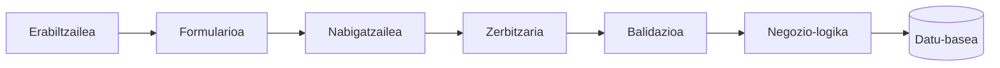
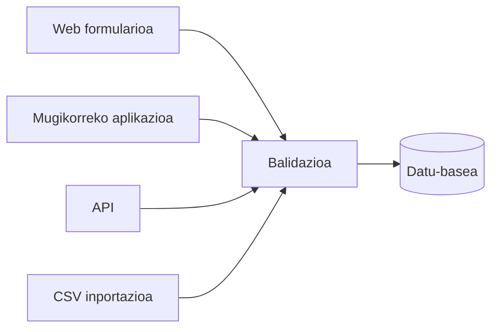
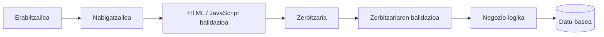
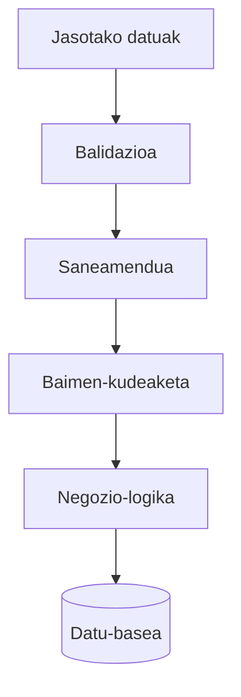
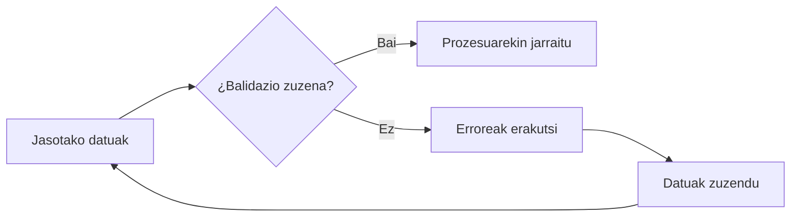

# Sarreren balidazioa

## Sarrera

Miren Lanbide Heziketako ikastetxe bateko idazkaritzan lan egiten du, eta **TxurdiGest** erabiltzen du ikasle berri baten matrikula egiteko.

Prozesuan zehar, izena, abizenak, helbide elektronikoa, jaiotze-data eta nortasun-agiria sartzen ditu. Azkenik, **Gorde** botoia sakatzen du eta informazioa datu-basean gordetzen da.

Itxuraz, denak ondo funtzionatu du.

Hala ere, datu horiek onartu aurretik, aplikazioak galdera asko planteatu beharko lituzke.

- Helbide elektronikoak baliozko formatua al du?
- Jaiotze-data benetan existitzen al da?
- NANak zenbaki eta letra zuzenak al ditu?
- Helbide elektroniko hori beste ikasle bati dagokio jada?
- Eremuren batean HTML edo JavaScript kodea sartzen saiatu al dira?
- Datu guztiek aplikazioak ezarritako murrizketak betetzen al dituzte?

Galdera horiei zuzen erantzutea web garapen seguruaren oinarrietako bat da.

Sarreren balidazioa ez da formulario bat ondo beteta dagoela egiaztatzea bakarrik. Helburua da aplikazioan sartzen den informazio guztia koherentea, segurua eta egokia izatea, prozesatu edo gorde aurretik.

```text
				 TxurdiGest

		   Alta de un nuevo alumno

┌────────────────────────────────────────────┐
│ Nombre:              ____________________  │
│ Apellidos:           ____________________  │
│ DNI:                 ____________________  │
│ Correo electrónico:  ____________________  │
│ Fecha nacimiento:    ____________________  │
│                                            │
│               [ Guardar ]                  │
└────────────────────────────────────────────┘
```

!!! note "Kasu-azterketa"

	Kapitulu honetan zehar **TxurdiGest**-eko egoera desberdinak erabiliko ditugu, informazioa aplikazioak prozesatu aurretik nola balidatu behar den azaltzeko.

Kapitulu honetan ikasiko dugu zergatik aplikazio batek ezin duen jasotako datuetan itsu-itsuan fidatu, eta nola inplementatu balidazio-estrategia bat errore eta ahultasunen arriskua nabarmen murrizteko.

---

## Kapituluaren helburuak

Kapitulu hau amaitzean gai izango zara:

- Sarreren balidazioa zer den eta zergatik den ezinbestekoa ulertzeko.
- Zer datu balidatu behar diren identifikatzeko.
- Bezeroan eta zerbitzarian egindako balidazioa bereizteko.
- Balidazio mota ohikoenak ezagutzeko.
- Datuen saneamenduaren kontzeptua ulertzeko.
- Web aplikazioen garapenean jardunbide egokiak aplikatzeko.

---

## Zer esan nahi du balidatzeak?

Balidatzea da datu batek arau jakin batzuk betetzen dituela egiaztatzea, aplikazioak erabili aurretik.

Arau horiek informazioa erabiltzen den testuinguruaren araberakoak dira.

Adibidez, helbide elektroniko batek formatu jakin bat izan behar du, pasahitz batek gutxieneko segurtasun-baldintzak bete behar ditu, eta data batek egutegiko egun baliodun bat adierazi behar du.

Balidatzea ez da datu baten formatua egiaztatzea bakarrik. Askotan, aplikazioaren negozioarekin lotutako alderdiak ere egiaztatzea dakar.

Adibidez, **TxurdiGest**-en ez da nahikoa helbide elektroniko batek formatu zuzena izatea. Horrez gain, egiaztatu behar da helbide berarekin aurretik beste erabiltzailerik erregistratuta ez dagoela.

!!! note "Gogoratu"

	Datu bat formatuaren ikuspegitik zuzena izan daiteke, eta hala ere aplikazioarentzat baliogabea izan.

---

## Zergatik ezin dugu datuetan fidatu?

Web aplikazioak sortzen hasten diren garatzaileen artean ohikoenetako akats bat da pentsatzea erabiltzaileek beti informazio zuzena sartuko dutela.

Errealitatea oso bestelakoa da.

Datuak okerrak izan daitezke arrazoi askorengatik.

- Idazteko akatsak.
- Ezjakintasuna.
- Informazio osatugabea.
- Komunikazio-arazoak.
- Nahitako manipulazioa.
- Ahultasunak ustiatzeko saiakerak.

Segurtasunaren ikuspegitik, aplikazioak kontuan hartu behar du **jasotako datu oro potentzialki ez-fidagarria dela** balidatu arte.

Filosofia hori garapen seguruaren oinarrizko printzipioetako bat da.

!!! warning "Ohiko akatsa"

	Erabiltzaileak beti informazio zuzena sartuko duelakoan fidatzeak akats funtzionalak eragiten ditu, eta askotan segurtasun-ahultasunak ere bai.

---

## Datu baten bizi-zikloa

Erabiltzaile batek web aplikazio batean informazioa sartzen duenean, datu horrek ibilbide bat egiten du datu-basean gorde aurretik.



Ibilbide horretan, balidazioa etapa kritikoa da.

Aplikazioak egiaztapen hori baztertzen badu edo gaizki egiten badu, datu baliogabeak sistemaren gainerakora irits daitezke eta funtzionamendu-errore txikietatik segurtasun-arazo larrietaraino eragin ditzakete.

Horregatik, balidazioa egin behar da jasotako edozein datu erabili **aurretik**.

---

## Zer balidatu behar da?

Ohiko galdera bat da pentsatzea formularioak bakarrik balidatu behar direla.

Egia esan, kanpotik iristen den edozein datu ez-fidagarritzat hartu behar da.

Besteak beste, honako hauek balidatu behar dira:

- HTML formularioak.
- URL bidez bidalitako parametroak.
- HTTP eskaeren bidez jasotako datuak.
- Mugikorreko aplikazioetatik bidalitako informazioa.
- Erabiltzaileek igotako fitxategiak.
- APIetatik jasotako datuak.
- Beste sistemetatik inportatutako informazioa.
- Cookieak.
- Saio-aldagaiak, dagokionean.

Azken batean, jatorria aplikaziotik kanpokoa den edozein datu.

!!! example "TxurdiGest"

	Irakasle batek CSV fitxategi bat inportatzen du talde baten kalifikazioekin.

	Fitxategia ikastetxeko beste aplikazio batetik sortu bada ere, TxurdiGestek bere edukia balidatu behar du datu-basean txertatu aurretik.

---
## Informazio bera, sarrera asko

Datuen balidazioan pentsatzen dugunean, normalean web formulario bat irudikatzen dugu. Hala ere, aplikazio moderno batek informazioa jatorri askotatik jasotzen du.

**TxurdiGest**-en, adibidez, ikasle bera alta emateko hainbat modu daude:

- idazkaritzak erabiltzen duen web aplikaziotik;
- mugikorreko aplikazio baten bidez;
- API baten bidez;
- CSV fitxategi bat inportatuz;
- beste hezkuntza-plataforma batetik datuak sinkronizatuz.

Datuen jatorria desberdina izan arren, guztiek datu-base bera aldatzen dute azkenean.

Horregatik, balidazio-arauak informazioaren jatorria edozein dela ere aplikatu behar dira.



!!! note "Ideia gakoa"

	Balidazioa aplikazioaren logikaren parte da, ez datuak sartzeko formularioaren parte. Bihar interfazea aldatzen bada edo API berri bat gehitzen bada, balidazio-arauek berberak izaten jarraitu behar dute.


## Bezeroaren balidazioa

Bezeroaren balidazioa datuak zerbitzarira bidali aurretik exekutatzen da.

Oro har, HTML5 edo JavaScript bidez inplementatzen da.

Helburu nagusia erabiltzailearen esperientzia hobetzea da, erroreak berehala detektatuz.

Adibidez:

- Nahitaezko eremuak.
- Gutxieneko luzera.
- Helbide elektronikoaren formatua.
- Data baliozkoak.
- Zenbakizko tarteak.

Erabiltzaileak nahitaezko eremu bat betetzea ahazten badu, nabigatzaileak errorea berehala erakuts dezake, informazioa zerbitzarira bidali beharrik gabe.

Horrek sare-trafikoa murrizten du eta aplikazioa erosoago bihurtzen du.

Hala ere, balidazio honek muga oso garrantzitsu bat du.

Erabiltzaileak nabigatzailea erabat kontrolatzen du.

Honako hauek egin ditzake:

- JavaScript desgaitu;
- HTML kodea aldatu;
- garapen-tresnak erabili;
- beste aplikazio batzuetatik eskaerak bidali;
- HTTP eskaera bat eskuz eraiki.

Beraz, bezeroaren balidazioa **ezin da inoiz segurtasun-mekanismotzat hartu**.

Bere helburu nagusia erabilgarritasuna hobetzea da.

!!! tip "Jardunbide egokiak"

	Erabili bezeroaren balidazioa erabiltzailearen esperientzia hobetzeko, baina inoiz ez babes-mekanismo bakar gisa.

---
## Zerbitzariaren balidazioa

Zerbitzariaren balidazioa eskaera aplikaziora iritsi ondoren egiten da.

Bezeroaren balidazioarekin alderatuta, zerbitzaria garatzaileak kontrolatutako ingurunea da, eta erabiltzaileak ezin du haren portaera aldatu.

Horregatik, **web aplikazio orok datuak beti zerbitzarian balidatu behar ditu**, nabigatzailean dagoeneko egin diren egiaztapenak gorabehera.

Eskaera bat jatorri askotatik etor daiteke.

- Web nabigatzaile bat.
- Mugikorreko aplikazio bat.
- Script automatizatu bat.
- Kanpoko API bat.
- Postman bezalako tresna bat.
- HTTP eskaera bat eskuz eraikitzen duen erasotzaile bat.

Zerbitzariaren ikuspegitik, denak HTTP eskaera hutsak dira.

Aplikazioak ezin du suposatu jasotako datuak zuzenak direla, bere formulario batetik datozelako bakarrik.



Zerbitzariaren balidazioa da datuak aplikazioak prozesatu aurreko azken hesia.

Datu batek fase hori gainditzen ez badu, baztertu egin behar da eta erabiltzaileari errore-mezu egoki bat itzuli.

!!! warning "Ez baztertu inoiz zerbitzariaren balidazioa"

	Formularioak HTML5, JavaScript edo nabigatzailean beste edozein balidazio-mekanismo erabili arren, aplikazioak jasotako datu guztiak berriz egiaztatu behar ditu zerbitzarian.

---

## Bezeroa eta zerbitzaria: bi helburu desberdin

Ohikoa da pentsatzea bi balidazioek lan bera egiten dutela zehazki.

Egia esan, helburu desberdinak dituzte.

| Bezeroaren balidazioa | Zerbitzariaren balidazioa |
|---------------------------|---------------------------|
| Erabiltzailearen esperientzia hobetzen du. | Aplikazioaren segurtasuna eta osotasuna bermatzen ditu. |
| Nabigatzailean exekutatzen da. | Zerbitzarian exekutatzen da. |
| Aldatu edo desgaitu daiteke. | Erabiltzaileak ezin du aldatu. |
| Beharrezkoak ez diren eskaerak murrizten ditu. | Informazioa onartuko den ala ez erabakitzen du. |
| Ez du segurtasunik ematen. | Ezinbestekoa da segurtasunerako. |

Ohikoena biak modu osagarrian erabiltzea da.

Bezeroaren balidazioak errore sinpleak azkar detektatzeko aukera ematen du.

Zerbitzariaren balidazioak behin betiko baieztatzen du datuek aplikazioak ezarritako arau guztiak betetzen dituztela.

!!! tip "Jardunbide egokiak"

	Inplementatu oinarrizko arau berak bezeroan eta zerbitzarian. Erabiltzaileak berehalako erantzuna jasotzen du, eta aplikazioak segurtasuna mantentzen du.

---

## Balidazio motak

Egiaztapen guztiek ez dute helburu bera.

Datu motaren arabera, arau batzuk edo beste batzuk aplikatu beharko dira.

Hauek dira balidazio ohikoenetako batzuk.

---

### Nahitaezko eremuak

Erabiltzaileak balio bat eman duela egiaztatzean datza.

Adibidez, TxurdiGesten nahitaezkoa litzateke honako hauek adieraztea:

- izena;
- abizenak;
- helbide elektronikoa;
- pasahitza.

Datu horietakoren bat falta bada, eragiketa ezin da osatu.

---

### Datu mota

Jasotako balioa espero den motakoa izan behar da.

Adibidez:

| Eremua | Espero den mota |
|--------|---------------|
| Adina | Zenbaki osoa |
| Jaiotze-data | Data |
| Prezioa | Zenbaki hamartarra |
| Helbide elektronikoa | Formatu balioduna duen katea |

Datu mota oker bat onartzeak erroreak eragin ditzake informazioa prozesatzean.

---

### Luzera

Datu askok gutxieneko edo gehieneko tamaina dute.

Adibidez:

| Eremua | Murrizketa |
|--------|-------------|
| Izena | 2 eta 60 karaktere artean |
| Pasahitza | Gutxienez 12 karaktere |
| Posta-kodea | 5 karaktere |

Murrizketa horiek gordetako informazioaren koherentzia mantentzen laguntzen dute.

---

### Formatua

Datu batzuek egitura zehatz bat bete behar dute.

Ohiko adibideak:

- helbide elektronikoa;
- telefonoa;
- NANa;
- matrikula;
- posta-kodea;
- IP helbidea.

TxurdiGesten, adibidez, ez luke zentzurik **@** karakterea ez duen helbide elektroniko bat onartzeak.

---

### Balioen tartea

Batzuetan datua formatuaren ikuspegitik zuzena izan daiteke, baina baimendutako mugetatik kanpo egon.

Adibidez:

| Eremua | Murrizketa |
|--------|-------------|
| Nota | 0 eta 10 artean |
| Ehunekoa | 0 eta 100 artean |
| ECTS kredituak | Balio positiboa |

---

### Baimendutako balioen zerrenda

Eremu batzuek balio jakin batzuk bakarrik onartzen dituzte.

Adibidez, ikasturtea honako hau izan daiteke:

- Lehen maila.
- Bigarren maila.

Edo matrikularen egoera bat:

- Aktiboa.
- Zain.
- Amaituta.

Beste edozein balio onartzeak informazio inkoherentea sartzea ekarriko luke.

---

### Bakantasuna

Datu batzuk ezin dira errepikatu.

Adibidez:

- helbide elektronikoa;
- NANa;
- espediente-zenbakia.

Mariak TxurdiGesten ikasle berri bat erregistratzen duenean, aplikazioak egiaztatu behar du aurretik ez dagoela helbide elektroniko bera duen beste ikaslerik.

Egiaztapen horrek normalean datu-basea kontsultatzea eskatzen du.

---

### Negozio-arauak

Aplikazioaren beraren balidazio espezifikoak dira.

Ez daude programazio-lengoaiaren edo erabilitako framework-aren menpe.

Sistemaren funtzionamenduaren menpe daude.

Adibidez:

- ikasle bat ezin da bi aldiz matrikulatu modulu berean;
- irakasle batek bere taldeen kalifikazioak bakarrik alda ditzake;
- matrikula bat ezin da ezarritako epez kanpo egin.

Egiaztapen horiek aplikazioaren negozio-logikaren parte dira, eta normalean garrantzitsuenak izaten dira.

!!! example "TxurdiGest"

	Matrikula-formularioak eremu guztiak behar bezala beteta ditu.

	Hala ere, ikaslea ziklo formatibo berean matrikulatuta dago jada.

	Datu guztiak baliozkoak izan arren, eragiketa baztertu egin beharko da, aplikazioaren arau bat urratzen duelako.

---

## Balidazio moten laburpena

| Balidazio mota | Adibidea |
|--------------------|----------|
| Nahitaezkoa | Eremu ez-hutsa |
| Datu mota | Zenbaki osoa |
| Luzera | 8 eta 20 karaktere artean |
| Formatua | Helbide elektronikoa |
| Tartea | Nota 0 eta 10 artean |
| Balioen zerrenda | Baimendutako ikasturtea |
| Bakantasuna | Errepikatu gabeko helbide elektronikoa |
| Negozio-araua | Aurretik matrikulatu gabeko ikaslea |

---
## Balidazioa eta datuen saneamendua

Maiz **balidatu** eta datuak **saneatu** terminoak berdin erabiltzen dira. Hala ere, bi kontzeptuek prozesu desberdin baina osagarriak adierazten dituzte.

### Balidatzea

Balidatzea da datu batek aplikazioak ezarritako arauak betetzen dituen egiaztatzea.

Balidazioak honelako galderei erantzuten die:

- Helbide elektronikoa baliozkoa al da?
- Nota 0 eta 10 artean al dago?
- NANak formatu zuzena al du?
- Data benetan existitzen al da?

Datuak ez baditu definitutako arauak betetzen, aplikazioak baztertu egin behar du.

---

### Saneatzea

Saneatzea da datu bat modu seguruan erabili ahal izateko prestatzea.

Ez du erabaki nahi datu bat zuzena edo okerra den; helburua da karaktere jakin batzuk aurreikusitakoa ez den modu batean interpreta ez daitezen saihestea.

Adibidez, erabiltzaile batek web orri batean idatzitako iruzkin bat erakutsi aurretik, baliteke karaktere jakin batzuk iheskaratu behar izatea, nabigatzaileak HTML kode gisa interpreta ez ditzan.

Beste egoera batzuetan, saneamendua honako hau izan daiteke:

- beharrezkoak ez diren zuriuneak kentzea;
- karaktereak formatu estandar batera bihurtzea;
- maiuskulak eta minuskulak normalizatzea;
- kontrol-karaktereak kentzea.

Estrategia zehatza datuari gero emango zaion erabileraren araberakoa izango da.

!!! note "Gogoratu"

	Balidatzeak honako galderari erantzuten dio: **«datu hau baliozkoa al da?»**.

	Saneatzeak honako galderari erantzuten dio: **«nola prestatu behar dut datu hau modu seguruan erabiltzeko?»**.

---

## Balidazioa eta segurtasuna

Balidazioa garapen seguruaren oinarrietako bat bada ere, bere kabuz ez ditu ahultasun guztiak ezabatzen.

Ondo garatutako aplikazio batek babes-mekanismo desberdinak konbinatzen ditu.



Urrats horietako bakoitzak arrisku desberdinen aurrean babesten du aplikazioa.

Horietako edozein kentzeak sistemaren segurtasun-maila murriztea dakar.

Hurrengo kapituluetan mekanismo horietako batzuk xehetasunez aztertuko ditugu.

---
## Zer gertatzen da balidazio batek huts egiten duenean?

Datu batek balidazio bat gainditzen ez duenean, aplikazioak eskaeraren prozesamenduak aurrera jarraitzea eragotzi behar du.

Horrek esan nahi du datua ez dela erabili, gorde edo aplikazioaren egoeran aldaketak eragiteko erabili behar.

Egoera gehienetan, jarduera-sekuentzia honakoa izango da:

1. Datu baliogabea detektatzea.
2. Eskaeraren prozesamendua etetea.
3. Erabiltzaileari arazoaren berri ematea mezu argi baten bidez.
4. Erabiltzaileari informazioa zuzendu eta berriro saiatzeko aukera ematea.

Adibidez, Mariak helbide elektroniko bat formatu okerrarekin sartzen badu ikasle baten matrikulazioan, TxurdiGestek ez luke ikaslearen fitxa partzialki gorde behar. Eragiketa ezeztatu egin behar da datu guztiak baliozkoak izan arte.



!!! warning "Garrantzitsua"

	Aplikazio batek ez du inoiz gorde behar definitutako balidazio guztiak gainditu ez dituen informaziorik.


## Jardunbide egokiak

Web aplikazio baten garapenean komenigarria da printzipio orokor batzuk jarraitzea.

### Beti balidatu zerbitzarian

HTML edo JavaScript bidez egindako balidazioak erabiltzailearen esperientzia hobetzen du, baina ez du inoiz zerbitzariaren balidazioa ordezkatu behar.

---

### Arau argiak definitu

Datu bakoitzak murrizketa erabat definituak izan behar ditu.

Arauak zenbat eta anbiguoagoak izan, orduan eta zailagoa izango da aplikazioa mantentzea eta erroreak detektatzea.

---

### Mezu ulergarriak erakutsi

Datu batek balidazioa gainditzen ez duenean, erabiltzaileak arrazoia ezagutu behar du.

Errore-mezuek zein informazio zuzendu behar den adierazi behar dute, beharrezkoak ez diren xehetasun teknikoak erakutsi gabe.

Adibidez:

✔ "Helbide elektronikoaren formatua ez da baliozkoa."

hobe da honakoa baino:

✘ "Error 500."

---

### Inoiz ez fidatu datuen jatorriaz

Ez du axola informazioa nondik datorren:

- formulario propio batetik;
- mugikorreko aplikazio batetik;
- barneko API batetik;
- ikastetxeko beste sistema batetik.

Sarrera oro balidatu behar da.

---

### Arauak zentralizatu

Ahal den neurrian, balidazio-arauak multzokatuta eta antolatuta mantendu behar dira.

Horrek errazten du:

- mantentzea;
- berrerabiltzea;
- probak;
- aplikazioaren eboluzioa.

---

### Koherentzia mantendu

Informazio bera eskatzen duten bi formularioek balidazio-arau berberak aplikatu beharko lituzkete.

Bestela, aplikazioaren portaera ezin aurreikusizkoa izango da erabiltzaileentzat.

!!! tip "Jardunbide egokiak"

	Balidazioa aplikazioaren diseinuaren parte da, eta ez da azken orduko gehigarritzat hartu behar.

---

## Ohiko akatsak

Web aplikazioen garapenean ohikoa da honako akats hauek aurkitzea.

### JavaScript-en bakarrik fidatzea

Ziurrenik akatsik arruntena da.

Erasotzaile batek eskaerak zuzenean bidal ditzake zerbitzarira, aplikazioaren formularioa erabili gabe.

---

### Eremu batzuk bakarrik balidatzea

Jasotako datu guztiak egiaztatu behar dira.

Ez soilik garrantzitsuenak diruditenak.

---

### Erabiltzaile zintzoetan bakarrik pentsatzea

Aplikazioak diseinatu behar dira suposatuz edozein sarrera okerra edo baita maliziatsua ere izan daitekeela.

---

### Formularioaren arabera arau desberdinak erabiltzea

Helbide elektroniko batek formatu jakin bat bete behar badu, arau hori beti aplikatu behar da.

---

### Fitxategiak ez balidatzea

Fitxategi-igoerak web aplikazio askoren puntu sentikorrenetako bat dira.

Fitxategiaren izenaz gain, honako alderdi hauek egiaztatu behar dira:

- fitxategi mota;
- tamaina;
- luzapena;
- edukia;
- baimenak.

Gai hau sakonago aztertuko da hurrengo blokeetan.

!!! warning "Ohiko akatsa"

	Ondo diseinatutako formulario batek ez du bermatzen jasotako informazioa segurua denik.

---

## Zer aldatzen da garatzailearentzat?

Aplikazioa hazten den heinean, jasotzen duen informazio kopurua ere handitzen da.

Balidazioa hasieratik diseinuaren parte ez bada, sistemaren koherentzia mantentzea gero eta konplexuagoa bihurtzen da.

Horregatik, talde profesionalek balidazioa aplikazioaren arkitekturaren funtsezko osagaitzat hartzen dute, eta ez datuak gorde aurretik egindako egiaztapen soil gisa.

**TxurdiGest**-en, adibidez, balidazio-arau berak honako hauetatik aplika daitezke:

- web interfazea;
- mugikorreko aplikazio bat;
- API bat;
- datuak inportatzeko prozesu automatikoak.

Arau horiek hasieratik ondo definitzeak akatsak murrizten ditu, mantentzea errazten du eta sistemaren segurtasuna hobetzen du.

---

## Zer balidatu TxurdiGesten?

Hurrengo taulak laburbiltzen ditu **TxurdiGest** bezalako aplikazio batek jasotako informazioa prozesatu aurretik egin beharko lituzkeen balidazio batzuk.

| Informazioa | Ohiko balidazioak |
|--------------|------------------------|
| Izena eta abizenak | Nahitaezkoa, gutxieneko eta gehieneko luzera |
| NANa | Formatua eta bakantasuna |
| Helbide elektronikoa | Formatua, luzera eta bakantasuna |
| Pasahitza | Gutxieneko luzera eta konplexutasuna |
| Jaiotze-data | Data baliozkoa |
| Nota | Zenbakizko mota eta 0 eta 10 arteko tartea |
| PDF fitxategia | MIME mota, luzapena eta gehieneko tamaina |
| Matrikula | Negozio-arauak (ez bikoiztua, epea irekita, etab.) |

Aplikazio bakoitzak bere balidazio-arauak definituko ditu, baina printzipioa beti bera da: **ez da daturik prozesatu behar aurretik balidatu gabe**.


## Gogoratzeko

- Inoiz ez fidatu jasotako datuez.
- Kanpotik datorren informazio oro balidatu behar da.
- Bezeroaren balidazioak erabiltzailearen esperientzia hobetzen du, baina ez du segurtasunik ematen.
- Zerbitzariaren balidazioa nahitaezkoa da.
- Balidatzea eta saneatzea prozesu desberdinak dira.
- Balidazioak aplikazioaren diseinuaren parte izan behar du.

---

## Ideia gakoak

Kapitulu honetan ikusi dugu sarreren balidazioa edozein web aplikazioren lehen defentsa-lerroetako bat dela.

Ez da nahikoa formulario bat ondo beteta dagoela egiaztatzea. Beharrezkoa da jasotako datu guztiak aplikazioak definitutako arauekin koherenteak direla bermatzea, prozesatu edo gorde aurretik.

Halaber, ikasi dugu nabigatzailean egindako balidazioak erabiltzailearen esperientzia hobetzen duela, eta zerbitzariaren balidazioa, berriz, aplikazioaren segurtasuna eta osotasuna bermatzeko ezinbesteko baldintza dela.

Hala ere, datuak ondo balidatzeak ez du saihesten aplikazio baten exekuzioan ustekabeko egoerak gerta daitezkeenik. Datu-base batek erantzuteari utz diezaioke, kanpoko zerbitzu bat erabilgarri ez egon daiteke, edo eskaera baten prozesamenduan barne-akats bat gerta daiteke.

Kasu horietan, aplikazioak modu kontrolatuan erantzun behar du: arazoa erregistratu, informazio-galera saihestu eta erabiltzaileari mezu egoki bat erakutsi sistemaren barne-xehetasunak agerian utzi gabe.

Hori nola lortu ikasiko dugu, hain zuzen ere, hurrengo kapituluan: **erroreen kudeaketa**.

---
