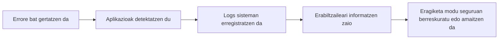
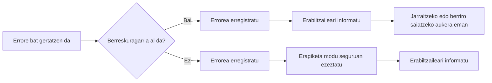
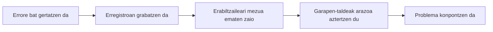
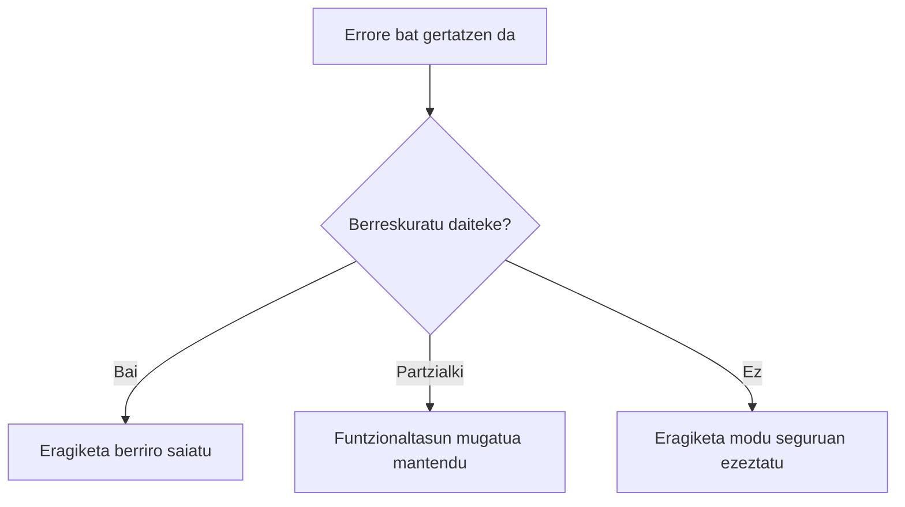
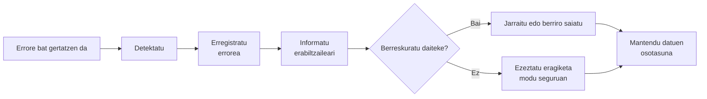

# Erroreen kudeaketa

## Sarrera

Mirenek ikasle berri bat erregistratu du **TxurdiGest**-en. Datu guztiak zuzen sartu ditu: izena, abizenak, NANa, helbide elektronikoa eta taldea. Informazioa berrikusi ondoren, **Gorde** botoia sakatu du.

Segundo batzuetan denak normaltasunez funtzionatzen duela dirudi. Hala ere, une horretan bertan arazo bat gertatzen da datu-base zerbitzarian eta aplikazioak ezin du eragiketa osatu.

Zer gertatu beharko litzateke orain?

Mezu tekniko ulertezin bat erakutsi? Sartutako informazio guztia galdu? Sistemaren barne-xehetasunak agerian utzi? Edo erabiltzaileari modu argian informatu, arazoa erregistratu eta geroago berriro saiatzeko aukera eman?

Galdera horien erantzuna da aplikazio seguru eta kalitatezkoen garapeneko alderdirik garrantzitsuenetako bat.

Aurreko kapituluan ikasi genuen **sarreren balidazio** zuzen batek datu oker asko prozesatzera iristea saihesten duela. Hala ere, datu guztiak baliozkoak direnean ere, aplikazioaren exekuzioan ustekabeko egoerak ager daitezke: datu-base eskuraezina, existitzen ez den fitxategi bat, eten den sare-konexio bat, erantzuteari uzten dion kanpoko zerbitzu bat edo programazio-errore bat.

Aplikazio profesional batek ezin du arazo horiek guztiak gertatzea saihestu, baina bai haien aurrean nola erantzun erabaki dezake.

Erroreak ondo kudeatzeak esan nahi du egoera anomaloak detektatzea, erabiltzaileari behar bezala informazioa ematea, gertakaria erregistratzea analisia errazteko eta, ahal denean, aplikazioak modu seguruan funtzionatzen jarraitzeko aukera ematea.

Erroreen kudeaketa txarrak ez du soilik erabiltzailearen esperientzia kaltetzen. Aplikazioaren segurtasuna ere arriskuan jar dezake, bere funtzionamenduari buruzko barne-informazioa agerian utziz eta erasotzaile posible baten lana erraztuz.

Kapitulu honetan ikasiko dugu nola diseinatu ustekabeko egoeren aurrean modu kontrolatuan erantzuteko gai diren aplikazioak, erroreak softwarearen diseinuaren beste elementu bat bihurtuz, eta ez agertzen denean konpondu beharreko arazo soila.

## Helburuak

Kapitulu hau amaitzean gai izango zara:

- Web aplikazio batean erroreen kudeaketa zer den ulertzeko.
- Aplikazio baten exekuzioan gerta daitezkeen errore mota desberdinak bereizteko.
- Gorabehera mota bakoitzerako erantzun egokiak diseinatzeko.
- Erabiltzaileari behar duen informazioa soilik erakusteko, sistemaren barne-datuak agerian utzi gabe.
- Erroreak behar bezala erregistratzeko, haien diagnostikoa eta mantentzea errazteko.
- Web aplikazio baten sendotasuna, segurtasuna eta erabilera-esperientzia hobetzen dituzten jardunbide egokiak aplikatzeko.

## Zer da erroreen kudeaketa?

Web aplikazio baten exekuzioan, eragiketa bat normaltasunez osatzea eragozten duten egoerak gerta daitezke. Batzuk erabiltzailearen ekintzen ondorio dira, beste batzuk azpiegitura-arazoengatik gertatzen dira, eta beste batzuk programazio-erroreen edo aplikazioak kontrolatu ezin dituen kanpo-egoeren ondorio dira.

**Erroreen kudeaketa** egoera horiek detektatzeko, modu egokian erantzuteko eta erabiltzailearentzat zein sistemarentzat duten eragina minimizatzeko aukera ematen duten tekniken eta prozeduren multzoa da.

Errore bat kudeatzea ez da hutsegite bat gertatu dela adierazten duen mezu bat erakustea bakarrik. Kudeaketa egokiak honako hau dakar:

- Arazoa ahalik eta azkarren detektatzea.
- Aplikazioa egoera inkoherente batean gera ez dadin saihestea.
- Erabiltzaileari modu argi eta ulergarrian informazioa ematea.
- Gertakaria erregistratzea ondorengo analisia errazteko.
- Segurtasuna mantentzea, informazio sentikorra agerian utzi gabe.
- Ahal denean, erabiltzaileari lanean jarraitzeko aukera ematea.

!!! note "Kudeatzea ez da ezkutatzea"

    Erroreen kudeaketa ona ez da arazoak ezkutatzea, baizik eta modu kontrolatuan tratatzea, erabiltzaileari beharrezkoa ez den kalterik ez eragiteko eta aplikazioaren segurtasuna arriskuan ez jartzeko.

**TxurdiGest**-en, adibidez, honelako egoerak gerta daitezke:

- Datu-basea segundo batzuetan erabilgarri egoteari uztea.
- Irakasle bat baimenik ez duen espediente batera sartzen saiatzea.
- Mezu elektronikoak bidaltzeko kanpoko zerbitzuarekin konexioa etetea.
- Ezabatua izan den dokumentu bat deskargatzen saiatzea.
- Kontsulta baten exekuzioan ustekabeko errore bat gertatzea.

Kasu horietan guztietan, aplikazioak modu desberdinean erantzun behar du; izan ere, errore guztiek ez dute jatorri bera eta ez dute tratamendu bera behar.

## Zergatik da garrantzitsua erroreak ondo kudeatzea?

Aplikazio profesional bat ez da inoiz huts egiten ez duelako bereizten, arazo bat agertzen denean nola erantzuten duenagatik baizik.

Erroreak edozein sistema informatikoren funtzionamendu normalaren parte dira. Zerbitzariek erantzuteari utz diezaiokete, konexioak eten daitezke, kanpoko zerbitzuak aldi baterako erabilgarri ez egon daitezke eta beti dago programazio-akats bat agertzeko aukera.

Arazo horiek behar bezala kudeatzen ez badira, ondorio garrantzitsuak izan ditzakete:

- Erabiltzaileak sartzen ari zen informazioa gal dezake.
- Aplikazioa blokeatuta geratu daiteke edo egoera inkoherente batean.
- Datu osatugabeak edo okerrak gorde daitezke.
- Sistemaren barne-arkitekturari buruzko informazio sentikorra ager daiteke.
- Mantentzea eta arazoa kokatzea askoz konplexuagoak izango dira.

Aitzitik, erroreen kudeaketa zuzenak abantaila ugari ematen ditu:

- Erabiltzailearen esperientzia hobetzen du.
- Aplikazioaren sendotasuna handitzen du.
- Softwarearen mantentzea errazten du.
- Gorabeherak kokatzeko behar den denbora murrizten du.
- Segurtasuna indartzen du, barne-informazioaren esposizioa saihestuz.

!!! example "Adibidea"

    Mirenek nota-buletin bat sortzen saiatzen bada eta inprimaketa-zerbitzaria erabilgarri ez badago, honelako mezu batek:

    **Error SQLSTATE[HY000]: Connection refused in DatabaseConnection.php line 127**

    ez dio erabiltzaileari informazio erabilgarririk ematen eta, gainera, sistemaren barne-xehetasunak agerian uzten ditu.

    Aitzitik, honelako mezu batek:

    **Une honetan ezin izan da buletina sortu. Saiatu berriro minutu batzuk barru.**

    erabiltzaileari behar bezala informatzen dio informazio teknikoa agerian utzi gabe, eta gertakaria ondorengo analisirako erregistratzeko aukera ematen du.

{ width="800" align="center" }

*2.2. irudia. Aplikazio profesional batek beharrezko informazioa baino ez dio erakusten erabiltzaileari, eta arazoaren diagnostikoa errazteko xehetasun teknikoak erregistratzen ditu.*

## Errore baten bizi-zikloa

Aplikazio baten exekuzioan arazo bat gertatzen denean, ez litzateke erabiltzaileari mezu bat erakutsi eta prozesua amaitzera mugatu behar. Ondo diseinatutako aplikazio batek arazoa detektatzeko, ondorioak minimizatzeko eta konponketa errazteko urrats batzuk jarraitzen ditu.

Prozesu horri **errore baten bizi-zikloa** deitzen zaio.



Etapa bakoitzak funtzio espezifiko bat betetzen du.

### 1. Errore bat gertatzen da

Erroreak jatorri oso desberdinak izan ditzake. Adibidez:

- Datu-baseko kontsulta batek huts egitea.
- Erabiltzaile bat baimenik gabeko baliabide batera sartzen saiatzea.
- Kanpoko zerbitzu batek erantzuteari uztea.
- Programazio-hutsegite bat gertatzea.
- Zerbitzaria diskoko lekurik gabe geratzea.

Fase honetan aplikazioak oraindik ez du erreakzionatu; ustekabeko egoera bat besterik ez da agertu.

### 2. Aplikazioak arazoa detektatzen du

Errorea gertatu ondoren, aplikazioak identifikatu behar du eragiketak ezin duela normaltasunez jarraitu.

Erabilitako lengoaia edo framework-aren arabera, detekzio hau salbuespenen, itzulera-kodeen, egoera-egiaztapenen edo beste kontrol-mekanismo batzuen bidez egin daiteke.

Garrantzitsuena da errorea **ez pasatzea oharkabean**.

!!! warning "Inoiz ez ezikusi errore bat"

    Errore bat ez ikusi eta aplikazioa exekutatzen jarraitzeak emaitza okerrak, informazio-galera edo gero diagnostikatzeko askoz zailagoak diren portaera aurreikusezinak eragin ditzake.

### 3. Errorea erregistratzen da

Erabiltzaileari informatu aurretik, aplikazioak garapen-taldeak gero gertatutakoa aztertu ahal izateko behar duen informazio guztia erregistratu beharko luke.

Normalean honelako informazioa gordetzen da:

- Data eta ordua.
- Eragiketa egiten ari zen erabiltzailea.
- Exekutatutako ekintza.
- Errorearen mezu teknikoa.
- Non gertatu den (fitxategia edo osagaia).
- Larritasun-maila.

Erregistro hauek, **logs** izenez ezagunak, ezinbestekoak dira gorabeherak kokatzeko eta aplikazioaren mantentzea errazteko.

### 4. Erabiltzaileari informatzen zaio

Erabiltzaileak jakin behar du eragiketa ezin izan dela osatu, baina ez du sistemaren barne-xehetasunak ezagutu behar.

Horregatik, mezuek honako ezaugarriak izan behar dituzte:

- Argiak.
- Ulergarriak.
- Errespetuzkoak.
- Lanean jarraitzeko erabilgarriak.

!!! example "Adibidea"

    Miren matrikula bat gordetzen saiatzen bada eta datu-baseak erantzuteari uzten badio, mezu egoki bat hau izan daiteke:

    **Une honetan ezin izan da eragiketa osatu. Saiatu berriro minutu batzuk barru.**

    Inola ere ez lirateke salbuespenak, SQL kontsultak, zerbitzariaren bideak edo garapen-taldearentzat soilik den informazio teknikoa erakutsi behar.

### 5. Aplikazioa berreskuratu edo eragiketa amaitzen du

Azkenik, aplikazioak erabaki behar du nola jarraitu.

Errore motaren arabera, honako hau egin dezake:

- Erabiltzaileari berriro saiatzeko aukera eman.
- Eragindako eragiketa bakarrik ezeztatu.
- Aplikazioaren aurreko egoera leheneratu.
- Prozesua modu kontrolatuan amaitu.
- Erabiltzailea errore-orri batera birbideratu.

Helburua beti bera da: aplikazioa egoera inkoherente batean gera ez dadin saihestea eta informazioa zein erabiltzailearen esperientzia babestea.

!!! note "Erroreen kudeaketa ona"

    Aplikazio profesional batek ez ditu errore guztiak ezabatzen. Aplikazio ez sendo batetik bereizten duena da erroreak detektatzen, erregistratzen, behar den informazioa bakarrik komunikatzen eta ahalik eta modu seguruenean berreskuratzen jakitea.

## Web aplikazio bateko errore motak

Errore guztiek ez dute kausa bera, eta ez dira modu berean tratatu behar. Nola erantzun erabaki aurretik, arazoaren jatorria identifikatu behar da.

Sailkapen egoki batek egoera bakoitzerako erantzun espezifikoak diseinatzeko aukera ematen du, aplikazioaren segurtasuna, erabiltzailearen esperientzia eta mantentzea hobetuz.

**TxurdiGest**-en errore mota desberdinak aurki ditzakegu.

### Balidazio-erroreak

Erabiltzaileak sartzen dituen datuek aplikazioak ezarritako arauak betetzen ez dituztenean gertatzen dira.

Errore mota hau aurreko kapituluan aztertu bazen ere, erroreen kudeaketa globalaren parte dira, eragiketa bat behar bezala osatzea eragozten dutelako.

Adibideak:

- Formatu okerreko NAN bat.
- Baliozkoa ez den helbide elektroniko bat.
- Segurtasun-politika betetzen ez duen pasahitz bat.
- Nahitaezko eremu huts bat.

Errore hauek ahalik eta azkarren detektatu behar dira, eta erabiltzaileari zein informazio zuzendu behar duen adierazi.

!!! tip "Gogoratu"

    Balidazio-erroreak ez dira sistemaren hutsegiteak. Aurreikusitako egoerak dira, eta aplikazioaren funtzionamendu normalaren parte gisa kudeatu behar dira.

### Autentifikazio- eta baimen-erroreak

Errore hauek erabiltzaile bat aplikaziora sartzen saiatzen denean edo beharrezko baimenik ez duen eragiketa bat egin nahi duenean agertzen dira.

Adibidez:

- Erabiltzaile edo pasahitz okerrak.
- Iraungitako saioa.
- Administratzaileentzat gordetako funtzionaltasun batera sartzea.
- Beste erabiltzaile bati dagokion informazioa aldatzeko saiakera.

Aplikazioak eragiketa eragotzi behar du eta arazoa komunikatu, informazio gehigarririk agerian utzi gabe.

!!! warning "Ez eman arrastorik"

    **"Erabiltzailea existitzen da baina pasahitza okerra da"** bezalako mezuak erasotzaile baten lana errazten dute.

    Hobe da mezu generikoak erabiltzea, adibidez:

    **Erabiltzailea edo pasahitza okerrak dira.**

### Negozio-logikako erroreak

Arazo guztiak ez dira errore teknikoak. Askotan, eskatutako eragiketak aplikazioaren arau propio bat urratzen du.

Adibidez, **TxurdiGest**-en:

- Ikasle bera ikastaro berean bi aldiz matrikulatzea.
- Oraindik gainditu gabeko ikasgaiak dituen espediente bat ixtea.
- Irakasle bat bere departamentuarekin bateragarria ez den talde bati esleitzea.

Aplikazioak ondo funtzionatzen du, baina eskatutako eragiketa ez da baliozkoa negozio-arauen arabera.

### Azpiegitura-erroreak

Aplikazioaren funtzionamendurako beharrezko baliabideren bat erabilgarri egoteari uzten dionean gertatzen dira.

Adibide batzuk:

- Datu-baseak ez du erantzuten.
- Fitxategi-zerbitzaria eskuraezina dago.
- Ez dago Interneteko konexiorik.
- Zerbitzaria diskoko lekurik gabe geratzen da.

Kasu horietan, normalean erabiltzaileak ezin du arazoa konpondu; beraz, aplikazioak gorabeheraren berri eman behar du eta xehetasun guztiak erregistratu ondorengo analisirako.

### Kanpoko zerbitzuen erroreak

Aplikazio askok hirugarrenek emandako zerbitzuen mende daude.

Adibidez:

- Mezu elektronikoen bidalketa.
- Ordainketa-pasabideak.
- Autentifikazio-zerbitzuak.
- Erakunde ofizialetako APIak.
- Hodeiko biltegiratze-plataformak.

Zerbitzu horietako batek erantzuteari uzten badio, aplikazioak egoera kudeatu behar du gainerako sistema erabat blokeatu gabe.

### Ustekabeko erroreak

Aplikazioaren garapenean aurreikusi ez ziren erroreak dira.

Honengatik izan daitezke:

- Programazio-akatsak.
- Salbuespenezko egoerak.
- Datu hondatuak.
- Kontuan hartu gabeko egoeren konbinazioak.

Errore mota hau ez da inoiz erabat desagertuko. Horregatik, aplikazio guztiek haiek harrapatzeko, erregistratzeko eta modu kontrolatuan erantzuteko mekanismoak izan behar dituzte.

!!! note "Estrategiarik onena"

    Errore guztiak aurreikustea ezinezkoa bada ere, aplikazioa presta daiteke agertzen direnean behar bezala erreakzionatzeko.

## Zer egin behar du aplikazio batek errorea gertatzen denean?

Errore bat gertatzen denean, aplikazioak ez du huts egin dela dioen mezu bat erakustera mugatu behar. Inprobisatutako erantzun batek informazio-galera, ustekabeko portaerak edo sistemaren segurtasuna arriskuan jartzea eragin dezake.

Aplikazio profesional batek beti jarraitu behar du edozein gorabehera kudeatzeko estrategia definitu bat.

Hurrengo diagramak gomendatutako prozesua laburbiltzen du:



Aplikazio bakoitzak prozesu hau bere beharretara egokitu badezake ere, badira beti errespetatu beharreko printzipio batzuk.

### Errorea berehala detektatu

Aplikazioak eragiketa garrantzitsu bakoitzaren emaitza egiaztatu behar du.

Adibidez:

- Datu-basera sartzea.
- Fitxategi bat gordetzea.
- Kanpoko API bat kontsumitzea.
- Mezu elektroniko bat bidaltzea.
- Segurtasun-kopia bat egitea.

Arazoa zenbat eta lehenago detektatu, orduan eta txikiagoak izango dira ondorioak.

### Eragindako eragiketa bakarrik eten

Errore guztiek ez dute aplikazio osoa gelditzea eskatzen.

Eragiketa jakin batek huts egiten badu, gomendagarria da eragiketa hori bakarrik ezeztatzea eta gainerako sistemak normaltasunez funtzionatzen jarraitzea.

!!! example "Adibidea"

    **TxurdiGest**-ek PDF formatuan ziurtagiri bat sortu ezin badu, erabiltzaileak espedienteak kontsultatzen, datu pertsonalak aldatzen edo beste zeregin batzuk egiten jarraitu beharko luke.

### Beharrezko informazio guztia erregistratu

Erabiltzaileari informatu aurretik, aplikazioak gertakaria gero aztertzeko aukera emango duen informazio guztia gorde behar du.

Erregistro egoki batek honako hauek jaso ditzake:

- Data eta ordua.
- Autentifikatutako erabiltzailea.
- Egindako eragiketa.
- Larritasun-maila.
- Errorearen deskribapen teknikoa.
- Eragindako osagaia.

Datu horiek oso erabilgarriak izango dira arazoaren jatorria aurkitzeko, berriz erreproduzitu beharrik gabe.

### Erabiltzaileari modu egokian informatu

Erabiltzaileak jakin behar du eragiketa ezin izan dela osatu, baina ez du aplikazioaren barne-funtzionamendua ezagutu behar.

Mezuek lau ezaugarri bete behar dituzte:

- Argiak.
- Laburrak.
- Ulergarriak.
- Konponbidera bideratuak.

Adibidez:

✅ **Ezin izan dira aldaketak gorde. Saiatu berriro minutu batzuk barru.**

Aitzitik, honelako mezu batek:

❌ **Fatal error: Uncaught PDOException...**

nahasmena baino ez du sortzen eta, gainera, informazio sentikorra agerian uzten du.

### Aplikazioa egoera koherentean mantendu

Eragiketa bat osatu gabe geratzen bada, aplikazioak ziurtatu behar du datuak ez direla partzialki gordeta geratzen.

Adibidez, ikasle baten matrikulazioan informazio pertsonala ondo erregistratzen bada baina espediente akademikoa sortzeak huts egiten badu, sistemak eragiketa osoa ezeztatu beharko luke inkoherentziak saihesteko.

!!! note "Eragiketa atomikoak"

    Ahal den guztietan, erlazionatutako hainbat datu aldatzen dituzten eragiketak lan-unitate bakar gisa exekutatu beharko lirateke. Zati batek huts egiten badu, eragiketa osoa desegin behar da.

### Ahal denean berreskuratzeko aukera eman

Errore asko aldi baterakoak dira.

Konexioaren eten laburra edo kanpoko zerbitzu baten saturazioa bezalako egoerak segundo batzuk barru konpon daitezkeera.

Ahal denean, aplikazioak erabiltzaileari eragiketa berriro saiatzea erraztu behar du, informazio gehigarririk berriro sartu beharrik gabe.

!!! tip "Erabiltzailearen esperientzia ona"

    Mirenek hainbat minutu eman baditu formularioa betetzen, erroreak ez luke behin eta berriz informazioa sartzera behartu behar. Ahal denean, aplikazioak dagoeneko sartutako datuak mantendu behar ditu eta eragiketa berriro saiatzea baimendu.

## Zer informazio erakutsi erabiltzaileari eta zein ez?

Errore bat gertatzen denean, aplikazioak erabiltzaileari esan behar dio eragiketa ezin izan dela osatu. Hala ere, bada desberdintasuna handia **informatu** eta **sistemaren barne-informazioa erakutsi** artean.

Garapenaren fasean ohikoena da erabiltzaileari garatzaileentzat pentsatutako mezu teknikoak erakustea, erabiltzailearentzat ulergarriak ez direnak.

Una buena gestión de errores debe cumplir dos objetivos:

- Erabiltzaileari lagundu ezaguteko zer gertatu den.
- Aplikazioaren informazio internala babestea.

### Zer informazio erakutsi behar da

Erabiltzaileari zuzendutako mezuek, ahal denean, hiru galdera erantzun behar dituzte:

- Zer gertatu da?
- Zer egin dezake orain?
- Berriro saiatu beharko du edo laguntza teknikoarekin harremanetan jarri?

Adibidez:

| Egoera | Gomendatutako mezua |
|-----------|---------------------|
| Zerbitzariaren errore aldi baterako | Ezin izan da eragiketa osatu. Saiatu berriro minutu batzuk barru. |
| Fitxategi inexistentea | Eskatutako dokumentua ez dago eskuragarri. |
| Baimenik gabeko sarbidea | Ez du baimenik eragiketa hau egiteko. |
| Kanpoko zerbitzua ez dago eskuragarri | Zerbitzua une honetan ez dago eskuragarri. Saiatu beranduago. |

Mezu hauek erabiltzaileari egoera ulertzen laguntzen diote, xehetasun teknikorik ezagutu gabe.

### Inoiz ez erakutsi behar den informazioa

Errore-mezuak ez lukete aplikazioari buruzko barne-informaziorik eduki behar.

Adibidez:

- SQL kontsultak.
- Fitxategi-sistemaren bideak.
- Taula edo datu-base izenak.
- Barne IP helbideak.
- Zerbitzariaren edo framework-aren bertsioak.
- Salbuespenen jarraipen osoa (*stack traces*).
- Kredentzialak edo sarbide-gakoak.
- Iturburu-kodea.

Informazio hori garatzaileari oso erabilgarria izan daiteke arazketa fasean, baina erasotzaileari ere pista baliotsuak eman diezazkioke.

!!! warning "Errore bat ahultasun bihur daiteke"

    Eraso askok mezu-errore xeheegietatik informazioa lortuz hasten dira. Zenbat eta informazio gehiago agerian utzi aplikazioak bere barne-funtzionamenduari buruz, orduan eta errazagoa izango da erasoa planifikatzea.

### Errore-mezu on bat

Demagun Mirenek matrikula berri bat gorde nahi duela eta datu-baseak erantzuteari uzten dion.

Erantzun ezegokia hau litzateke:

```text
Fatal error: Uncaught PDOException: SQLSTATE[HY000] [2002] Connection refused
```

Mezu honek teknologia erabilitakoari, datu-basearekiko sarbide-mekanismoei eta baita azpiegituraren ezagutza ere eman diezaioke.

Askoz ere egokiagoa litzateke:

```text
Ezin izan da matrikula gorde une honetan.
Saiatu berriro minutu batzuk barru.
```

Bitartean, beharrezkoa den informazio teknikoa erregistro-sistemetan gorde beharko litzateke, non soilik baimendutako pertsonalek ikus dezaketen.

!!! note "Bi hartzaile desberdin"

    Errore berak bi informazio-mota sortzen ditu:

    - **Erabiltzaileak** mezu argi, sinple eta konponbidera bideratutako bat behar du.
    - **Garapen-taldeak** arazoa diagnostikatu eta konpontzeko behar adina informazio teknikoa behar du.

    Ez dira inoiz bi mota horiek nahastu behar.

## Erroreen erregistroa (logging)

Errore bat gertatzen denean, ez da nahikoa erabiltzaileari informatzea. Aplikazioak ere erregistratu behar du garapen-taldeak gero gertatutakoa aztertu ahal izateko behar duen informazio guztia.

Prozesu hau **erroreen erregistroa** edo **logging** deitzen da.

Erregistroek ezagutzen laguntzen dute zer gertatu den, noiz gertatu den eta zein baldintzetan, mantentze-lanak eta arazketak asko erraztuz.



Erabiltzaileek soilik errore-mezua ikusiko dute. Informazio teknikoa guztia erregistro-sisteman gordeta geratuko da.

### Zer informazio erregistratu beharko litzateke?

Ez dago errore bat erregistratzeko modu bakarra, baina gutxienez erregistro batek behar adina informazio izan beharko luke gertatutakoa berreraikitzeko.

Normalean honako hauek gordetzen dira:

- Errorearen data eta ordua.
- Autentifikatutako erabiltzailea (baldin badago).
- Exekutatzen ari zen eragiketa.
- Larritasun-maila.
- Errorearen mezu teknikoa.
- Errorea gertatu zen osagaia.
- IP helbidea edo eragiketa egin zen gailua.

Zenbat eta informazio erabilgarri gehiago eduki erregistroak, orduan eta errazagoa izango da arazoaren jatorria aurkitzea.

### Larritasun-mailak

Errore guztiak ez dute berdina garrantzia.

Horregatik, aplikazio gehienek erregistroak larritasun-maila ezberdinekin sailkatzen dituzte.

| Maila | Deskribapena |
|-------|-------------|
| **DEBUG** | Garapenean erabilgarria den informazioa. |
| **INFO** | Aplikazioaren funtzionamendu normaleko gertaerak. |
| **WARNING** | Aurrera jarraitu ahal izateko egoera anomaloak. |
| **ERROR** | Eragiketa osatzea eragozten duten hutsegiteak. |
| **CRITICAL** | Sistemaren funtzionamenduan eragiten duten errore larriak. |

Sailkapen honek azkar aurki ditzake garrantzitsuak diren incidenciak.

### Adibidea TxurdiGesten

Demagun Mirenek ikasle bat matrikulatzen saiatzen ari dela eta, prozesuan, datu-baseak erantzuteari uzten dionean.

Erabiltzaileak honelako mezua ikus dezake:

```text
Ezin izan da matrikula osatu une honetan.
Saiatu berriro minutu batzuk barru.
```

Bitartean, sistema honelako informazioa erregistratu lezake:

```text
[2026-03-15 10:42:18] ERROR

Erabiltzailea: miren.garcia
Eragiketa: Matrikelazioaren alta
Modulua: Matrículas
Deskribapena: Datu-basearekin konexio-errorea.
```

Ikus daitekeen bezala, erabiltzaileari soilik beharrezkoa den informazioa ematen zaio, eta garapen-taldeari incidencian ikertzeko beharrezko datu guztiak daude.

!!! warning "Inoiz ez erregistratu informazio sentikorik"

    Erregistro-fitxategiek ere ez dute eduki behar informazio konfidentziala, hala nola pasahitzak, banku-txartel oso zenbakiak, API gakoak edo informazio medikoa.

    Erregistroak administratzaileek ikus ditzakete eta, behar bezala babestu ezean, informazio-ihesaren iturri bihur daitezke.

### Erroreen erregistroa egiteko jardunbide egokiak

Erregistro-sistema diseinatzerakoan, gomendio batzuk jarraitu beharko dira:

- Erregistratu benetan erabilgarria den informazioa bakarrik.
- Sailkatu behar bezala larritasun-maila.
- Saihestu informazio konfidentziala gordetzea.
- Babestu erregistro-fitxategietarako sarbidea.
- Aztertu aldian-aldian erregistroak incidencia errepikakorik ez dagoela jakiteko.
- Automatizatu alertak errore kritikoak gertatzen direnean.

!!! tip "Erregistroak ez du errorea konpontzen"

    Errorea erregistratzeak ez du berriro gertatzea saihesten, baina arazoaren jatorria ulertzeko eta behin betiko konpontzeko beharrezko informazioa ematen du.

## Erroreak konpontzeko estrategiak

Errore guztiak ez dute eragiketa bertan behera uztea eskatzen. Askotan aplikazioak partzialki edo guztiz berreskuratu daiteke, erabiltzaileari ia etenik gabe lan egiten utziz.

Estratégia egokia aukeratzea errore motaren, bere larritasunaren eta datuen osotasunean izan ditzakeen ondorioen araberakoa izango da.



Jarraian ohikoenak diren estrategia batzuk deskribatzen dira.

### Eragiketa berriro saiatu

Errore batzuk aldi baterakoak dira.

Adibidez:

- Kanpoko zerbitzu batek segundo batzuk behar ditu erantzuteko.
- Sare-konexio labur bat eten da.
- Datu-baseak mantentze-eragiketa egiten ari da.

Kasu horietan nahikoa izan daiteke eragiketa automatikoki berriro saiatzea edo erabiltzaileari eskuz berriro saiatzea baimendzea.

!!! example "Adibidea"

    TxurdiGest-ek matrikula baieztapen-mezu elektronikoa bidaltzea ez badu lortzen, zerbitzariak segundo batzuk geroago berriro saiatzea, erabiltzaileari erabateko errepikapenik gabe.

### Funtzionaltasun mugatua mantendu

Ez da beti beharrezkoa aplikazioa guztiz geldiaraztea.

Osagai bat funtzionatzeari uzten badio, gainerako sistema batzuk funtzionatzen jarraitu dezake, horren menpe ez dauden zerbitzuak eskaintzen.

Adibidez:

- Espedienteak kontsultatzea, inprimaketa-zerbitzua ez dagoen arren.
- Datu pertsonalak aldatzea, jakinarazpenen bidalketa huts egiten badu ere.
- Informazioa bistaratzea, dokumentuak deskargatu ezin badira ere.

Estratégia honek sistemaaren erabilgarritasuna hobetzen du eta incidencien eragina murrizten du.

### Eragiketa modu seguruan ezeztatu

Erroreak datuen osotasuna arriskuan jartzen duenean, erabaki onena eragiketa guztiz bertan behera uztea da.

Kasu horietan hobe da ez eragiteko inolako aldaketarik egitea, informazioa osatu gabe gordetzea baino.

!!! example "Adibidea"

    Ikasle baten matrikulazioan espediente akademikoa sortzeak huts egiten badu, aplikazioak ez luke informazio pertsonala soilik gorde behar. Zuzena da eragiketa osoa bertan behera uztea datuen koherentzia mantentzeko.

### Erabiltzaileari ekintza berria eskatu

Batzuetan aplikazioak erabiltzailearen esku-hartzea behar du jarraitzeko.

Adibidez:

- Saioa berriro hasi, saioa iraungi delako.
- Fitxategi berriro aukeratu, jada ez delako existitzen.
- Sarturiko datu bat zuzendu.

Kasu horietan aplikazioak argi azaldu behar du zer egin behar duen erabiltzaileak egoera konpontzeko.

### Errorea pentsatuz diseinatu

Aplikazio sendoa ez da asmatzen beti dena ondo funtzionatuko dela.

Diseinuan zehar, galdera hauek planteatu beharko dira:

- Zer gertatuko da datu-basea erantzuteari uzten badio?
- Zer gertatzen da posta elektronikoa bidaltzean huts egiten badu?
- Zer gertatzen da kanpoko zerbitzu bat erabilgarri ez badago?
- Nola saihestu daiteke erabiltzaileak sartutako informazioaren galera?

Galdera hauek diseinatzeko garaian erantzuteak aplikazio askoz fidagarriagoak eta mantentze-erraztasun handiagoa dutenak eraikitzea ahalbidetzen du.

!!! tip "Aplikazio sendoa"

    Aplikazio profesionala ez da hura ez duenean errore barik funtzionatzen, baizik eta agertzen direnean behar bezala kudeatzeko prest dagoena.

## Jardunbide egokiak

Erroreen kudeaketa egokiak aplikazioaren segurtasuna, egonkortasuna eta kalitatea hobetzen ditu. Proiektu bakoitzak ezaugarri propioak izan arren, garapen orokorrean aplikatu beharreko gomendio batzuk badaude.

- Beti balidatu datuak prozesatu aurretik.
- Detektatu erroreak ahalik eta azkarren.
- Erregistratu incidencia garrantzitsu guztiak.
- Erakutsi erabiltzaileari mezu argi eta ulergarriak.
- Saihestu sistemaren barne-informazioaren agerpena.
- Mantendu datuen koherentzia eragiketa bat huts egiten badu.
- Bereizi berreskuragarriak diren erroreak eta eragiketa bertan behera uztea eskatzen dutenak.
- Aztertu aldian-aldian erregistroak problema errepikakorik ez dagoela jakiteko.
- Diseinatu aplikazioa erroreak edozein unetan gerta daitezkeela pentsatuz.
- Proba ezazu aplikazioaren portaera egoera ezohikoetan, ez soilik dena ondo funtzionatzen denean.

!!! tip "Jardunbide egoki bat"

    Galdezka beti zer gertatuko litzatekeen eragiketa bat huts egiten badu. Erantzuna ezagutzen baduzu kodetzea hasi aurretik, aplikazioa askoz ere sendoagoa izango da.

## Ohiko akatsak

Aplikazioen garapenean ohikoa da incidencien kudeaketan lotutako akatsak egitea. Ohikoenetako batzuk honako hauek dira:

- Erabiltzaileari salbuespen osoak erakustea.
- SQL kontsultak, zerbitzariaren bideak edo informazio teknikoa agerian uztea.
- Erroreak ez erregistratzea erregistro-sisteman.
- Salbuespen bat ez ikustea eta aplikazioa exekutatzen jarraitzea.
- Mezu berbera erabiltzea errore guztietarako.
- Ez informatu erabiltzaileari eragiketa huts egin dela.
- Erroreak gertatu ondoren datuak partzialki gordetzea.
- Bezeroan egindako balidazioan bakarrik fidatzea.
- Ez probatzea aplikazioaren portaera kanpoko zerbitzu bat huts egiten duenean.

!!! warning "Gogoratu"

    Segurtasun-ahultasun asko ez dira errore bat existitzen delako agertzen, baizik eta errore hori gaizki kudeatzen delako.

## Zer aldatzen da garatzailearentzat?

Erroreen kudeaketa ikasteak garatzeko moduaren aldaketa garrantzitsua suposatzen du.

Helburua ez da soilik programa funtzionatzea dena ondo doaenean. Egoerak espero zirenak ez izatean ere behar bezala erantzuteko gai izan behar du.

Hemendik aurrera, aplikazio bat diseinatzerakoan galdera hauek planteatu beharko dira:

- Zer gaizki atera daiteke eragiketa honetan?
- Nola detektatuko dut arazo hori?
- Zer informazio behar du benetan erabiltzaileak?
- Zein datu erregistratu beharko ditut incidencia ikertzeko?
- Nola saihestuko dut aplikazioa egoera inkoherente batean geratzea?

Modu horretan pentsatuz, aplikazio askoz ere sendoagoak, seguruagoak eta mantentze-errazagoak garatu daitezke.

Azken batean, erroreak ondo kudeatzea ez da soilik arazoak konpontzea agertzen direnean, baizik eta haiekin bizitzen prest dauden aplikazioak diseinatzea.

## Laburpena

- Erroreak edozein aplikazioaren funtzionamendu normalaren parte dira.
- Ez dago errore mota berdinik, eta ez dute erantzun bera behar.
- Aplikazio profesional batek erroreak detektatu, erregistratu eta modu kontrolatuan kudeatu behar ditu.
- Erabiltzaileari mezu argi eta ulergarriak eman behar zaizkio.
- Informazio teknikoa erregistro-sisteman gorde behar da, ez erabiltzaileari erakusteko.
- Erroreen kudeaketa egokiak segurtasuna, erabiltzailearen esperientzia eta mantentzea hobetzen ditu.

## Ideia gakoak

- Erroreen kudeaketa garapen seguruaren parte funtsezkoa da.
- Gaizki kudeatutako errore batek segurtasun-ahultasun bihur daiteke.
- Erregistroak (*logs*) ezinbestekoak dira incidenciak diagnostikatzeko eta konpontzeko.
- Aplikazioak datuen osotasuna mantendu behar du, eragiketa bat huts egiten badu ere.
- Aplikazio sendoak diseinatu nahi badira, ustekabeko egoeretarako ere erantzun plan bat izan behar da.

## TxurdiGest-en erroreen kudeaketaren laburpena

Hurrengo taulak laburbiltzen du **TxurdiGest**-ek kapitulu honetan aztertu diren errore moten aurrean nola jardun behar duen.

| Errore mota | Erabiltzaileak konpon dezake? | Erregistratu behar da? | Informazio teknikoa erakutsi? | Gomendatutako erantzuna |
|-------------------------------|:----------------------------:|:-----------------:|:----------------------------:|---------------------------------------------------------|
| Datuen balidazioa | Bai | Ez* | Ez | Datu sartutakoak zuzentzeko eskatu. |
| Autentifikazioa | Bai | Bai | Ez | Eskubideak ez direla baliozkoak adierazi edo saioa berriro hasi eskatu. |
| Baimenak | Ez | Bai | Ez | Sarbidea ukatu eta ez duela nahikoa baimenik esan. |
| Negozio-logika | Bai | Bai | Ez | Azaldu zergatik ezin den eragiketa egin eta nola ebaztu. |
| Azpiegitura | Ez | Bai | Ez | Eragiketa modu seguruan bertan behera utzi eta zerbitzua ez dagoela esango. |
| Kanpoko zerbitzuak | Ez | Bai | Ez | Eragiketa berriro saiatzea baimendu edo lan egin ahal bada. |
| Errore ustekabekoak | Ez | Bai | Ez | Erregistratu informazio eskuragarria, babestu aplikazioa eta erabiltzaileari mezu generiko bat eman. |

!!! note "Balidazio-erroreen inguruan"

    Balidazio-erroreak aplikazioaren funtzionamendu normalaren parte dira. Gehienetan ez da beharrezkoa haiek banan-banan erregistratzea, salbu eta errepikatuz gertatzen badira edo aplikazioaren erabilera okerra adierazten badute.

## Sintesi-esquema

Hurrengo diagramak aplikazio batek errore bat kudeatzeko jarraitu beharreko prozesua laburbiltzen du.


