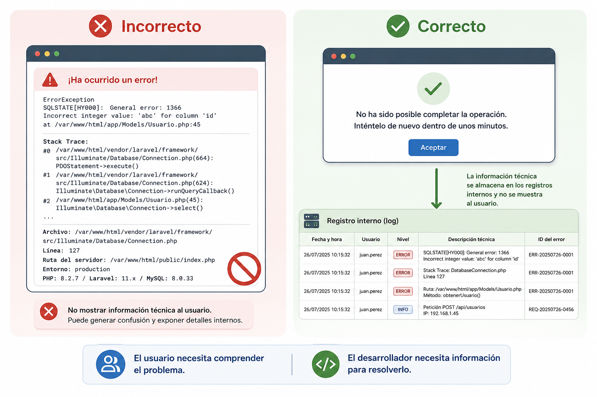
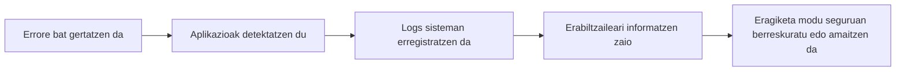
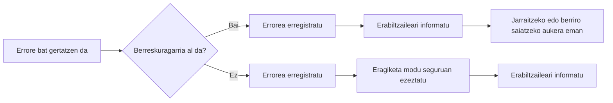
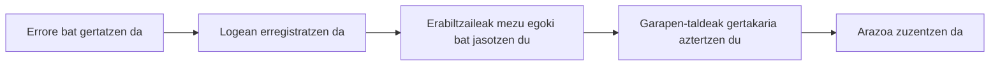
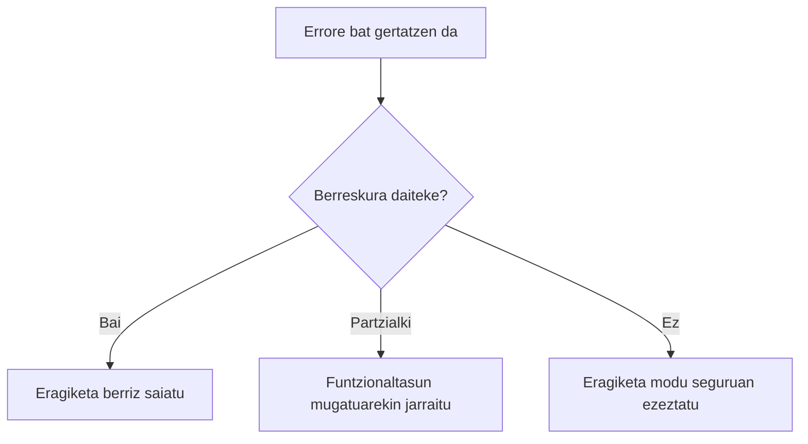
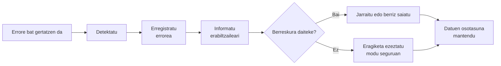

# Erroreen kudeaketa

## Sarrera

Mirenek ikasle berri bat erregistratu du **TxurdiGest**-en. Datu guztiak zuzen sartu ditu: izena, abizenak, NANa, helbide elektronikoa eta taldea. Informazioa berrikusi ondoren, **Gorde** botoia sakatu du.

Segundo batzuetan denak normaltasunez funtzionatzen duela dirudi. Hala ere, une horretan bertan arazo bat gertatzen da datu-base zerbitzarian eta aplikazioak ezin du eragiketa osatu.

Zer gertatu beharko litzateke orain?

Mezu tekniko ulertezin bat erakutsi? Sartutako informazio guztia galdu? Sistemaren barne-xehetasunak agerian utzi? Edo erabiltzaileari modu argian informatu, arazoa erregistratu eta geroago berriro saiatzeko aukera eman?

Galdera horien erantzuna da aplikazio seguru eta kalitatezkoen garapeneko alderdirik garrantzitsuenetako bat.

Aurreko kapituluan ikasi genuen **sarreren balidazio** zuzen batek datu oker asko prozesatzera iristea saihesten duela. Hala ere, datu guztiak baliozkoak direnean ere, aplikazioaren exekuzioan ustekabeko egoerak ager daitezke: datu-base eskuraezina, existitzen ez den fitxategi bat, eten den sare-konexio bat, erantzuteari uzten dion kanpoko zerbitzu bat edo programazio-errore bat.

Aplikazio profesional batek ezin du arazo horiek guztiak gertatzea saihestu, baina bai haien aurrean nola erantzun erabaki dezake.

Erroreak ondo kudeatzeak esan nahi du egoera anomaloak detektatzea, erabiltzaileari behar bezala informazioa ematea, gertakaria erregistratzea analisia errazteko eta, ahal denean, aplikazioak modu seguruan funtzionatzen jarraitzeko aukera ematea.

Erroreen kudeaketa txarrak ez du soilik erabiltzailearen esperientzia kaltetzen. Aplikazioaren segurtasuna ere arriskuan jar dezake, bere funtzionamenduari buruzko barne-informazioa agerian utziz eta erasotzaile posible baten lana erraztuz.

Kapitulu honetan ikasiko dugu nola diseinatu ustekabeko egoeren aurrean modu kontrolatuan erantzuteko gai diren aplikazioak, erroreak softwarearen diseinuaren beste elementu bat bihurtuz, eta ez agertzen denean konpondu beharreko arazo soila.

## Helburuak

Kapitulu hau amaitzean gai izango zara:

- Web aplikazio batean erroreen kudeaketa zer den ulertzeko.
- Aplikazio baten exekuzioan gerta daitezkeen errore mota desberdinak bereizteko.
- Gorabehera mota bakoitzerako erantzun egokiak diseinatzeko.
- Erabiltzaileari behar duen informazioa soilik erakusteko, sistemaren barne-datuak agerian utzi gabe.
- Erroreak behar bezala erregistratzeko, haien diagnostikoa eta mantentzea errazteko.
- Web aplikazio baten sendotasuna, segurtasuna eta erabilera-esperientzia hobetzen dituzten jardunbide egokiak aplikatzeko.

## Zer da erroreen kudeaketa?

Web aplikazio baten exekuzioan, eragiketa bat normaltasunez osatzea eragozten duten egoerak gerta daitezke. Batzuk erabiltzailearen ekintzen ondorio dira, beste batzuk azpiegitura-arazoengatik gertatzen dira, eta beste batzuk programazio-erroreen edo aplikazioak kontrolatu ezin dituen kanpo-egoeren ondorio dira.

**Erroreen kudeaketa** egoera horiek detektatzeko, modu egokian erantzuteko eta erabiltzailearentzat zein sistemarentzat duten eragina minimizatzeko aukera ematen duten tekniken eta prozeduren multzoa da.

Errore bat kudeatzea ez da hutsegite bat gertatu dela adierazten duen mezu bat erakustea bakarrik. Kudeaketa egokiak honako hau dakar:

- Arazoa ahalik eta azkarren detektatzea.
- Aplikazioa egoera inkoherente batean gera ez dadin saihestea.
- Erabiltzaileari modu argi eta ulergarrian informazioa ematea.
- Gertakaria erregistratzea ondorengo analisia errazteko.
- Segurtasuna mantentzea, informazio sentikorra agerian utzi gabe.
- Ahal denean, erabiltzaileari lanean jarraitzeko aukera ematea.

!!! note "Kudeatzea ez da ezkutatzea"

	Erroreen kudeaketa ona ez da arazoak ezkutatzea, baizik eta modu kontrolatuan tratatzea, erabiltzaileari beharrezkoa ez den kalterik ez eragiteko eta aplikazioaren segurtasuna arriskuan ez jartzeko.

**TxurdiGest**-en, adibidez, honelako egoerak gerta daitezke:

- Datu-basea segundo batzuetan erabilgarri egoteari uztea.
- Irakasle bat baimenik ez duen espediente batera sartzen saiatzea.
- Mezu elektronikoak bidaltzeko kanpoko zerbitzuarekin konexioa etetea.
- Ezabatua izan den dokumentu bat deskargatzen saiatzea.
- Kontsulta baten exekuzioan ustekabeko errore bat gertatzea.

Kasu horietan guztietan, aplikazioak modu desberdinean erantzun behar du; izan ere, errore guztiek ez dute jatorri bera eta ez dute tratamendu bera behar.

## Zergatik da garrantzitsua erroreak ondo kudeatzea?

Aplikazio profesional bat ez da inoiz huts egiten ez duelako bereizten, arazo bat agertzen denean nola erantzuten duenagatik baizik.

Erroreak edozein sistema informatikoren funtzionamendu normalaren parte dira. Zerbitzariek erantzuteari utz diezaiokete, konexioak eten daitezke, kanpoko zerbitzuak aldi baterako erabilgarri ez egon daitezke eta beti dago programazio-akats bat agertzeko aukera.

Arazo horiek behar bezala kudeatzen ez badira, ondorio garrantzitsuak izan ditzakete:

- Erabiltzaileak sartzen ari zen informazioa gal dezake.
- Aplikazioa blokeatuta geratu daiteke edo egoera inkoherente batean.
- Datu osatugabeak edo okerrak gorde daitezke.
- Sistemaren barne-arkitekturari buruzko informazio sentikorra ager daiteke.
- Mantentzea eta arazoa kokatzea askoz konplexuagoak izango dira.

Aitzitik, erroreen kudeaketa zuzenak abantaila ugari ematen ditu:

- Erabiltzailearen esperientzia hobetzen du.
- Aplikazioaren sendotasuna handitzen du.
- Softwarearen mantentzea errazten du.
- Gorabeherak kokatzeko behar den denbora murrizten du.
- Segurtasuna indartzen du, barne-informazioaren esposizioa saihestuz.

!!! example "Adibidea"

	Mirenek nota-buletin bat sortzen saiatzen bada eta inprimaketa-zerbitzaria erabilgarri ez badago, honelako mezu batek:

	**Error SQLSTATE[HY000]: Connection refused in DatabaseConnection.php line 127**

	ez dio erabiltzaileari informazio erabilgarririk ematen eta, gainera, sistemaren barne-xehetasunak agerian uzten ditu.

	Aitzitik, honelako mezu batek:

	**Une honetan ezin izan da buletina sortu. Saiatu berriro minutu batzuk barru.**

	erabiltzaileari behar bezala informatzen dio informazio teknikoa agerian utzi gabe, eta gertakaria ondorengo analisirako erregistratzeko aukera ematen du.

{ width="800" align="center" }

*2.2. irudia. Aplikazio profesional batek beharrezko informazioa baino ez dio erakusten erabiltzaileari, eta arazoaren diagnostikoa errazteko xehetasun teknikoak erregistratzen ditu.*


## Errore baten bizi-zikloa

Aplikazio baten exekuzioan arazo bat gertatzen denean, ez litzateke erabiltzaileari mezu bat erakutsi eta prozesua amaitzera mugatu behar. Ondo diseinatutako aplikazio batek arazoa detektatzeko, ondorioak minimizatzeko eta konponketa errazteko urrats batzuk jarraitzen ditu.

Prozesu horri **errore baten bizi-zikloa** deitzen zaio.



Etapa bakoitzak funtzio espezifiko bat betetzen du.

### 1. Errore bat gertatzen da

Erroreak jatorri oso desberdinak izan ditzake. Adibidez:

- Datu-baseko kontsulta batek huts egitea.
- Erabiltzaile bat baimenik gabeko baliabide batera sartzen saiatzea.
- Kanpoko zerbitzu batek erantzuteari uztea.
- Programazio-hutsegite bat gertatzea.
- Zerbitzaria diskoko lekurik gabe geratzea.

Fase honetan aplikazioak oraindik ez du erreakzionatu; ustekabeko egoera bat besterik ez da agertu.

### 2. Aplikazioak arazoa detektatzen du

Errorea gertatu ondoren, aplikazioak identifikatu behar du eragiketak ezin duela normaltasunez jarraitu.

Erabilitako lengoaia edo framework-aren arabera, detekzio hau salbuespenen, itzulera-kodeen, egoera-egiaztapenen edo beste kontrol-mekanismo batzuen bidez egin daiteke.

Garrantzitsuena da errorea **ez pasatzea oharkabean**.

!!! warning "Inoiz ez ezikusi errore bat"

	Errore bat ez ikusi eta aplikazioa exekutatzen jarraitzeak emaitza okerrak, informazio-galera edo gero diagnostikatzeko askoz zailagoak diren portaera aurreikusezinak eragin ditzake.

### 3. Errorea erregistratzen da

Erabiltzaileari informatu aurretik, aplikazioak garapen-taldeak gero gertatutakoa aztertu ahal izateko behar duen informazio guztia erregistratu beharko luke.

Normalean honelako informazioa gordetzen da:

- Data eta ordua.
- Eragiketa egiten ari zen erabiltzailea.
- Exekutatutako ekintza.
- Errorearen mezu teknikoa.
- Non gertatu den (fitxategia edo osagaia).
- Larritasun-maila.

Erregistro hauek, **logs** izenez ezagunak, ezinbestekoak dira gorabeherak kokatzeko eta aplikazioaren mantentzea errazteko.

### 4. Erabiltzaileari informatzen zaio

Erabiltzaileak jakin behar du eragiketa ezin izan dela osatu, baina ez du sistemaren barne-xehetasunak ezagutu behar.

Horregatik, mezuek honako ezaugarriak izan behar dituzte:

- Argiak.
- Ulergarriak.
- Errespetuzkoak.
- Lanean jarraitzeko erabilgarriak.

!!! example "Adibidea"

	Miren matrikula bat gordetzen saiatzen bada eta datu-baseak erantzuteari uzten badio, mezu egoki bat hau izan daiteke:

	**Une honetan ezin izan da eragiketa osatu. Saiatu berriro minutu batzuk barru.**

	Inola ere ez lirateke salbuespenak, SQL kontsultak, zerbitzariaren bideak edo garapen-taldearentzat soilik den informazio teknikoa erakutsi behar.

### 5. Aplikazioa berreskuratu edo eragiketa amaitzen du

Azkenik, aplikazioak erabaki behar du nola jarraitu.

Errore motaren arabera, honako hau egin dezake:

- Erabiltzaileari berriro saiatzeko aukera eman.
- Eragindako eragiketa bakarrik ezeztatu.
- Aplikazioaren aurreko egoera leheneratu.
- Prozesua modu kontrolatuan amaitu.
- Erabiltzailea errore-orri batera birbideratu.

Helburua beti bera da: aplikazioa egoera inkoherente batean gera ez dadin saihestea eta informazioa zein erabiltzailearen esperientzia babestea.

!!! note "Erroreen kudeaketa ona"

	Aplikazio profesional batek ez ditu errore guztiak ezabatzen. Aplikazio ez sendo batetik bereizten duena da erroreak detektatzen, erregistratzen, behar den informazioa bakarrik komunikatzen eta ahalik eta modu seguruenean berreskuratzen jakitea.

## Web aplikazio bateko errore motak

Errore guztiek ez dute kausa bera, eta ez dira modu berean tratatu behar. Nola erantzun erabaki aurretik, arazoaren jatorria identifikatu behar da.

Sailkapen egoki batek egoera bakoitzerako erantzun espezifikoak diseinatzeko aukera ematen du, aplikazioaren segurtasuna, erabiltzailearen esperientzia eta mantentzea hobetuz.

**TxurdiGest**-en errore mota desberdinak aurki ditzakegu.

### Balidazio-erroreak

Erabiltzaileak sartzen dituen datuek aplikazioak ezarritako arauak betetzen ez dituztenean gertatzen dira.

Errore mota hau aurreko kapituluan aztertu bazen ere, erroreen kudeaketa globalaren parte dira, eragiketa bat behar bezala osatzea eragozten dutelako.

Adibideak:

- Formatu okerreko NAN bat.
- Baliozkoa ez den helbide elektroniko bat.
- Segurtasun-politika betetzen ez duen pasahitz bat.
- Nahitaezko eremu huts bat.

Errore hauek ahalik eta azkarren detektatu behar dira, eta erabiltzaileari zein informazio zuzendu behar duen adierazi.

!!! tip "Gogoratu"

	Balidazio-erroreak ez dira sistemaren hutsegiteak. Aurreikusitako egoerak dira, eta aplikazioaren funtzionamendu normalaren parte gisa kudeatu behar dira.

### Autentifikazio- eta baimen-erroreak

Errore hauek erabiltzaile bat aplikaziora sartzen saiatzen denean edo beharrezko baimenik ez duen eragiketa bat egin nahi duenean agertzen dira.

Adibidez:

- Erabiltzaile edo pasahitz okerrak.
- Iraungitako saioa.
- Administratzaileentzat gordetako funtzionaltasun batera sartzea.
- Beste erabiltzaile bati dagokion informazioa aldatzeko saiakera.

Aplikazioak eragiketa eragotzi behar du eta arazoa komunikatu, informazio gehigarririk agerian utzi gabe.

!!! warning "Ez eman arrastorik"

	**"Erabiltzailea existitzen da baina pasahitza okerra da"** bezalako mezuak erasotzaile baten lana errazten dute.

	Hobe da mezu generikoak erabiltzea, adibidez:

	**Erabiltzailea edo pasahitza okerrak dira.**

### Negozio-logikako erroreak

Arazo guztiak ez dira errore teknikoak. Askotan, eskatutako eragiketak aplikazioaren arau propio bat urratzen du.

Adibidez, **TxurdiGest**-en:

- Ikasle bera ikastaro berean bi aldiz matrikulatzea.
- Oraindik gainditu gabeko ikasgaiak dituen espediente bat ixtea.
- Irakasle bat bere departamentuarekin bateragarria ez den talde bati esleitzea.

Aplikazioak ondo funtzionatzen du, baina eskatutako eragiketa ez da baliozkoa negozio-arauen arabera.

### Azpiegitura-erroreak

Aplikazioaren funtzionamendurako beharrezko baliabideren bat erabilgarri egoteari uzten dionean gertatzen dira.

Adibide batzuk:

- Datu-baseak ez du erantzuten.
- Fitxategi-zerbitzaria eskuraezina dago.
- Ez dago Interneteko konexiorik.
- Zerbitzaria diskoko lekurik gabe geratzen da.

Kasu horietan, normalean erabiltzaileak ezin du arazoa konpondu; beraz, aplikazioak gorabeheraren berri eman behar du eta xehetasun guztiak erregistratu ondorengo analisirako.

### Kanpoko zerbitzuen erroreak

Aplikazio askok hirugarrenek emandako zerbitzuen mende daude.

Adibidez:

- Mezu elektronikoen bidalketa.
- Ordainketa-pasabideak.
- Autentifikazio-zerbitzuak.
- Erakunde ofizialetako APIak.
- Hodeiko biltegiratze-plataformak.

Zerbitzu horietako batek erantzuteari uzten badio, aplikazioak egoera kudeatu behar du gainerako sistema erabat blokeatu gabe.

### Ustekabeko erroreak

Aplikazioaren garapenean aurreikusi ez ziren erroreak dira.

Honengatik izan daitezke:

- Programazio-akatsak.
- Salbuespenezko egoerak.
- Datu hondatuak.
- Kontuan hartu gabeko egoeren konbinazioak.

Errore mota hau ez da inoiz erabat desagertuko. Horregatik, aplikazio guztiek haiek harrapatzeko, erregistratzeko eta modu kontrolatuan erantzuteko mekanismoak izan behar dituzte.

!!! note "Estrategiarik onena"

	Errore guztiak aurreikustea ezinezkoa bada ere, aplikazioa presta daiteke agertzen direnean behar bezala erreakzionatzeko.

## Zer egin behar du aplikazio batek errorea gertatzen denean?

Errore bat gertatzen denean, aplikazioak ez du huts egin dela dioen mezu bat erakustera mugatu behar. Inprobisatutako erantzun batek informazio-galera, ustekabeko portaerak edo sistemaren segurtasuna arriskuan jartzea eragin dezake.

Aplikazio profesional batek beti jarraitu behar du edozein gorabehera kudeatzeko estrategia definitu bat.

Hurrengo diagramak gomendatutako prozesua laburbiltzen du:



Aplikazio bakoitzak prozesu hau bere beharretara egokitu badezake ere, badira beti errespetatu beharreko printzipio batzuk.

### Errorea berehala detektatu

Aplikazioak eragiketa garrantzitsu bakoitzaren emaitza egiaztatu behar du.

Adibidez:

- Datu-basera sartzea.
- Fitxategi bat gordetzea.
- Kanpoko API bat kontsumitzea.
- Mezu elektroniko bat bidaltzea.
- Segurtasun-kopia bat egitea.

Arazoa zenbat eta lehenago detektatu, orduan eta txikiagoak izango dira ondorioak.

### Eragindako eragiketa bakarrik eten

Errore guztiek ez dute aplikazio osoa gelditzea eskatzen.

Eragiketa jakin batek huts egiten badu, gomendagarria da eragiketa hori bakarrik ezeztatzea eta gainerako sistemak normaltasunez funtzionatzen jarraitzea.

!!! example "Adibidea"

	**TxurdiGest**-ek PDF formatuan ziurtagiri bat sortu ezin badu, erabiltzaileak espedienteak kontsultatzen, datu pertsonalak aldatzen edo beste zeregin batzuk egiten jarraitu beharko luke.

### Beharrezko informazio guztia erregistratu

Erabiltzaileari informatu aurretik, aplikazioak gertakaria gero aztertzeko aukera emango duen informazio guztia gorde behar du.

Erregistro egoki batek honako hauek jaso ditzake:

- Data eta ordua.
- Autentifikatutako erabiltzailea.
- Egindako eragiketa.
- Larritasun-maila.
- Errorearen deskribapen teknikoa.
- Eragindako osagaia.

Datu horiek oso erabilgarriak izango dira arazoaren jatorria aurkitzeko, berriz erreproduzitu beharrik gabe.

### Erabiltzaileari modu egokian informatu

Erabiltzaileak jakin behar du eragiketa ezin izan dela osatu, baina ez du aplikazioaren barne-funtzionamendua ezagutu behar.

Mezuek lau ezaugarri bete behar dituzte:

- Argiak.
- Laburrak.
- Ulergarriak.
- Konponbidera bideratuak.

Adibidez:

✅ **Ezin izan dira aldaketak gorde. Saiatu berriro minutu batzuk barru.**

Aitzitik, honelako mezu batek:

❌ **Fatal error: Uncaught PDOException...**

nahasmena baino ez du sortzen eta, gainera, informazio sentikorra agerian uzten du.

### Aplikazioa egoera koherentean mantendu

Eragiketa bat osatu gabe geratzen bada, aplikazioak ziurtatu behar du datuak ez direla partzialki gordeta geratzen.

Adibidez, ikasle baten matrikulazioan informazio pertsonala ondo erregistratzen bada baina espediente akademikoa sortzeak huts egiten badu, sistemak eragiketa osoa ezeztatu beharko luke inkoherentziak saihesteko.

!!! note "Eragiketa atomikoak"

	Ahal den guztietan, erlazionatutako hainbat datu aldatzen dituzten eragiketak lan-unitate bakar gisa exekutatu beharko lirateke. Zati batek huts egiten badu, eragiketa osoa desegin behar da.

### Ahal denean berreskuratzeko aukera eman

Errore asko aldi baterakoak dira.

Une bateko konexio-galera edo saturatutako kanpoko zerbitzu bat konpon daitezke erabiltzaileari segundo batzuk geroago berriro saiatzeko aukera emanez.

Ahal den guztietan, aplikazioak berreskuratze hori erraztu beharko luke, erabiltzailea egindako lan guztia errepikatzera behartu gabe.

!!! tip "Erabiltzaile-esperientzia ona"

	Mirenek minutu batzuk daramatzanean formulario bat betetzen, errore batek ez lioke informazio guztia berriro sartzera behartu behar. Ahal den guztietan, aplikazioak dagoeneko sartutako datuak gorde eta eragiketa berriz saiatzeko aukera eman beharko luke.

## Zein informazio erakutsi erabiltzaileari eta zein ez inoiz erakutsi

Errore bat gertatzen denean, aplikazioak erabiltzaileari informatu behar dio eragiketa ezin izan dela osatu. Hala ere, alde handia dago **informatzearen** eta **sistemaren barne-informazioa erakustearen** artean.

Garapenean ohiko akatsetako bat da garatzaileentzat pentsatutako mezu teknikoak erakustea, erabiltzaileentzat ulergarriak diren mezuen ordez.

Erroreen kudeaketa on batek bi helburu bete behar ditu:

- Erabiltzaileari zer gertatu den ulertzen laguntzea.
- Aplikazioaren barne-informazioa babestea.

### Zein informazio erakutsi behar den

Erabiltzaileari zuzendutako mezuak, ahal den guztietan, hiru galderari erantzun beharko lieke:

- Zer gertatu da?
- Zer egin dezake orain?
- Berriro saiatu behar al du edo laguntza teknikoko taldearekin harremanetan jarri?

Adibidez:

| Egoera | Gomendatutako mezua |
|-----------|---------------------|
| Zerbitzariaren aldi baterako errorea | Eragiketa ezin izan da osatu. Saiatu berriro minutu batzuk barru. |
| Existitzen ez den fitxategia | Eskatutako dokumentua ez dago erabilgarri. |
| Baimenik gabeko sarbidea | Ez duzu eragiketa hau egiteko baimenik. |
| Kanpoko zerbitzua erabilgarri ez | Zerbitzua une honetan ez dago erabilgarri. Saiatu geroago. |

Mezu hauek erabiltzaileari egoera ulertzeko aukera ematen diote xehetasun teknikorik ezagutu beharrik gabe.

### Inoiz erakutsi behar ez den informazioa

Errore-mezuek ez lukete inoiz aplikazioaren barne-informaziorik jaso behar.

Adibidez:

- SQL kontsultak.
- Fitxategi-sistemaren bideak.
- Taulen edo datu-baseen izenak.
- Barneko IP helbideak.
- Zerbitzariaren edo framework-aren bertsioak.
- Salbuespenen trazadura osoak (*stack traces*).
- Kredentzialak edo sarbide-gakoak.
- Iturburu-kodea.

Informazio hori guztia oso erabilgarria izan daiteke garatzaile batentzat arazketa-fasean, baina baita erasotzaile bati arrasto baliotsuak emateko ere.

!!! warning "Errore bat ahultasun bihur daiteke"

	Eraso asko errore-mezu xeheegietatik informazioa lortuz hasten dira. Aplikazio batek bere barne-funtzionamenduari buruz zenbat eta informazio gehiago erakutsi, orduan eta errazagoa izango da eraso bat planifikatzea.

### Errore-mezu ona

Demagun Miren matrikula berri bat gordetzen saiatzen dela eta datu-baseak erantzuteari uzten diola.

Erantzun desegoki bat hau litzateke:

```text
Fatal error: Uncaught PDOException: SQLSTATE[HY000] [2002] Connection refused
```

Mezu horrek erabilitako teknologiari buruzko informazioa erakusten du, datu-basera sartzeko mekanismoa azaltzen du eta azpiegitura identifikatzea ere erraztu dezake.

Erantzun egokiagoa hau litzateke:

```text
Une honetan ezin izan da matrikula gorde.
Saiatu berriro minutu batzuk barru.
```

Bitartean, beharrezko informazio tekniko guztia erregistro-sisteman (*logs*) gorde beharko litzateke, baimendutako langileek bakarrik kontsultatu ahal izateko.

!!! note "Bi hartzaile desberdin"

	Errore berak bi informazio mota sortzen ditu:

	- **Erabiltzaileak** mezu argi, sinple eta konponbidera bideratua behar du.
	- **Garapen-taldeak** arazoa diagnostikatu eta konpontzeko informazio tekniko nahikoa behar du.

	Bi informazio mota horiek ez dira inoiz nahastu behar.

## Erroreen erregistroa (logging)

Errore bat gertatzen denean, ez da nahikoa erabiltzaileari informazioa ematea. Aplikazioak garapen-taldeak gero gertatutakoa azter dezan behar duen informazio guztia ere erregistratu behar du.

Prozesu horri **erroreen erregistroa** edo **logging** deitzen zaio.

Erregistroek zer gertatu den, noiz gertatu den eta arazoa zein egoeratan sortu den jakiteko aukera ematen dute, mantentze- eta arazketa-lanak asko erraztuz.



Erabiltzaileek errore-mezua bakarrik ikusten dute. Informazio tekniko guztia erregistro-sisteman gordetzen da.

### Zer informazio erregistratu beharko litzateke?

Ez dago errore bat erregistratzeko modu bakarra, baina gutxienez erregistro batek gertatutakoa berreraikitzeko adina informazio jaso beharko luke.

Normalean honako hau gordetzen da:

- Errorearen data eta ordua.
- Autentifikatutako erabiltzailea (balego).
- Egiten ari zen eragiketa.
- Larritasun-maila.
- Errorearen mezu teknikoa.
- Gertatu den osagaia.
- Eragiketa egin den IP helbidea edo ekipoa.

Erregistroak zenbat eta informazio erabilgarri gehiago izan, orduan eta errazagoa izango da arazoaren jatorria aurkitzea.

### Larritasun-mailak

Errore guztiek ez dute garrantzi bera.

Horregatik, aplikazio gehienek erregistroak larritasun-mailaren arabera sailkatzen dituzte.

| Maila | Deskribapena |
|-------|-------------|
| **DEBUG** | Garapenean erabilgarria den informazioa. |
| **INFO** | Aplikazioaren funtzionamendu normaleko gertaerak. |
| **WARNING** | Lanean jarraitzea eragozten ez duten egoera anomaloak. |
| **ERROR** | Eragiketa bat osatzea eragozten duten hutsegiteak. |
| **CRITICAL** | Sistemaren funtzionamenduari eragiten dioten errore larriak. |

Sailkapen horrek garrantzitsuenak diren gorabeherak azkar aurkitzea ahalbidetzen du.

### Adibidea TxurdiGest-en

Demagun Miren ikasle bat matrikulatzen saiatzen dela eta prozesuan datu-baseak erantzuteari uzten diola.

Erabiltzaileak honako mezu hau ikus lezake:

```text
Une honetan ezin izan da matrikula osatu.
Saiatu berriro minutu batzuk barru.
```

Bitartean, sistemak honelako informazioa erregistra lezake:

```text
[2026-03-15 10:42:18] ERROR

Usuario: miren.garcia
Operación: Alta de matrícula
Módulo: Matrículas
Descripción: Error de conexión con la base de datos.
```

Ikus daitekeenez, erabiltzaileak behar duen informazioa bakarrik jasotzen du, eta garapen-taldeak, berriz, gertakaria ikertzeko behar dituen datu guztiak ditu.

!!! warning "Inoiz ez erregistratu informazio sentikorra"

	Erregistro-fitxategiek ere ez dute datu konfidentzialik eduki behar, hala nola pasahitzak, banku-txartelen zenbaki osoak, API gakoak edo informazio medikoa.

	Erregistroak sistemaren administratzaileek kontsulta ditzakete eta, behar bezala babesten ez badira, informazio-ihesaren iturri bihur daitezke.

### Erroreen erregistrorako jardunbide egokiak

Erregistro-sistema diseinatzean, komeni da gomendio batzuk jarraitzea:

- Benetan erabilgarria den informazioa bakarrik erregistratzea.
- Larritasun-maila zuzen sailkatzea.
- Informazio konfidentziala gordetzea saihestea.
- Erregistro-fitxategietarako sarbidea babestea.
- Erregistroak aldizka berrikustea, errepikatzen diren gorabeherak detektatzeko.
- Errore kritikoak gertatzen direnean alertak automatizatzea.

!!! tip "Erregistroak ez du errorea konpontzen"

	Errore bat erregistratzeak ez du berriro gertatzea saihesten, baina jatorria ulertu eta behin betiko zuzentzeko behar den informazioa ematen du.

## Erroretik berreskuratzeko estrategiak

Errore guztiek ez dute eragiketa bat ezeztatzea eskatzen. Askotan aplikazioa partzialki edo osorik berreskura daiteke, erabiltzaileari ia etenik gabe lanean jarraitzeko aukera emanez.

Estrategia egokia aukeratzea errore motaren, larritasunaren eta datuen osotasunean izan dezakeen eraginaren araberakoa izango da.



Jarraian, estrategiarik ohikoenetako batzuk deskribatzen dira.

### Eragiketa berriz saiatzea

Errore batzuk aldi baterakoak dira.

Adibidez:

- Kanpoko zerbitzu batek segundo batzuk behar ditu erantzuteko.
- Sarearen une bateko eten bat gertatzen da.
- Datu-basea mantentze-eragiketa bat egiten ari da.

Kasu horietan nahikoa izan daiteke eragiketa automatikoki berriz saiatzea edo erabiltzaileari eskuz egiteko aukera ematea.

!!! example "Adibidea"

	TxurdiGest-ek ezin badu matrikula berrespeneko mezu elektronikoa bidali posta-zerbitzariak ez duelako erantzuten, segundo batzuk geroago berriro saia daiteke erabiltzaileak eragiketa osoa errepikatu beharrik gabe.

### Funtzionaltasun mugatuarekin jarraitzea

Ez da beti beharrezkoa aplikazioa erabat gelditzea.

Osagai batek funtzionatzeari uzten badio, gainerako sistemak osagai horren mende ez dauden zerbitzuak eskaintzen jarrai dezake.

Adibidez:

- Espedienteak kontsultatzea, inprimaketa-zerbitzua erabilgarri ez egon arren.
- Datu pertsonalak aldatzea, jakinarazpenen bidalketak huts egin arren.
- Informazioa bistaratzea, dokumentuak deskargatu ezin direnean ere.

Estrategia honek sistemaren erabilgarritasuna hobetzen du eta gorabeheren eragina murrizten du.

### Eragiketa modu seguruan ezeztatzea

Erroreak datuen osotasuna arriskuan jartzen duenean, erabakirik onena eragiketa erabat ezeztatzea da.

Kasu horietan hobe da aldaketarik ez egitea, informazioa osatugabe gordeta uztea baino.

!!! example "Adibidea"

	Ikasle baten matrikulazioan espediente akademikoa sortzeak huts egiten badu, aplikazioak ez luke informazioaren zati bat bakarrik gorde behar. Zuzena da eragiketa osoa ezeztatzea, datuen koherentzia mantentzeko.

### Erabiltzaileari ekintza berri bat eskatzea

Batzuetan aplikazioak erabiltzailearen esku-hartzea behar du jarraitu ahal izateko.

Adibidez:

- Saioa berriz hastea, saioa iraungi delako.
- Existitzen ez den fitxategi bat berriro hautatzea.
- Gaizki sartutako datu bat zuzentzea.

Kasu horietan, aplikazioak argi azaldu behar du erabiltzaileak zer egin behar duen egoera konpontzeko.

### Errorea kontuan hartuta diseinatzea

Aplikazio sendo bat ez da garatzen dena beti ondo funtzionatuko dela suposatuz.

Dizainuan zehar, komeni da honelako galderak egitea:

- Zer gertatuko da datu-baseak erantzuteari uzten badio?
- Zer gertatzen da mezu elektroniko baten bidalketak huts egiten badu?
- Zer gertatzen da kanpoko zerbitzu bat erabilgarri ez badago?
- Nola saihestu erabiltzaileak sartutako informazioa galtzea?

Garapenean zehar galdera horiei erantzuteak aplikazio askoz fidagarriagoak eta mantentzeko errazagoak eraikitzeko aukera ematen du.

!!! tip "Aplikazio sendoa"

	Aplikazio profesional bat ez da inoiz errorerik gertatzen ez dena, erroreak agertzen direnean behar bezala kudeatzeko prestatuta dagoena baizik.

## Jardunbide egokiak

Erroreen kudeaketa egokiak web aplikazio baten segurtasuna, egonkortasuna eta kalitatea hobetzen laguntzen du. Proiektu bakoitzak bere ezaugarriak izan arren, badira edozein garapenetan aplikatzea komeni den gomendio batzuk.

- Datuak beti balidatzea prozesatu aurretik.
- Erroreak ahalik eta azkarren detektatzea.
- Garrantzitsuak diren gorabehera guztiak erregistratzea.
- Erabiltzailearentzat mezu argi eta ulergarriak erakustea.
- Sistemaren barne-informazioa agerian uztea saihestea.
- Eragiketa batek huts egiten duenean datuen koherentzia mantentzea.
- Berreskuragarriak diren erroreak eta eragiketa ezeztatzera behartzen dutenak bereiztea.
- Erregistroak aldizka berrikustea, arazo errepikariak detektatzeko.
- Aplikazioa diseinatzea erroreak edozein unetan gerta daitezkeela pentsatuta.
- Aplikazioaren portaera egoera berezietan probatzea, ez bakarrik dena ondo dabilenean.

!!! tip "Jardunbide egoki bat"

	Galdetu zeure buruari beti zer gertatuko den eragiketa batek huts egiten badu. Kodea idatzi aurretik erantzuna baduzu, ziurrenik aplikazioa askoz sendoagoa izango da.

## Ohiko akatsak

Aplikazioen garapenean ohikoa da gorabeheren kudeaketarekin lotutako akatsak egitea. Ohikoenetako batzuk hauek dira:

- Erabiltzaileari salbuespen osoak erakustea.
- SQL kontsultak, zerbitzariaren bideak edo informazio teknikoa agerian uztea.
- Erroreak logs sisteman ez erregistratzea.
- Salbuespen bati ezikusia egitea eta aplikazioa exekutatzen jarraitzea.
- Errore guztietarako mezu bera erabiltzea.
- Erabiltzaileari eragiketa batek huts egin duela ez jakinaraztea.
- Errore baten ondoren datuak partzialki gordeta uztea.
- Nabigatzailean egindako balidazioan bakarrik fidatzea.
- Kanpoko zerbitzu batek huts egiten duenean aplikazioaren portaera ez probatzea.

!!! warning "Gogoratu"

	Segurtasun-ahultasun asko ez dira errore bat existitzeagatik agertzen, errore hori gaizki kudeatzen delako baizik.

## Zer aldatzen da garatzailearentzat?

Erroreak kudeatzen ikasteak aldaketa garrantzitsua dakar aplikazioak garatzeko moduan.

Helburua ez da soilik programa dena ondo doanean funtzionatzea. Espero ez ziren egoerak agertzen direnean ere behar bezala erantzun behar du.

Aurrerantzean, aplikazio bat diseinatzerakoan, honelako galderak planteatu beharko dira:

- Zer huts egin dezake eragiketa honetan?
- Nola detektatuko dut arazo hori?
- Zer informazio behar du benetan erabiltzaileak?
- Zer datu erregistratu behar ditut gertakaria ikertu ahal izateko?
- Nola saihestuko dut aplikazioa egoera inkoherente batean geratzea?

Horrela pentsatzeak aplikazio sendoagoak, seguruagoak eta mantentzeko askoz errazagoak garatzeko aukera ematen du.

Azken batean, erroreak ondo kudeatzea ez da arazoak agertzen direnean konpontzea bakarrik, baizik eta haiekin bizitzeko prestatutako aplikazioak diseinatzea.

## Gogoratzeko

- Erroreak edozein aplikazioren funtzionamendu normalaren parte dira.
- Errore guztiek ez dute jatorri bera, ezta erantzun bera behar ere.
- Aplikazio profesional batek erroreak modu kontrolatuan detektatu, erregistratu eta kudeatu behar ditu.
- Erabiltzaileak mezu argi eta ulergarriak jaso behar ditu.
- Informazio teknikoa sistemaren erregistroetan gorde behar da, inoiz ez erabiltzaileari erakutsi.
- Erroreen kudeaketa on batek aplikazioaren segurtasuna, erabiltzaile-esperientzia eta mantentzea hobetzen ditu.

## Ideia gakoak

- Erroreak kudeatzea garapen seguruaren funtsezko partea da.
- Gaizki kudeatutako errore bat segurtasun-ahultasun bihur daiteke.
- Erregistroak (*logs*) funtsezkoak dira gorabeherak diagnostikatu eta konpontzeko.
- Aplikazioak beti mantendu behar du datuen osotasuna, baita eragiketa batek huts egiten duenean ere.
- Aplikazio sendoak diseinatzeak aurreikustea eskatzen du nola jardungo duten ustekabeko egoerak agertzen direnean.

Hurrengo kapituluan web aplikazio bat babesteko bi mekanismo funtsezko aztertuko ditugu: **autentifikazioa** eta **baimen-kudeaketa**. Ikasiko dugu nola egiaztatu erabiltzaileen identitatea eta nola kontrolatu haietako bakoitzak sistemaren barruan zer ekintza egin ditzakeen.
## TxurdiGest-eko erroreen kudeaketaren laburpena

Hurrengo taulak laburbiltzen du nola jardun beharko lukeen **TxurdiGest**-ek kapitulu honetan aztertutako errore mota desberdinen aurrean.

| Errore mota | Erabiltzaileak konpon dezake? | Erregistratu behar da? | Informazio teknikoa erakutsi? | Gomendatutako erantzuna |
|-------------------------------|:----------------------------:|:-----------------:|:----------------------------:|---------------------------------------------------------|
| Datuen balidazioa | Bai | Ez* | Ez | Sartutako datuak zuzentzea eskatu. |
| Autentifikazioa | Bai | Bai | Ez | Kredentzialak ez direla baliozkoak direla jakinarazi edo saioa berriro hasteko eskatu. |
| Baimen-kudeaketa | Ez | Bai | Ez | Sarbidea ukatu eta baimen nahikorik ez duela jakinarazi. |
| Negozio-logika | Bai | Bai | Ez | Azaldu zergatik ezin den eragiketa egin eta nola konpondu egoera. |
| Azpiegitura | Ez | Bai | Ez | Eragiketa modu seguruan ezeztatu eta zerbitzua erabilgarri ez dagoela jakinarazi. |
| Kanpoko zerbitzuak | Ez | Bai | Ez | Eragiketa berriz saiatzeko aukera eman edo, posible bada, lanean jarraitzea ahalbidetu. |
| Ustekabeko errorea | Ez | Bai | Ez | Eskuragarri dagoen informazio guztia erregistratu, aplikazioa babestu eta erabiltzaileari mezu generiko baten bidez informatu. |

!!! note "Balidazio-erroreei buruz"

	Balidazio-erroreak aplikazioaren funtzionamendu normalaren parte dira. Kasu gehienetan ez da beharrezkoa banan-banan erregistratzea, salbu eta behin eta berriz gertatzen badira edo aplikazioaren erabilera desegokiaren saiakera bat adieraz badezakete.

## Sintesi-eskema

Hurrengo diagramak laburbiltzen du aplikazio batek errore bat behar bezala kudeatzeko jarraitu behar duen prozesua.


