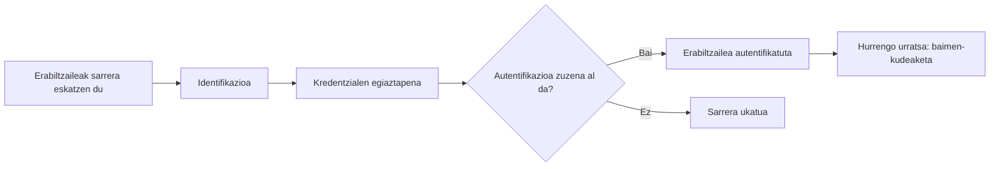

# Autentifikazioa

## Sarrera

**TxurdiGest**-eko erabiltzaileek egunero sartzen dira aplikazioan beren erantzukizunei dagozkien zereginak egiteko.

Hala ere, sarrera baimendu aurretik, aplikazioak oinarrizko galdera bati erantzun behar dio:

> **Benetan al da saioa hasteko saiatzen ari den pertsona dela dioena?**

Galdera horri erantzutea da **autentifikazioaren** helburua.

Autentifikazioa web aplikazio baten lehen segurtasun-hesia da. Erabiltzaile batek bere nortasuna frogatu ezin badu, sistemak ez lioke informaziora sartzen edo inolako eragiketarik egiten utzi behar.

Kapitulu honetan autentifikazioa nola funtzionatzen duen, erabiltzaile baten identitatea egiaztatzeko zer faktore erabil daitezkeen eta web aplikazio baterako sarrera babesteko zer jardunbide egoki aplikatu behar diren aztertuko dugu.

## Helburuak

Kapitulu hau amaitzean gai izango zara:

- Autentifikazioa zer den eta zein helbururekin erabiltzen den ulertzeko.
- Autentifikazioa eta baimen-kudeaketa bereizteko.
- Autentifikazio-faktore nagusiak ezagutzeko.
- Erabiltzaile-izenaren eta pasahitzaren bidezko autentifikazioa nola funtzionatzen duen ulertzeko.
- Autentifikazio multifaktorearen abantailak identifikatzeko.
- Erabiltzaile-kontuak babesteko jardunbide egokiak aplikatzeko.

## Zer da autentifikazioa?

**Autentifikazioa** aplikazio batek erabiltzaile baten identitatea egiaztatzeko egiten duen prozesua da, sistemara sartzen utzi aurretik.

Beste hitz batzuekin esanda, autentifikazioak honako galdera honi erantzuten dio:

> **Nor zara?**

Horri erantzuteko, erabiltzaileak bere nortasuna frogatzen duten froga bat edo gehiago eman behar ditu. Aplikazioak baliozkotzat jotzen baditu, sarbidea baimenduko du; bestela, ukatu egingo du.

!!! note "Autentifikazioa eta identifikazioa"

	Identifikatzea nor den adieraztea da, adibidez erabiltzaile-izen bat sartuz. Autentifikatzea, berriz, identitate hori benetan zuzena dela frogatzea da.

### Adibidea TxurdiGest-en

Irakasle bat **TxurdiGest**-era sartzen saiatzen da.

Erabiltzaile-izena eta pasahitza sartzen ditu. Aplikazioak egiaztatzen du bi datuak baliozko kontu bati dagozkiola.

Egiaztapena zuzena bada, sistemara sartu ahal izango da.

Ez bada zuzena, sarrera ukatu egingo da eta berriro saiatu beharko du.

Une horretan, aplikazioak erabiltzailearen identitatea soilik egiaztatu du. Oraindik ez du erabaki sistemaren barruan zer eragiketa egin ahal izango dituen.

!!! tip "Ideia gakoa"

	Autentifikazioak **erabiltzailea nor den** egiaztatzen du. Egin ahal izango dituen ekintzak geroago erabakiko dira, baimen-kudeaketaren bidez.

## Autentifikazio-faktoreak

Erabiltzaile baten identitatea frogatzeko, autentifikazio-sistemek **autentifikazio-faktore** izeneko froga bat edo gehiago erabiltzen dituzte.

Hiru kategoria nagusi daude.

{ width="800" align="center" }

*2.3 irudia. Autentifikazio-faktoreek erabiltzaile baten identitatea egiaztatzeko aukera ematen dute, informazio edo elementu mota desberdinak erabiliz.*

### Badakizun zerbait

Autentifikazio-modurik ohikoena da.

Erabiltzaileak bere identitatea frogatzen du berak bakarrik jakin beharko lukeen informazioaren bidez.

Adibideak:

- Pasahitz bat.
- PIN bat.
- Segurtasun-galdera baten erantzuna.

### Daukazun zerbait

Erabiltzaileak bere identitatea frogatzen du daukan objektu fisiko bat erabiliz.

Adibideak:

- Sakelako telefono bat.
- Txartel adimendun bat.
- USB segurtasun-giltza bat.
- Aldi baterako kodeak sortzen dituen aplikazio bat.

### Zaren zerbait

Identitatea ezaugarri biometriko baten bidez egiaztatzen da.

Adibideak:

- Hatz-marka.
- Aurpegi-ezagutza.
- Irisa ezagutzea.
- Ahots-ezagutza.

!!! note "Biometria"

	Sistema biometrikoek erabiltzailearentzat erosotasun handia eskaintzen dute, baina datuak babesteko araudia eta dagokion segurtasun-neurriak errespetatuz erabili behar dira.

### Faktoreen konbinazioa

Zenbat eta faktore independente gehiago erabili, orduan eta handiagoa izango da sistemaren segurtasuna.

Adibidez, **TxurdiGest**-era sartzeko, Mirenek bere pasahitza sar lezake eta, gainera, bere sakelako telefonoan jasotako kode baten bidez sarrera berretsi.

Kasu horretan, aplikazioak bi faktore desberdin erabiliko lituzke:

- **Badakizun zerbait:** pasahitza.
- **Daukazun zerbait:** sakelako telefonoa.

Autentifikazio mota horri **autentifikazio multifaktore (MFA)** deitzen zaio eta geroago xehetasun gehiagorekin aztertuko da.

!!! warning "Faktore guztiek ez dute babes bera eskaintzen"

	Bi pasahitz desberdin erabiltzeak ez du esan nahi bi autentifikazio-faktore erabiltzen direnik, biak "badakizun zerbait" kategorian baitaude. Autentifikazio multifaktorea egon dadin, kategoria desberdinetako faktoreak konbinatu behar dira.

## Erabiltzaile-izenaren eta pasahitzaren bidezko autentifikazioa

**Erabiltzaile-izenaren eta pasahitzaren** bidezko autentifikazioa da web aplikazioetan gehien erabiltzen den mekanismoa.

Bere funtzionamendua sinplea da:

1. Erabiltzaileak bere erabiltzaile-izena sartzen du.
2. Pasahitza sartzen du.
3. Aplikazioak egiaztatzen du kredentzialak zuzenak direla.
4. Egiaztapena arrakastatsua bada, sistemara sartzen uzten du.

Prozesu hori sinplea dirudien arren, autentifikazio segurua ez da datu-base batean gordetako pasahitz batekin alderatze hutsa.

### Erabiltzaile-izena

Erabiltzaile-izenak aplikazioaren barruan pertsona bakoitza modu bakarrean identifikatzen du.

Sistemaren arabera, honako hau izan daiteke:

- Erabiltzaile-izen bat.
- Helbide elektroniko bat.
- Barne-identifikatzaile bat.
- Langile-zenbaki bat.

**TxurdiGest**-en, langile bakoitzak identifikatzaile bakarra du aplikaziora sartzeko.

### Pasahitza

Pasahitza erabiltzaileak bakarrik ezagutzen duen sekretua da.

Nahikoa sendoa izan behar du, eraso automatikoen bidez edo erabiltzaileari buruzko informazioa ezagutzen duten pertsonek asmatzea zailtzeko.

Pasahitz seguru batek normalean ezaugarri hauek betetzen ditu:

- Luzera nahikoa du.
- Zaila da asmatzen.
- Ez du informazio pertsonalik.
- Ez da beste zerbitzu batzuetan berrerabiltzen.
- Aldatu egiten da arriskuan egon daitekeela susmatzen denean.

!!! tip "Adibidea"

	**Irakaslea2026** pasahitz ona dirudi, baina erraz ondoriozta daitekeen informazioa dauka. Pasahitz luze eta aurreikustea zaila batek babes askoz handiagoa eskaintzen du.

### Pasahitzak ez dira inoiz testu lauan gorde behar

Garapen seguruaren oinarrizko arauetako bat da **erabiltzaileak sartzen dituen bezala pasahitzak inoiz ez gordetzea**.

Erasotzaile batek datu-basera sartzea lortuko balu, berehala kredentzial guztiak eskuratuko lituzke.

Horren ordez, aplikazioek pasahitzaren irudikapen kriptografiko bat gordetzen dute, **hash** deritzona.

Erabiltzaileak saioa hasten duenean, aplikazioak berriro kalkulatzen du sartutako pasahitzaren hash-a eta gordetakoarekin alderatzen du.

Biak bat badatoz, autentifikazioa zuzena da.

!!! note "Geroago"

	Kriptografiari eskainitako kapituluan xehetasunez aztertuko dugu zer den hash bat eta zergatik diren egokiak **bcrypt** edo **Argon2** bezalako algoritmoak pasahitzak gordetzeko.

### Sarrera saiakeren aurkako babesa

Aplikazio seguru batek erasotzaile bati milaka pasahitz automatikoki probatzen uztea eragotzi behar du.

Ohiko neurri batzuk honako hauek dira:

- Ondoz ondoko saiakera kopurua mugatzea.
- Hainbat akatsen ondoren itxarote-denborak sartzea.
- Kontua aldi baterako blokeatzea portaera anomaloa detektatzen denean.
- Autentifikazio-saiakera huts guztiak erregistratzea.

Neurri horiek nabarmen murrizten dute indar gordinaren eta pasahitzak asmatzeko erasoen arriskua.

### Adibidea TxurdiGest-en

Irakasle batek okerreko pasahitza hiru aldiz jarraian sartzen du.

TxurdiGest-ek ez du kontua behin betiko blokeatzen, baina hurrengo saiakerak minutu batzuetan atzeratzen ditu eta gertakaria auditoriako sisteman erregistratzen du.

Horrela, kontua saihesten da saiakera automatikoen aurrean, baina erabiltzaileak berriro sartu ahal izango du pasahitza ondo gogoratzen duenean.

## Autentifikazio multifaktorea (MFA)

Kasu askotan, pasahitz batek bakarrik ez du babes nahikorik eskaintzen.

Asma daiteke, eraso baten bidez lapurtu edo arriskuan jarritako beste zerbitzu batetik berrerabili.

Arrisku hori murrizteko, aplikazio askok **autentifikazio multifaktorea** erabiltzen dute, **MFA** siglez ere ezaguna (*Multi-Factor Authentication*).

Autentifikazio multifaktoreak erabiltzaileari **kategoria desberdinetako bi autentifikazio-faktore edo gehiago** eskatzen dizkio sistemara sartzeko baimena eman aurretik.

### Nola funtzionatzen du?

Demagun administrazio-langile batek **TxurdiGest**-era sartu nahi duela ordenagailu berri batetik.

Prozesua honakoa izan liteke:

1. Erabiltzaile-izena eta pasahitza sartzen ditu.
2. Aplikazioak egiaztatzen du kredentzialak zuzenak direla.
3. Bigarren urrats gisa, bere sakelako telefonoan sortutako egiaztapen-kode bat eskatzen du.
4. Erabiltzaileak kodea sartzen du.
5. Bi egiaztapenak zuzenak badira, sarrera baimenduta geratzen da.

Adibide honetan bi faktore konbinatzen dira:

- **Badakizun zerbait:** pasahitza.
- **Daukazun zerbait:** sakelako telefonoa.

Erasotzaile batek bietako biak eskuratu beharko lituzke kontura sartzeko.

### Autentifikazio multifaktorearen abantailak

Autentifikazio multifaktoreak abantaila garrantzitsuak eskaintzen ditu:

- Baimenik gabeko sarbideen arriskua murrizten du.
- Pasahitza lapurtu bada ere babesten du.
- Eraso automatizatuak zailtzen ditu.
- Informazio sentikorra duten kontuen segurtasuna handitzen du.

Horregatik, gero eta hedatuago dago banku-aplikazioetan, administrazio elektronikoaren plataformetan, hodeiko zerbitzuetan eta enpresa-aplikazioetan.

### Noiz komeni da MFA erabiltzea?

Edozein aplikaziotan erabil daitekeen arren, bereziki gomendagarria da honako kasuetan:

- Informazio konfidentziala erabiltzen denean.
- Eragiketa ekonomikoak egiten direnean.
- Datu pertsonalak edo osasun-datuak kudeatzen direnean.
- Erabiltzaileek Internetetik sartu ahal dutenean.

**TxurdiGest**-en, autentifikazio multifaktorea bereziki gomendagarria litzateke administrazio-funtzioak dituzten erabiltzaileentzat edo informazio akademiko eta pertsonal bereziki sentikorrerako sarbidea dutenentzat.

!!! warning "Autentifikazio multifaktoreak ez du pasahitz on baten beharra ordezten"

	MFAk segurtasun-geruza gehigarri bat gehitzen du, baina ez du pasahitz sendoak erabiltzeko beharra ezabatzen. Bi mekanismoek elkar osatu behar dute.

!!! tip "Jardunbide egokia"

	Ahal den guztietan, gaitu autentifikazio multifaktorea pribilegio handieneko kontuetan edo informazio bereziki sentikorra kudeatzen dutenetan.

## Jardunbide egokiak

Autentifikazioa web aplikazio baten lehen defentsa-lerroa da. Diseinu egokiak baimenik gabeko sarbideen arriskua murrizten du eta sisteman gordetako informazioa babesten du.

Autentifikazio-mekanismo bat garatzerakoan gomendio hauek jarraitzea komeni da:

- Erabiltzailea identifikatzeko beharrezkoa den informazioa soilik eskatzea.
- Pasahitzak hash algoritmo egokien bidez gordetzea, inoiz ez testu lauan.
- Ondoz ondoko saio-haste saiakerak mugatzea.
- Autentifikazio-hutsegiteak erregistratzea.
- Autentifikazio multifaktorea erabiltzea arrisku-mailak hala eskatzen duenean.
- Konexio seguruak HTTPS bidez erabiltzea derrigorrezkoa izatea.
- Erabiltzaile-kontuei buruzko informazioa agerian uzten duten errore-mezuak saihestea.

!!! tip "Jardunbide egokia"

	Diseinatu sistema suposatuz, noizbait, pasahitz bat arriskuan egongo dela. Helburua egoera horren eragina minimizatzea da.

## Ohiko akatsak

Autentifikazio-sistema bat inplementatzerakoan ohikoa da segurtasuna nabarmen murrizten duten akats batzuk egitea.

Ohikoenak honako hauek dira:

- Pasahitzak testu lauan gordetzea.
- Saio-haste saiakera kopuru mugagabea uztea.
- Zaharkitutako hash algoritmoak erabiltzea.
- Erabiltzailea edo pasahitza okerrak direnean mezu desberdinak erakustea.
- Kredentzialak transmititzeko HTTPS ez erabiltzea.
- Autentifikazioa funtzionalitate gisa hartzea eta ez segurtasun-mekanismo gisa.

!!! warning "Gogoratu"

	Autentifikazio-sistema bat bere puntu ahulena bezain segurua da. Inplementazio-errore txiki batek aplikazioaren kontu guztiak arriskuan jar ditzake.

## Zer aldatzen da garatzailearentzat?

Autentifikazio-sistema bat inplementatzeak ez du soilik saio-haste formulario bat sortzea esan nahi.

Garatzaileak bermatu behar du erabiltzailearen identitatea modu fidagarrian egiaztatzen dela eta kredentzialek tratamendu segurua jasotzen dutela beren bizi-ziklo osoan.

Gainera, autentifikazioa eraso posibleak kontuan hartuta diseinatu behar da, hala nola pasahitzen lapurreta edo sarrera-saiakera masiboak.

Ondo inplementatutako autentifikazioa aplikazioaren gainerako segurtasun-mekanismoak oinarritzen diren oinarria da.

## TxurdiGest-eko autentifikazioaren laburpena

| Alderdia | TxurdiGest-en aplikazioa |
|---------|---------------------------|
| Identifikazioa | Erabiltzaileak bere identitatea erabiltzaile-izen edo identifikatzaile baten bidez adierazten du. |
| Autentifikazioa | Aplikazioak egiaztatzen du kredentzialak baliozkoak direla. |
| Faktoreak | Autentifikazio-faktore bat edo gehiago erabil daitezke. |
| Pasahitzak | Inoiz ez dira testu lauan gordetzen. |
| Babesa | Sarrera-saiakerak mugatzen dira eta gorabeherak erregistratzen dira. |
| Helburua | Erabiltzaile legitimoek bakarrik aplikaziora sartzea bermatzea. |

## Gogoratzeko

- Autentifikazioak erabiltzaile baten identitatea egiaztatzen du.
- Identifikatzea ez da autentifikatzea bera.
- Hiru kategoria nagusi daude autentifikazio-faktoreetan.
- Pasahitzak inoiz ez dira testu lauan gorde behar.
- Autentifikazio multifaktoreak segurtasuna nabarmen handitzen du.
- Autentifikazioa web aplikazio baten lehen babesa-mekanismoa da.

## Ideia gakoak

- Autentifikazioak **«Nor zara?»** galderari erantzuten dio.
- Pasahitz batek, bakarrik, kontu bat babesteko nahikoa ez izatea gerta daiteke.
- Faktore anitz erabiltzeak baimenik gabeko sarbideak zailtzen ditu.
- Autentifikazio-sistema seguru batek erabiltzaileak zein aplikazioaren informazioa babesten ditu.

## Sintesi-eskema

