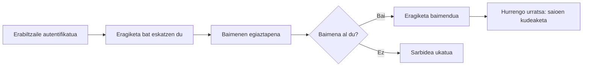

# Baimen-kudeaketa

## Sarrera

Aurreko kapituluan ikusi dugu aplikazio batek erabiltzaile baten identitatea nola egiaztatzen duen autentifikazioaren bidez.

Hala ere, erabiltzaile baten identitatea ezagutzeak ez du esan nahi sistemaren barruan edozein eragiketa egin dezakeenik.

Behin autentifikatuta, aplikazioak erabaki behar du zein baliabidetara sar daitekeen eta zein ekintza egin ditzakeen.

Galdera horiei erantzutea da **baimen-kudeaketaren** helburua.

Kapitulu honetan aztertuko dugu nola kontrolatu web aplikazio bateko baliabideetarako sarbidea, nola antolatu erabiltzaile desberdinen baimenak eta zer jardunbide egoki jarraitu behar diren baimen-sistema seguru bat inplementatzeko.

## Helburuak

Kapitulu hau amaitzean gai izango zara:

- Baimen-kudeaketa zer den eta zein helburu duen ulertzeko.
- Autentifikazioa eta baimen-kudeaketa bereizteko.
- Rolak eta baimenak nola erabiltzen diren baliabideetarako sarbidea kontrolatzeko ulertzeko.
- Pribilegio minimoaren printzipioa ezagutzeko.
- Baimen-sistema segurua inplementatzeko jardunbide egokiak aplikatzeko.

## Zer da baimen-kudeaketa?

**Baimen-kudeaketa** aplikazio batek erabiltzaile batek zein baliabidetara sar daitekeen eta zein eragiketa egiteko baimena duen erabakitzeko prozesua da.

Beste hitz batzuekin esanda, baimen-kudeaketak honako galdera honi erantzuten dio:

> **Zer egin dezakezu?**

Galdera horri erantzuteko, aplikazioak erabiltzaileari buruz duen informazioa erabiltzen du, hala nola bere rola edo esleituta dituen baimenak.

Erabiltzaileak beharrezko baimenak baditu, eragiketa baimentzen da. Bestela, aplikazioak blokeatu egiten du.

!!! note "Autentifikazioa eta baimen-kudeaketa"

	Baimen-kudeaketa erabiltzailea autentifikatu ondoren bakarrik egin daiteke. Lehenik bere identitatea ezagutu behar da eta, ondoren, zer ekintza egin ditzakeen erabaki.

### Adibidea TxurdiGest-en

Irakasle batek **TxurdiGest**-era behar bezala sartzen du.

Bere taldeko kalifikazioak aldatzen saiatzean, aplikazioak egiaztatzen du beharrezko baimena duela eta eragiketa baimentzen du.

Hala ere, erabiltzaile-kontu berri bat sortzen saiatzen bada, aplikazioak ekintza ukatzen du eragiketa hori administratzailearentzat gordeta dagoelako.

!!! tip "Ideia gakoa"

	Baimen-kudeaketak ez du egiaztatzen erabiltzailea nor den, aplikazioaren barruan zer ekintza egin ditzakeen baizik.

## Autentifikazioa eta baimen-kudeaketa: bi kontzeptu desberdin

Bi kontzeptuak askotan batera agertzen diren arren, funtzio desberdinak betetzen dituzte web aplikazio baten barruan.

**Autentifikazioak** erabiltzailearen identitatea egiaztatzen du.

**Baimen-kudeaketak** zein baliabide erabil ditzakeen eta identifikatu ondoren zein eragiketa egin ditzakeen zehazten du.

Hurrengo taulak desberdintasun nagusiak laburbiltzen ditu:

| Autentifikazioa | Baimen-kudeaketa |
|--------------|--------------|
| **«Nor zara?»** galderari erantzuten dio | **«Zer egin dezakezu?»** galderari erantzuten dio |
| Saioa hastean egiten da. | Erabiltzailea baliabide batera sartzen edo ekintza bat exekutatzen saiatzen den bakoitzean aplikatzen da. |
| Erabiltzailearen identitatea egiaztatzen du. | Beharrezko baimenak dituen egiaztatzen du. |
| Aplikaziora sartzeko lehen urratsa da. | Autentifikazioaren ondoren bakarrik egin daiteke. |

Aplikazio seguru batean, bi prozesuek modu osagarrian egiten dute lan. Erabiltzaile baten identitatea ezagutzeak ez du esan nahi informazio guztira sar daitekeenik edo edozein eragiketa exekuta dezakeenik.

## Rolak eta baimenak

Web aplikazio gehienetan, baimen-kudeaketa **rolen** eta **baimenen** konbinazioan oinarritzen da.

**Rol** batek aplikazioaren barruko erantzukizun multzo bat adierazten du.

**Baimen** batek erabiltzaile batek baliabide baten gainean egin dezakeen ekintza zehatz bat definitzen du.

Erabiltzaile bakoitzari banaka baimenak esleitu beharrean, ohikoa da rol desberdinei esleitzea. Ondoren, erabiltzaile bakoitzak dagokion rola jasotzen du.

Ikuspegi horrek sistemaren administrazioa sinplifikatzen du eta segurtasunaren mantentzea errazten du.

### Rolak TxurdiGest-en

**TxurdiGest**-en erabiltzaile mota desberdinak daude, bakoitza bere erantzukizunekin.

| Rola | Baimenen adibideak |
|------|----------------------|
| Administratzailea | Erabiltzaileak sortu, rolak esleitu eta aplikazioaren konfigurazioa kudeatu. |
| Irakaslea | Bere taldeak kontsultatu, kalifikazioak erregistratu eta bere ikasleen informazio akademikoa kudeatu. |
| Ikaslea | Bere kalifikazioak eta informazio pertsonala kontsultatu. |
| Administrazio-langileak | Matrikulak kudeatu eta administrazio-zereginak egin. |

Erabiltzaile bakoitzak bere funtzioak betetzeko beharrezkoak diren baimenak bakarrik ditu.

!!! note "Rola eta baimena"

	Rola ez da baimen bat. Rol batek lotutako hainbat baimen biltzen ditu erabiltzaileen kudeaketa errazteko.

### Baimenen egiaztapena

Baimen-kudeaketa ez da saioa hastean bakarrik egiten.

Erabiltzaile bat baliabide batera sartzen edo eragiketa bat exekutatzen saiatzen den bakoitzean, aplikazioak dagokion baimena duela egiaztatu behar du.

Adibidez, ikasle batek irakasle batek kalifikazioak erregistratzeko erabiltzen duen URL helbidea ezagutu arren, aplikazioak sarbidea eragotzi beharko du bere rolak ez duelako beharrezko baimena.

!!! tip "Jardunbide egokia"

	Inoiz ez fidatu interfazeko aukera ikusgarrietan bakarrik. Baimenen egiaztapena beti egin behar da zerbitzarian, edozein eragiketa exekutatu aurretik.

## Pribilegio minimoaren printzipioa

Segurtasun informatikoaren oinarrizko printzipioetako bat da **pribilegio minimoaren printzipioa**.

Printzipio horrek dio erabiltzaile bakoitzak bere lana egiteko ezinbestekoak diren baimenak bakarrik izan behar dituela, eta gehiago ez.

Pribilegioak murrizteak akats posibleen, sarbide desegokien edo arriskuan jarritako kontuen eragina txikitzen du.

### Adibidea TxurdiGest-en

Irakasle batek bere taldeak kontsultatu eta kalifikazioak erregistratu behar ditu, baina ez du erabiltzaile berriak sortu edo aplikazioaren konfigurazioa aldatu behar.

Era berean, administrazio-langileek matrikulak kudea ditzakete, baina ez lukete beren funtzioak betetzeko beharrezkoa ez den informazio akademikora sartu behar.

Beharrezko baimenak bakarrik esleitzeak segurtasuna hobetzen du eta aplikaziorako sarbide-kontrola errazten du.

!!! warning "Baimen gehiago ez dira produktibitate gehiago"

	Beharrezkoak ez diren baimenak emateak eraso-azalera handitzen du eta baimenik gabeko sarbideak edo informazioaren aldaketa ustekabeak eragin ditzake.

## Jardunbide egokiak

Ondo diseinatutako baimen-sistema batek baimenik gabeko sarbideen arriskua murrizten du eta aplikazioaren baliabideak babesten ditu.

Baimen-kudeaketa mekanismo bat inplementatzerakoan, gomendio hauek jarraitzea komeni da:

- Eragiketa edozein exekutatu aurretik baimenak egiaztatzea.
- Erabiltzaile bakoitzari beharrezkoak diren baimenak bakarrik esleitzea.
- Rolak erabiltzea baimenen kudeaketa sinplifikatzeko.
- Esleitutako baimenak aldizka berrikustea.
- Baimenari buruzko edozein zalantza dagoenean sarbidea lehenespenez ukatzea.
- Murriztutako baliabideetara sartzeko saiakerak erregistratzea.

!!! tip "Jardunbide egokia"

	Egiaztatu beti baimenak zerbitzarian. Erabiltzaile-interfazean bakarrik ezarritako murrizketak erraz saihestu daitezke.

## Ohiko akatsak

Baimen-kudeaketa gaizki inplementatuta badago, erabiltzaile batek baimenik ez duen informaziora sar daiteke edo baimendu gabeko eragiketak egin ditzake.

Akats ohikoenak hauek dira:

- Erabiltzaile-interfazeko murrizketetan bakarrik fidatzea.
- Eragiketa bat exekutatu aurretik baimenak ez egiaztatzea.
- Beharrezkoak baino baimen gehiago esleitzea.
- Kontuak hainbat erabiltzaileren artean partekatzea.
- Jada beharrezkoak ez diren baimenak mantentzea.

!!! warning "Gogoratu"

	Baimen-kudeaketa babestutako baliabide batera sartzen den aldi bakoitzean egiaztatu behar da. Saioa ondo hasita egoteak ez du esan nahi erabiltzaile batek edozein ekintza egin dezakeenik.

## Zer aldatzen da garatzailearentzat?

Baimen-sistema bat inplementatzea ez da interfazeko aukerak ezkutatzea bakarrik.

Garatzaileak bermatu behar du eragiketa bakoitzak erabiltzailearen baimenak egiaztatzen dituela exekutatu aurretik.

Gainera, baimen-kudeaketa modu koherentean aplikatu behar da aplikazio osoan, erabiltzaile batek URL helbideen, HTTP eskaeren edo API deien bidez babestutako baliabideetara sar ez dadin.

Ondo inplementatutako baimen-kudeaketak informazioa babesten du eta erabiltzaileek baimenik ez duten ekintzak egitea saihesten du.

## TxurdiGest-eko baimen-kudeaketaren laburpena

| Alderdia | TxurdiGest-en aplikazioa |
|---------|---------------------------|
| Helburua | Erabiltzaile bakoitzak zer ekintza egin ditzakeen zehaztea. |
| Rolak | Administratzailea, irakaslea, ikaslea eta administrazio-langileak. |
| Baimenak | Rol bakoitzak bere funtzioetarako beharrezkoak diren baimenak bakarrik ditu. |
| Egiaztapena | Aplikazioak baimenak egiaztatzen ditu eragiketa bakoitza exekutatu aurretik. |
| Printzipioa | Arriskuak murrizteko pribilegio minimoa aplikatzen da. |
| Emaitza | Erabiltzaile bakoitza baimendutako baliabideetara bakarrik sartzen da. |

## Gogoratzeko

- Baimen-kudeaketak erabiltzaile batek zein ekintza egin ditzakeen zehazten du.
- Baimen-kudeaketa beti autentifikazioaren ondoren egiten da.
- Rolek lotutako baimenak multzokatzen dituzte.
- Eragiketa bakoitzak baimenak egiaztatu behar ditu exekutatu aurretik.
- Pribilegio minimoaren printzipioak aplikazioaren segurtasuna hobetzen du.
  
## Ideia gakoak

- Baimen-kudeaketak **«Zer egin dezakezu?»** galderari erantzuten dio.
- Autentifikazioa eta baimen-kudeaketa prozesu desberdinak eta osagarriak dira.
- Rolek baimenen kudeaketa sinplifikatzen dute.
- Baimenen egiaztapena beti egin behar da zerbitzarian.
- Erabiltzaile batek bere lana egiteko ezinbestekoak diren baimenak bakarrik izan behar ditu.
  
## Sintesi-eskema

