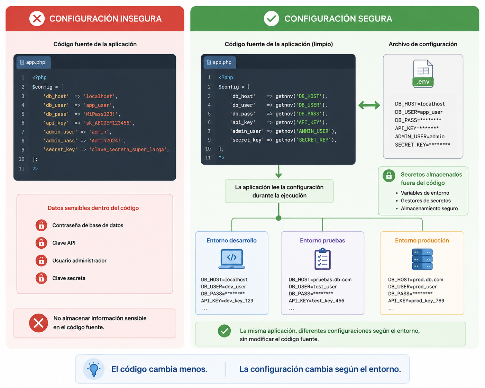
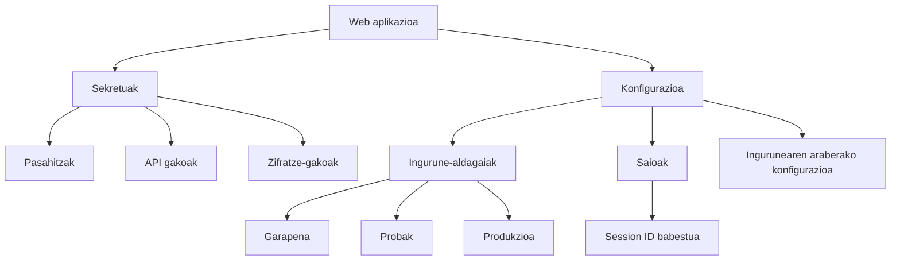

# Sekretuen eta konfigurazioaren kudeaketa

## Sarrera

Aurreko kapituluetan aztertu dugu nola identifikatzen duen aplikazio batek erabiltzailea autentifikazioaren bidez eta nola kontrolatzen dituen egin ditzakeen ekintzak baimen-kudeaketaren bidez.

Hala ere, aplikazio baten segurtasuna ez dago soilik erabiltzaileen mende.

Aplikazioek beraiek ere informazio konfidentziala gorde behar dute behar bezala funtzionatzeko, hala nola datu-baseko pasahitzak, zifratze-gakoak, kanpoko zerbitzuetako kredentzialak edo saio-identifikatzaileak.

Informazio hori babestea funtsezkoa da baimenik gabeko sarbideak saihesteko eta segurtasun-gertakarien eragina murrizteko.

Kapitulu honetan aztertuko dugu zer diren sekretuak, nola kudeatu behar diren modu seguruan, nola konfiguratu aplikazio bat informazio sentikorra agerian utzi gabe eta zer jardunbide egoki jarraitu behar diren datu horiek babesteko.

## Helburuak

Kapitulu hau amaitzean gai izango zara:

- Web aplikazio baten barruan sekretu bat zer den ulertzeko.
- Iturburu-kodean sartu behar ez den informazio sentikorra identifikatzeko.
- Ingurune-aldagaiak eta konfigurazio-fitxategiak nola erabili ulertzeko.
- Saioak segurtasunaren ikuspegitik nola kudeatzen diren ezagutzeko.
- Sekretuak eta konfigurazioak babesteko jardunbide egokiak aplikatzeko.

## Zer dira sekretuak?

Web aplikazio batean badaude konfidentzial mantendu behar diren datuak, baliabideetara sartzeko edo eragiketa sentikorrak egiteko aukera ematen dutelako.

Datu horiei **sekretu** deitzen zaie.

Adibide ohiko batzuk hauek dira:

- Datu-baseetako pasahitzak.
- Zifratze-gakoak.
- API gakoak.
- Kanpoko zerbitzuetako kredentzialak.
- Ziurtagiriak eta gako pribatuak.
- Informazioa sinatzeko edo egiaztatzeko erabiltzen diren sekretuak.

Erasotzaile batek sekretu horietako bat lortzen badu, babestutako baliabideetara sar liteke, informazioa aldatu edo aplikazioa erabat arriskuan jarri.

Horregatik, sekretuak erabiltzaileen informazioarekin bezainbesteko arretaz babestu behar dira.

!!! note "Sekretua"

	Sekretua aplikazio baten edo harekin komunikatzen diren zerbitzuen segurtasuna bermatzeko konfidentzial mantendu behar den edozein informazio da.

### Adibidea TxurdiGest-en

Datu-basera konektatzeko, **TxurdiGest**-ek zerbitzaria, erabiltzailea eta sarbide-pasahitza ezagutu behar ditu.

Datu horiek ezinbestekoak dira aplikazioaren funtzionamendurako, baina ez dira inoiz zuzenean agertu behar iturburu-kodean, ezta biltegi batean argitaratu ere.

!!! tip "Ideia gakoa"

	Sekretu batek ez ditu erabiltzaileak bakarrik babesten; aplikazioaren azpiegitura bera ere babesten du.

## Ingurune-aldagaiak eta konfigurazio-fitxategiak

Aplikazio batek balio jakin batzuk ezagutu behar ditu behar bezala funtzionatzeko.

Adibidez:

- Datu-base zerbitzariaren helbidea.
- Datu-basearen izena.
- Sarbide-kredentzialak.
- Informazioa zifratzeko erabiltzen diren gakoak.
- Kanpoko zerbitzuetako kredentzialak.

Datu horiek aplikazioaren konfigurazioaren parte badira ere, horietako asko sekretuak dira eta behar bezala babestu behar dira.

Horregatik, aplikazio modernoek iturburu-kodea eta konfigurazioa bereizten dituzte normalean, **ingurune-aldagaien** bidez.

Ingurune-aldagaiei esker informazio sentikorra aplikazioaren kodetik kanpo gorde daiteke; gainera, aplikazio bera garapen-, proba- eta produkzio-inguruneetan konfigurazio desberdinekin erabiltzea errazten dute.

!!! note "Ingurune-aldagaiak"

	Ingurune-aldagaia sistema eragileak edo exekuzio-inguruneak emandako konfigurazio-balio bat da, eta aplikazioak exekuzioan dagoenean kontsulta dezake.

{ width="850" align="center" }

*2.5 irudia. Aplikazio seguruek sekretuak iturburu-kodetik kanpo mantentzen dituzte, konfigurazio-mekanismo independenteak erabiliz.*

### Adibidea TxurdiGest-en

Garapen-fasean, **TxurdiGest**-ek probako datu-base bat erabiltzen du.

Aplikazioaren kodea aldatu gabe, nahikoa da ingurune-aldagaiak aldatzea produkzioan zabaltzean behin betiko datu-basea erabiltzeko.

Ikuspegi horrek kodea aldatzea saihesten du exekuzio-ingurunea aldatzen den bakoitzean.

!!! tip "Jardunbide egokia"

	Mantendu kodea konfiguraziotik independente. Horrela aplikazio bera ingurune desberdinetan zabaldu ahal izango da konfigurazio-balioak soilik aldatuta.

## Sekretuen kudeaketa segurua

Sekretuak behar bezala gordetzea haiek erabiltzea bezain garrantzitsua da.

Kredentzialen kudeaketa txarrak erasotzaile bati aplikazioaren azpiegiturara sartzeko aukera eman diezaioke, kodeak ahultasunik ez izan arren.

Horregatik, sekretuak ez dira inoiz zuzenean sartu behar iturburu-kodean.

Era berean, ez dira biltegi publikoetan gorde behar, ezta posta elektronikoz edo mezularitza-aplikazioen bidez partekatu ere.

Garatzaile anitz proiektu berean lanean ari direnean, bakoitzak bere kredentzial propioak izan behar ditu edo konfigurazioa modu seguruan partekatzeko mekanismo espezifikoak erabili.

### Adibidea TxurdiGest-en

**TxurdiGest**-en garapenean, taldeko kide guztiek iturburu-kode bera erabiltzen dute.

Hala ere, ingurune bakoitzak bere konfigurazioa eta bere sarbide-kredentzialak ditu.

Horrela, produkzioko gakoak babestuta mantentzen dira eta ez dira inoiz proiektuaren biltegian sartzen.

!!! warning "Inoiz ez argitaratu sekretuak"

	Pasahitz edo gako pribatu bat biltegi batean argitaratu denean, arriskuan dagoela jo behar da, geroago historiaren azken zatitik ezabatu bada ere.

## Saioen kudeaketa

Erabiltzaile batek saioa behar bezala hasten duenean, aplikazioak bere identitatea gogoratu behar du orri desberdinetan nabigatzen duen bitartean.

Horretarako **saio** bat erabiltzen du, HTTP eskaera desberdinak erabiltzaile berari lotzeko aukera ematen duena.

Saioa normalean **saio-identifikatzaile** baten bidez identifikatzen da (*Session ID*), eta nabigatzaileak automatikoki bidaltzen du eskaera bakoitzean.

Identifikatzaile hori datu sentikorra da. Erasotzaile batek eskuratzen badu, erabiltzailearen plantak egin ditzake pasahitza ezagutu beharrik gabe.

Horregatik, saioen kudeaketa aplikazio baten segurtasun-konfigurazioaren parte da eta arretaz egin behar da.

### Saioen babesa

Saio baten lapurreta edo erabilera desegokiaren arriskua murrizteko, aplikazioek hainbat babes-neurri aplikatu behar dituzte:

- HTTPS konexioak erabiltzea, saio-identifikatzailea zifratu gabe bidaiatu ez dadin.
- Saio-cookieak segurtasun-atributu egokiekin konfiguratzea.
- Autentifikazioaren ondoren saio-identifikatzailea birsortzea.
- Saioa amaitzea jarduerarik gabeko epe baten ondoren edo erabiltzaileak saioa ixten duenean.

!!! note "Saio-identifikatzailea"

	Saio-identifikatzaileak erabiltzaile bat HTTP eskaera desberdinen artean ezagutzeko aukera ematen du. Informazio konfidentzial gisa tratatu behar da.

### Adibidea TxurdiGest-en

Irakasle batek **TxurdiGest**-en saioa hasten du eta bere ikasleen kalifikazioak erregistratzen hasten da.

Lanean ari den bitartean, nabigatzaileak automatikoki bidaltzen du saio-identifikatzailea eskaera bakoitzean, aplikazioak erabiltzailea berriro kredentzialak eskatu gabe ezagutu dezan.

Irakasleak saioa ixten duenean, identifikatzaile hori baliozkoa izateari uzten dio eta ezin da gehiago erabili aplikaziora sartzeko.

!!! tip "Jardunbide egokia"

	Saio batek behar den denbora bakarrik iraun behar du. Saioak denbora luzez aktibo mantentzeak baimenik gabeko sarbideen arriskua handitzen du.

## Jardunbide egokiak

Sekretuen eta konfigurazioaren kudeaketa egokiak nabarmen murrizten du aplikazio baten eraso-azalera.

Web aplikazio bat garatzean gomendagarria da honako hauek jarraitzea:

- Sekretuak iturburu-kodetik kanpo mantentzea.
- Informazio sentikorra gordetzeko ingurune-aldagaiak erabiltzea.
- Saioak HTTPS eta cookie seguruen bidez babestea.
- Saioen iraupena mugatzea.
- Garapen, proba eta produkziorako kredentzial desberdinak erabiltzea.
- Segurtasun-konfigurazioa aldizka berrikustea.

!!! tip "Jardunbide egokia"

	Pentsatu argitaratutako edozein sekretuk sekretu izateari uzten diola. Kredentzial bat agerian geratzen bada, berehala ordezkatu behar da berri batekin.

## Ohiko akatsak

Sekretuen kudeaketa txarrak aplikazio osoa arriskuan jar dezake, kodeak ahultasunik ez badu ere.

Akats ohikoenak hauek dira:

- Pasahitzak edo gakoak zuzenean kodean sartzea.
- Sekretuak kanal ez-seguruen bidez partekatzea.
- Informazio sentikorra duten konfigurazio-fitxategiak argitaratzea.
- Ingurune guztietan kredentzial berak erabiltzea.
- Saioak beharrezkoa dena baino denbora gehiago aktibo mantentzea.

!!! warning "Gogoratu"

	Sekretuen ihes gehienak ez dira hutsegite kriptografikoengatik gertatzen, konfigurazio- edo kudeaketa-erroreengatik baizik.

## Zer aldatzen da garatzailearentzat?

Aplikazio seguru bat garatzeak kodea ez ezik, aplikazioak funtzionatzeko behar duen informazioa ere babestea dakar.

Garatzaileak konfigurazioa iturburu-kodetik bereizi behar du, sekretuak behar bezala kudeatu eta saioak egoki konfiguratu behar ditu baimenik gabeko sarbideen arriskua murrizteko.

Neurri hauek aplikazioaren segurtasuna hobetzeaz gain, ingurune desberdinetan zabalkundea eta mantentzea ere errazten dituzte.

## TxurdiGest-eko sekretuen eta konfigurazioaren kudeaketaren laburpena

| Alderdia | TxurdiGest-en aplikazioa |
|---------|---------------------------|
| Sekretuak | Datu-baseko kredentzialak, zifratze-gakoak eta konfigurazio sentikorra. |
| Konfigurazioa | Iturburu-kodetik bereizita mantentzen da ingurune-aldagaien bidez. |
| Saioak | Aplikazioak saio-identifikatzaileak erabiltzen ditu autentifikatutako erabiltzailea ezagutzeko. |
| Babesa | Sekretuak ez dira kodean gordetzen eta saioak konfigurazio seguru baten bidez babesten dira. |
| Helburua | Aplikazioaren azpiegitura zein erabiltzaileen informazioa babestea. |

## Gogoratzeko

- Sekretuek aplikazioaren baliabide sentikorretara sartzeko aukera ematen dute.
- Konfigurazioa iturburu-kodetik bereizita mantendu behar da.
- Ingurune-aldagaiek konfigurazioaren kudeaketa segurua errazten dute.
- Saio-identifikatzailea beste edozein sekretu bezala babestu behar da.
- Konfigurazio on batek segurtasun-gertakarien arriskua murrizten du.

## Ideia gakoak

- Informazio sentikor guztia ez dagokie erabiltzaileei; aplikazioak ere bere sekretuak ditu.
- Sekretuak ez dira inoiz iturburu-kodean sartu behar.
- Konfigurazioa ingurune bakoitzera egokitu behar da aplikazioa aldatu gabe.
- Saioek erabiltzailea autentifikatuta mantentzen dute eta behar bezala babestu behar dira.
- Sekretuen eta konfigurazioaren kudeaketa web garapen seguruaren funtsezko elementua da.

## Sintesi-eskema

