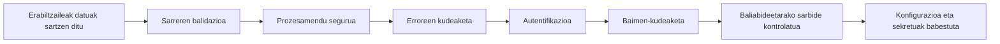
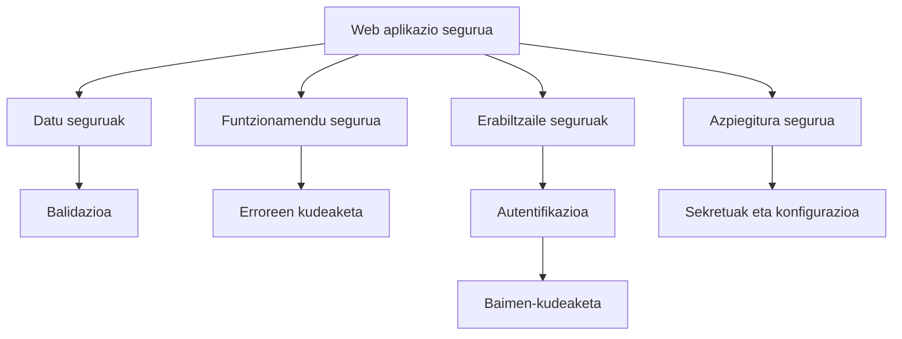

# 2. blokearen laburpena

## Sarrera

Bloke honetan web aplikazio seguruagoak garatzeko aukera ematen duten oinarrizko mekanismo batzuk aztertu ditugu.

Segurtasuna ez dago teknika isolatu bakar baten mende. Aplikazio segurua bere garapen-ziklo osoan neurri desberdinak aplikatuz eraikitzen da.

Datuak behar bezala balidatzea, erroreak kudeatzea, erabiltzaileen sarbidea kontrolatzea eta barne-konfigurazioa babestea alderdi desberdinak dira, baina denak helburu beraren parte dira:

> **Informazioa babesteko eta ustekabeko egoeren aurrean modu seguruan funtzionatzeko gai diren aplikazioak eraikitzea.**

Bloke honetan zehar **TxurdiGest** kasu-azterketa gisa erabili dugu neurri horiek web aplikazio erreal batean nola aplikatu aztertzeko.

---

## Oinarrizko kontzeptuak

### Sarreren balidazioa

Aplikazio batek jasotzen duen informazio oro potentzialki ez-segurutzat hartu behar da.

Erabiltzaileek sartutako datuak, formularioen bidez bidalitakoak edo APIen bidez jasotakoak balidatu egin behar dira prozesatu aurretik.

Balidazioak informazioak honako hauek betetzen dituela egiaztatzeko balio du:

- Espero den formatua duela.
- Definitutako murrizketak betetzen dituela.
- Baimendu gabeko baliorik ez duela.
- Aplikazioak modu seguruan erabil dezakeela.

Aplikazio batek ez luke inoiz zuzenean fidatu behar kanpotik jasotako datuekin.

---

### Erroreen kudeaketa

Erroreak edozein aplikazioren funtzionamendu normalaren parte dira.

Aplikazio seguru batek gai izan behar du:

- Erroreak detektatzeko.
- Horiek aztertzeko beharrezkoa den informazioa erregistratzeko.
- Erabiltzaileari behar bezala informatzeko.
- Sistemaren barne-informazioa erakustea saihesteko.

Gaizki kudeatutako errore bat ahultasun bihur daiteke informazio sentikorra agerian uzten badu edo aplikazioa egoera okerrean uzten badu.

---

### Autentifikazioa

Autentifikazioak erabiltzaile baten identitatea egiaztatzea ahalbidetzen du.

Galdera honi erantzuten dio:

> **Nor zara?**

Horretarako faktore desberdinak erabil daitezke:

- Badakizun zerbait.
- Daukazun zerbait.
- Zaren zerbait.

Autentifikazio seguruak kredentzialak babestea eskatzen du, eta arriskuak hala gomendatzen duenean neurri osagarriak aplikatzea, hala nola autentifikazio multifaktorea.

---

### Baimen-kudeaketa

Baimen-kudeaketak zehazten du erabiltzaile batek zer ekintza egin ditzakeen behin identifikatuta.

Galdera honi erantzuten dio:

> **Zer egin dezakezu?**

Rolen eta baimenen bidez, aplikazioak baliabideetarako sarbidea kontrolatzen du eta erabiltzaile batek baimenik ez duen eragiketarik egitea saihesten du.

Oinarrizko printzipioa hau da:

> Erabiltzaile bakoitzak bere funtzioak betetzeko beharrezko baimenak bakarrik izan behar ditu.

---

### Sekretuen eta konfigurazioaren kudeaketa

Aplikazioek barne-informazioa behar dute behar bezala funtzionatzeko.

Datu horien artean daude:

- Datu-baseetako pasahitzak.
- Zifratze-gakoak.
- API gakoak.
- Ingurune bakoitzerako konfigurazio espezifikoak.
- Saioekin lotutako informazioa.

Datu horiek babestu egin behar dira eta iturburu-kodetik bereizita mantendu.

Aplikazio seguru batek erabiltzaileen datuak ez ezik, bere barne-sekretuak ere babesten ditu.

---

## Mekanismo desberdinak nola lotzen diren

Bloke honetan aztertutako mekanismoek ez dute modu independentean funtzionatzen.

Guztiak babes-kate baten parte dira:

Mekanismo bakoitzak behar desberdin bat estaltzen du:

| Mekanismoa | Helburua |
|-----------|----------|
| Balidazioa | Jasotako datuak kontrolatzea. |
| Erroreen kudeaketa | Hutsegiteen aurrean behar bezala erantzutea. |
| Autentifikazioa | Erabiltzailearen identitatea egiaztatzea. |
| Baimen-kudeaketa | Baimendutako ekintzak kontrolatzea. |
| Sekretuen kudeaketa | Aplikazioaren barne-informazioa babestea. |

---

## Jardunbide egoki orokorrak

Bloke honetan zehar edozein web garapenetan aplikatu beharreko gomendio batzuk ikusi ditugu:

- Inoiz ez fidatzea kanpotik jasotako datuekin.
- Erabiltzaileari erakutsitako informazioa eta barneko informazio teknikoa bereiztea.
- Aplikazioaren kredentzialak eta sekretuak babestea.
- Sarbide-kontrolak beti zerbitzarian aplikatzea.
- Pribilegio minimoaren printzipioa erabiltzea.
- Erroreak informazio sentikorra gorde gabe erregistratzea.
- Aplikazioa hutsegiteak gerta daitezkeela pentsatuta diseinatzea.

---

## Ohiko akatsak

Web aplikazioen garapenean ohikoak diren akats batzuk hauek dira:

- Nabigatzailean egindako balidazioan bakarrik fidatzea.
- Xehetasun gehiegiko errore-mezuak erakustea.
- Pasahitzak edo sekretuak iturburu-kodean gordetzea.
- Erabiltzaile bati baliabideetara sartzen uztea haren baimenak egiaztatu gabe.
- Beharrezkoak baino pribilegio gehiago esleitzea.
- Segurtasuna proiektuaren amaierako fase gisa hartzea.

!!! warning "Segurtasuna hasieratik integratu behar da"

	Segurtasuna ez da garapenaren amaieran neurriak gehitzea. Diseinuaren, inplementazioaren eta aplikazioaren mantentzearen parte izan behar du.

---

## Zer aldatzen da garatzailearentzat?

Bloke honen ondoren, aplikazioak garatzeko modua aldatu egin behar da.

Helburua jada ez da funtzionalitate batek ondo funtzionatzea soilik.

Garatzaileak galdera hauek ere egin behar dizkio bere buruari:

- Zer datu kontrola ditzake erabiltzaile batek?
- Zer gertatzen da jasotako informazioa okerra bada?
- Zer gertatzen da eragiketa batek huts egiten badu?
- Nork sar dezake baliabide bakoitzera?
- Non gordetzen dira aplikazioaren sekretuak?

Modu seguruan garatzeak arazoei aurrea hartzea eta haien ondorioak murrizteko mekanismoak diseinatzea dakar.

---

## Garapen seguruaren checklist-a

Funtzionalitate bat amaitutzat jo aurretik, komeni da honako hauek egiaztatzea:

| Egiaztapena | Eginda |
|-------------|-----------|
| Jasotako datuak balidatu dira. | ☐ |
| Erroreak behar bezala kudeatzen dira. | ☐ |
| Erabiltzaileari bidalitako mezuek ez dute barne-informaziorik agerian uzten. | ☐ |
| Pasahitzak eta sekretuak babestuta daude. | ☐ |
| Baimenak zerbitzarian egiaztatzen dira. | ☐ |
| Konfigurazio sentikorra kodetik bereizita dago. | ☐ |

---

## Gogoratzeko

- Segurtasuna elkarren artean lotutako mekanismoen multzoa da.
- Aplikazio seguru batek datuak, erabiltzaileak eta barne-konfigurazioa babestu behar ditu.
- Balidazioak informazio okerra prozesatzea saihesten du.
- Autentifikazioak erabiltzaileak identifikatzen ditu.
- Baimen-kudeaketak haien ekintzak kontrolatzen ditu.
- Sekretuak iturburu-kodetik kanpo mantendu behar dira.

---

## Ideia gakoak

- Segurtasuna aplikazioaren diseinuaren parte izan behar da.
- Mekanismo isolatu bakar bat ez da nahikoa sistema bat osorik babesteko.
- Balidazioak, erroreen kudeaketak, autentifikazioak, baimen-kudeaketak eta sekretuen kudeaketak elkarrekin egiten dute lan.
- Garatzaile on batek ez ditu soilik aplikazio funtzionalak sortzen, baizik eta ustekabeko egoeren aurrean erresistenteak diren aplikazioak.

---

## Sintesi-eskema

