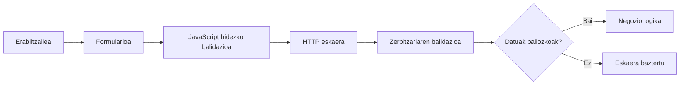

# Sarreren balidazioa

Kanpoko iturrietatik datoak iristen direnean, aplikazioak aurreikusitako arauak betetzen dituela egiaztatu arte ez dira fidagarri kontsideratu behar.

Bloke aurrekoan zer esan nahi duen balidazioak eta zergatik parte izan behar duen diseinuan azaldu da. Orain helburua da arau horiek kodean eramatea.

## Bezeroa eta zerbitzaria

Web aplikazio batean balidazioa nabigatzailean edo zerbitzarian egin daiteke, baina biak funtzio desberdinak betetzen dituzte.

| Bezeroa | Zerbitzaria |
|---|---|
| Erabiltzailearen esperientzia hobetzen du. | Aplikazioa babesten du. |
| Akatsak berehala erakutsi ditzake. | Datuak onartu edo baztertu erabakitzen du. |
| Nabigatzailean exekutatzen da. | Aplikazioak kontrolatutako ingurune batean exekutatzen da. |
| Aldatu edo saihestu daiteke. | Ez da nabigatzailearen portaeraren araberakoa. |

Beraz, aplikazioak bi aldeetan balidazioa erabil dezake, baina azkenean balidazio definitiboa beti zerbitzarian egin behar da.

!!! warning "Ez fidatu nabigatzaileari"

    Formulariok balio bat sartzea eragotzi arren, balioa zerbitzarira irits daiteke aldatu edo eskuz eraikitako eskaeraren bidez.

## Gomendatutako fluxua

Fluxu arrunta honela irudika daiteke:



Bezeroaren balidazioak erroreak bidalketa aurretik detektatzeko lagun dezake. Zerbitzariaren balidazioak berriro egiaztatzen du datuak eta erabakitzen du erabil daitezkeen.

## TxurdiGest-en adibidea

Demagun irakasle batek kalifikazio bat sartzen duela.

Interfazeak eremua `0` eta `10` arteko balioetara mugatu dezake, baina zerbitzariak ere jasotako balioa egiaztatu behar du.

```text
Sartutako balioa: 8
        ↓
JavaScript-ek 0–10 egiaztatzen du
        ↓
HTTP eskaera
        ↓
PHP-k berriro 0–10 egiaztatzen du
        ↓
Kalifikazioa prozesatzen da
```

Norbait eskaera aldatzen badu eta honela bidaltzen badu:

```text
nota=25
```

zerbitzariak baztertu behar du, nahiz eta jatorrizko nabigatzaileak ez zuen balio hori onartu.

## Inplementazioa

Atal honetan hiru ikuspegi osagarri landuko ditugu:

- [Balidazioa JavaScript-en](javascript.md): nola detektatu erroreak eta erabiltzailearen esperientzia hobetzeko.
- [Balidazioa PHP-n](php.md): nola aplikatu azkenean zerbitzariaren egiaztapenak.
- [Laborategia](laboratorio.md): nola frogatu bezeroan soilik egindako balidazioa saihestu daitekeela.

## Laburpena

- Kanpoko sarrera guztiak balidatu behar dira.
- JavaScript-ek erabiltzaileari lagun dezake, baina ez da segurtasun-hesia.
- Zerbitzaria beti balidatu behar du jasotako datuak.
- Balidazio-arauak bezeroan eta zerbitzarian koherenteak izan behar dute.
